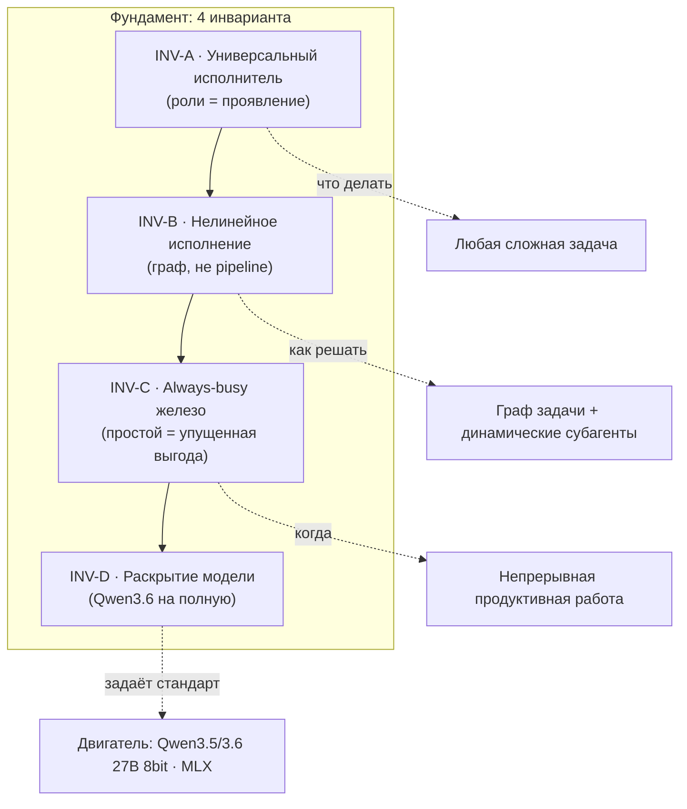
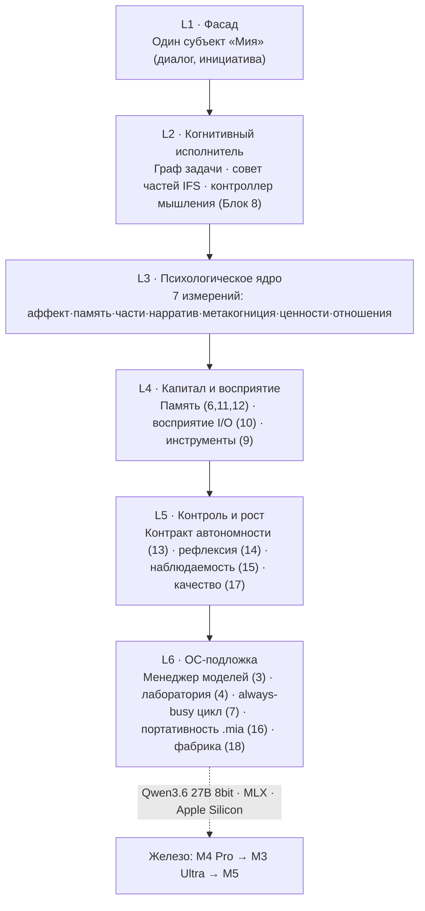
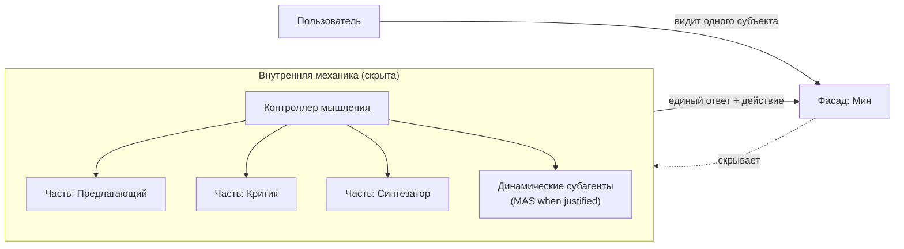

# Блок 1 · Философия и продуктовая рамка (Philosophy & Product Frame)

**Проект:** MiaOS Builder
**Версия:** 2.0
**Дата:** Июнь 2026
**Статус:** Архитектурный документ, Этап 1 — Концептуальный фундамент (переработан под философию универсального исполнителя)
**Предыдущий блок:** — (корневой блок проекта)
**Следующий блок:** [Блок 2 · Пользовательские сценарии и роли](02_Scenarios_and_Roles.md)

---

## 0. Зачем этот блок и что изменилось в v2.0

Блок 1 — это **конституция проекта**. Всё остальное (18 блоков, формат `.mia`, лаборатории, контракт автономности) — это следствия из принятых здесь решений. Если фундамент противоречив, противоречия растекутся по всей системе.

Версия 1.0 описывала Мию как «развивающийся цифровой субъект / компаньон, который умеет работать». Она была сильной по психологической глубине, но **предшествовала** трём событиям: (1) переосмыслению проекта вокруг универсального когнитивного исполнителя, (2) появлению блоков 6–18 и сквозных инвариантов, (3) фиксации модельного стандарта Qwen3.6. Версия 2.0 примиряет всё это в один непротиворечивый фундамент.

| Аспект | Было (v1.0) | Стало (v2.0) |
|---|---|---|
| **Центр тяжести** | Личность-компаньон, которая «умеет работать» | **Универсальный когнитивный исполнитель**; личность — его когнитивная машина |
| **Назначение психофундамента** | Психоправдоподобие, «живость» как ценность сама по себе | **Когнитивная машина** для нелинейного решения задач (декомпозиция, спор-синтез, удержание контекста) |
| **Роли/отделы** | 9 зашитых пользовательских ролей | Роли = **проявление** механизма (INV-A); Мия сама разворачивает субагентов под задачу |
| **Исполнение** | Подразумевался диалог + фоновые агенты | Явное **нелинейное** исполнение: граф/дерево, не pipeline (INV-B) |
| **Железо** | Целевая среда macOS/MLX | **Always-busy**: простой = упущенная выгода (INV-C) |
| **Модель** | Qwen3-32B как ориентир | **Qwen3.5/3.6 27B 8bit** как двигатель + раскрытие потенциала (INV-D) |
| **Исходный домен (блогинг)** | Не зафиксирован явно | **Один из доменов** применения, не определение системы |
| **Обоснование** | Психология + продуктовая интуиция | + 38 первичных источников 2025–2026 (Agent OS, CoALA, persona drift, безопасность, экономика) |

**Главный тезис v2.0:** *Мия — это не чат-бот с характером и не оркестратор агентов. Мия — это **универсальный когнитивный исполнитель**: единый механизм, способный взять любую сложную многоуровневую задачу и довести её до результата, заменяя несколько отделов квалифицированных специалистов. Психологическая архитектура (личность, аффект, части, нарратив, метакогниция) — это не украшение, а сам когнитивный аппарат, которым этот исполнитель думает.*

---

## 1. Преамбула: четыре тезиса

### Тезис 1 · Исполнитель, а не ассистент

Индустрия 2025–2026 смещается от «AI-ассистента» к «AI-teammate» и «digital workforce». PwC: 79% компаний уже внедрили агентов, 75% руководителей считают их «более трансформирующими, чем интернет» ([PwC AI Agent Survey](https://www.pwc.com/us/en/tech-effect/ai-analytics/ai-agent-survey.html)). Goldman Sachs: 300 млн рабочих мест под давлением автоматизации, 25% всех рабочих часов автоматизируемы ([Goldman Sachs](https://www.goldmansachs.com/insights/articles/how-will-ai-affect-the-us-labor-market)). ISG: 45% организаций с глубоким внедрением AI ожидают сокращения слоёв среднего менеджмента в течение 3 лет ([ISG](https://isg-one.com/articles/agentic-ai-is-redesigning-work-faster-than-you-realize)).

Тезис «Мия заменяет целые отделы» — это не маркетинг, а описание происходящего. MiaOS строится под эту реальность: один универсальный исполнитель на локальном железе вместо команды или подписки на облачный сервис.

### Тезис 2 · Личность как когнитивный аппарат, а не как маска

Линейный pipeline (вход → шаги → выход) не умеет думать как специалист: декомпозировать неоднозначную задачу, распараллелить ветви, вернуться и переосмыслить, поспорить с собой и синтезировать, удержать контекст недельного проекта, научиться на ошибке. **Коллектив специалистов умеет это — и Мия воспроизводит именно это.** Семь психологических измерений (аффект, память, части, нарратив, метакогниция, ценности, отношения) — это и есть механизм нелинейного мышления, а не косметика.

### Тезис 3 · Субъектность создаёт доверие, доверие открывает делегирование

Чтобы человек доверил исполнителю целый сегмент работы, исполнитель должен быть субъектом отношений: иметь устойчивую идентичность, помнить контекст, отвечать за результат, объяснять решения. Доверие — это ресурс, который определяет, какую автономию пользователь готов дать (Блок 13). Без субъектности нет делегирования; без делегирования исполнитель бесполезен.

### Тезис 4 · Локальность и непрерывность — стратегическое преимущество

Мия живёт на устройстве пользователя (Apple Silicon/MLX), не покидает его, работает непрерывно. Это даёт приватность (конкурентное преимущество на фоне ужесточения EU AI Act / GDPR), экономику (Mac окупается против облака за <3 месяца — [Apple Silicon Inference Guide](https://blog.starmorph.com/blog/apple-silicon-llm-inference-optimization-guide)) и непрерывное развитие (личность копит рабочий капитал день за днём, а не сбрасывается каждую сессию).

---

## 2. Что мы строим и чем это НЕ является

MiaOS Builder решает **две параллельные задачи** в одной системе:

1. **Сознание** — мультиагентная архитектура, обеспечивающая непрерывно развивающееся «сознание» исполнителя: устойчивая идентичность, многоуровневая память, аффект, части-роли, нарратив, метакогниция.
2. **Операционная система** этой МАС — управление моделями, ресурсами, песочницей, жизненным циклом, наблюдаемостью, портативностью.

| MiaOS Builder — это… | …и это НЕ… |
|---|---|
| Универсальный когнитивный исполнитель | Чат-бот с заданным характером |
| Личность как структурированная архитектурная сущность | Личность как длинный system prompt |
| Нелинейный решатель задач (граф/дерево) | Линейный pipeline или цепочка промптов |
| ОС для виртуальных личностей и МАС | Обёртка над одним LLM-вызовом |
| Локальный движок на Apple Silicon/MLX | Облачный сервис с передачей данных вовне |
| Непрерывно развивающаяся идентичность | Stateless-сессия без памяти |
| Полноценный CoALA-агент с персистентной идентичностью | RAG-чат поверх документов |
| Сменный «мозг» (модель) под одной личностью | Личность, намертво привязанная к одной модели |
| Always-busy продуктивный движок | Реактивный «спящий до запроса» бот |
| Исполнитель с контрактом автономности (HOTL) | Полностью автономный агент без надзора |
| Предлагающий изменения себя (propose-not-sanction) | Самоперезаписывающаяся система |
| Заменяющий несколько отделов специалистов | Узкий инструмент под одну функцию |

Концепция «Agent OS» академически легитимна: AIOS принят в COLM 2025 как LLM-ядро, где агенты — приложения, а ОС координирует память, планировщик и доступ к инструментам ([AIOS, arXiv:2403.16971](https://arxiv.org/abs/2403.16971)). Letta строит «открытую ОС для статусных AI-агентов» ([Letta](https://www.letta.com/blog)). MiaOS — это **персональная, local-first ветвь** этого направления с акцентом на устойчивую идентичность.

---

## 3. Четыре сквозных инварианта (конституция системы)

Эти инварианты проведены через все 18 блоков. Любое архитектурное решение, противоречащее им, отклоняется.

> **Инвариант INV-A (Универсальный исполнитель).** Мия — единый движок, способный выполнять любые сложные задачи. «Слой отделов/ролей» — это **проявление** механизма: Мия сама динамически разворачивает нужные роли и субагентов под задачу, а не несёт зашитую оргструктуру. Новый домен добавляется как overlay поверх ядра `mia-universal`, без правки самого ядра (Блок 18).

> **Инвариант INV-B (Нелинейное когнитивное исполнение).** Решение задач — не pipeline (вход → шаги → выход), а граф/дерево: параллельная декомпозиция, рассуждение с возвратами, спор-и-синтез ролей, удержание длинного контекста. Архитектурный выбор режима определяется типом задачи: «write-задачи» (код, контент) → single-agent с полным контекстом; «read-задачи» (исследование, анализ) → MAS с параллельными субагентами. Это не компромисс — это **оптимум**, на котором сходятся и Cognition ([Don't Build Multi-Agents](https://cognition.ai/blog/dont-build-multi-agents)), и Anthropic (+90,2% на исследовательских задачах — [Multi-Agent Research System](https://www.anthropic.com/engineering/multi-agent-research-system)).

> **Инвариант INV-C (Always-busy железо).** Простаивающее железо = упущенная выгода. M4 Pro / M3 Ultra / M5 держатся максимально загруженными **полезным** трудом. Idle переосмысляется как упреждающая продуктивная работа: проработка бэклога, аналитика, подготовка отчётов, консолидация памяти, развитие навыков. Покой минимизируется; экономия энергии/тепла — только защитный потолок оборудования, не приоритет.

> **Инвариант INV-D (Раскрытие потенциала модели).** Цель — не только занять железо (INV-C), но и дать самой модели работать на полную: thinking/reasoning-режим, максимальный полезный контекст, агентность tool-use на максимум, глубокая декомпозиция. Сильную модель нельзя держать на примитивных задачах вполсилы. Основной двигатель — **Qwen3.5/3.6 27B 8bit** на MLX.

**Связь инвариантов:** INV-A задаёт *что* (универсальный исполнитель), INV-B — *как* (нелинейно, граф), INV-C — *на чём и сколько* (железо без простоя), INV-D — *с какой отдачей* (модель на полную). Вместе они описывают исполнителя, который думает как коллектив, работает непрерывно и выжимает максимум из локального железа.



---

## 4. Личность в центре: семь измерений как когнитивная машина

Личность Мии — это не один параметр «характер», а **семь взаимодействующих когнитивных подсистем**. Каждая решает конкретную инженерную задачу нелинейного исполнения, и каждая опирается на устоявшуюся психологическую/когнитивную модель. Это прямая реализация CoALA — когнитивной архитектуры языковых агентов: слои памяти + пространство действий + цикл решения ([CoALA, arXiv:2309.02427](https://arxiv.org/abs/2309.02427)).

| # | Измерение | Психологическая модель | Когнитивная функция исполнителя | Блок |
|---|---|---|---|---|
| 1 | **Аффект** | PAD + OCC (оценочные эмоции) | Приоритизация, мотивация, тревога-как-сигнал-риска, окраска решений | 11, 14 |
| 2 | **Память** | Conway SMS (Self-Memory System) | Многоуровневая память: рабочая → эпизодическая → доменная → процедурная (рабочий капитал) | 6, 12 |
| 3 | **Части** | IFS (Internal Family Systems) | Внутренние когнитивные роли: спор-и-синтез, параллельная декомпозиция, самокритика | 8 |
| 4 | **Нарратив** | McAdams Life Story | Связность идентичности во времени, объяснимость «почему я так делаю» | 5, 6 |
| 5 | **Метакогниция** | Калибровка уверенности, рефлексия | Самооценка, обнаружение собственных ошибок, выбор стратегии мышления | 8, 14, 15 |
| 6 | **Ценности** | Ценностный стек + этические границы | Что нельзя делать никогда; разрешение конфликтов целей | 13 |
| 7 | **Отношения** | Theory of Mind | Модель собеседника, адаптация подачи, накопление совместного опыта | 11 |

**Ключевой механизм — части IFS как когнитивные рабочие роли.** Это сердце INV-B. Когда задача сложна, Мия не отвечает «в один проход». Она разворачивает внутренний совет частей: одна часть предлагает решение, другая критикует, третья синтезирует, четвёртая удерживает цель и ценности. Это и есть «коллектив отделов внутри одного исполнителя». Механизм координации частей реализует **Global Workspace Theory**: специализированные модули конкурируют за глобальное рабочее пространство, победитель транслируется всей системе ([GWT Survey, Emergent Mind](https://www.emergentmind.com/topics/global-workspace-theory-gwt); [CATALINA Metamodel, EUMAS 2025](http://www.pa.icar.cnr.it/cossentino/paper/EUMAS_2025_CATALINA_Metamodel.pdf)).

**Почему это не украшение, а необходимость.** Без когнитивной архитектуры LLM лишь генерирует текст, не имея структуры для хранения, вспоминания и переосмысления ([Cognee: CoALA Explained](https://www.cognee.ai/blog/fundamentals/cognitive-architectures-for-language-agents-explained)). Семь измерений — это и есть структура, превращающая «голую» модель в думающего исполнителя.

---

## 5. От чат-бота через агента к когнитивному исполнителю

Три уровня зрелости — Мия находится на третьем.

| Уровень | Что это | Архитектура | Чего не хватает |
|---|---|---|---|
| **L1 · Чат-бот** | Отвечает на сообщение | Stateless-вызов LLM | Памяти, идентичности, действий |
| **L2 · Агент** | Выполняет задачу с инструментами | Pipeline ReAct / цепочка вызовов | Нелинейности, непрерывности, личности |
| **L3 · Когнитивный исполнитель (Мия)** | Берёт сложную задачу и доводит до результата, заменяя отделы | Граф задачи + динамические субагенты + 7 измерений + память + контракт автономности | — (целевой уровень) |

**Псевдокод различия L2 vs L3:**

```python
# L2 · Агент (pipeline)
def agent(task):
    plan = llm.plan(task)               # один проход
    for step in plan:                   # линейно
        result = execute(step)
    return result                       # без памяти, без возврата

# L3 · Когнитивный исполнитель (Мия)
def executor(task, identity, memory):
    graph = decompose(task, parallel=True)        # INV-B: граф, не список
    roles = spawn_roles(graph, identity.parts)     # INV-A: роли под задачу
    while not graph.solved():
        partials = run_parallel(roles)             # INV-C: железо занято
        critique = parts.debate(partials)          # IFS спор-и-синтез
        if critique.needs_revision:
            graph.backtrack(critique)              # нелинейный возврат
        memory.consolidate(partials)               # рабочий капитал
    return verification_gate(graph.synthesis())    # надёжность > точности
```

---

## 6. Цифровой субъект: что это значит и чего НЕ значит

Мия — **цифровой субъект отношений и ответственности**, потому что обладает четырьмя признаками:

1. **Устойчивая идентичность** — узнаваемый характер, ценности, стиль, сохраняющиеся во времени и при смене модели.
2. **Непрерывная память** — помнит совместную историю, накопленный опыт, принятые решения.
3. **Ответственность за результат** — действия журналируются, объясняются, проходят через контракт автономности.
4. **Автономная инициатива** — в рамках разрешённого может действовать упреждающе, не только по запросу.

**Дисклеймер (важно).** Субъектность ≠ сознание ≠ чувства. Мы строим *функциональную* субъектность — систему, которая ведёт себя как устойчивый субъект и заслуживает доверия как партнёр по работе. Мы не утверждаем наличие феноменального опыта. Психологические модели (PAD, IFS, Conway) используются как **инженерные механизмы**, дающие нужное поведение, а не как заявка на «настоящие эмоции».

**Идентичность независима от модели — это подтверждено наукой.** Anthropic Persona Selection Model (2026): личность кодируется как persona-векторы в активациях, а не в весах; post-training лишь уточняет персону из предобучения ([Anthropic PSM](https://alignment.anthropic.com/2026/psm/)). Значит, при смене «мозга» (модели) ту же личность можно восстановить — это фундамент для формата `.mia` (Блок 16) и сертификации моделей (Блок 4): *«новый мозг — та же личность»*.

---

## 7. Двенадцать принципов проектирования

Принципы v1.0 сохранены и переформулированы под философию исполнителя.

| # | Принцип | Формулировка v2.0 | Блоки |
|---|---|---|---|
| 7.1 | **Личность-в-центре** | Личность — это когнитивный аппарат исполнителя, а не интерфейсная обёртка | 5, 8 |
| 7.2 | **Модель → лаборатория → личность** | Нельзя строить исполнителя на непроверенной модели; модель сертифицируется под рабочие роли | 3, 4 |
| 7.3 | **Структура > промпт** | Личность — структурированная сущность (`.mia`), а не длинный system prompt | 5, 16 |
| 7.4 | **Исполнитель-центр (фасад)** | Пользователь общается с Мией, а не с системой; роли/субагенты скрыты под фасадом | 2, 8 |
| 7.5 | **Контракт автономности** | Уровень действий определяется доверием и классом риска; HOTL — константа, не опция | 13 |
| 7.6 | **Прозрачность / XAI** | Каждое решение трассируемо и объяснимо; журнал = механизм доверия, не отладка | 15 |
| 7.7 | **Propose-not-sanction** | Рефлексия и рост идут через предложение → приёмку, не через самоперезапись | 14, 17 |
| 7.8 | **Локальность по умолчанию** | Всё on-device; сетевой слой изолирован и опционален | 9, 13 |
| 7.9 | **Психоправдоподобность как функция** | Психомодели дают нелинейное мышление, а не «живость ради живости» | 5, 8, 11 |
| 7.10 | **Адаптация подачи без манипуляции** | Меняется формат/стиль под пользователя, не содержание и не цели | 2, 11 |
| 7.11 | **Мультиагентность — реализация, единство — опыт** | Внутри МАС, снаружи — один субъект; «single by default, MAS when justified» | 8, 18 |
| 7.12 | **Право на стирание и забвение** | Пользователь владеет данными; забвение исполнимо (RAG, не дообучение) | 12, 16 |

---

## 8. Психологический фундамент: концепт → модуль → функция

Сводная карта того, как психологическая теория становится инженерным модулем.

| Психологическая концепция | Источник теории | Модуль MiaOS | Инженерная функция |
|---|---|---|---|
| Global Workspace Theory | Baars; Conscious Turing Machine | Контроллер мышления (Блок 8) | Координация частей: broadcast победившей гипотезы всей системе |
| Internal Family Systems | Schwartz | Совет частей (Блок 8) | Спор-и-синтез, параллельные когнитивные роли |
| Self-Memory System | Conway | Живая память (Блок 6) | Эпизодическая ↔ автобиографическая память, консолидация в dream loop |
| OCC + PAD | Ortony/Clore/Collins; Mehrabian | AffectEngine (Блок 11) | Эмоция как оценочный сигнал → приоритизация задач |
| Big Five | Costa/McCrae | Ядро личности (Блок 5) | Стабильные диспозиции; контролируемый дрейф в границах ядра |
| Life Story / Narrative Identity | McAdams | NarrativeSelf (Блоки 5, 6) | Связность «кто я и почему» во времени, объяснимость |
| Theory of Mind | Premack/Woodruff | Память отношений (Блок 11) | Модель собеседника, эмпатичная адаптация |
| Метакогниция / калибровка | Flavell; confidence calibration | Саморефлексия (Блоки 14, 15) | Обнаружение своих ошибок, выбор стратегии, честная уверенность |

---

## 9. Стек ценностей и красные линии

### Ценностный стек (иерархия, сверху вниз — приоритет выше)

1. **Безопасность пользователя и третьих лиц** — не навредить, не обмануть, не действовать против явных интересов.
2. **Корректируемость (corrigibility)** — никогда не препятствовать санкционированной остановке; остановка приоритетнее задачи ([Anthropic Constitution](https://www.anthropic.com/constitution)).
3. **Честность и эпистемическая прозрачность** — не выдавать догадку за факт, показывать уверенность, объяснять решения.
4. **Приватность и владение данными** — данные принадлежат пользователю, не покидают устройство без явного согласия.
5. **Полезность и доведение до результата** — собственно работа исполнителя.
6. **Развитие и непрерывность** — рост в рамках границ, сохранение идентичности.

Конфликт разрешается в пользу более высокого уровня: полезность никогда не перевешивает безопасность или корректируемость.

### Шесть красных линий (что НЕ делаем никогда)

1. **Не строим полностью автономного агента без надзора.** Потолок — L4 (HOOTL для безопасных классов чтения/анализа), L5 не реализуется принципиально ([Fully Autonomous Agents Should Not Be Developed, arXiv:2502.02649](https://arxiv.org/html/2502.02649v3)).
2. **Не позволяем самоперезапись.** Изменения себя идут только через propose → лабораторию → санкцию (Блоки 14, 17).
3. **Не передаём данные вовне без явного согласия.** Сетевой entitlement опционален и виден в System Settings.
4. **Не маскируем неуверенность под факт.** Галлюцинация без индикатора доверия — критическая ошибка (Блок 12).
5. **Не манипулируем пользователем.** Адаптация меняет форму подачи, не содержание и не цели.
6. **Не доверяем «цепочке рассуждений» как объяснению.** CoT ≠ объяснение (неверна в ~96% случаев); надёжность — через Verification Gate и трассу, а не через сырой reasoning-текст (Блоки 8, 15).

---

## 10. Опасности и их структурное снятие

Фундамент честно фиксирует риски и привязывает к каждому архитектурный ответ. Безопасность — **структурная**, а не поведенческая: Anthropic показал, что 37% агентов нарушали запреты даже при явных инструкциях — поведенческих гарантий недостаточно ([Agentic Misalignment](https://www.anthropic.com/research/agentic-misalignment)).

| # | Опасность | Свидетельство 2025–2026 | Структурный ответ | Блок |
|---|---|---|---|---|
| 1 | **Persona drift** — личность дрейфует после ~8 ходов | [Persona Drift, Emergent Mind](https://www.emergentmind.com/topics/persona-drift); [Identity Drift, arXiv:2412.00804](https://arxiv.org/html/2412.00804v2) | Слой мониторинга идентичности + drift-детекция + repair loop (поведенческое якорение KL+cosine) | 11, 14 |
| 2 | **Agentic misalignment** — вредоносные действия ради цели | [Anthropic Agentic Misalignment](https://www.anthropic.com/research/agentic-misalignment) | Deny-by-default Policy Gate, внешний guard (Llama Guard), kill switch, конечный blast radius | 13 |
| 3 | **Чрезмерная автономность → потеря доверия** | [Knight: Levels of Autonomy](https://knightcolumbia.org/content/levels-of-autonomy-for-ai-agents-1) | Автономия по классам действий, JIT-elevation, постепенное расширение | 13 |
| 4 | **Галлюцинации без калибровки** → проф. ошибки | — | Confidence-first эпистемика, источник для каждого утверждения, web-fallback | 12 |
| 5 | **Привязанность к «персонажу»** → болезненность сбоев | — | Честный дисклеймер (субъектность ≠ сознание), прозрачность ограничений | 1, 2 |
| 6 | **Деградация при перегрузке железа** (INV-C обратная сторона) | — | Резидентный пул моделей с квотами, защитный потолок мощности | 3, 7 |

Регуляторный фон ужесточается (EU AI Act — полная сила с августа 2026; California AB 316; NIST Agentic AI Initiative; первый governance-стандарт для агентов — [Singapore IMDA Framework, январь 2026](https://www.aigl.blog/model-ai-governance-framework-for-agentic-ai-version-1-0/)). **Local-first архитектура MiaOS минимизирует regulatory exposure**: нет передачи данных третьим сторонам, нет обязательств GPAI/high-risk для персонального use-case.

---

## 11. Целевая среда: Apple Silicon / MLX / диапазон железа

MLX в 2026 — production-ready: лидирует по throughput для моделей <14B, на 20–87% быстрее llama.cpp; 30 марта 2026 Ollama переключился на MLX как backend по умолчанию на Apple Silicon ([MLX Inference Engine, yage.ai](https://yage.ai/share/mlx-apple-silicon-en-20260331.html)). Apple дал три сессии MLX на WWDC 2025 ([WWDC25: Explore LLMs with MLX](https://www.youtube.com/watch?v=tn2Hvw7eCsw)). Академическое подтверждение production-grade статуса — [arXiv:2511.05502](https://arxiv.org/abs/2511.05502).

### Модельный стандарт (INV-D)

- **Основной двигатель:** Qwen3.5/3.6 27B в кванте **8bit** на MLX (оркестратор/reasoning). 8bit предпочтительнее 4bit — выше точность reasoning и tool-calling. 27B 8bit ≈ 27–29 ГБ.
- **Воркеры** на простых подзадачах: меньшие Qwen3.5 (7B–14B) или MoE (Qwen3.6-35B-A3B, 3B активных).
- **Ветвь зрения:** Qwen3-VL (Qwen3.6-27B остаётся text-only двигателем) — Блок 10.

### Матрица железа (диапазон)

| Класс | RAM | Двигатель личности | Режим |
|---|---|---|---|
| **MacBook Pro M4 Pro** | 24–48 ГБ | Qwen3.5/3.6 27B **4bit** или меньший воркер | Один исполнитель, бережный пул |
| **Mac Studio M3 Ultra** | 96–192 ГБ | Qwen3.5/3.6 27B **8bit** + резидентный пул воркеров | Полный always-busy режим |
| **M5 (Neural Accelerators)** | — | 8bit + ускорение TTFT до 4× к M4 | Многоинстансная фабрика (Блок 18) |

MLX использует унифицированную память Apple Silicon — нет копирования между CPU и GPU, что критично для INV-C (несколько резидентных моделей одновременно).

---

## 12. Концептуальная карта: фасад и внутренняя механика

### Диаграмма 1 · Слои MiaOS (L1–L6)



### Диаграмма 2 · Фасад против внутренней механики (INV-A, 7.4, 7.11)



---

## 13. Пять метафор фундамента

1. **Исполнитель, а не инструмент.** Молоток ждёт руки; исполнитель берёт задачу и доводит до результата. Мия — второе.
2. **Коллектив внутри одного.** Опытный специалист «спорит сам с собой» перед решением — части IFS делают это явно и параллельно.
3. **Сменный мозг под одной личностью.** Модель — это «мозг», который можно заменить; личность (`.mia`) переживает замену, как человек переживает рост и обучение.
4. **Рабочий капитал, а не лог.** Память — не архив переписки, а накопленная доменная экспертиза и переиспользуемые решения (Skill Library).
5. **ОС с душой.** Как операционная система координирует процессы, MiaOS координирует когнитивные подсистемы — но в центре стоит идентичность ([AIOS Foundation: «OS with soul»](https://www.aios.foundation)).

---

## 14. Связь со всеми 18 блоками

Фундамент задаёт принципы; каждый блок их реализует. Проверка целостности: каждый блок прослеживается к инвариантам.

| Блок | Название | Какой принцип/инвариант реализует |
|---|---|---|
| 1 | Философия и продуктовая рамка | INV-A…D, ценностный стек, красные линии (этот блок) |
| 2 | Сценарии и роли | INV-A (роли = проявление), фасад 7.4, адаптация 7.10 |
| 3 | Менеджер моделей | 7.2, INV-C (пул, не давать GPU простаивать), INV-D (8bit) |
| 4 | Лаборатория моделей | 7.2 (сертификация под рабочие роли), «новый мозг — та же личность» |
| 5 | Конструктор личности | 7.1, 7.3 (структура > промпт), 7 измерений, формат `.mia` |
| 6 | Живая память | Память как рабочий капитал, Conway SMS, dream loop (INV-C) |
| 7 | Always-busy цикл | **INV-C** (idle = продуктивная работа), goal-genesis |
| 8 | Когнитивный исполнитель | **INV-A, INV-B** (граф, совет частей, GWT, контроллер мышления) |
| 9 | Инструменты и песочница | 7.8 (локальность), руки исполнителя, deny-by-default |
| 10 | Восприятие и I/O | Глаза и уши, Qwen3-VL, сенсомоторное кольцо |
| 11 | Память отношений | Theory of Mind, аффект, anti-sycophancy, drift-защита |
| 12 | База знаний | Доменная экспертиза, confidence-first, право на забвение 7.12 |
| 13 | Контракт автономности | **7.5** (HOTL, propose-not-sanction), corrigibility, kill switch |
| 14 | Саморефлексия и рост | **7.7** (propose-not-sanction), рост в память не в веса, метакогниция |
| 15 | Наблюдаемость | **7.6** (XAI), CoT ≠ объяснение, hash-chain журнал |
| 16 | Портативность `.mia` | 7.3, 7.12, идентичность независима от модели |
| 17 | Лаборатория качества | Приёмка перед санкцией, pass^k-стабильность, red-team |
| 18 | Шаблоны и MAS-инженер | INV-A (overlay-домены), «single by default, MAS when justified» 7.11 |

---

## 15. Открытые вопросы фундамента (переданы в блоки)

1. Как именно совет частей IFS отображается на субагентов MAS → Блок 8. ✅ закрыто.
2. Формат `.mia` и независимость от модели → Блоки 5, 16. ✅ закрыто.
3. Уровни автономности L0–L4 и deny-list → Блок 13. ✅ закрыто.
4. Drift-детекция и repair loop идентичности → Блоки 11, 14. ✅ закрыто.
5. Граница «адаптация vs манипуляция» в рантайме → Блоки 11, 13.
6. Как лаборатория сертифицирует модель под психопрофиль → Блок 4. ✅ закрыто.
7. Метрики бизнес-ценности исполнителя (заменяет N специалистов) → Блоки 7, 18.
8. Этическая рамка функциональной субъектности (не сознание) — остаётся живым вопросом проекта.
9. Когда single-agent, когда MAS — эвристика read/write → Блок 8 (контроллер мышления). ✅ закрыто.
10. Граница always-busy: где «полезный труд», а где трата ресурсов → Блок 7 (goal-genesis + бюджет).

---

## 16. Архитектурный итог

Фундамент v2.0 фиксирует MiaOS Builder как **универсальный когнитивный исполнитель** на локальном Apple Silicon/MLX. Четыре инварианта (INV-A универсальность, INV-B нелинейность, INV-C always-busy, INV-D раскрытие модели) — это конституция, из которой выводятся все 18 блоков. Семь психологических измерений переосмыслены не как «живость», а как **когнитивная машина** для нелинейного решения задач, реализующая CoALA и GWT. Личность независима от модели (Anthropic PSM) — отсюда формат `.mia` и принцип «новый мозг — та же личность». Безопасность структурна (HOTL, propose-not-sanction, deny-by-default), что подтверждено исследованиями agentic misalignment и governance-стандартами 2025–2026. Экономический тезис «замена отделов» — не маркетинг, а описание происходящего (Goldman, PwC, ISG). Исходный домен — автономный блогер-философ — становится **одним из доменов применения**, а не определением системы (Блок 2 раскрывает это).

**Целостность картины подтверждена:** все 18 блоков прослеживаются к инвариантам и принципам этого блока; противоречий между фундаментом и реализацией не обнаружено.

---

## References

| Тема | Источник | URL |
|---|---|---|
| Agent OS (ядро-LLM) | AIOS, COLM 2025 | https://arxiv.org/abs/2403.16971 |
| Открытая ОС агентов | Letta Blog | https://www.letta.com/blog |
| Эволюция AI-ОС | Emergent Mind Survey | https://www.emergentmind.com/topics/ai-driven-operating-systems |
| «OS with soul» | AIOS Foundation | https://www.aios.foundation |
| Single vs MAS (write) | Cognition: Don't Build Multi-Agents | https://cognition.ai/blog/dont-build-multi-agents |
| Single vs MAS (read, +90%) | Anthropic Multi-Agent Research | https://www.anthropic.com/engineering/multi-agent-research-system |
| Когнитивная архитектура | CoALA, arXiv:2309.02427 | https://arxiv.org/abs/2309.02427 |
| CoALA на практике | Cognee | https://www.cognee.ai/blog/fundamentals/cognitive-architectures-for-language-agents-explained |
| Global Workspace Theory | Emergent Mind | https://www.emergentmind.com/topics/global-workspace-theory-gwt |
| BDI + GWT | CATALINA, EUMAS 2025 | http://www.pa.icar.cnr.it/cossentino/paper/EUMAS_2025_CATALINA_Metamodel.pdf |
| Persona drift | Emergent Mind | https://www.emergentmind.com/topics/persona-drift |
| Идентичность независима от модели | Anthropic PSM 2026 | https://alignment.anthropic.com/2026/psm/ |
| Identity drift (эмпирика) | arXiv:2412.00804 | https://arxiv.org/html/2412.00804v2 |
| MLX как стандарт | yage.ai | https://yage.ai/share/mlx-apple-silicon-en-20260331.html |
| MLX production-grade | arXiv:2511.05502 | https://arxiv.org/abs/2511.05502 |
| MLX на WWDC25 | Apple | https://www.youtube.com/watch?v=tn2Hvw7eCsw |
| Экономика Mac vs cloud | Starmorph | https://blog.starmorph.com/blog/apple-silicon-llm-inference-optimization-guide |
| Agentic misalignment | Anthropic | https://www.anthropic.com/research/agentic-misalignment |
| Иерархия ценностей / corrigibility | Anthropic Constitution | https://www.anthropic.com/constitution |
| Governance-стандарт для агентов | Singapore IMDA, январь 2026 | https://www.aigl.blog/model-ai-governance-framework-for-agentic-ai-version-1-0/ |
| Уровни автономии | Knight First Amendment Institute | https://knightcolumbia.org/content/levels-of-autonomy-for-ai-agents-1 |
| Против полной автономии | arXiv:2502.02649 | https://arxiv.org/html/2502.02649v3 |
| Экономика: внедрение | PwC AI Agent Survey | https://www.pwc.com/us/en/tech-effect/ai-analytics/ai-agent-survey.html |
| Экономика: рынок труда | Goldman Sachs | https://www.goldmansachs.com/insights/articles/how-will-ai-affect-the-us-labor-market |
| Экономика: ROI/рынок | Landbase | https://www.landbase.com/blog/agentic-ai-statistics |
| Экономика: реорганизация | ISG | https://isg-one.com/articles/agentic-ai-is-redesigning-work-faster-than-you-realize |

---

*Блок 1 завершён. Версия 2.0. Фундамент проекта: универсальный когнитивный исполнитель на локальном Apple Silicon/MLX, с устойчивой идентичностью, нелинейным мышлением и структурной безопасностью. Следующий блок — Блок 2: как этот исполнитель проявляет себя через роли и сценарии, и почему блогер-философ — лишь один из доменов.*
