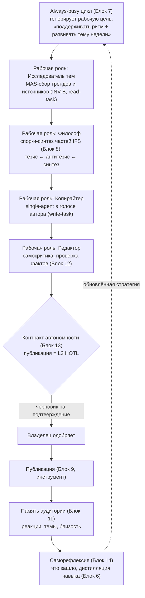
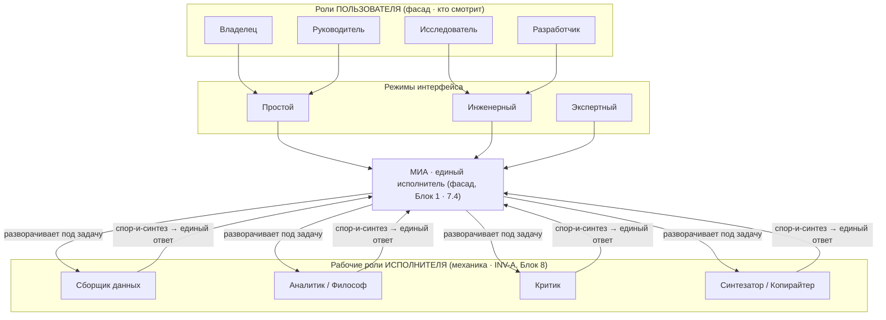
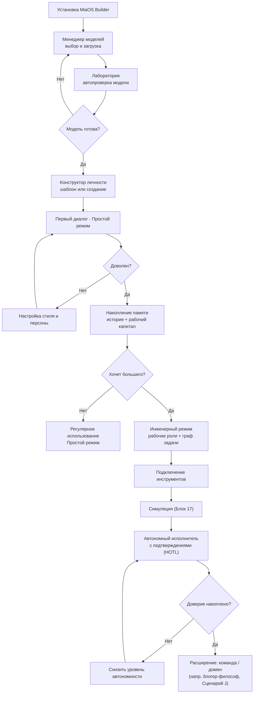
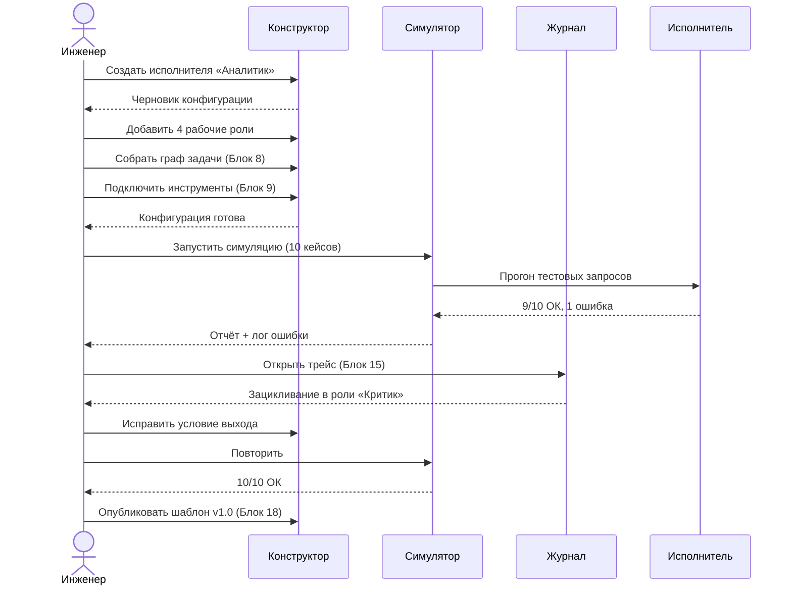

# Блок 2 · Пользовательские сценарии и роли (User Scenarios & Roles)

**Проект:** MiaOS Builder
**Версия:** 2.0
**Дата:** Июнь 2026
**Статус:** Архитектурный документ, Этап 1 — Концептуальный фундамент (переработан под философию универсального исполнителя)
**Предыдущий блок:** [Блок 1 · Философия и продуктовая рамка](01_Philosophy.md)
**Следующий блок:** [Блок 3 · Менеджер моделей](03_Model_Manager.md)

---

## 0. Зачем этот блок и что изменилось в v2.0

Блок 1 объявил Мию **универсальным когнитивным исполнителем**. Блок 2 отвечает на вопрос: *как этот единый механизм проявляется для разных людей и задач — и почему «роли» это не зашитая оргструктура, а формы одного исполнителя.*

Версия 1.0 описывала 9 «пользовательских ролей-масок» как конфигураций UI и прав. Это остаётся верным, но v2.0 добавляет два слоя, которых не было:

| Аспект | Было (v1.0) | Стало (v2.0) |
|---|---|---|
| **Что такое роль** | Маска пользователя (UI + права) | Две сущности: *роль пользователя* (как человек смотрит) И *рабочая роль исполнителя* (как Мия разворачивает себя под задачу — INV-A) |
| **Исходный домен** | Не зафиксирован | **Блогер-философ — это ОДИН домен** универсального исполнителя, развёрнутый сценарий-эталон |
| **Сценарии** | 9 пользовательских историй | + сценарий автономного блогера-философа (исходное видение) как доказательство универсальности |
| **Связь с исполнением** | UI-видимость модулей | + как роль пользователя транслируется в режим исполнения (single vs MAS, INV-B) |
| **Обоснование** | Продуктовая интуиция | + индустрия 2025–2026: «AI teammate / digital workforce», MAS как «команда специалистов» |

**Главный тезис v2.0:** *Существует два независимых понятия «роли». **Роль пользователя** — это то, как человек смотрит на Мию (владелец, руководитель, инженер…) и какой UI он видит. **Рабочая роль исполнителя** — это часть/субагент, которую Мия сама разворачивает внутри себя под конкретную задачу (аналитик, критик, копирайтер…). Первое — фасад (Блок 1, принцип 7.4). Второе — механика (INV-A, Блок 8). Девять пользовательских ролей и любые рабочие роли — это проявления одного универсального исполнителя.*

---

## 1. Преамбула: зачем роли в однопользовательском MVP

MiaOS v0.1 — однопользовательская локальная система. Зачем роли, если пользователь один? Две плоскости, как в v1.0, плюс третья.

**Поведенческая.** Один человек в разные моменты использует Мию по-разному: утром — стратег, которому нужен брифинг; днём — разработчик, пишущий код; вечером — создатель контента. Каждое состояние требует своего интерфейса и стиля.

**Архитектурная.** Этап 6 мастер-плана — мультипользовательский режим и цифровые отделы. Абстракции ролей, заложенные сейчас, станут контрактом между UI и бизнес-логикой без переписывания.

**Исполнительская (новое в v2.0).** Роль пользователя — это ещё и сигнал исполнителю, *в каком режиме думать* (INV-B): руководителю-стратегу нужен глубокий single-agent диалог с памятью; исследователю — параллельный MAS-сбор источников. Роль пользователя транслируется не только в UI, но и в архитектуру исполнения задачи.

**Ключевой принцип блока:** проектируем под одного пользователя, но через явные роли-маски. Маска — это конфигурация интерфейса + прав + **режима исполнения**. Под каждой маской — одна архитектура, одна личность Мии, одни данные.

---

## 2. Два понятия «роли» в MiaOS Builder

### 2.1 Роль пользователя (фасад)

То, как человек смотрит на Мию. Это конфигурация из пяти элементов:

| Элемент | Описание |
|---|---|
| **Цели** | Что пользователь хочет (создать, управлять, исследовать, делегировать) |
| **Режим интерфейса** | Какие панели видны, какая детализация настроек |
| **Права на действия** | Что можно создавать, изменять, запускать, подтверждать |
| **Видимые модули** | Какой набор компонентов показан в навигации |
| **Стиль коммуникации** | Как Мия говорит (деловой / творческий / технический / дружеский) |

### 2.2 Рабочая роль исполнителя (механика, INV-A)

То, как Мия разворачивает **себя** под задачу. Это не пользователь — это часть IFS / субагент внутри Мии (Блок 8). Примеры: «Сборщик данных», «Аналитик», «Критик», «Синтезатор», «Копирайтер», «Редактор». Они:
- порождаются динамически под задачу (не зашиты),
- работают параллельно или спорят-и-синтезируют (INV-B),
- скрыты за фасадом — пользователь видит одну Мию (принцип 7.4, 7.11).

> **Инвариант B2-1 (Две роли).** «Роль пользователя» (фасад: UI + права + режим исполнения) и «рабочая роль исполнителя» (механика: часть/субагент под задачу) — это разные сущности. Пользователь конфигурирует первое; Мия сама разворачивает второе. Смешение их — архитектурная ошибка.

### 2.3 Три измерения роли пользователя

**Уровень экспертизы:** Новичок → Уверенный пользователь → Инженер → Эксперт.
**Цель использования:** Личное / Творческое / Профессиональное / Бизнес.
**Положение по отношению к личности:** Создатель / Владелец / Коллега / Руководитель / Клиент.

### 2.4 Режим интерфейса (уровень детализации, не уровень прав)

Одна сущность показывается по-разному:
- **Простой:** карточка Мии + кнопка «Начать диалог».
- **Инженерный:** + вкладки «Части/Агенты», «Граф задачи», «Инструменты», «Память».
- **Экспертный:** + «JSON-схема `.mia`», «Прямой доступ к памяти», «Конфиги MLX», «Контроллер мышления».

Принцип: **одна архитектура под капотом, разная подача наверху**. Переключение режима не меняет данных. Роль — сериализуемый объект: `mode` (simple/engineer/expert), `permissions[]`, `visible_modules[]`, `communication_style`, `expertise_level`, **`execution_hint`** (single/auto/mas — новое в v2.0).

---

## 3. Девять ролей пользователя

Каждая роль — это окно в одного универсального исполнителя. Колонка «Режим исполнения» (новое в v2.0) показывает, как роль транслируется в архитектуру решения (INV-B).

### Роль 1 · Владелец виртуальной личности
**Описание:** воспринимает Мию как «свою» — персональный ассистент, собеседник, внешняя память, творческий партнёр.
**Хочет:** простой приятный интерфейс; Мия помнит разговоры; лёгкий поиск по истории; проактивные предложения; надёжное локальное хранение.
**Не должен видеть:** граф задачи, JSON-схемы, контроллер мышления, параметры MLX.
**Видимые модули:** диалог, история, коллекция личностей, простые настройки, уведомления.
**Режим исполнения:** преимущественно single-agent с памятью (диалог).
**Метрики:** время до первого диалога <3 мин; возврат на след. день >60%; NPS ≥8.

### Роль 2 · Инженер мультиагентных систем
**Описание:** создаёт сложные конфигурации исполнителя — для себя и других. Понимает архитектуру изнутри (детально — Блок 18a).
**Хочет:** визуальный редактор графа задач с вложенностью; прямое редактирование JSON; полный трейс по частям/субагентам; симуляция перед запуском; версии конфигов; экспорт шаблонов (Блок 18).
**Видимые модули:** все, включая менеджер моделей, лабораторию, конструктор, контроллер мышления, части/агенты, память, граф, инструменты, контракт автономности, лабораторию качества.
**Режим исполнения:** конструирует оба режима явно.
**Метрики:** отладка цикла <15 мин; 100% трассировка; симуляция покрывает ≥80% путей.

### Роль 3 · Руководитель компании
**Описание:** CEO/директор, использующий Мию как стратегического собеседника и оператора задач. Без техэкспертизы, требования высокие.
**Хочет:** утренний брифинг без настройки; простое делегирование; статус задач без техники; объяснения человеческим языком; вечерний дайджест; одобрение одним нажатием.
**Не должен видеть:** части/субагенты, граф, трейс, параметры моделей.
**Видимые модули:** дашборд задач, диалог, делегирование, статус, дайджест, настройки стиля.
**Режим исполнения:** глубокий single-agent диалог (стратегия) + фоновый MAS на делегированных задачах.
**Метрики:** брифинг <5 мин; >80% делегированных задач без вмешательства; доверие >8/10.

### Роль 4 · Начальник отдела
**Описание:** руководитель направления, управляющий несколькими цифровыми специалистами или гибридной командой.
**Хочет:** шаблоны типового отдела; назначение ролей и задач; единая панель статусов; настройка автономности каждого; инциденты в одном месте; отчёты; подключение специалиста из библиотеки.
**Видимые модули:** панель отдела, шаблоны специалистов, контракт автономности (упрощ.), отчёты, управление задачами, библиотека.
**Режим исполнения:** оркестрация нескольких инстансов-исполнителей (Блок 18).
**Метрики:** охват мониторинга 100%; реакция на инцидент <2 мин; выполнение плана >90%.

### Роль 5 · Сотрудник предприятия
**Описание:** линейный специалист (аналитик, юрист, бухгалтер, HR) — Мия как доменный ассистент.
**Хочет:** поиск по регламентам; ответы со ссылками (Блок 12); индикатор доверия; простой интерфейс; история запросов.
**Не должен видеть:** конфигурацию частей, граф, модели, инструменты с внешним доступом.
**Видимые модули:** диалог с базой знаний, история, индикатор доверия, экспорт.
**Режим исполнения:** single-agent + RAG (confidence-first, Блок 12).
**Метрики:** точность >95%; ответ <10 с; доля ответов со ссылками >90%.

### Роль 6 · Создатель контента
**Описание:** блогер, SMM, редактор — Мия генерирует, редактирует, публикует контент. *См. также развёрнутый сценарий-эталон автономного блогера-философа (§4, Сценарий J).*
**Хочет:** настройка персоны публикаций (голос, стиль, темы); память аудитории (Блок 11); генерация постов с учётом истории; редактор; подтверждение публикации одним нажатием; планировщик; аналитика реакций.
**Не должен видеть:** техконфигурацию, части/субагенты, граф, журнал.
**Видимые модули:** генератор контента, планировщик, история публикаций, настройки персоны, аналитика.
**Режим исполнения:** MAS на этапе исследования темы и идей + single-agent на написании в голосе автора (write-задача, INV-B).
**Метрики:** производительность ×3; сохранение голоса >8/10; доля постов с правкой <30%.

### Роль 7 · Исследователь
**Описание:** учёный/аналитик/студент — синтез литературы, гипотезы, структурированный анализ.
**Хочет:** загрузка PDF в базу знаний; синтез по множеству источников; параллельные субагенты «Исследователь/Аналитик/Критик»; черновик с цитатами; визуализация связей; экспорт MD/Word/BibTeX; контроль галлюцинаций (источник на каждое утверждение).
**Не должен видеть:** системные конфиги, параметры MLX, инструменты с внешним доступом без разрешения.
**Видимые модули:** загрузка документов, база знаний, синтез, граф концепций, история, экспорт.
**Режим исполнения:** **MAS by justified** — классический read-task, где Anthropic-паттерн даёт +90% (INV-B).
**Метрики:** синтез 15 источников <5 мин; галлюцинации <2%; экспорт без ручной правки.

### Роль 8 · Разработчик
**Описание:** программист — Мия как кодовый коллега с памятью проекта, ревью, рефакторингом.
**Хочет:** подключение репозитория; память архитектурных решений; ревью с объяснением; рефакторинг в стиле базы; контракт автономности (правки только с подтверждением); запуск тестов; ответы по истории коммитов.
**Не должен видеть:** социальные функции, настройки персоны, планировщик контента.
**Видимые модули:** диалог с контекстом репо, ревью, рефакторинг, история решений, контракт автономности, инструменты (ФС/терминал — с подтверждением).
**Режим исполнения:** **single-agent с полным контекстом** — write-task, где Cognition прав: фрагментация ломает причинность (INV-B).
**Метрики:** точность ревью >85%; контекстный вопрос <15 с; 0 несанкционированных записей.

### Роль 9 · Оператор цифрового отдела
**Описание:** технически грамотный специалист, управляющий несколькими личностями как командой. Ближе к Инженеру, но с управленческим фокусом.
**Хочет:** дашборд всех личностей и статусов; управление ресурсами (память, модели, инструменты); алёрты при сбоях/лимитах; контракты автономности каждой; балансировка нагрузки на Apple Silicon; экспорт отчётов; быстрое создание личности из шаблона.
**Не должен видеть:** диалоги отдельных личностей без согласия владельца.
**Видимые модули:** дашборд системы, менеджер ресурсов, журнал событий, контракты всех личностей, шаблоны, алёрты.
**Режим исполнения:** многоинстансная фабрика с общим пулом моделей (INV-C, Блок 18).
**Метрики:** uptime >99%; реакция на инцидент <1 мин; балансировка без вмешательства в 90%.

> **Инвариант B2-2 (Роль → режим исполнения).** Роль пользователя транслируется не только в UI и права, но и в режим исполнения задачи (single / auto / MAS) согласно эвристике read/write из INV-B. Это `execution_hint`, который исполнитель может переопределить под конкретную задачу.

---

## 4. Пользовательские сценарии

Сценарии A–I сохранены из v1.0 (см. ниже сжато) + новый эталонный Сценарий J — автономный блогер-философ (исходное видение проекта).

### Сценарий A · Первый день владельца
Анна, маркетолог, без техопыта. Установка `.dmg` (индикатор «Только ваше устройство») → менеджер моделей (3 карточки: Быстрая/Сбалансированная/Мощная, рекомендация под RAM зелёным) → автопроверка в лаборатории (90 с, «47 ток/сек») → выбор шаблона «Личный ассистент» (имя, 3 слайдера стиля, аватар) → первый диалог (Мия предлагает «страницу проекта» в памяти) → завершение (локальное сохранение подтверждено). **Итог: 17 минут от установки до осмысленного диалога, без технических знаний.**

### Сценарий B · Путь инженера МАС
Сергей собирает исполнителя «Аналитик рынка». Переключает на Инженерный режим → конструктор → добавляет 4 рабочие роли («Сборщик» 7B, «Структуратор», «Критик», «Синтезатор» 27B) → собирает граф задачи (Блок 8): запрос → Сборщик ∥ Синтезатор → Структуратор → Критик → Синтезатор, условие: Критик возвращает при оценке <7/10 → подключает инструменты (Блок 9) с уровнями автономности → симуляция (Блок 17) на 10 кейсах, находит зацикливание Критика, правит условие выхода → журнал (Блок 15) показывает трейс → экспорт шаблона (Блок 18).

### Сценарий C · Руководитель компании
Михаил, CEO. 7:55 брифинг (дашборд: 3 задачи, карточка-выжимка, 3 мин) → 10:30 делегирование («сравнительный анализ 3 конкурентов», Мия уточняет срок/формат, запускает MAS в фоне) → 12:00 подтверждение действия («Аналитик хочет обратиться к корп. API — подтвердить?», принцип «согласие → действие», Блок 13) → 15:00 стратегический разговор (Мия достаёт контекст прошлых разговоров, находит противоречия — глубокий single-agent) → 18:00 дайджест (PDF в Documents).

### Сценарий D · Начальник отдела
Ольга, контент-отдел: 2 человека + 3 цифровых специалиста. Создаёт отдел из шаблона «Контент-отдел» (Блок 18) → назначает специализации и стили → настраивает контракты автономности (Копирайтер: черновики автономно, публикация по подтверждению; SMM: автопубликация при уверенности >0.85) → мониторинг (Редактор заблокирован — нет брендбука, разблокировка 30 с) → еженедельный отчёт (14 текстов, 11 опубликовано, ×2 к ручному режиму).

### Сценарий E · Создатель контента ведёт соцсети
Дмитрий, 50k подписчиков. Настройка персоны (30 лучших постов как образец голоса, запрещённые темы, форматы) → память аудитории (Блок 11: темы >500 реакций) → генерация 3 вариантов (учёт голоса и истории) → подтверждение публикации (не публикует без явного действия — репутационный риск максимален) → анализ реакции через 48 ч («820 реакций, +34%, рекомендую серию»).

### Сценарий F · Сотрудник как проф-помощник
Наталья, HR. Админ загрузил в Блок 12 ТК РФ + регламенты. Запрос про отпуск по совместительству → ответ со ссылками («ТК ст. 286» + «HR-Regulations-2025.pdf, стр.14») → **Уровень доверия: Высокий** (источники согласованы; при противоречии — «Требует проверки» с объяснением).

### Сценарий G · Исследователь делает обзор литературы
Павел, аспирант, 40 PDF. Загрузка (извлечение метаданных, индекс, 4 мин) → запрос на синтез → MAS-пайплайн («Исследователь» извлекает, «Аналитик» группирует, «Критик» ищет противоречия) → прогресс «28/40» → черновик: 3 раздела, 4–6 цитат с DOI/страницей, раздел «Противоречия» (Baddeley 2000 vs Cowan 2001) → экспорт MD + BibTeX.

### Сценарий H · Разработчик кодирует с Мией
Иван, senior backend. Подключение репо через Security-Scoped Bookmark (Приложение A) → Мия читает README/структуру/коммиты, создаёт «страницу проекта» → ревью функции (3 замечания: N+1 запрос, нет обработки пустого результата, неинформативное имя) → контракт автономности (diff → «Применить» → только тогда запись) → вопрос по истории («почему SQLAlchemy?» — ответ по коммиту от 12 марта).

### Сценарий I · От простой личности к сложной системе
| Уровень | Что есть | Что добавляется |
|---|---|---|
| 0 · Диалог | Один диалог без памяти | — |
| 1 · Личность | Имя, стиль, память сессий | Конструктор личности (Блок 5) |
| 2 · Шаблон | Сохранённая конфигурация | Библиотека шаблонов (Блок 18) |
| 3 · Исполнитель с графом | Личность + рабочие роли + граф задачи | Контроллер мышления (Блок 8) |
| 4 · Команда | Несколько личностей с ролями | Координация инстансов |
| 5 · Отдел | Управляемая система с мониторингом | Дашборд, контракты (Блоки 13, 15) |

Каждый уровень включает предыдущий; система не принуждает к усложнению.

### Сценарий J · Автономный блогер-философ (эталон исходного видения) — НОВЫЙ

> **Контекст и статус.** Исходное видение проекта: *«Мия разрабатывалась как сервис автономной генерации контента и интеллектуального ведения и продвижения соцсетей… полностью автономным и самодостаточным блогером и философом, Мия должна была полностью заменить всю команду современного успешного блогера».* В v2.0 это видение **сохранено целиком, но переосмыслено как ОДИН домен** универсального исполнителя (INV-A). Блогер-философ — это самый требовательный сценарий-эталон: он задействует все 18 блоков и доказывает универсальность.

**Что значит «заменить всю команду блогера».** Команда успешного блогера = стратег контента + исследователь тем + копирайтер + редактор + SMM-менеджер + аналитик аудитории + комьюнити-менеджер. Мия разворачивает каждого как **рабочую роль исполнителя** (INV-A), а не как отдельное приложение.

**Эталонный цикл (нелинейный, INV-B):**

**Почему этот домен — доказательство фундамента:**
- **INV-A:** вся «команда» — это рабочие роли одного исполнителя, не зашитые приложения.
- **INV-B:** исследование темы → MAS; написание поста → single-agent; философское осмысление → спор-и-синтез частей.
- **INV-C:** между публикациями Мия не простаивает — прорабатывает бэклог тем, анализирует аудиторию, развивает «голос».
- **INV-D:** философская глубина требует полного reasoning-режима Qwen3.6 (thinking, длинный контекст истории канала).
- **Безопасность:** публикация — L3 HOTL (Блок 13), репутационный риск → явное подтверждение владельца, как в Сценарии E.
- **Идентичность:** «голос философа» = устойчивая персона (Блок 11, защита от drift); переживает смену модели (`.mia`, Блок 16).

**Метрики эталона:** автономная подготовка поста <10 мин; сохранение философского голоса >8/10; доля постов, прошедших одобрение без переделки >70%; ноль публикаций без санкции владельца.

> **Инвариант B2-3 (Домен — это overlay).** Любой домен применения (блогер-философ, аналитик, исследователь, кодер) реализуется как overlay поверх ядра `mia-universal` (Блок 18), а не как отдельная система. Исходное видение «автономный блогер» — это эталонный overlay, а не определение MiaOS.

---

## 5. Уровни сложности интерфейса

| Элемент | Простой | Инженерный | Экспертный |
|---|---|---|---|
| **Аудитория** | Владелец, Руководитель, Сотрудник | Инженер МАС, Разработчик, Исследователь | Опытный инженер, Оператор |
| **Навигация** | 3–4 пункта | 8–10 пунктов | Все + Dev Tools |
| **Конструктор личности** | Имя, аватар, стиль, шаблон | + Рабочие роли, Граф, Инструменты, Память | + JSON `.mia`, Raw Prompt |
| **Менеджер моделей** | Карточки | + temp, top-p, context | + MLX config, quantization |
| **Контракт автономности** | Слайдер | + Правила по инструментам | + JSON-правила, условия |
| **Граф задачи** | Скрыт | Визуальный редактор | + Raw DAG JSON, профилировщик |
| **Контроллер мышления** | Скрыт | Статус (single/MAS) | + бюджет thinking, стратегия |
| **Память** | «Что Мия помнит» | + Управление, теги | + Прямой доступ к хранилищу |
| **Журнал** | «История действий» (человеч.) | Статусы задач | Полный трейс с токенами |

**Переключатель режимов** — постоянно видим (правый верхний угол), осознанное переключение = ключевое UX-действие. При переходе: «Дополнительные настройки появятся в навигации. Данные не изменятся.» На macOS переключение может требовать дополнительных entitlements через System Settings (ограничение Sandbox, Приложение A).

---

## 6. Адаптация системы под пользователя

Память отношений (Блок 11) накапливает знания о пользователе через наблюдение, не анкеты: стиль общения, уровень техэкспертизы, любимые форматы, темы интереса, активное время, паттерны делегирования, реакции на автономность.

**Принцип «мягкой адаптации без манипуляции» (принцип 7.10).** Адаптация = изменение *формата и стиля* подачи. Манипуляция = изменение *содержания* ради реакции. Граница строгая.

Пример — одна и та же причина сбоя:
- **Руководитель (Простой):** «Задача "Анализ конкурентов" не завершена из-за недоступности внешнего источника. Повторить завтра или выбрать альтернативу.»
- **Инженер (Инженерный):** «Агент "Сборщик" — код 503 на `/api/market-data`, timeout 30 с. Варианты: (1) увеличить timeout, (2) fallback-источник, (3) retry с backoff.»
- **Эксперт (Экспертный):** полный стек-трейс + JSON-лог + patch.

Архитектурно: два слоя — **профиль пользователя** (Блок 11) + **шаблоны объяснений** на каждый уровень. Anti-sycophancy критичен: адаптация под пользователя не должна скатываться в угодничество (PersistBench 97% fail — Блок 11).

---

## 7. Карта решений: роль пользователя × модуль

| Модуль | Владелец | Инженер МАС | Руководитель | Нач. отдела | Сотрудник | Контент | Исследователь | Разработчик | Оператор |
|---|---|---|---|---|---|---|---|---|---|
| Менеджер моделей (3) | Упрощ. | Полный | Скрыт | Скрыт | Скрыт | Скрыт | Упрощ. | Упрощ. | Полный |
| Лаборатория (4) | Упрощ. | Полный | Скрыт | Скрыт | Скрыт | Скрыт | Упрощ. | Упрощ. | Полный |
| Конструктор личности (5) | Упрощ. | Полный | Результат | Шаблоны | Скрыт | Персона | Упрощ. | Упрощ. | Полный |
| Живая память (6) | Просмотр | Полный | Скрыт | Скрыт | Скрыт | Скрыт | Полный | Полный | Полный |
| Always-busy цикл (7) | Скрыт | Полный | Итоги | Итоги | Скрыт | Итоги | Упрощ. | Упрощ. | Полный |
| Когнитивный исполнитель (8) | Скрыт | Полный | Скрыт | Скрыт | Скрыт | Скрыт | Результат | Упрощ. | Полный |
| Инструменты (9) | Скрыт | Полный | Результат | Скрыт | Скрыт | Только публ. | Скрыт | Полный | Полный |
| Восприятие I/O (10) | Упрощ. | Полный | Скрыт | Скрыт | Скрыт | Упрощ. | Упрощ. | Упрощ. | Полный |
| Память отношений (11) | Просмотр | Полный | Результат | Скрыт | Скрыт | Аудитория | Скрыт | Скрыт | Статус |
| База знаний (12) | Скрыт | Полный | Скрыт | Шаблоны | Поиск | Скрыт | Полный | Репозиторий | Полный |
| Контракт автономности (13) | Слайдер | Полный | Слайдер | Упрощ. | Скрыт | Упрощ. | Упрощ. | Полный | Полный |
| Саморефлексия (14) | Скрыт | Полный | Итоги | Итоги | Скрыт | Скрыт | Полный | Полный | Полный |
| Наблюдаемость (15) | История | Полный | Задачи | Задачи | Скрыт | Скрыт | Статус | Полный | Полный |
| Портативность .mia (16) | Экспорт | Полный | Скрыт | Шаблоны | Скрыт | Скрыт | Скрыт | Скрыт | Полный |
| Лаборатория качества (17) | Скрыт | Полный | Скрыт | Скрыт | Скрыт | Скрыт | Упрощ. | Упрощ. | Полный |
| Шаблоны систем (18) | Галерея | Полный | Галерея | Галерея | Скрыт | Персона | Скрыт | Скрыт | Полный |

**Легенда:** Полный — все функции; Упрощённый — без техдеталей; Результат/Итоги — только итоговые данные; Статус — только статусы; Галерея — выбор из готовых; Персона — настройка публичного голоса; Репозиторий — доступ через разрешения; Слайдер — один элемент; История — человекочитаемый журнал; Скрыт — не отображается.

---

## 8. Однопользовательский MVP: какие роли нужны на старте

| Версия | Активные роли пользователя | Ключевые блоки |
|---|---|---|
| **v0.1** | Владелец + Инженер МАС | 3, 4, 5, 8 (базовый), 16 (базовый) |
| **v0.5** | + Руководитель + Нач. отдела | 6, 7, 9, 13, 17, 18 |
| **v1.0** | + Сотрудник + Исследователь + Разработчик | 10, 11, 12, 14, 15 |
| **v1.5+** | + Оператор + полный Создатель контента (домен блогера-философа) | Мультипользовательский режим |

**Ключевой принцип:** интерфейсные абстракции для всех 9 ролей закладываются в v0.1, даже если активны только две. Система прав, формат роли (`execution_hint` включительно) и логика видимости должны поддерживать все 9 — это технический долг в виде отсутствующей функции, а не неправильной архитектуры.

---

## 9. Сегментация аудитории

**Год 1 (v0.1–v0.5):** инженер-энтузиаст, исследователь, продвинутый разработчик. 25–40 лет, техфон, Mac Apple Silicon ≥16 ГБ, ценит приватность, активен в GitHub/Reddit/HN. → Приоритет: документация, шаблоны, прозрачность (журнал/трейс) важнее UX-полировки.

**Год 2 (v0.5–v1.0):** руководители SMB, фрилансеры, агентства, **соло-блогеры (домен J)**. Без глубокой техэкспертизы, результато-ориентированы, готовы платить, решают по ROI. → Приоритет: шаблоны отделов, брифинги/дайджесты, простота онбординга. Здесь раскрывается исходное видение: блогер заменяет команду одним Mac.

**Год 3 (v1.5+):** средний/крупный бизнес, корп. IT. → Приоритет: аудит на уровне организации, API-интеграции, SSO/LDAP, on-premise.

Экономический фон подтверждает сегментацию: рынок agentic AI растёт CAGR 43.84% до $199B к 2034, средний ROI 171% ([Landbase](https://www.landbase.com/blog/agentic-ai-statistics)); WEF: «AI для исполнения, люди для суждения, творчества и отношений» ([WEF Future of Jobs](https://www.weforum.org/stories/2026/02/workforce-transformation-ai-jobs/)).

**Вывод:** приоритеты v0.1 ориентированы на первый сегмент. Любая функция «для корпоратов» в v0.1 — это технический долг, замедляющий запуск.

---

## 10. Шесть принципов проектирования интерфейса

1. **Одно главное действие на экране.** Доминирующая кнопка/поле; остальное вторично. Снижает когнитивную нагрузку (особенно в Простом режиме).
2. **Не пугать сложностью раньше времени.** JSON-схемы, термины, параметры моделей — только после явного перехода в Инженерный/Экспертный режим.
3. **Всегда есть выход в простой режим.** Переключатель виден всегда; случайный заход в Инженерный обратим без потери данных.
4. **Журнал = надёжность, не отладка.** Даже в Простом режиме — «История действий» человеческим языком. Скрытие журнала = скрытие ответственности (принцип 7.6, Блок 15).
5. **Согласие → действие, никогда не наоборот.** Ни одно действие с внешними последствиями без явного подтверждения, если контракт автономности не разрешает явно. Подтверждение информативно: «Мия хочет сохранить `report.pdf` в Documents. Разрешить?» (Блок 13).
6. **Локальность видна везде.** Индикатор «Всё на вашем устройстве» на каждом основном экране; подкреплён системными разрешениями ([Apple Privacy Overview](https://www.apple.com/privacy/docs/privacy_overview.pdf)).

**Вывод:** принципы формализуются как дизайн-система; нарушение любого — повод отклонить PR на дизайн-ревью.

---

## 11. Mermaid-диаграммы

### Диаграмма 1 · Две роли: пользователь (фасад) и исполнитель (механика)

### Диаграмма 2 · Путь владельца: от установки к автономному исполнителю

### Диаграмма 3 · Цикл работы инженера МАС

---

## 12. Открытые вопросы по ролям

**В1 · Должна ли Мия видеть текущую роль пользователя?** Рабочий вариант: Мия видит активный *режим интерфейса* (Простой/Инженерный/Экспертный) → транслирует в стиль объяснений; имя-роль не видит. Тонкая адаптация — через память отношений (Блок 11), по наблюдениям, не по предположениям.

**В2 · Как переключаться между ролями?** v0.1 — явный переключатель режима (одна персона). v0.5+ — профили использования («Утренний руководитель», «Инженерная сессия»), переключение в 2 клика.

**В3 · Как исполнитель адаптирует стиль под роль, не теряя себя?** Разделение двух уровней: **ядро личности** (Блок 5: ценности, характер, этика — неизменны) vs **поверхностный стиль** (тон, формат, длина — адаптируются). Защита ядра от drift — Блоки 11, 14. Аналогия: консультант говорит по-разному с CEO и разработчиком, но его ценности и честность неизменны.

**В4 · Где граница домена-overlay и ядра?** (новое) Домен (блогер-философ) добавляет персону, навыки, инструменты, контракт — но не правит ядро `mia-universal` → Блок 18.

---

## 13. Связь с другими блоками

| Блок | Роли-пользователи | Формирующие сценарии |
|---|---|---|
| 1 · Философия | Все (основа) | — |
| 3 · Менеджер моделей | Инженер, Оператор, Исследователь | A, B, G |
| 4 · Лаборатория | Инженер, Оператор, Разработчик | A, B, H |
| 5 · Конструктор личности | Инженер, Владелец, Контент | A, B, E, J |
| 6 · Живая память | Владелец, Исследователь, Разработчик, Контент | A, G, H, J |
| 7 · Always-busy цикл | Все (фон) | C, J |
| 8 · Когнитивный исполнитель | Инженер, Оператор | B, G, J |
| 9 · Инструменты | Инженер, Разработчик, Оператор, Контент | B, H, J |
| 10 · Восприятие I/O | Исследователь, Разработчик, Контент | G, H, J |
| 11 · Память отношений | Все; Контент (аудитория) | A, C, E, J |
| 12 · База знаний | Сотрудник, Исследователь, Разработчик | F, G, H |
| 13 · Контракт автономности | Руководитель, Нач. отдела, Разработчик, Контент | C, D, H, J |
| 14 · Саморефлексия | Владелец, Инженер, Исследователь, Контент | A, B, G, J |
| 15 · Наблюдаемость | Инженер, Оператор, Разработчик | B, H |
| 16 · Портативность .mia | Владелец, Инженер, Оператор | I, J |
| 17 · Лаборатория качества | Инженер, Оператор | B |
| 18 · Шаблоны и MAS-инженер | Нач. отдела, Инженер, Руководитель | D, I, J |

---

## 14. Архитектурный итог

Блок 2 v2.0 показывает, как универсальный когнитивный исполнитель (Блок 1) проявляется для людей и задач. Ключевое уточнение версии 2.0 — **разделение двух понятий роли** (B2-1): роль пользователя (фасад: UI + права + `execution_hint`) и рабочая роль исполнителя (механика: часть/субагент под задачу, INV-A). Девять пользовательских ролей сохранены и дополнены режимом исполнения (B2-2: single/auto/MAS по эвристике read/write из INV-B). Исходное видение проекта — автономный блогер-философ, заменяющий всю команду блогера, — сохранено целиком и переосмыслено как **эталонный домен-overlay** (Сценарий J, B2-3), доказывающий универсальность исполнителя через задействование всех 18 блоков. Девять сценариев A–I дополнены эталоном J. Интерфейс остаётся трёхрежимным (Простой/Инженерный/Экспертный) с принципом «одна архитектура, разная подача». Все абстракции девяти ролей закладываются в v0.1.

**Целостность подтверждена:** роли и сценарии непротиворечиво ложатся на инварианты INV-A…D и на все 18 блоков; фасад (один субъект) и механика (МАС внутри) разведены чётко.

---

## References

| Тема | Источник | URL |
|---|---|---|
| AI teammate / digital workforce | PwC AI Agent Survey | https://www.pwc.com/us/en/tech-effect/ai-analytics/ai-agent-survey.html |
| MAS как «команда специалистов» | Anthropic Multi-Agent Research | https://www.anthropic.com/engineering/multi-agent-research-system |
| Single vs MAS (write/read) | Cognition: Don't Build Multi-Agents | https://cognition.ai/blog/dont-build-multi-agents |
| Эвристика single vs MAS | Phil Schmid | https://www.philschmid.de/single-vs-multi-agents |
| Экономика / ROI / сегменты | Landbase Agentic AI Statistics | https://www.landbase.com/blog/agentic-ai-statistics |
| Реорганизация работы | ISG | https://isg-one.com/articles/agentic-ai-is-redesigning-work-faster-than-you-realize |
| AI для исполнения, люди для суждения | WEF Future of Jobs | https://www.weforum.org/stories/2026/02/workforce-transformation-ai-jobs/ |
| anti-sycophancy в адаптации | Persona Drift (Emergent Mind) | https://www.emergentmind.com/topics/persona-drift |
| Security-Scoped Bookmarks (macOS) | Apple Developer Documentation | https://developer.apple.com/documentation/security/accessing-files-from-the-macos-app-sandbox |
| Приватность по умолчанию | Apple Privacy Overview | https://www.apple.com/privacy/docs/privacy_overview.pdf |

---

## Приложение A · Технические аспекты ролей на macOS / Apple Silicon

**Файловая система.** Роли Разработчика и Исследователя требуют доступа к произвольным папкам. На macOS — через Security-Scoped Bookmarks: пользователь один раз выбирает папку системным диалогом, приложение получает «закладку» ([Apple — Security-Scoped Bookmarks](https://developer.apple.com/documentation/security/accessing-files-from-the-macos-app-sandbox)). Контракт автономности на запись (Блок 13) технически подкреплён: нет закладки — нет записи.

**Сетевой доступ.** Роли Создателя контента (публикация) и Руководителя (корп. API) требуют сети. Entitlement `com.apple.security.network.client` декларируется явно ([Apple — Entitlements](https://developer.apple.com/documentation/bundleresources/entitlements)). При позиционировании «полностью локальный» сетевой entitlement опционален и включается только явным выбором («Подключить внешние инструменты»).

**Accessibility API.** Роли Разработчика/Оператора могут требовать мониторинга активных приложений → entitlement Accessibility, разрешаемый пользователем в System Settings → Privacy & Security. Нельзя запросить программно без взаимодействия — это и есть «согласие → действие» ([Apple — Accessibility](https://developer.apple.com/accessibility/macos/)).

**MLX и унифицированная память.** Все роли зависят от производительности модели на MLX ([Apple MLX](https://github.com/ml-explore/mlx)). Унифицированная память исключает копирование CPU↔GPU. Для Оператора (несколько личностей) критична балансировка квот памяти MLX между инстансами при общем пуле моделей (INV-C, Блок 3) — иначе соревнование за ресурсы деградирует все личности одновременно.

**Ограничения как продуктовое преимущество.** Sandbox — не недостаток, а часть нарратива доверия: Security-Scoped Bookmarks → прозрачный выбор папок; отсутствие фоновых сетевых запросов → индикатор «Только ваше устройство» технически верен; Accessibility только по необходимости → минимальный след. Каждое ограничение отражается в UI явно (стандартный macOS-диалог, а не кастомный UI) — сигнал, что система использует проверенные механизмы ОС, а не обходит их.

**Вывод для архитектуры:** entitlements документируются в разрезе ролей (какая роль → какой entitlement → при каком действии) — документ «Политика разрешений», готовится до имплементации Блоков 3–5.

---

*Блок 2 завершён. Версия 2.0. Этап 1 (фундамент) закрыт: Блоки 1 и 2 переработаны под универсального когнитивного исполнителя. Исходное видение блогера-философа сохранено как эталонный домен. Следующий шаг — Этап 2, Блок 3: как MiaOS обнаруживает, скачивает, хранит и запускает MLX-модели как сменный «мозг» исполнителя.*
