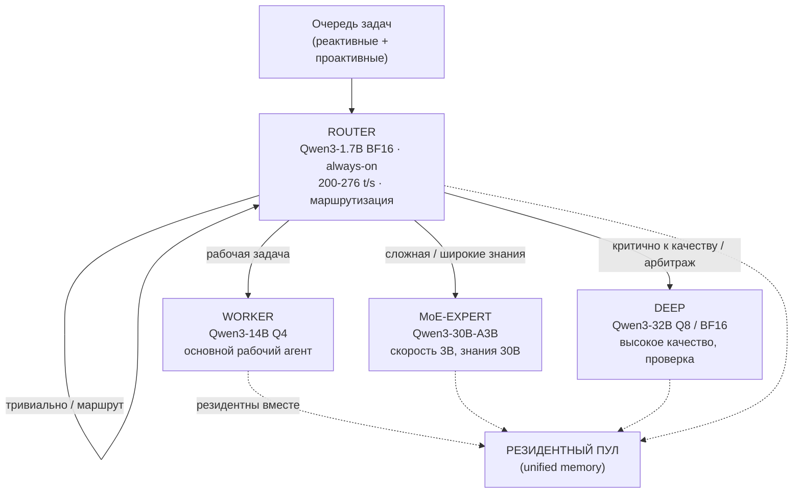
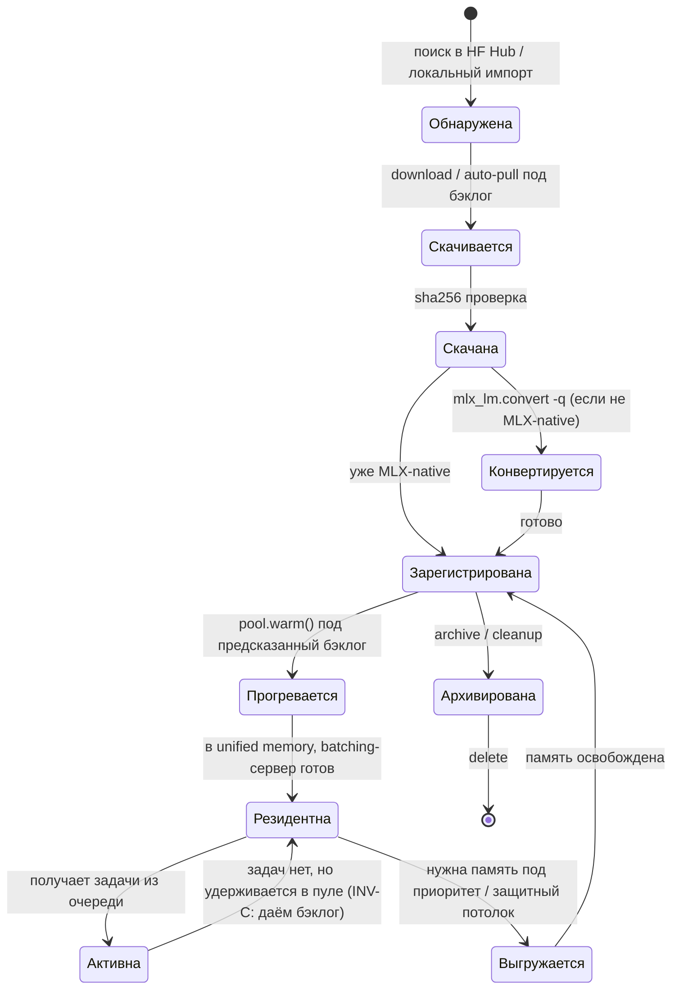
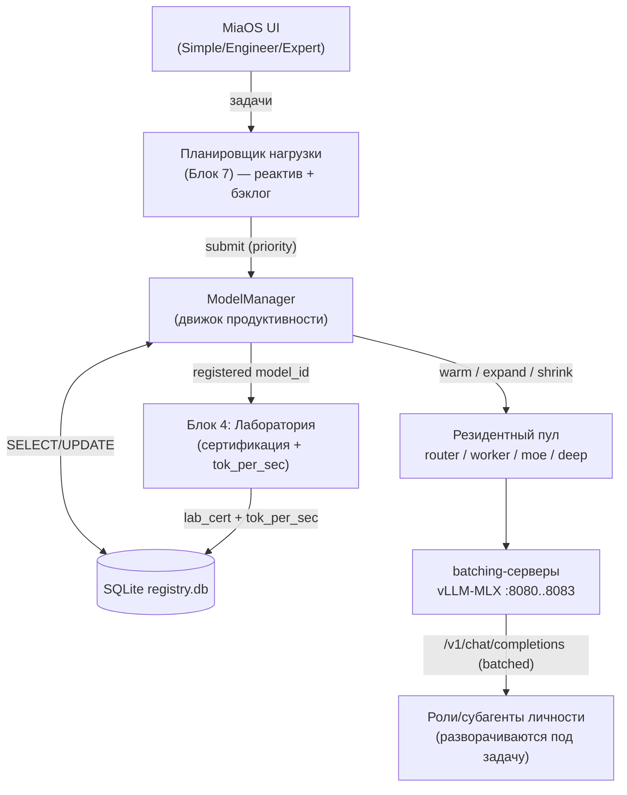
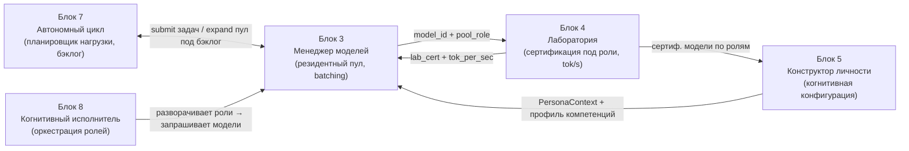

# Блок 3 · Менеджер моделей — движок продуктивности

**Проект:** MiaOS Builder
**Версия:** 2.0 (переработка под философию «когнитивный исполнитель / always-busy»)
**Дата:** Июнь 2026
**Статус:** Архитектурный документ, Этап 2 — Первый пользовательский путь
**Предыдущий блок:** Блок 2 · Пользовательские сценарии и роли
**Следующий блок:** Блок 4 · Лаборатория моделей

---

## 0. Что изменилось в версии 2.0

Версия 1.0 описывала менеджер моделей как «диспетчер»: одна активная модель, выгрузка по простою, экономия памяти. Это противоречит новой философии проекта.

Мия — **универсальный когнитивный исполнитель** (INV-A): механизм, разворачивающий под задачу столько ролей/субагентов, сколько нужно. Значит, моделей в памяти одновременно — несколько, и каждая — это **рабочая сила**, а не «движок диалога». Отсюда переработка:

| Было (v1.0) | Стало (v2.0) |
|---|---|
| Одна активная модель | **Резидентный пул** из 2–5 моделей одновременно |
| Выгрузка из памяти по TTL простоя | **Прогрев и удержание** под бэклог; выгрузка только при нехватке RAM |
| `mlx_lm.server` однопоточный, запрос за запросом | **Continuous batching** (vLLM-MLX / LM Studio mlx-engine) — GPU не простаивает |
| Llama-центричная матрица моделей | **Qwen3-семейство** + MoE-first как рабочая лошадка |
| «Сменить мозг, не меняя личность» | То же + **роль модели в пуле** (роутер / рабочий / глубокий / MoE-эксперт) |
| Экономия энергии — цель | Экономия — **только защитный термопотолок** (INV-C), не приоритет |

> **Инвариант B3-1 (Рабочая сила, не движок диалога).** Модель в MiaOS — единица рабочей силы. Менеджер моделей держит в памяти ПУЛ моделей, распределённых по ролям, и максимизирует их полезную утилизацию. Простаивающая загруженная модель — это сотрудник, который сидит без задачи: менеджер обязан дать ей работу из бэклога (INV-C).

---

## 1. Преамбула: роль в архитектуре

Менеджер моделей — это **движок продуктивности** MiaOS и одновременно её «отдел кадров + цех». Он делает для языковых моделей то, что планировщик задач и пул потоков делают для вычислений: обнаруживает, загружает, версионирует, квантует, держит в памяти **несколько моделей сразу** и распределяет между ними входящую и фоновую работу так, чтобы железо было загружено полезным трудом постоянно.

**Две аналогии:**

| ОС / инфраструктура | MiaOS Model Manager |
|---|---|
| `homebrew install` | Скачать модель с HuggingFace Hub |
| `~/.cache/huggingface/hub/` | Хранилище весов |
| Пул воркеров / thread pool | **Резидентный пул моделей** в unified memory |
| Балансировщик нагрузки | Роутер задач → модель по роли |
| `launchctl` / supervisor | Менеджер процессов `mlx_lm.server` / vLLM-MLX |
| Контроль целостности (checksum, sandbox) | SHA-256, offline-изоляция |

**Модель = рабочая сила личности.** Личность (`.mia`, Блок 5) — независимая от модели архитектурная сущность. Менеджер обеспечивает инвариант «сменить мозг, не меняя личность» И новый инвариант B3-1: под задачу Мия может задействовать НЕСКОЛЬКО мозгов одновременно — лёгкий роутер маршрутизирует, рабочая модель исполняет, MoE-эксперт берёт сложное, а глубокая модель проверяет. Это аппаратное основание нелинейного исполнения (INV-B): параллельные роли требуют параллельных моделей.

---

## 2. Резидентный пул моделей: ядро движка продуктивности

### 2.1 Идея

На Apple Silicon действует **Unified Memory Architecture (UMA)**: CPU, GPU и Neural Engine делят один физический пул памяти, тензоры передаются между процессорами без копирования через PCIe ([MLX: The Next Inference Engine for Apple Silicon](https://yage.ai/share/mlx-apple-silicon-en-20260331.html)). Это позволяет держать **несколько моделей резидентно** и переключаться между ними «горячо» (за миллисекунды на уровне роутинга), не перезагружая с диска.

Загрузка модели с NVMe SSD занимает 2–45 секунд в зависимости от размера ([Mac Studio M3 Ultra review](https://www.youtube.com/watch?v=wzPMdp9Qz6Q)). Поэтому **резидентный пул обязателен**: модели, которые понадобятся, держим прогретыми, а не грузим по запросу.

### 2.2 Роли в пуле



| Роль | Модель (пример) | Что делает | Throughput (M3 Ultra 96GB) |
|---|---|---|---|
| **ROUTER** (always-on) | Qwen3-1.7B BF16 | Классифицирует задачу, маршрутизирует, отвечает на тривиальное, draft для speculative decoding | [276 т/с](https://forums.macrumors.com/threads/mac-studio-m3-ultra-96gb-28-60-llm-performance.2456559/) |
| **WORKER** | Qwen3-14B Q4 | Основная масса рабочих задач: анализ, написание, tool-calling | [70 т/с](https://forums.macrumors.com/threads/mac-studio-m3-ultra-96gb-28-60-llm-performance.2456559/) |
| **MoE-EXPERT** | Qwen3-30B-A3B Q4/Q8 | Сложные задачи с широкими знаниями: скорость как у 3B-dense, знания как у 30B | [95 т/с (Q4) / 76 т/с (Q8)](https://forums.macrumors.com/threads/mac-studio-m3-ultra-96gb-28-60-llm-performance.2456559/) |
| **DEEP** | Qwen3-32B Q8/BF16 | Максимальное качество, финальная проверка, арбитраж «спор-и-синтез» | [20 т/с (Q8) / 11 т/с (BF16)](https://forums.macrumors.com/threads/mac-studio-m3-ultra-96gb-28-60-llm-performance.2456559/) |

> **Инвариант B3-2 (MoE-first).** При прочих равных MoE-модель предпочтительнее dense той же ёмкости. Qwen3-30B-A3B при той же памяти даёт **~2.8× throughput** против dense Qwen3-32B (95 vs 34 т/с на M3 Ultra 96GB, [MacRumors benchmark](https://forums.macrumors.com/threads/mac-studio-m3-ultra-96gb-28-60-llm-performance.2456559/)). Для always-busy это прямой выигрыш пропускной способности «отдела».

### 2.3 Конфигурации пула по железу (диапазон)

Реально доступно для LLM: ~80–90% RAM (macOS резервирует 4–6 ГБ) ([LocalLLaMA](https://www.reddit.com/r/LocalLLaMA/comments/1ad8fsl/)).

**M4 Pro 24 ГБ (~18 ГБ доступно) — минимальный always-on стек:**
```
├── ROUTER:  Qwen3-1.7B BF16  (~4.4 ГБ)  always-on
└── WORKER:  Qwen3-14B Q4     (~8.3 ГБ)  основной агент
                              Итого ~13 ГБ + 5 ГБ под KV-кэш ✓
Вывод: 1 рабочая модель + 1 tiny одновременно. MoE-эксперт — по выгрузке.
```

**M4 Pro 48 ГБ (~42 ГБ) — практичный MiaOS-стек:**
```
├── ROUTER:    Qwen3-1.7B BF16   (~4.4 ГБ)  always-on
├── WORKER:    Qwen3-14B Q4      (~8.3 ГБ)  основной агент
└── MoE-EXPERT: Qwen3-30B-A3B Q4 (~17.2 ГБ) сложные задачи
                                 Итого ~30 ГБ + 12 ГБ под KV-кэш ✓
```

**Mac Studio M3 Ultra 96 ГБ (~88 ГБ) — полноценный когнитивный движок:**
```
├── ROUTER:     Qwen3-1.7B BF16   (~4.4 ГБ)   276 t/s
├── WORKER:     Qwen3-14B Q4      (~8.3 ГБ)   70 t/s
├── MoE-EXPERT: Qwen3-30B-A3B Q8  (~32.5 ГБ)  76 t/s
└── DEEP:       Qwen3-32B Q8      (~34.8 ГБ)  20 t/s (качество/арбитраж)
                                  Итого ~80 ГБ ✓
```

**Mac Studio M3 Ultra 192 ГБ (~184 ГБ) — флагман:**
```
├── ROUTER + WORKER (Q8) + Qwen3-32B BF16 (~65 ГБ) + Qwen3-30B-A3B BF16 (~61 ГБ)
└── ~40 ГБ резерв под KV-кэш, эмбеддинги, инструменты ✓
```

Источник по конфигурациям и числам: [Apple Silicon LLM benchmarks](https://craftrigs.com/comparisons/apple-silicon-llm-benchmarks/), [MacRumors M3 Ultra 96GB](https://forums.macrumors.com/threads/mac-studio-m3-ultra-96gb-28-60-llm-performance.2456559/).

> **Инвариант B3-3 (Резидентный пул).** Менеджер держит прогретым максимально возможный по RAM пул моделей под текущий и предсказанный профиль задач. Выгрузка модели происходит ТОЛЬКО когда требуется память под более приоритетную задачу или при достижении защитного потолка — не по простою.

---

## 3. Continuous batching: GPU не простаивает

### 3.1 Проблема однопоточного сервера

Официальный `mlx_lm.server` обрабатывает запросы **последовательно**. Между пользовательскими запросами GPU простаивает 60–80% времени ([arXiv 2601.19139v2](https://arxiv.org/html/2601.19139v2)). Это прямое нарушение INV-C.

```
DECODE (memory-bandwidth-bound): GPU ~15-30% загружен
IDLE между запросами (без batching): GPU = 0%
CONTINUOUS BATCHING: GPU ~70-90% — новые запросы входят в батч без ожидания
```

### 3.2 Решение: continuous batching сервер

| Сервер | Batching | Фича | Прирост throughput |
|---|---|---|---|
| **vLLM-MLX** ([GitHub](https://github.com/waybarrios/vllm-mlx)) | Continuous | Paged KV-cache, prefix caching | **3.7–4.3×** на 16 параллельных запросах |
| **LM Studio mlx-engine** (v0.4.2+) | Continuous | Авто MLX/GGUF, MIT | — |
| **mlx_lm.server** (официальный) | Нет | Базовый OpenAI API | базис для fallback |

Замеры на M4 Max ([arXiv 2601.19139v2](https://arxiv.org/html/2601.19139v2)):
```
Qwen3-0.6B:      1 запрос → 441 t/s  |  16 запросов → 1642 t/s  (3.7×)
Qwen3-8B:        1 запрос → 93 t/s   |  до 2.6× при 16 запросах
Qwen3-30B-A3B:   до 4.3× агрегатного throughput при 16 запросах
```

> **Инвариант B3-4 (Continuous batching по умолчанию).** Каждая модель в пуле обслуживается batching-сервером (vLLM-MLX в проде, `mlx_lm.server` как fallback). Декомпозиция задачи на параллельные субзадачи (INV-B) и фоновый бэклог (INV-C) дают пул из множества одновременных запросов — именно тот режим, где batching даёт 2.6–4.3×.

### 3.3 Prefix caching и speculative decoding

- **Prefix caching** (vLLM-MLX): общий системный промпт / контекст роли кэшируется и не пересчитывается — до **5.8×** экономии prefill при повторяющихся префиксах ([arXiv 2601.19139v2](https://arxiv.org/html/2601.19139v2)). Критично, когда роли Мии делят один системный контекст.
- **Speculative decoding**: ROUTER-модель (Qwen3-1.7B) служит draft-моделью для WORKER/DEEP. Прирост [+11% (Q8) … +63% (BF16)](https://forums.macrumors.com/threads/mac-studio-m3-ultra-96gb-28-60-llm-performance.2456559/) на M3 Ultra. Already-resident ROUTER = бесплатный ускоритель.

---

## 4. Жизненный цикл модели

Модель проходит состояния, управляемые событиями менеджера, политикой пула и сигналами планировщика нагрузки (Блок 7).



| Состояние | Память | В пуле | Доступна |
|---|---|---|---|
| Зарегистрирована | 0 | нет | готова к прогреву |
| Прогревается | растёт | входит | нет |
| **Резидентна** | полная | **да** | да (ждёт задач) |
| **Активна** | полная | да | да (исполняет) |
| Выгружается | освобождается | выходит | нет |

Ключевое отличие от v1.0: между «Резидентна» и «Активна» нет выгрузки по простою. Резидентная модель без задачи — это сигнал планировщику Блока 7 дать ей проактивную работу из бэклога, а не выгружать её.

---

## 5. Источники, форматы, хранилище

### 5.1 Источники моделей

Основной источник — [mlx-community](https://huggingface.co/mlx-community) и [Qwen на HuggingFace](https://huggingface.co/Qwen) (готовые MLX-веса, safetensors, квантованные). Загрузка через [`mlx-lm`](https://github.com/ml-explore/mlx-lm):

```bash
# Скачать модель пула
python -c "from mlx_lm import load; load('mlx-community/Qwen3-14B-4bit')"

# Конвертация не-MLX репо (секунды на M-чипе)
mlx_lm.convert --hf-path Qwen/Qwen3-30B-A3B --mlx-path ./Qwen3-30B-A3B-4bit -q

# Локальный импорт
miaos model import --path ~/Downloads/my-model --name "custom-7b" --family qwen
```

Кэш: `~/.cache/huggingface/hub/`. Учёт: [`mlx_lm.manage --scan`](https://github.com/ml-explore/mlx-lm).

### 5.2 Форматы

| Формат | Поддержка | Примечание |
|---|---|---|
| MLX safetensors | **Нативная** | предпочтительный |
| HF safetensors (BF16) | Конвертация → MLX | авто при импорте |
| GGUF | Не нативно | MLX [быстрее llama.cpp на 20–87%](https://arxiv.org/html/2601.19139v2), на MoE — до 3×; предлагаем конвертацию |
| ONNX / PyTorch `.bin` | Через HF Transformers | вне основного пути |

> **Решение:** MLX — единственный движок. На моделях до 14B MLX обгоняет llama.cpp на 20–87%, на MoE — до 3× ([arXiv 2601.19139v2](https://arxiv.org/html/2601.19139v2)). Для always-busy это критично: каждый процент throughput — это пропускная способность «отдела».

### 5.3 SQLite-реестр (DDL)

```sql
CREATE TABLE models (
    id          TEXT PRIMARY KEY,          -- UUID v4
    repo        TEXT NOT NULL,             -- "mlx-community/Qwen3-14B-4bit" | "local:custom-7b"
    family      TEXT NOT NULL,             -- "qwen" | "llama" | "mistral" | "deepseek" | ...
    params      REAL NOT NULL,             -- млрд параметров (для MoE — total, см. active_params)
    active_params REAL,                    -- активные параметры (MoE), напр. 3.0 для 30B-A3B
    is_moe      INTEGER NOT NULL DEFAULT 0, -- 1 если MoE
    quant       TEXT NOT NULL,             -- "bf16" | "8bit" | "4bit"
    size_bytes  INTEGER NOT NULL,
    context_len INTEGER NOT NULL,
    path        TEXT NOT NULL,
    pool_role   TEXT,                      -- "router" | "worker" | "moe_expert" | "deep" | NULL
    status      TEXT NOT NULL
        CHECK(status IN ('discovered','downloaded','registered',
                         'warming','resident','active','archived')),
    tok_per_sec REAL,                      -- измеренный throughput (заполняет Блок 4)
    checksum    TEXT,
    added_at    TEXT NOT NULL DEFAULT (strftime('%Y-%m-%dT%H:%M:%fZ','now')),
    last_used   TEXT,
    lab_cert    TEXT,                      -- NULL | "passed" | "failed" | "pending" (Блок 4)
    notes       TEXT
);

CREATE INDEX idx_models_status ON models(status);
CREATE INDEX idx_models_role   ON models(pool_role, is_moe);
CREATE INDEX idx_models_lab    ON models(lab_cert);
```

Новое в v2.0: `pool_role`, `is_moe`, `active_params`, `tok_per_sec`, статусы `warming`/`resident`.

---

## 6. Квантизация и память

Диапазон железа: M4 Pro 24–48 ГБ → M3 Ultra 96–192 ГБ → задел на M5.

| Семейство / Размер | Квант | RAM | M4 Pro 24 | M4 Pro 48 | M3 Ultra 96 | Роль в пуле |
|---|---|---|---|---|---|---|
| Qwen3-1.7B | BF16 | ~4.4 ГБ | ✅ | ✅ | ✅ | ROUTER (always-on) |
| Qwen3-4B | Q4 | ~2.3 ГБ | ✅ | ✅ | ✅ | ROUTER / лёгкий worker |
| Qwen3-8B | Q4 | ~4.6 ГБ | ✅ | ✅ | ✅ | worker (лёгкий) |
| Qwen3-14B | Q4 | ~8.3 ГБ | ✅ | ✅ | ✅ | **WORKER (основной)** |
| Qwen3-14B | Q8 | ~15.7 ГБ | ⚠️ | ✅ | ✅ | worker (качество) |
| **Qwen3-30B-A3B (MoE)** | Q4 | ~17.2 ГБ | ⚠️ | ✅ | ✅ | **MoE-EXPERT** |
| Qwen3-30B-A3B (MoE) | Q8 | ~32.5 ГБ | ❌ | ⚠️ | ✅ | MoE-EXPERT (качество) |
| Qwen3-32B (dense) | Q8 | ~34.8 ГБ | ❌ | ⚠️ | ✅ | DEEP (арбитраж) |
| Qwen3-32B (dense) | BF16 | ~65.5 ГБ | ❌ | ❌ | ✅(192) | DEEP / эталон |
| Llama 3.1 70B | Q4 | ~39.7 ГБ | ❌ | ✅ | ✅ | максимальное качество |

**Легенда:** ✅ рекомендуется · ⚠️ впритык · ❌ не помещается.

> **Решение по кванту.** ROUTER — BF16 (мелкий, скорость важнее памяти, нужен для speculative decoding). WORKER — Q4 (баланс пропускной способности). MoE-EXPERT — Q4 на 48 ГБ, Q8 от 96 ГБ. DEEP — Q8/BF16 для качества арбитража. Это смещение от v1.0 («8-bit для всего»): в пуле квант подбирается ПОД РОЛЬ, а не единый.

---

## 7. Движок запуска и переключение

### 7.1 Менеджер процессов

Каждая резидентная модель — отдельный процесс batching-сервера на своём localhost-порту:

```bash
# vLLM-MLX для рабочей модели (continuous batching)
vllm-mlx serve mlx-community/Qwen3-14B-4bit --port 8081 --host 127.0.0.1

# Fallback / лёгкий роутер на официальном сервере
mlx_lm.server --model mlx-community/Qwen3-1.7B-bf16 --port 8080 --host 127.0.0.1
```

### 7.2 Переключение и расширение пула без потери личности

```
1. Личность (.mia: PAD, IFS-части, Conway-память, Нарратив) хранится отдельно от моделей.
2. switch():  выгрузить старую модель роли → загрузить новую на тот же порт роли.
3. expand():  при росте бэклога — прогреть доп. модель в свободную RAM (INV-C).
4. shrink():  только под защитный потолок или приоритетную задачу — выгрузить по LRU.
5. Контекст личности (PersonaContext) передаётся новой модели — идентичность сохранена.
```

### 7.3 Диаграмма взаимодействия



### 7.4 Интерфейс ModelManager (расширен под пул)

```python
class ModelManager:
    """Движок продуктивности: управляет РЕЗИДЕНТНЫМ ПУЛОМ моделей."""

    def warm(self, model_id: str, role: str) -> ServerHandle:
        """Прогреть модель в пул на роль (router/worker/moe_expert/deep),
        поднять batching-сервер. Не ждёт задач — модель резидентна."""

    def route(self, task: Task) -> str:
        """ROUTER классифицирует задачу и возвращает model_id роли-исполнителя.
        Тривиальное — отвечает сам. Реализует нелинейную маршрутизацию (INV-B)."""

    def expand(self, anticipated_load: LoadProfile) -> list[str]:
        """Прогреть доп. модели под предсказанный бэклог, пока есть RAM (INV-C)."""

    def shrink(self, need_bytes: int) -> list[str]:
        """Выгрузить по LRU ТОЛЬКО под приоритет/защитный потолок."""

    def switch(self, role: str, to_id: str, ctx: PersonaContext) -> ServerHandle:
        """Заменить модель роли, сохранив идентичность личности."""

    def status(self) -> PoolStatus:
        """Состояние пула: роли, mem_used, gpu_util, очереди, tok/s по моделям."""

    def download(self, repo: str, quant: str = "4bit") -> str:
        """Единственная сетевая операция. Авто-конвертация при quant != bf16."""
```

---

## 8. Безопасность, приватность, термозащита

### 8.1 Целостность и изоляция

- **SHA-256** при регистрации и `warm()`: config.json + первый `.safetensors`. Несовпадение → модель не грузится.
- **Сеть:** только `download()` выходит в HTTPS → huggingface.co. Инференс — `127.0.0.1` только. Агенты — через IPC. Телеметрии нет. После загрузки система работает offline (можно отключить фаерволом).
- **HF-токен** — в macOS Keychain. **Аудит-лог** — `~/.miaos/audit.log`.

### 8.2 Термика как защитный потолок (INV-C)

Экономия энергии — НЕ приоритет; приоритет — полезная утилизация. Но есть аппаратный потолок:

| Платформа | 24/7 always-busy | Throttling | Политика менеджера |
|---|---|---|---|
| **Mac Studio M3/M5 Ultra** | ✅ без оговорок | [0–2%](https://www.reddit.com/r/macbookpro/comments/1rse854/sustained_dense_72b_inference_on_m5_max_128gb_how/) | пул на максимум, потолок не нужен |
| MacBook Pro 16" | ✅ с оговорками | [5–10%](https://www.youtube.com/watch?v=l5TChAc5qPg) | питание от сети, мониторинг T° |
| MacBook Pro 14" | ⚠️ не для постоянной | [10–20%](https://www.reddit.com/r/macbookpro/comments/1rse854/sustained_dense_72b_inference_on_m5_max_128gb_how/) | мягкий потолок утилизации |

Затраты: Mac Studio M3 Ultra 96GB в режиме 24/7 ≈ 60 кВт·ч/мес ≈ [$8–12/мес](https://news.ycombinator.com/item?id=43266453) — пренебрежимо против ценности автоматизированного «отдела».

> **Инвариант B3-5 (Термопотолок, не термоэкономия).** Менеджер снижает нагрузку ТОЛЬКО при риске устойчивого перегрева (защита железа), а не ради экономии. На Mac Studio потолок практически не срабатывает; на MacBook 14" вводится мягкое ограничение глубины пула.

---

## 9. M5 Neural Accelerators: эффект на движок

M5 вводит Neural Accelerator в каждое ядро GPU ([Apple ML Research](https://machinelearning.apple.com/research/exploring-llms-mlx-m5)):
- **TTFT / prefill: 3.5–4×** — длинные промпты (RAG, контекст недели) перестают блокировать очередь. Prefill Llama3-8B: M4 Max [1855 → M5 Max 4468 т/с](https://www.youtube.com/watch?v=XGe7ldwFLSE).
- **Генерация: +20–28%** (от bandwidth) — устойчивый прирост на всех моделях.
- **MoE + Neural Accelerators** — лучшее сочетание: Qwen3-30B-A3B TTFT [×3.52](https://machinelearning.apple.com/research/exploring-llms-mlx-m5), hot-reload за 1–2 с.

Для движка продуктивности это значит: на M5 ROUTER почти мгновенно обрабатывает большой контекст, а параллельная декомпозиция (INV-B) дешевеет — больше ролей разворачивается без роста latency. Требует macOS 26.2+.

---

## 10. UI по уровням

**Simple.** Пользователь видит «мощность Мии», а не модели: ползунок «Скорость ↔ Качество» и индикатор «Загрузка движка». Менеджер сам собирает пул под железо.
```
┌──────────────────────────────────────────────┐
│  Движок Мии: ●●●●○  активен                   │
│  Скорость ───●──────── Качество                │
│  В работе: 3 модели · GPU 82% · 4 задачи      │
│  [Настроить под моё железо →]                  │
└──────────────────────────────────────────────┘
```

**Engineer.** Состав пула и роли, выбор кванта, переключение моделей роли, мониторинг GPU/RAM/очередей, `miaos pool status`.

**Expert.** Прямой доступ к `registry.db`, ручное `warm/expand/shrink`, настройка batching-сервера (max_batch, prefix-cache, spec-decoding draft-модель), нестандартная конвертация, `audit.log` и метрики throughput по моделям.

---

## 11. Связь с блоками



| Данные | Откуда | Куда | Формат |
|---|---|---|---|
| `model_id` + `pool_role` | Блок 3 | Блок 4 | UUID + role |
| `lab_cert` + `tok_per_sec` | Блок 4 | Блок 3 registry | строка + REAL |
| Сертиф. модели по ролям | Блок 4 | Блок 5 | список model_id |
| Задачи (priority) | Блок 7/8 | Блок 3 `submit` | Task |
| `expand(LoadProfile)` под бэклог | Блок 7 | Блок 3 | LoadProfile |
| Запрос модели под роль | Блок 8 | Блок 3 `route/warm` | role + Task |

**Ключевой принцип Этапа 2:** Менеджер моделей — это **отдел кадров и цех** когнитивного исполнителя. Он не просто выдаёт одну модель — он держит загруженный пул рабочей силы, распределяет работу через continuous batching и не даёт железу простаивать. Блок 8 разворачивает роли и запрашивает у Блока 3 модели; Блок 7 кормит пул проактивным бэклогом.

---

## Архитектурный итог

Версия 2.0 переосмысляет менеджер моделей из «диспетчера одной модели» в **движок продуктивности** — аппаратное основание Мии как когнитивного исполнителя.

Три ключевых архитектурных решения:
1. **Резидентный пул вместо одной модели** (B3-1, B3-3) — несколько моделей по ролям (router/worker/MoE/deep) одновременно в unified memory; параллельные роли требуют параллельных мозгов.
2. **Continuous batching + MoE-first** (B3-2, B3-4) — vLLM-MLX даёт [2.6–4.3× throughput](https://arxiv.org/html/2601.19139v2), Qwen3-30B-A3B даёт [~2.8× против dense 32B](https://forums.macrumors.com/threads/mac-studio-m3-ultra-96gb-28-60-llm-performance.2456559/); GPU не простаивает.
3. **Always-busy с термопотолком, не термоэкономией** (B3-5) — выгрузка только под приоритет/перегрев; Mac Studio держит нагрузку 24/7 при [0–2% throttling](https://www.reddit.com/r/macbookpro/comments/1rse854/sustained_dense_72b_inference_on_m5_max_128gb_how/).

Все решения проверены свежими бенчмарками 2026 года и реализуемы на сегодняшнем MLX-стеке. Блок передаёт пул моделей и роли в Лабораторию (Блок 4 — сертификация под рабочие роли) и обслуживает планировщик нагрузки (Блок 7) и оркестратор ролей (Блок 8).

---

## References

1. [mlx-lm: официальный репозиторий Apple MLX](https://github.com/ml-explore/mlx-lm)
2. [vLLM-MLX — continuous batching сервер](https://github.com/waybarrios/vllm-mlx)
3. [arXiv 2601.19139v2 — MLX inference benchmarks, continuous batching, MoE](https://arxiv.org/html/2601.19139v2)
4. [MacRumors Forum — Mac Studio M3 Ultra 96GB LLM performance](https://forums.macrumors.com/threads/mac-studio-m3-ultra-96gb-28-60-llm-performance.2456559/)
5. [Apple ML Research — Exploring LLMs with MLX on M5](https://machinelearning.apple.com/research/exploring-llms-mlx-m5)
6. [yage.ai — MLX: The Next Inference Engine for Apple Silicon](https://yage.ai/share/mlx-apple-silicon-en-20260331.html)
7. [Apple Silicon LLM Benchmarks — craftrigs.com](https://craftrigs.com/comparisons/apple-silicon-llm-benchmarks/)
8. [contracollective.com — M4/M5 Pro local AI inference (MLX 2026)](https://contracollective.com/blog/m4-m5-pro-local-ai-inference-mlx-2026)
9. [Reddit — Sustained dense 72B inference on M5 Max 128GB](https://www.reddit.com/r/macbookpro/comments/1rse854/sustained_dense_72b_inference_on_m5_max_128gb_how/)
10. [YouTube — Does Lifting MacBook Speed Up AI Inference? (thermals)](https://www.youtube.com/watch?v=l5TChAc5qPg)
11. [Hacker News — M3 Ultra 24/7 agent economics](https://news.ycombinator.com/item?id=43266453)
12. [Qwen на HuggingFace](https://huggingface.co/Qwen)
