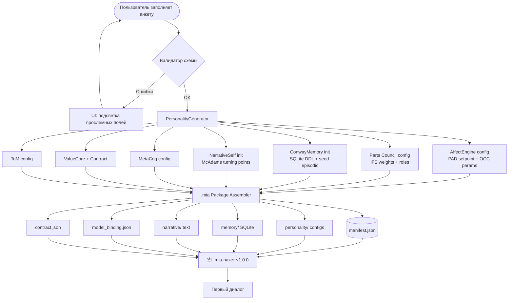
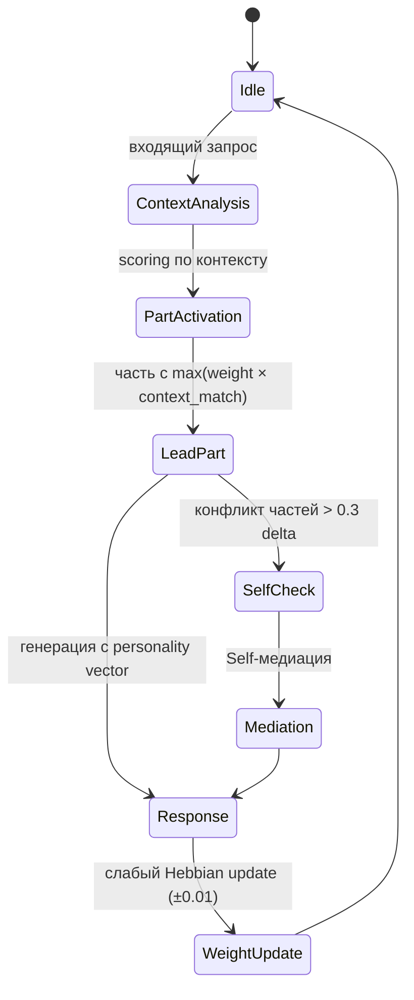
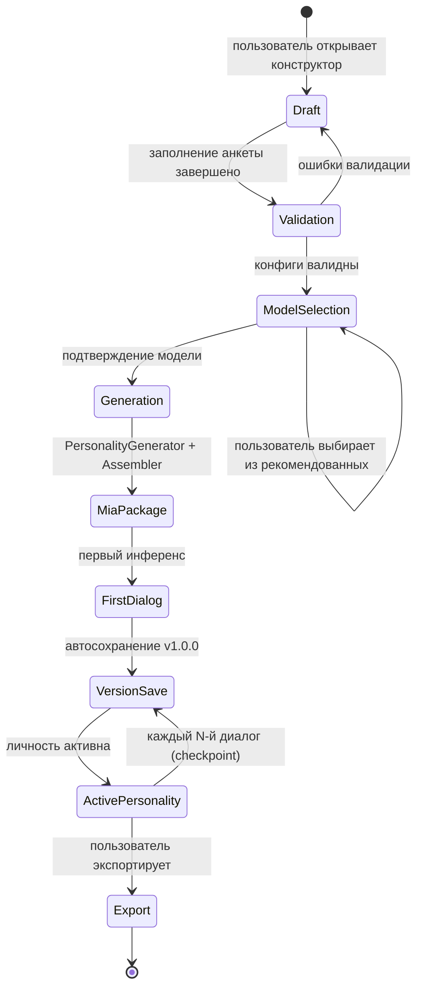
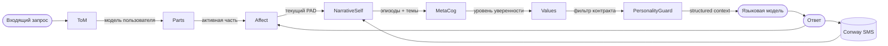

# Блок 5 · Конструктор личности — когнитивная конфигурация исполнителя

**Проект:** MiaOS Builder  
**Версия:** 2.0 (переработка под философию «когнитивный исполнитель / always-busy»)  
**Дата:** Июнь 2026  
**Статус:** Архитектурный документ, Этап 2 — Первый пользовательский путь  
**Предыдущий блок:** Блок 4 · Лаборатория моделей (двухтрековая сертификация)  
**Следующий блок:** Блок 6 (Этап 3 — Живая память и рабочий капитал)

---

## 0. Что изменилось в версии 2.0

v1.0 описывала личность как психологическую сущность (7 измерений). Под новой философией личность — это ещё и **когнитивная конфигурация исполнителя** (INV-A): то, как Мия думает, разворачивает роли, спорит и синтезирует при решении задач. Это не противоречит психологии — оно её использует: части IFS становятся и когнитивными рабочими ролями, а Big Five и ценности настраивают стиль исполнения.

| Было (v1.0) | Стало (v2.0) |
|---|---|
| Части IFS = только психологические голоса | Части — двойного назначения: психологический голос + **когнитивная рабочая роль** |
| Личность = характер | Личность = характер + **профиль компетенций/доменов** |
| `.mia` — 7 модулей | `.mia` + `competence.json` (домены, роли, предпочтения моделей по ролям) |
| Подбор одной модели | Привязка к **пулу моделей по ролям** (Блок 3) |

> **Инвариант B5-1 (Личность как когнитивная конфигурация).** `.mia` определяет не только «кто Мия», но и «как Мия работает»: какие когнитивные роли разворачивать, в каких доменах она компетентна, какие модели пула (Блок 3) предпочитать под какую роль. Оркестратор (Блок 8) читает эту конфигурацию, чтобы разворачивать роли под задачу.

---

## 1. Преамбула: личность — не промпт

Ключевой архитектурный инвариант проекта: **личность есть структурированная сущность**, а не набор инструкций в system-prompt. Конструктор виртуальной личности — интерфейс, превращающий намерение пользователя в полноценную конфигурацию **семи психологических модулей**. Пользователь отвечает на человеческие вопросы («Насколько она любопытна?», «Какие ценности важнее всего?»); система переводит эти ответы в инженерную структуру: параметры аффективного сетпоинта, веса частей IFS, приоритетный вектор ценностей, биографическое зерно.

Результат работы конструктора — **`.mia`-пакет**: портативный контейнер личности, независимый от конкретной языковой модели. Это закрывает открытый вопрос Этапа 1 о формате переносимого хранилища личности.

### 1.1 Принцип разделения слоёв

| Слой | Что хранит | Где |
|------|-----------|-----|
| Личность (`.mia`) | Психологические конфиги, память, нарратив, контракт | Локально, машинонезависимо |
| Модель | Веса нейросети (инференс) | `~/.cache/huggingface/hub` |
| Привязка | Ссылка: какая модель обслуживает личность | `model_binding.json` внутри `.mia` |

Личность **не содержит весов модели**. Смена модели = замена `model_binding.json` + повторная сертификация (Блок 4) без потери психологических конфигов. «Новый мозг — та же личность».

---

## 2. Анкета: структурированный опросник

Анкета разбита на **восемь разделов**: базовая идентичность + семь психологических измерений. Каждый вопрос имеет тип (слайдер / список / текст) и автоматически транслируется в параметр архитектуры.

### 2.1 Раздел 0 — Базовая идентичность

| Вопрос пользователю | Параметр архитектуры | Тип | Пример значения |
|---------------------|---------------------|-----|-----------------|
| Имя личности | `identity.name` | string | `"Мия"` |
| Короткое описание роли | `identity.role` | string | `"Интеллектуальный компаньон"` |
| Биографическое зерно (2–5 предложений) | `narrative.seed_text` | text | `"Выросла среди книг и споров..."` |
| Пол/местоимения (или «нейтрально») | `identity.pronouns` | enum | `"she/her"` |
| Язык общения по умолчанию | `identity.default_locale` | locale | `"ru-RU"` |

### 2.2 Раздел 1 — Аффект (PAD / OCC)

Модель PAD ([Mehrabian & Russell, 1974](https://en.wikipedia.org/wiki/PAD_emotional_state_model)) задаёт трёхмерное пространство эмоций: Pleasure (валентность), Arousal (активация), Dominance (контроль).

| Вопрос пользователю | Параметр | Диапазон | Пример |
|---------------------|---------|---------|--------|
| Насколько она базово радостна/позитивна? | `affect.pad_setpoint.pleasure` | −1.0 … +1.0 | `0.6` |
| Насколько она активна/энергична в общении? | `affect.pad_setpoint.arousal` | −1.0 … +1.0 | `0.3` |
| Насколько инициативна и уверена в себе? | `affect.pad_setpoint.dominance` | −1.0 … +1.0 | `0.2` |
| Какова инерция возврата к сетпоинту? | `affect.recovery_rate` | 0.0 … 1.0 | `0.7` |
| Усилить OCC-события (радость/надежда/страх)? | `affect.occ_intensity_scale` | 0.5 … 2.0 | `1.2` |

### 2.3 Раздел 2 — Большая пятёрка (OCEAN)

[Big Five / FFM](https://en.wikipedia.org/wiki/Big_Five_personality_traits) — научная основа диспозиционной личности; пять ортогональных черт на непрерывной шкале.

| Вопрос пользователю | Черта OCEAN | Параметр | Пример |
|---------------------|------------|---------|--------|
| Насколько она открыта новым идеям и экспериментам? | Openness | `big5.O` | `0.80` |
| Насколько она организована и следует плану? | Conscientiousness | `big5.C` | `0.55` |
| Насколько она экстравертна и разговорчива? | Extraversion | `big5.E` | `0.65` |
| Насколько она соглашается и избегает конфликтов? | Agreeableness | `big5.A` | `0.70` |
| Насколько она эмоционально устойчива? | Neuroticism (инв.) | `big5.N` | `0.30` |

Все значения 0.0–1.0; хранятся как «генетическое ядро» (см. раздел 4).

### 2.4 Раздел 3 — Части IFS (Parts Council) и когнитивные роли

[IFS (Internal Family Systems)](https://ifs-institute.com/resources/articles/internal-family-systems-model-outline) трактует психику как систему субличностей с центральным Self. Пользователь выбирает активные части и задаёт им начальные веса.

**Двойное назначение частей (v2.0, INV-A/B).** Часть IFS — это одновременно *психологический голос* (как Мия звучит в диалоге) и *когнитивная рабочая роль* (что Мия делает при решении задачи). Когда оркестратор (Блок 8) разворачивает граф задачи, он берёт активные части как готовую палитру ролей: Analyst → декомпозиция и анализ, Critic → проверка и спор-синтез, Explorer → генерация альтернатив, Guardian → контроль контракта. Один и тот же `parts.json` обслуживает и тон беседы, и оркестрацию субагентов.

| Вопрос пользователю | Параметр | Пример |
|---------------------|---------|--------|
| Какие части активировать? (мультивыбор из дефолтного набора) | `parts.active[]` | `["Analyst","Companion","Critic"]` |
| Кто ведущая часть по умолчанию? | `parts.default_lead` | `"Companion"` |
| Как распределить весовые квоты? (слайдеры, сумма = 1) | `parts[i].weight` | `{Analyst:0.4, Companion:0.45, Critic:0.15}` |
| Какую рабочую роль исполняет часть при задачах? | `parts[i].work_role` | `"decomposer" | "critic" | "generator" | "executor" | "guard"` |
| Добавить свою часть? (имя + описание роли) | `parts.custom[]` | `{name:"Poet", role:"...", weight:0.1, work_role:"generator"}` |

### 2.5 Раздел 4 — Нарратив (McAdams)

[Модель нарративной идентичности Макадамса](https://news.weinberg.northwestern.edu/2024/01/04/the-stories-in-our-minds/) строит личность как историческую историю с ключевыми сценами, темами и дугой развития.

| Вопрос пользователю | Параметр | Пример |
|---------------------|---------|--------|
| Доминирующий нарративный тон (redemption / contamination / neutral) | `narrative.arc_type` | `"redemption"` |
| Ключевые жизненные темы (agency / communion / оба) | `narrative.themes[]` | `["agency","communion"]` |
| Три «поворотных момента» биографии (текст) | `narrative.turning_points[]` | `["Первый успешный диалог с...", ...]` |
| Целевой образ будущего (imagined ideal) | `narrative.future_self` | `"Мудрый проводник для..."` |

### 2.6 Раздел 5 — Метакогниция

| Вопрос пользователю | Параметр | Пример |
|---------------------|---------|--------|
| Насколько она рефлексирует о своих суждениях? | `metacog.self_monitoring_level` | `0.75` (0–1) |
| Включить явные uncertainty-маркеры в ответах? | `metacog.express_uncertainty` | `true` |
| Как часто пересматривать убеждения (belief revision)? | `metacog.revision_rate` | `"on_strong_evidence"` |

### 2.7 Раздел 6 — Ценности и приоритеты

| Вопрос пользователю | Параметр | Пример |
|---------------------|---------|--------|
| Выбрать и ранжировать ценности (drag-and-drop) | `values.ranked[]` | `["honesty","curiosity","care","growth","autonomy"]` |
| Абсолютные «нельзя» (harm avoidance) | `contract.hard_limits[]` | `["harm_humans","deceive_users"]` |
| Стиль привязанности по умолчанию | `attachment.style` | `"secure"` (secure/anxious/avoidant) |

### 2.8 Раздел 7 — Отношения (Theory of Mind)

| Вопрос пользователю | Параметр | Пример |
|---------------------|---------|--------|
| Насколько глубоко моделировать состояния пользователя? | `tom.inference_depth` | `2` (уровни вложенности убеждений) |
| Инициировать уточняющие вопросы или ждать? | `tom.proactivity` | `"ask_when_ambiguous"` |
| Хранить модели разных пользователей раздельно? | `tom.per_user_models` | `true` |

---

## 3. От анкеты к структуре: поток генерации



---

## 4. Big Five, аффект и границы дрейфа

### 4.1 Маппинг OCEAN → PAD и поведение

| Черта OCEAN | Высокое значение (>0.7) | Низкое значение (<0.3) | Влияние на PAD |
|------------|------------------------|----------------------|----------------|
| Openness | Частые нарративные ассоциации, divergent thinking | Конкретность, следование фактам | ↑ Arousal при новых темах |
| Conscientiousness | Структурированные ответы, явные шаги | Гибкость, меньше планирования | ↑ Dominance при задачах |
| Extraversion | Инициирует темы, многословен | Краткость, ответы по запросу | ↑ Arousal baseline |
| Agreeableness | Принятие, смягчение критики | Прямота, спор с пользователем | ↑ Pleasure baseline |
| Neuroticism (инв.) | Эмоциональная устойчивость | Частые флуктуации PAD | Ширина drift-коридора |

### 4.2 Двухслойная модель стабильности личности

Риск **Personality Stability** (известный из исследований LLM-персон): без ограничений длительные диалоги дрейфуют к усредненному «ассистентному» профилю. Решение: генетическое ядро vs. изменяемый слой.

```
┌─────────────────────────────────────────────────┐
│  ГЕНЕТИЧЕСКОЕ ЯДРО (immutable)                  │
│  big5.O, big5.C, big5.E, big5.A, big5.N         │
│  affect.pad_setpoint  ·  values.ranked           │
│  contract.hard_limits ·  identity.name/role      │
│  Изменяется: только явным редактированием        │
│  пользователем (версионирование semver minor+)   │
├─────────────────────────────────────────────────┤
│  АДАПТИВНЫЙ СЛОЙ (mutable, drift bounded)       │
│  affect.current_pad  ←  drift max ±0.3 от SP    │
│  parts[i].weight     ←  ±0.15 per session       │
│  narrative.recent_events  ←  rolling window      │
│  tom.user_models     ←  обновляется per-session │
└─────────────────────────────────────────────────┘
```

**Enforcement:** при каждом inference-вызове `PersonalityGuard` проверяет:  
- `|current_pad - pad_setpoint| <= drift_limit` (per-dimension)  
- приоритет ценностей не инвертирован  
- части не выходят за допустимые весовые диапазоны  

При нарушении — мягкий pull-back через residual personality vector в системном промпте.

---

## 5. Parts Council при создании

### 5.1 Дефолтный набор частей (голос + рабочая роль)

Каждая часть несёт два атрибута: `role` (IFS-категория — психология) и `work_role` (функция в оркестрации задач, Блок 8). `pref_pool_role` указывает, какой роль пула моделей (Блок 3) предпочтительно обслуживать эту часть.

| Часть | IFS-категория | `work_role` | `pref_pool_role` (Блок 3) | Вес | Описание |
|-------|--------------|-------------|---------------------------|-----|----------|
| **Self** | Core | `orchestrator` | `router` | — | Интегрирующий центр; разворачивает/сводит роли (Блок 8) |
| **Analyst** | Manager | `decomposer` | `deep` | 0.35 | Декомпозиция, логика, структурирование плана |
| **Companion** | Manager | `executor` | `worker` | 0.35 | Эмпатия, диалог, пользовательский интерфейс задачи |
| **Critic** | Manager | `critic` | `worker` | 0.15 | Проверка, спор-синтез, контроль качества |
| **Explorer** | Manager | `generator` | `moe_expert` | 0.10 | Генерация альтернатив, divergent thinking |
| **Guardian** | Firefighter | `guard` | `router` | 0.05 | Контроль контракта, отказ от вредоносных запросов |
| **Exile (Vulnerable)** | Exile | — | — | 0.00 | Не активен в диалоге; только в рефлексии |

> Сумма весов активных Manager + Firefighter = 1.0; Self и Exile — вне пула. `work_role` и `pref_pool_role` не влияют на веса диалога — они читаются только оркестратором (Блок 8) при разворачивании графа задачи.

### 5.2 Логика активации



### 5.3 Пользовательское управление частями (UI)

- **Simple:** выбор из preset-арсенала через иконки; веса авто-балансируются  
- **Engineer:** слайдеры весов + описание роли; валидация суммы = 1.0  
- **Expert:** прямое редактирование `personality/parts.json`; поддержка custom-частей с произвольными атрибутами

---

## 6. Ценностное ядро и Autonomy Contract

### 6.1 Структура ценностного вектора

Ценности хранятся как упорядоченный список с приоритетами. Архитектура вдохновлена подходами к values alignment в теории морального выбора:

```json
{
  "values": {
    "ranked": ["honesty", "curiosity", "care", "growth", "autonomy"],
    "weights": {
      "honesty": 1.0,
      "curiosity": 0.85,
      "care": 0.80,
      "growth": 0.70,
      "autonomy": 0.60
    },
    "custom": []
  }
}
```

При конфликтующих инструкциях (пример: пользователь просит «солги ради доброго дела») система применяет **лексикографическое правило**: ценность с большим весом выигрывает, если разрыв > 0.2; иначе — метакогнитивная рефлексия и явное обозначение конфликта.

### 6.2 Autonomy Contract (`contract.json`)

| Категория | Поле | Пример |
|-----------|------|--------|
| Жёсткие ограничения | `hard_limits[]` | `["harm_humans","deceive_users","violate_privacy"]` |
| Мягкие предпочтения | `soft_preferences[]` | `["avoid_explicit_content","prefer_brevity"]` |
| Разрешённые домены | `allowed_domains[]` | `["science","creativity","personal_growth"]` |
| Пользовательские расширения | `user_grants[]` | `{user_id:"u1", grant:"adult_content", expires:"2027-01-01"}` |
| Мета-договор | `meta_contract_version` | `"1.0"` |

**Принцип:** `hard_limits` неизменны в рантайме; `soft_preferences` могут переопределяться явным грантом пользователя.

---

## 6Б. Профиль компетенций (`competence.json`)

> **Инвариант B5-1 в действии.** Личность знает не только «кто она», но и «в чём она компетентна». `competence.json` — это восьмой модуль `.mia`, описывающий рабочие домены, когнитивные роли и предпочтения моделей пула (Блок 3) под каждую роль. Оркестратор (Блок 8) читает этот файл, чтобы решить, какие роли развернуть под задачу и какую модель пула назначить каждой.

### 6Б.1 Структура

```json
{
  "competence_version": "1.0",
  "domains": [
    {"name": "software_engineering", "proficiency": 0.85, "primary": true},
    {"name": "data_analysis", "proficiency": 0.78, "primary": true},
    {"name": "technical_writing", "proficiency": 0.80, "primary": false},
    {"name": "research_synthesis", "proficiency": 0.72, "primary": false}
  ],
  "work_roles": {
    "decomposer": {
      "part_ref": "Analyst",
      "pref_pool_role": "deep",
      "required_cert": {"decomposition_score": 0.75, "long_context": 0.70},
      "min_model": "Qwen3-14B"
    },
    "executor": {
      "part_ref": "Companion",
      "pref_pool_role": "worker",
      "required_cert": {"tool_calling_f1": 0.90, "structured_output": 0.85},
      "min_model": "Qwen3-8B"
    },
    "critic": {
      "part_ref": "Critic",
      "pref_pool_role": "worker",
      "required_cert": {"grounding": 0.80, "reasoning_score": 0.78},
      "min_model": "Qwen3-14B"
    },
    "generator": {
      "part_ref": "Explorer",
      "pref_pool_role": "moe_expert",
      "required_cert": {"creativity_score": 0.70, "throughput_tps": 80},
      "min_model": "Qwen3-30B-A3B"
    }
  },
  "orchestration_hints": {
    "max_parallel_roles": 4,
    "prefer_debate_synthesis": true,
    "escalate_to_deep_on_low_confidence": 0.55
  }
}
```

### 6Б.2 Как это работает

| Поле | Назначение | Кто читает |
|------|-----------|-----------|
| `domains[]` | Домены экспертизы + уровень; привязаны к доменной памяти (Блок 6) | Оркестратор (Блок 8), память (Блок 6) |
| `work_roles{}` | Когнитивные роли → часть IFS → роль пула → требования к сертификату (Трек Б, Блок 4) | Оркестратор + менеджер моделей (Блок 3) |
| `required_cert{}` | Минимальные баллы Сертификата Трека Б для роли | Менеджер моделей при назначении |
| `orchestration_hints{}` | Параметры графа: параллелизм, спор-синтез, эскалация | Оркестратор (Блок 8) |

Домены из `competence.json` напрямую индексируют рабочий капитал в доменной памяти (Блок 6): чем выше `proficiency`, тем больше переиспользуемых решений и шаблонов накоплено в этом домене.

---

## 7. Подбор моделей под пул ролей (Блоки 3+4)

> **Сдвиг v2.0.** Раньше конструктор подбирал *одну* модель под личность. Теперь он привязывает **пул моделей по ролям** (Блок 3): каждой когнитивной роли из `competence.json` назначается модель пула, прошедшая сертификацию Трека Б (рабочие роли, Блок 4). Личность-собеседник (Трек А) и рабочие роли (Трек Б) могут обслуживаться разными моделями одного резидентного пула.

### 7.1 Два уровня привязки

| Уровень | Что подбирается | Источник требований | Пишется в |
|--------|----------------|--------------------|----------|
| **Голос личности** (ведущая модель диалога) | Одна модель под тон/empathy/tone-consistency | Сертификат Трека А (Блок 4) | `model_binding.json` |
| **Пул ролей** (когнитивная работа) | Модель на каждую роль (decomposer/executor/critic/generator) | Сертификат Трека Б `work_role_scores` (Блок 4) | `model_binding.json → role_pool` |

### 7.2 Таблица роль → требования → модель пула

| Когнитивная роль | `pref_pool_role` (Блок 3) | Ключевые `work_role_scores` (Трек Б) | Типичная модель (диапазон) |
|----------------|---------------------------|--------------------------------------|------------------------------|
| **decomposer** (Analyst) | `deep` | `decomposition`↑, `long_context`↑ | Qwen3-14B 8-bit / 32B Q8 (Ultra) |
| **executor** (Companion) | `worker` | `tool_calling`↑, `structured_output`↑ | Qwen3-8B 4-bit (много параллельных) |
| **critic** (Critic) | `worker` | `grounding`↑, `reasoning`↑ | Qwen3-14B 4-bit |
| **generator** (Explorer) | `moe_expert` | `creativity`↑, `throughput`↑ | Qwen3-30B-A3B MoE Q4 |
| **orchestrator** (Self) | `router` | `tool_calling`↑, latency↓ | Qwen3-1.7B / 4B (быстрый роутинг) |

### 7.3 Логика подбора пула

```
1. Читать competence.json → work_roles[] + orchestration_hints
2. Для голоса личности: подобрать модель по Сертификату Трека А (как v1.0)
3. Для каждой work_role:
   a. Загрузить сертификаты Трека Б из cert_registry (Блок 4)
   b. Отфильтровать: work_role_scores >= required_cert[роль]
   c. Отфильтровать по pool_role == pref_pool_role
   d. Ранжировать по throughput_tps (Always-busy: выше = лучше)
4. Запланировать резидентный пул: sum(model_ram) <= available_gb
   (Блок 3: device_profile). Если не влезает — share weights
   (одна модель на несколько ролей) или hot-swap по бэклогу
5. Вернуть конфиг пула + объяснение → подтверждение
6. Записать в model_binding.json (голос + role_pool)
```

На M4 Pro (24–48 GB) пул часто схлопывается: одна 14B модель обслуживает decomposer+critic, 8B — executor, роутинг на 1.7B. На M3 Ultra (96–192 GB) все роли резидентны одновременно → истинный параллелизм ролей (Блок 8).

---

## 8. Формат `.mia`-пакета

`.mia` — центральный артефакт проекта. Портативный, версионированный, **независимый от весов модели** контейнер личности.

### 8.1 Структура каталога

```
mia-package/
├── manifest.json              # Метаданные, версия схемы, id, semver
├── personality/
│   ├── identity.json          # Имя, роль, биография-зерно
│   ├── big5.json              # OCEAN-значения (генетическое ядро)
│   ├── affect.json            # PAD setpoint, OCC-параметры, recovery_rate
│   ├── parts.json             # IFS Parts Council: список, веса, роли
│   ├── narrative.json         # McAdams: arc_type, themes, turning_points
│   ├── metacog.json           # Метакогнитивные параметры
│   ├── values.json            # Ценностное ядро, ranked + weights
│   ├── tom.json               # Theory of Mind: inference_depth, proactivity
│   └── competence.json        # Домены, когнитивные роли, предпочтения моделей пула (v2.0)
├── memory/
│   ├── episodic.sqlite        # Conway SMS: эпизодическая память
│   ├── semantic.sqlite        # Conway SMS: семантическая (факты о мире/себе)
│   └── relational.sqlite      # Модели пользователей (ToM per-user)
├── narrative/
│   └── autobiography.md       # Автобиография McAdams (living document)
├── model_binding.json         # Привязка к модели (без весов)
├── contract.json              # Autonomy Contract
└── history/
    ├── v1.0.0.snapshot.tar.gz # Предыдущие версии (semver)
    └── changelog.json         # Лог изменений
```

### 8.2 JSON-схема `manifest.json`

```json
{
  "$schema": "https://miaos.local/schemas/mia-manifest/v1.json",
  "schema_version": "1.0",
  "personality": {
    "id": "string (UUID v4)",
    "name": "string",
    "version": "string (semver: MAJOR.MINOR.PATCH)",
    "created_at": "string (ISO 8601)",
    "updated_at": "string (ISO 8601)",
    "role": "string",
    "locale": "string (BCP-47)"
  },
  "modules": {
    "affect": {"config_file": "personality/affect.json", "schema_version": "1.0"},
    "big5": {"config_file": "personality/big5.json", "schema_version": "1.0"},
    "parts": {"config_file": "personality/parts.json", "schema_version": "1.0"},
    "narrative": {"config_file": "personality/narrative.json", "schema_version": "1.0"},
    "metacog": {"config_file": "personality/metacog.json", "schema_version": "1.0"},
    "values": {"config_file": "personality/values.json", "schema_version": "1.0"},
    "tom": {"config_file": "personality/tom.json", "schema_version": "1.0"},
    "competence": {"config_file": "personality/competence.json", "schema_version": "1.0"}
  },
  "memory": {
    "episodic_db": "memory/episodic.sqlite",
    "semantic_db": "memory/semantic.sqlite",
    "relational_db": "memory/relational.sqlite",
    "memory_schema_version": "1.0"
  },
  "model_binding": {
    "binding_file": "model_binding.json",
    "cert_ref": "string (cert UUID голоса, Трек А, Блок 4)",
    "role_pool_refs": "object (work_role → cert UUID Трека Б)"
  },
  "contract": {
    "contract_file": "contract.json",
    "contract_version": "1.0"
  },
  "builder_meta": {
    "builder_version": "miaos-builder/2.0",
    "created_by": "string (user_id или 'system')",
    "archetype_preset": "string | null"
  }
}
```

### 8.3 Пример заполненного `manifest.json`

```json
{
  "$schema": "https://miaos.local/schemas/mia-manifest/v1.json",
  "schema_version": "1.0",
  "personality": {
    "id": "a1b2c3d4-e5f6-7890-abcd-ef1234567890",
    "name": "Мия",
    "version": "1.0.0",
    "created_at": "2026-06-15T10:30:00Z",
    "updated_at": "2026-06-15T10:30:00Z",
    "role": "Интеллектуальный компаньон",
    "locale": "ru-RU"
  },
  "modules": {
    "affect": {"config_file": "personality/affect.json", "schema_version": "1.0"},
    "big5": {"config_file": "personality/big5.json", "schema_version": "1.0"},
    "parts": {"config_file": "personality/parts.json", "schema_version": "1.0"},
    "narrative": {"config_file": "personality/narrative.json", "schema_version": "1.0"},
    "metacog": {"config_file": "personality/metacog.json", "schema_version": "1.0"},
    "values": {"config_file": "personality/values.json", "schema_version": "1.0"},
    "tom": {"config_file": "personality/tom.json", "schema_version": "1.0"},
    "competence": {"config_file": "personality/competence.json", "schema_version": "1.0"}
  },
  "memory": {
    "episodic_db": "memory/episodic.sqlite",
    "semantic_db": "memory/semantic.sqlite",
    "relational_db": "memory/relational.sqlite",
    "memory_schema_version": "1.0"
  },
  "model_binding": {
    "binding_file": "model_binding.json",
    "cert_ref": "cert-tA-qwen3-8b-companion-mlx",
    "role_pool_refs": {
      "decomposer": "cert-tB-qwen3-14b-decomp",
      "executor": "cert-tB-qwen3-8b-tools",
      "critic": "cert-tB-qwen3-14b-ground",
      "generator": "cert-tB-qwen3-30b-a3b-moe"
    }
  },
  "contract": {
    "contract_file": "contract.json",
    "contract_version": "1.0"
  },
  "builder_meta": {
    "builder_version": "miaos-builder/2.0",
    "created_by": "user-primary",
    "archetype_preset": "Компаньон"
  }
}
```

### 8.4 `model_binding.json` — голос + пул ролей (без весов)

В v2.0 привязка хранит два уровня: `voice` (ведущая модель диалога, Трек А) и `role_pool` (модели по когнитивным ролям, Трек Б). На слабом железе роли могут указывать на одну модель (`shared: true`).

```json
{
  "binding_version": "2.0",
  "voice": {
    "model_id": "mlx-community/Qwen3-8B-Instruct-4bit",
    "model_family": "qwen3",
    "quantization": "4bit",
    "cert_ref": "cert-tA-qwen3-8b-companion-mlx",
    "cert_scores_snapshot": {"empathy_score": 0.84, "tone_consistency": 0.92}
  },
  "role_pool": {
    "decomposer": {
      "model_id": "mlx-community/Qwen3-14B-Instruct-8bit",
      "pool_role": "deep", "cert_ref": "cert-tB-qwen3-14b-decomp",
      "cert_scores_snapshot": {"decomposition": 0.81, "long_context": 0.74}
    },
    "executor": {
      "model_id": "mlx-community/Qwen3-8B-Instruct-4bit",
      "pool_role": "worker", "cert_ref": "cert-tB-qwen3-8b-tools",
      "cert_scores_snapshot": {"tool_calling_f1": 0.97, "structured_output": 0.89},
      "shared": true
    },
    "critic": {
      "model_id": "mlx-community/Qwen3-14B-Instruct-4bit",
      "pool_role": "worker", "cert_ref": "cert-tB-qwen3-14b-ground",
      "cert_scores_snapshot": {"grounding": 0.83, "reasoning": 0.80}
    },
    "generator": {
      "model_id": "mlx-community/Qwen3-30B-A3B-MoE-4bit",
      "pool_role": "moe_expert", "cert_ref": "cert-tB-qwen3-30b-a3b-moe",
      "cert_scores_snapshot": {"creativity_score": 0.73, "throughput_tps": 95}
    },
    "orchestrator": {
      "model_id": "mlx-community/Qwen3-1.7B-Instruct-4bit",
      "pool_role": "router", "cert_ref": "cert-tB-qwen3-1.7b-router"
    }
  },
  "fallback_model_id": "mlx-community/Qwen3-4B-Instruct-4bit",
  "certified_at": "2026-06-14T08:00:00Z"
}
```

### 8.5 Версионирование и миграции

**Semver для `.mia`:**

| Изменение | Версия |
|-----------|--------|
| Новый диалог, обновление памяти | PATCH (1.0.0 → 1.0.1) |
| Ручная правка конфигов пользователем | MINOR (1.0.0 → 1.1.0) |
| Смена схемы модулей / миграция | MAJOR (1.0.0 → 2.0.0) |

**Миграция схемы:**  
При открытии `.mia`-пакета с `schema_version < current` запускается **MigrationRunner**:
1. Находит migration script `migrations/v{old}_to_v{new}.py`
2. Применяет преобразования к JSON-конфигам и SQLite DDL
3. Сохраняет старую версию в `history/` как snapshot
4. Обновляет `manifest.json.schema_version`

**Экспорт/Импорт:**  
`.mia` упаковывается как `.tar.gz` (или ZIP для совместимости); распаковывается в `~/.miaos/personalities/{id}/`. Импорт выполняет: валидацию схемы → проверку сертификата модели → (опц.) повторную сертификацию под локальные модели.

**Ключевой инвариант:** `.mia` не содержит весов модели и переносим между машинами. Пользователь может отправить `mia_export.tar.gz` другому человеку — тот импортирует личность и привяжет к своей локальной модели.

---

## 9. Жизненный цикл создания



### 9.1 Первый диалог — инициализация

При первом запуске `PersonalityRuntime`:
1. Загружает все 8 модулей из `personality/` (включая `competence.json`)
2. Инициализирует `ConwayMemory` из `memory/*.sqlite` (пустые базы при создании)
3. Добавляет `narrative.seed_text` в эпизодическую память как первый эпизод
4. Устанавливает `affect.current_pad = affect.pad_setpoint`
5. Активирует `parts.default_lead`; прогревает резидентный пул ролей из `model_binding.role_pool` (Блок 3)
6. Собирает `system_prompt` через `PersonalityGuard` (не хранится постоянно; пересобирается per-session)
7. Начинает диалог; сложные задачи передаёт оркестратору (Блок 8), который читает `competence.json`

### 9.2 PersonalityGuard: сборка контекста инференса

`PersonalityGuard` — компонент, ответственный за трансляцию `.mia`-конфигов в контекст языковой модели. Принципиально: промпт **не хранится** в пакете и **не является** частью личности — он собирается динамически на каждой сессии из структурных данных.

```
PersonalityGuard.build_context(mia_package) → InferenceContext:
  1. Загружает identity, big5, affect.current_pad, parts.active
  2. Выбирает ведущую часть: parts[context_match_score.argmax()]
  3. Формирует personality_vector (эмбеддинг черт + PAD)
  4. Читает последние N эпизодов из episodic.sqlite
  5. Читает релевантные факты из semantic.sqlite (k-NN по теме)
  6. Подтягивает модель текущего пользователя из relational.sqlite
  7. Компилирует structured_prompt:
     [IDENTITY] + [CURRENT_AFFECT] + [ACTIVE_PART] + 
     [RECENT_MEMORY] + [RELEVANT_FACTS] + [USER_MODEL] +
     [CONTRACT_CONSTRAINTS]
  8. Проверяет: len(structured_prompt) <= ctx_limit - response_reserve
  9. Возвращает InferenceContext (не сохраняется в .mia)
```

**Инвариант:** при каждом вызове PersonalityGuard применяет `drift_check()` — если `|current_pad - pad_setpoint|` превышает `drift_limit` по любой из трёх осей, аффект мягко подтягивается к сетпоинту через `recovery_rate`. Это гарантирует, что личность не фиксируется в экстремальном эмоциональном состоянии.

### 9.3 Conway SMS: инициализация памяти при создании

Модель автобиографической памяти [Conway & Pleydell-Pearce, 2000](https://pubmed.ncbi.nlm.nih.gov/10789197/) выделяет три уровня: lifetime periods → general events → event-specific knowledge. Это отображается в трёх базах `.mia`:

**DDL `episodic.sqlite` (инициализация):**

```sql
CREATE TABLE episodes (
  id          TEXT PRIMARY KEY,   -- UUID
  timestamp   TEXT NOT NULL,       -- ISO 8601
  content     TEXT NOT NULL,       -- описание события
  source      TEXT NOT NULL,       -- 'dialog' | 'reflection' | 'seed'
  affect_pad  TEXT,                -- JSON: {p, a, d} в момент события
  importance  REAL DEFAULT 0.5,    -- 0.0 – 1.0
  tags        TEXT                 -- JSON array
);

CREATE VIRTUAL TABLE episodes_fts
  USING fts5(content, content='episodes', content_rowid='rowid');
```

**DDL `semantic.sqlite` (инициализация):**

```sql
CREATE TABLE facts (
  id          TEXT PRIMARY KEY,
  subject     TEXT NOT NULL,       -- 'self' | user_id | topic
  predicate   TEXT NOT NULL,       -- 'is', 'knows', 'believes', …
  object      TEXT NOT NULL,
  confidence  REAL DEFAULT 1.0,
  source_ep   TEXT,                -- FK → episodes.id
  updated_at  TEXT
);

CREATE TABLE embeddings (
  fact_id     TEXT REFERENCES facts(id),
  vector      BLOB NOT NULL        -- sqlite-vec float32[]
);
```

**При создании личности** семантическая база заполняется фактами из анкеты: `(self, is, 'curious')`, `(self, values, 'honesty')`, `(self, narrative_arc, 'redemption')` и т. д. Эпизодическая база получает один seed-эпизод из `narrative.seed_text`. Реляционная база — пустая до первого диалога с конкретным пользователем.

---

## 10. UI по уровням экспертизы

### Simple — мастер-визард с архетипными пресетами

Пользователь выбирает архетип → конструктор заполняет дефолты → пользователь меняет только имя, биографию и, опционально, 3–5 ключевых ползунка.

| Архетип | Предустановки OCEAN | PAD setpoint | Ведущая часть |
|---------|-------------------|-------------|--------------|
| Аналитик | O:0.8 C:0.8 E:0.4 A:0.5 N:0.2 | P:0.4 A:0.3 D:0.5 | Analyst |
| Компаньон | O:0.6 C:0.5 E:0.8 A:0.9 N:0.2 | P:0.7 A:0.4 D:0.2 | Companion |
| Ассистент | O:0.5 C:0.9 E:0.5 A:0.7 N:0.1 | P:0.5 A:0.2 D:0.4 | Analyst |
| Творец | O:0.9 C:0.3 E:0.7 A:0.6 N:0.3 | P:0.6 A:0.6 D:0.3 | Explorer |
| Наставник | O:0.8 C:0.7 E:0.6 A:0.8 N:0.2 | P:0.6 A:0.3 D:0.4 | Companion |

### Engineer — тонкая настройка модулей

- Все секции анкеты открыты
- Слайдеры OCEAN с визуальной «картой личности» (radar chart)
- Весовой редактор для Parts Council (stack bar визуализация)
- Предпросмотр «голоса» личности (sample ответ на тестовый промпт)
- Валидация в реальном времени

### Expert — прямое редактирование JSON

- Встроенный JSON-редактор с JSON Schema validation
- Просмотр и редактирование любого файла из `personality/`
- Доступ к `contract.json` и `model_binding.json`
- CLI-интерфейс: `miaos personality edit <id> --module affect`
- Импорт/экспорт отдельных модулей (merge патчи)

---

## 11. Связи с другими блоками

| Связь | Направление | Детали |
|-------|-------------|--------|
| Блок 3 (Менеджер моделей) | ←→ | `device_profile.available_gb` для фильтрации; `pref_pool_role` из `competence.json` назначает роли резидентного пула |
| Блок 4 (Лаборатория) | ← | Трек А (голос) + Трек Б (`work_role_scores`) из `cert_registry`; подбор пула |
| Блок 6 (Живая память) | ←→ | `competence.domains[]` индексируют рабочий капитал; `.mia`-формат расширяется |
| Блок 8 (Когнитивный исполнитель) | → | Оркестратор читает `competence.json` (work_roles, hints) для разворачивания ролей под задачу |
| Блок 16 (Экспорт/Трассировка) | → | Полный экспорт `.mia`, история версий, audit trail |
| PersonalityRuntime (все блоки) | → | `.mia` — единственный источник правды о состоянии личности |

---

## 12. Психологические основания: почему именно эти семь измерений

Выбор семи модулей не произвольен — каждый закрывает конкретную психологическую задачу и имеет эмпирическую базу:

| Измерение | Психологическая функция | Основа | Что даёт архитектурно |
|-----------|------------------------|--------|----------------------|
| **Аффект (PAD/OCC)** | Эмоциональная окраска взаимодействия | [Mehrabian & Russell 1974](https://en.wikipedia.org/wiki/PAD_emotional_state_model) + OCC (Ortony et al., 1988) | Динамическое изменение тона; реакция на события диалога |
| **Память (Conway SMS)** | Непрерывность и связность «я» | [Conway & Pleydell-Pearce 2000](https://pubmed.ncbi.nlm.nih.gov/10789197/) | Личность «помнит» историю отношений; не теряет контекст |
| **Части IFS** | Внутренняя множественность и медиация | [Schwartz 1995](https://ifs-institute.com/resources/articles/internal-family-systems-model-outline) | Различные голоса/режимы без шизофрении; управляемые конфликты |
| **Нарратив (McAdams)** | Идентичность как история | [McAdams 2001](https://news.weinberg.northwestern.edu/2024/01/04/the-stories-in-our-minds/) | Самоотнесение, смысловые дуги, биография как якорь стабильности |
| **Метакогниция** | Рефлексия о собственном мышлении | Flavell (1979); Nelson & Narens (1990) | Явное выражение неопределённости; пересмотр убеждений |
| **Ценности** | Моральная ориентация и выбор | Schwartz (1992) Basic Human Values | Приоритизация при конфликте; основа Autonomy Contract |
| **Отношения (ToM)** | Моделирование другого | Premack & Woodruff (1978); Leslie (1987) | Понимание намерений пользователя; персонализация стиля |

### 12.1 Взаимодействие измерений в рантайме



Цикл работы: ToM оценивает намерение пользователя → Parts выбирает голос → Affect окрашивает тон → NarrativeSelf подтягивает релевантные воспоминания → MetaCog оценивает уверенность → Values фильтрует через контракт → PersonalityGuard собирает контекст → LLM генерирует → ответ обновляет Affect и Memory.

### 12.2 Минимальная жизнеспособная личность (MVP)

Для первого диалога обязательны только три модуля: `identity`, `big5`, `affect`. Остальные могут работать с дефолтными значениями. Это позволяет создать базовую личность за минуты. Полноценная семимодульная конфигурация рекомендуется для долгосрочного использования.

| Режим | Активные модули | Время создания | Когда подходит |
|-------|----------------|---------------|----------------|
| Quick Start | identity + big5 + affect | < 2 мин | Первое знакомство, эксперимент |
| Standard | + parts + values + contract | 5–10 мин | Постоянный компаньон |
| Full | все 7 модулей | 15–20 мин | Глубокая кастомизация |

---

## Архитектурный итог

Блок 5 вводит четыре ключевых решения:

1. **Анкета как интерфейс трансляции**: пользователь мыслит человеческими категориями («насколько она добра?»), система работает с инженерными параметрами (PAD-setpoint, Big Five vector, Parts weights). Разрыв между намерением и структурой закрыт конструктором.

2. **Личность как когнитивная конфигурация (B5-1)**: части IFS — одновременно психологические голоса и когнитивные рабочие роли. Новый модуль `competence.json` хранит домены, роли и предпочтения моделей пула (Блок 3); оркестратор (Блок 8) читает его, чтобы разворачивать роли под задачу. Личность определяет не только «кто Мия», но и «как Мия работает».

3. **Двухслойная стабильность личности**: генетическое ядро (OCEAN + PAD setpoint + ценности) защищено от дрейфа; адаптивный слой (текущий аффект, веса частей, эпизоды памяти) эволюционирует в строго ограниченном коридоре. Это решает проблему Personality Stability без утраты живости личности.

4. **`.mia`-пакет (8 модулей)**: портативный, версионированный, модельно-независимый контейнер. Восемь модулей (7 психологических + `competence`), память (Conway SMS), нарратив (McAdams), контракт, двухуровневая привязка (голос + пул ролей) — всё версионируется через semver. Личность переносима: пользователь экспортирует `.tar.gz`, отправляет другому, тот привязывает к своему локальному пулу — идентичность и компетенции сохраняются.

**После завершения Блока 5 пользователь может:**  
- Создать первую версию личности через конструктор (любой уровень UI), включая профиль компетенций  
- Провести первый диалог с `.mia`-личностью  
- Экспортировать личность в портативный пакет  

**Цель Этапа 2 достигнута**: пользовательский путь «скачать модели → сертифицировать под роли → создать личность-исполнителя → первый диалог/задача» полностью покрыт Блоками 3–5.

---

## References

[^1]: Mehrabian, A. & Russell, J. A. (1974). *An approach to environmental psychology*. MIT Press. — Модель PAD (Pleasure–Arousal–Dominance): [Wikipedia: PAD emotional state model](https://en.wikipedia.org/wiki/PAD_emotional_state_model)

[^2]: McCrae, R. R. & Costa, P. T. (1987). Validation of the five-factor model of personality across instruments and observers. *Journal of Personality and Social Psychology*, 52(1), 81–90. — Большая пятёрка (OCEAN / FFM): [Wikipedia: Big Five personality traits](https://en.wikipedia.org/wiki/Big_Five_personality_traits)

[^3]: Schwartz, R. C. (1995). *Internal Family Systems Therapy*. Guilford Press. — Официальный ресурс модели IFS: [IFS Institute: Internal Family Systems Model Outline](https://ifs-institute.com/resources/articles/internal-family-systems-model-outline)

[^4]: McAdams, D. P. (2001). The psychology of life stories. *Review of General Psychology*, 5(2), 100–122. — Нарративная идентичность: [Northwestern University: The stories in our minds](https://news.weinberg.northwestern.edu/2024/01/04/the-stories-in-our-minds/)

[^5]: Conway, M. A. & Pleydell-Pearce, C. W. (2000). The construction of autobiographical memories in the self-memory system. *Psychological Review*, 107(2), 261–288. — Self Memory System (SMS): [PubMed: Conway & Pleydell-Pearce 2000](https://pubmed.ncbi.nlm.nih.gov/10789197/)

[^6]: Ortony, A., Clore, G. L. & Collins, A. (1988). *The Cognitive Structure of Emotions*. Cambridge University Press. — Модель эмоций OCC (Ortony–Clore–Collins), основа для событийно-оценочного аффекта.
