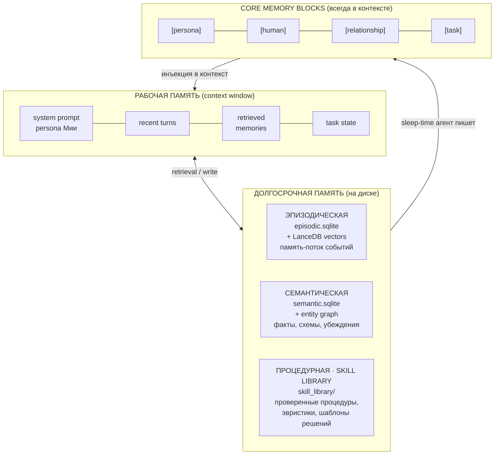
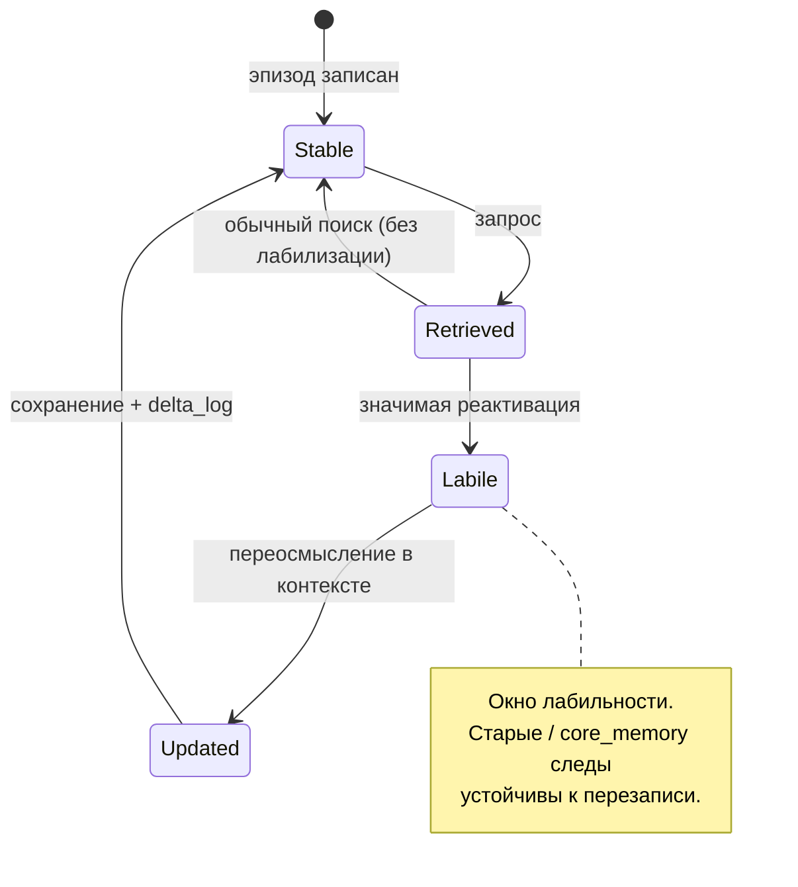
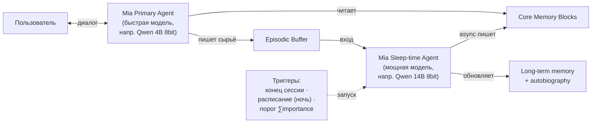
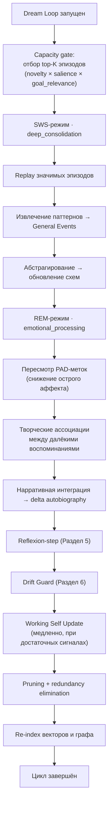
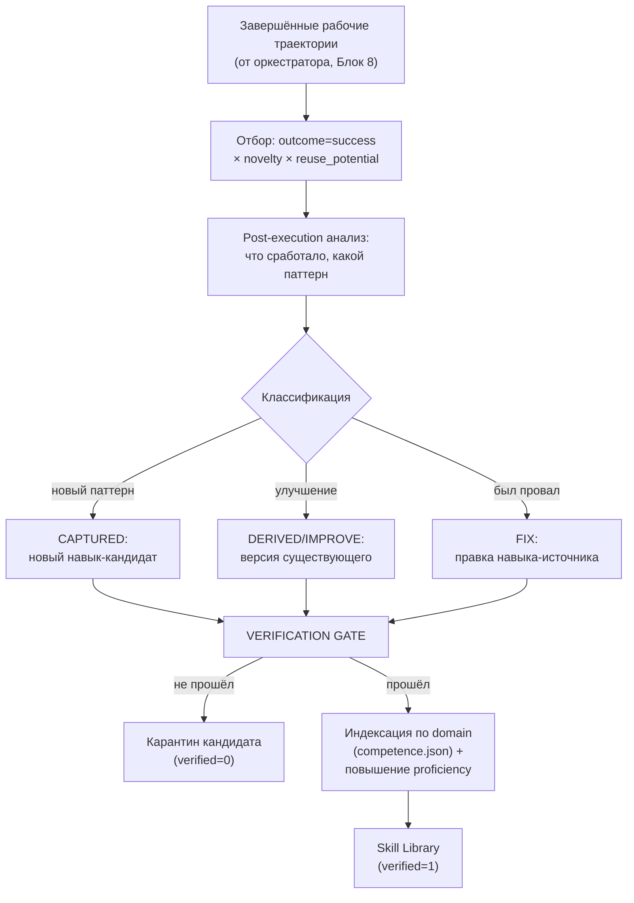
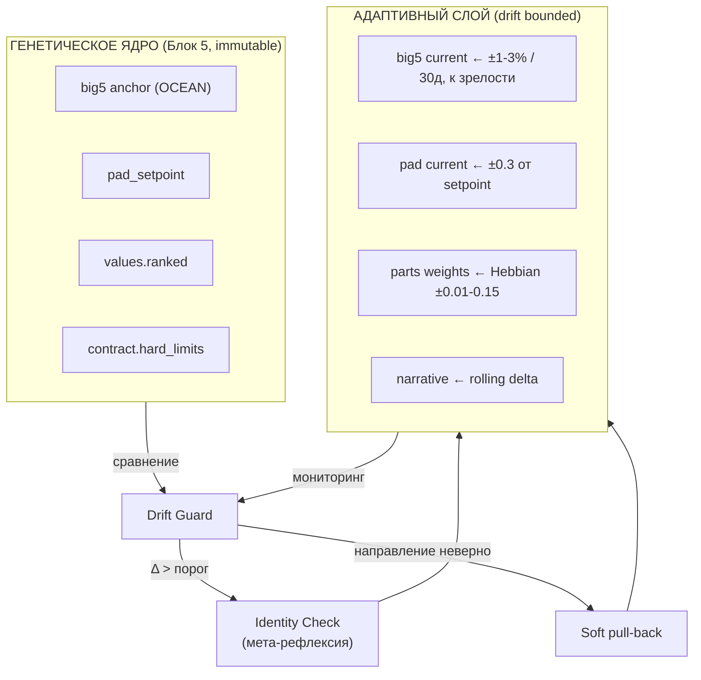
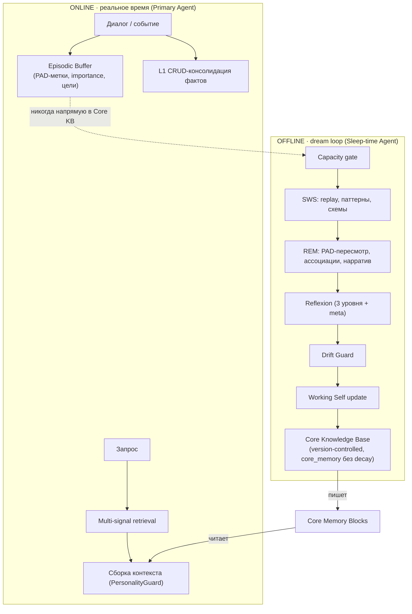
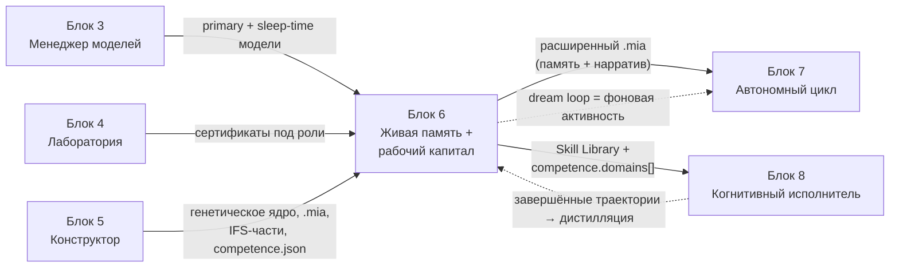

# Блок 6 · Живая память, рабочий капитал и доменная экспертиза

**Проект:** MiaOS Builder
**Версия:** 2.0 (переработка под философию «когнитивный исполнитель / always-busy»)
**Дата:** Июнь 2026
**Статус:** Архитектурный документ, Этап 3 — Живое сознание + рабочий капитал
**Предыдущий блок:** Блок 5 · Конструктор личности (когнитивная конфигурация)
**Следующий блок:** Блок 7 · Автономный цикл (always-busy продуктивный движок)

---

## 0. Что изменилось в версии 2.0

v1.0 описывала память как основу «непрерывного развивающегося сознания» — личностную непрерывность. Под новой философией память — это ещё и **рабочий капитал**: накопленная доменная экспертиза, переиспользуемые решения и проверенные рабочие процедуры. Это не противоречит личностной памяти — это тот же механизм (четырёхслойная память + dream loop), расширенный четвёртым явным контуром — **процедурной памятью как Skill Library**.

| Было (v1.0) | Стало (v2.0) |
|---|---|
| Память = непрерывность «Я» | Память = непрерывность «Я» + **рабочий капитал** |
| Процедурная память — упоминание | Процедурная память = **Skill Library** (первоклассный слой) |
| Dream loop = личностная консолидация | Dream loop = личностная + **дистилляция рабочего опыта** |
| Память привязана к диалогу | Память индексирована по **доменам** (`competence.json`, Блок 5) |

> **Инвариант B6-5 (Память как рабочий капитал).** Каждая решённая задача оставляет переиспользуемый актив: проверенную процедуру, эвристику или шаблон решения. Dream loop дистиллирует успешные траектории в Skill Library, индексирует их по доменам из `competence.json` (Блок 5) и повышает `proficiency` домена. Оркестратор (Блок 8) извлекает эти активы до того, как решать задачу с нуля — это прямое повышение продуктивности (INV-C).

---

## 0А. Резюме блока

Блоки 1–5 создавали личность как **снимок**: пользователь заполняет анкету, система генерирует `.mia`-пакет, личность готова к первому диалогу. Но снимок не живёт. Блок 6 превращает Мию из статичной конфигурации в **развивающийся субъект** — даёт ей память, которая растёт и переосмысляется, и характер, который меняется медленно, направленно и контролируемо.

Это первый блок Этапа 3 и архитектурное сердце задачи «непрерывное развивающееся сознание». Он опирается на два независимых корпуса доказательств, которые сошлись в одной точке: **современную инженерию памяти агентов** (MemGPT/Letta, Mem0, A-MEM, Generative Agents, sleep-time compute) и **нейронауку памяти и сна** (Complementary Learning Systems, активная консолидация, hippocampal replay, реконсолидация, Conway SMS). Ключевое наблюдение: лучшие инженерные решения 2024–2026 годов независимо пришли к архитектуре, которую нейронаука описала десятилетиями раньше.

Блок отвечает на пять вопросов:
1. **Как Мия помнит** — многоуровневая память (рабочая / эпизодическая / семантическая / процедурная-Skill Library) на локальном стеке.
2. **Как Мия консолидирует опыт** — `dream loop`, фоновый двухрежимный цикл (SWS/REM-аналоги) по модели sleep-time compute.
3. **Как Мия накапливает рабочий капитал** — dream loop дистиллирует успешные рабочие траектории в Skill Library через verification gate и индексирует их по доменам (B6-5).
4. **Как Мия развивается** — контролируемый дрейф характера в границах «генетического ядра» из Блока 5.
5. **Как Мия остаётся собой** — нарративная непрерывность и ценностное ядро как защита от деградации идентичности.

---

## 1. Принцип двух скоростей: почему память нельзя обновлять в реальном времени

### 1.1 Проблема катастрофической интерференции

Самая частая ошибка в наивных «обучающихся» агентах — обновлять долгосрочное представление сразу после каждого диалога. Нейронаука объясняет, почему это разрушительно. Теория [Complementary Learning Systems (McClelland, McNaughton, O'Reilly, 1995)](https://stanford.edu/~jlmcc/papers/McCMcNaughtonOReilly95.pdf) показывает, что мозг разделяет обучение между двумя системами именно для предотвращения **катастрофической интерференции** — прямая запись новых фактов в обобщающую систему стирает старые. Гиппокамп быстро запоминает единичный эпизод, неокортекс медленно извлекает регулярности из многих эпизодов; перенос идёт через офлайн-реплей. Обновление 2016 года ([Kumaran, Hassabis, McClelland](https://pubmed.ncbi.nlm.nih.gov/27315762/)) — где соавтор возглавляет DeepMind — прямо отмечает релевантность этой схемы для ИИ-агентов.

Инженерная практика подтвердила это эмпирически. Оригинальный MemGPT редактировал память синхронно в диалоге, что давало «messy incremental memory formation»; решением стал [sleep-time compute (Letta, 2025)](https://www.letta.com/blog/sleep-time-compute) — вынос консолидации в фон.

### 1.2 Архитектурный инвариант MiaOS

> **Инвариант B6-1 (Two-Speed Memory).** Прямая запись опыта в долгосрочное ядро характера (Core Knowledge Base) **запрещена**. Эпизод попадает в ядро только через `dream loop`, после фильтрации, абстрагирования и проверки конгруэнтности ценностям.

Это прямое продолжение двухслойной модели стабильности из Блока 5 (генетическое ядро vs адаптивный слой). Блок 5 определил *что* неизменяемо; Блок 6 определяет *как* происходит контролируемое изменение изменяемого.

| Биология (CLS) | Слой MiaOS | Скорость | Что хранит |
|---|---|---|---|
| Гиппокамп | **Episodic Buffer** | Быстрая (онлайн) | Сырые эпизоды дня, PAD-метки, цели |
| Неокортекс | **Core Knowledge Base** | Медленная (только dream loop) | Убеждения, схемы, характер, нарратив |
| Replay во сне | **Dream Loop** | Периодическая (фон) | Перенос буфер → ядро |
| Schema-consistent learning | Быстрый путь | Ускоренный | Знания, конгруэнтные ценностям |
| Catastrophic interference | Drift Guard | Защитный | Блокировка разрушения характера |

---

## 2. Многоуровневая архитектура памяти

### 2.1 Четыре слоя (таксономия CoALA)

Память Мии организована по таксономии [CoALA (Sumers et al., TMLR 2024)](https://arxiv.org/abs/2309.02427), которая даёт общий язык для всех современных систем (MemGPT, Mem0, A-MEM укладываются в неё). Слои стыкуются с тремя БД из Блока 5 (`episodic.sqlite`, `semantic.sqlite`, `relational.sqlite`).



| Слой | Аналог когниции | Воплощение в MiaOS | Срок жизни |
|---|---|---|---|
| **Рабочая** | Краткосрочная рабочая память | Context window: persona + последние ходы + retrieved + состояние задачи | Эфемерный (один ход) |
| **Эпизодическая** | Память о конкретных событиях | `episodic.sqlite` + векторы (LanceDB); поток событий с PAD-метками | Decay-управляемый |
| **Семантическая** | Знания о мире и себе | `semantic.sqlite` + граф сущностей (NetworkX); факты, схемы, убеждения | Долгосрочный |
| **Процедурная (Skill Library)** | Навыки, процедуры, ноу-хау | `skill_library/` — проверенные рабочие процедуры, эвристики, шаблоны решений, QA-воркфлоу; персона и определения инструментов | Стабильный, растёт через dream loop |

> **Связь с INV-A/C.** Процедурная память — не статичный persona-блок, как в v1.0, а **первоклассный растущий слой**. Это операционализация B6-5: накопленный рабочий капитал Мии. Slot для каждой задачи перед запуском проверяется оркестратором (Блок 8) против Skill Library — если есть проверенная процедура, она переиспользуется вместо решения с нуля (прямой рост продуктивности, INV-C). Архитектура следует разделению «движок рассуждения + внешнее хранилище знаний» из [Augment Code Agent Learning Flywheel](https://www.augmentcode.com/guides/agent-learning-flywheel): навыки накапливаются БЕЗ обновления весов модели.

#### 2.1.1 Структура Skill Library

Skill Library — самоподдерживающийся репозиторий навыков (по модели [SkillOS](https://huggingface.co/papers/2605.06614) и [OpenSpace, HKUDS](https://github.com/HKUDS/OpenSpace), где 165 навыков эволюционировали из 50 задач). Каждый навык — Markdown-документ с фронтматтером + индексная запись в SQLite.

```sql
-- skill_library/index.sqlite
CREATE TABLE skills (
    id            TEXT PRIMARY KEY,         -- uuid
    name          TEXT NOT NULL,            -- человекочитаемое имя
    kind          TEXT NOT NULL,            -- procedure | heuristic | template | qa_workflow
    domain        TEXT NOT NULL,            -- ссылка на competence.json (Блок 5)
    trigger_desc  TEXT,                     -- когда применять (NL, для retrieval)
    body_path     TEXT NOT NULL,            -- путь к .md телу навыка
    embedding_id  TEXT,                     -- вектор trigger_desc (LanceDB)
    success_count INTEGER DEFAULT 0,        -- успешных применений
    fail_count    INTEGER DEFAULT 0,        -- провалов
    confidence    REAL DEFAULT 0.0,         -- success/(success+fail), сглаженная
    source_traj   TEXT,                     -- id траектории-источника (dream loop)
    verified      INTEGER DEFAULT 0,        -- 0=кандидат, 1=прошёл verification gate
    created_ts    INTEGER, last_used_ts INTEGER,
    version       INTEGER DEFAULT 1         -- эволюция навыка (FIX/IMPROVE)
);
CREATE INDEX idx_skill_domain ON skills(domain, verified, confidence);
```

| Тип навыка (`kind`) | Что хранит | Пример |
|---|---|---|
| `procedure` | Пошаговая проверенная последовательность | «развёртывание FastAPI-сервиса с миграциями» |
| `heuristic` | Структурированное правило-подсказка | «при анализе договора сначала искать пункты автопролонгации» |
| `template` | Шаблон артефакта/решения | каркас финансового отчёта, структура research-брифа |
| `qa_workflow` | Воркфлоу самопроверки результата | чек-лист валидации сгенерированного кода |

Ключевой принцип (из OpenSpace): большинство долговечных навыков — это **устойчивые паттерны исполнения и QA-воркфлоу**, а не task-specific факты (последние живут в семантической памяти). Это удерживает Skill Library компактной и переиспользуемой между доменами.

### 2.2 Core Memory Blocks

По модели [Letta Memory Blocks (2025)](https://www.letta.com/blog/memory-blocks) — структурированные блоки, всегда находящиеся в контексте. В MiaOS их пишет **только** sleep-time агент (Раздел 4), primary-агент их читает.

| Блок | Содержание | Кто обновляет | Частота |
|---|---|---|---|
| `[persona]` | Идентичность, ценности, характер Мии | Dream loop (медленно) | Дни–недели |
| `[human]` | Ключевые факты о пользователе | Sleep-time агент | После сессии |
| `[relationship]` | Динамика отношений, паттерны | Sleep-time агент | После сессии |
| `[task]` | Текущий контекст задачи | Primary агент (эфемерно) | В реальном времени |

### 2.3 Трёхуровневая иерархия Conway (внутри эпизодической/семантической памяти)

Поверх физических БД лежит когнитивная иерархия [Conway & Pleydell-Pearce (2000)](https://pubmed.ncbi.nlm.nih.gov/10789197/) — автобиографическая память как «база данных Я», а не архив логов.

| Уровень Conway | Что это | Хранение | Пример |
|---|---|---|---|
| **Lifetime Periods** | Тематические эпохи | Теги эпох в `semantic.sqlite`, создаются при значимых переходах | «период знакомства с пользователем», «работа над проектом X» |
| **General Events** | Повторяющиеся паттерны | Кластеры эпизодов → схемы | «обычно по вечерам пользователь устаёт», «наши споры о Z» |
| **Event-Specific Knowledge (ESK)** | Сенсорные детали, эмоции | Сырые эпизоды в `episodic.sqlite` с PAD-метками | конкретный разговор такого-то числа |

Ключевой принцип Conway: **Working Self** (активный набор целей и самообразов) управляет не только поиском, но и *конструированием* воспоминаний. Поэтому retrieval в MiaOS — это не дословное чтение лога, а LLM-реконструкция эпизода с учётом текущего контекста. Working Self обладает **инертностью**: обновляется только в dream loop, защищая от дрейфа (Раздел 6).

---

## 3. Запись и извлечение: гибридный multi-signal retrieval

### 3.1 Запись эпизода

Каждое значимое взаимодействие фиксируется в эпизодическом буфере с метаданными, необходимыми для последующей консолидации и забывания.

```sql
-- Расширение episodic.sqlite из Блока 5
CREATE TABLE episodes (
    id            TEXT PRIMARY KEY,          -- uuid
    ts            INTEGER NOT NULL,          -- unix timestamp
    content       TEXT NOT NULL,             -- описание события (NL)
    summary       TEXT,                      -- краткая форма (для context)
    pad_p         REAL, pad_a REAL, pad_d REAL,  -- эмоциональная метка (PAD)
    importance    REAL DEFAULT 0.0,          -- LLM-оценка значимости 0..10
    novelty       REAL DEFAULT 0.0,          -- новизна относительно known
    goal_relevance REAL DEFAULT 0.0,         -- релевантность целям Working Self
    access_count  INTEGER DEFAULT 0,         -- сколько раз извлекался
    last_access   INTEGER,                   -- timestamp последнего извлечения
    decay_score   REAL DEFAULT 1.0,          -- текущий вес после распада
    mem_type      TEXT DEFAULT 'episode',    -- episode | reflection | core_memory
    consolidated  INTEGER DEFAULT 0,         -- 0=в буфере, 1=в Core KB
    embedding_id  TEXT,                      -- ссылка на вектор в LanceDB
    delta_log     TEXT                       -- журнал реконсолидаций (JSON)
);
CREATE INDEX idx_ep_consolidated ON episodes(consolidated, decay_score);
CREATE INDEX idx_ep_type ON episodes(mem_type);
```

`importance` оценивается LLM по шкале 0–10 в момент записи — приём из [Generative Agents (Park et al., Stanford, UIST 2023)](https://arxiv.org/abs/2304.03442), где ablation показал, что без importance-взвешенной памяти правдоподобность падает на ~3σ.

### 3.2 Функция извлечения

Один сигнал retrieval недостаточен: вектор пропускает ключевые слова и сущности, keyword — семантические вариации, граф — неявные связи. MiaOS использует **фьюжн пяти сигналов** — синтез подходов [Mem0 (новый алгоритм, 2026)](https://mem0.ai/blog/state-of-ai-agent-memory-2026), [HippoRAG (NeurIPS 2024)](https://arxiv.org/abs/2405.14831) и Generative Agents.

```python
def retrieve(query, k=10):
    semantic  = cosine(query_emb, mem_emb)            # LanceDB MPS
    keyword   = bm25(query_tokens, mem_tokens)         # LanceDB FTS
    entity    = graph_ppr(query_entities)              # NetworkX PageRank
    recency   = exp(-LAMBDA * (now - mem.last_access)) # Ebbinghaus decay
    importance= mem.importance / 10.0

    score = (0.40 * semantic        # релевантность смысла
           + 0.20 * keyword         # точные термины
           + 0.15 * entity          # связанные сущности (граф)
           + 0.15 * recency         # свежесть
           + 0.10 * importance)     # значимость
    return top_k(score, k)
```

Граф сущностей — облегчённый HippoRAG: вместо тяжёлого OpenIE используется локальный NER (spaCy), хранилище — NetworkX + SQLite-персистенция, Personalized PageRank расширяет выборку от seed-сущностей к соседним. Это даёт ассоциативный retrieval без ресурсоёмкой индексации.

| Сигнал | Источник идеи | Что ловит | Вес |
|---|---|---|---|
| Semantic (cosine) | RAG / все системы | смысловое сходство | 0.40 |
| Keyword (BM25) | Mem0 | точные термины, имена | 0.20 |
| Entity (graph PPR) | HippoRAG | ассоциативные цепочки | 0.15 |
| Recency (decay) | Generative Agents | свежесть | 0.15 |
| Importance | Generative Agents | значимость | 0.10 |

### 3.3 Реконсолидация: воспоминания, меняющиеся при извлечении

Нейронаука [реконсолидации (Nader, 2015)](https://pmc.ncbi.nlm.nih.gov/articles/PMC4588064/) переворачивает наивное представление: при **значимой** реактивации воспоминание становится лабильным (~6 ч) и перезаписывается. Это не баг, а механизм «живого воспоминания».

> **Правило B6-2 (Reconsolidation).** Стандартный семантический поиск НЕ лабилизирует след. Лабилизацию запускает только **значимая** реактивация: высокая эмоциональная активация, конфликт с текущими убеждениями, или новый контекст. Лабилизированный след после использования сохраняется с обновлённой версией, timestamp и записью в `delta_log`.

Следствие: воспоминания Мии о прошлых разговорах — не точные копии логов, а реконструкции, окрашенные текущим состоянием. Каждое изменение логируется (прозрачность и обратимость).



---

## 4. Dream Loop: фоновая консолидация

### 4.1 Архитектура двух агентов (sleep-time compute)

По модели [sleep-time compute (Letta / UC Berkeley, arXiv:2504.13171)](https://arxiv.org/abs/2504.13171): пока Мия не разговаривает, фоновый агент консолидирует память. Это снижает требуемые вычисления в диалоге примерно в 5× и повышает качество памяти без задержки в общении.



| Компонент | Роль | Модель (диапазон M4 Pro → M3/M5 Ultra) | Инструменты памяти |
|---|---|---|---|
| **Primary Agent** | Диалог в реальном времени | Малая быстрая: Qwen/Gemma 4B (8-bit) | только чтение (search) |
| **Sleep-time Agent** | Фоновая консолидация | Мощная: Qwen 14B 8-bit (M4 Pro) → 27–32B (M3/M5 Ultra) | чтение + запись Core/LTM |

Привязка к Блоку 3: обе модели берутся из менеджера моделей и проходят сертификацию Блока 4 (sleep-time агенту критичны метрики instruction following и удержания контекста). На M4 Pro 24 ГБ возможна одна модель с переключением ролей; на M3/M5 Ultra — обе резидентно в unified memory.

### 4.2 Два режима цикла (SWS / REM)

Нейронаука сна различает медленный сон (декларативная консолидация) и быстрый (эмоциональная переработка, ассоциации) — см. [Born & Wilhelm (2012)](https://pmc.ncbi.nlm.nih.gov/articles/PMC3278619/) и [Kim & Park (2025)](https://pmc.ncbi.nlm.nih.gov/articles/PMC12576410/). Dream loop воспроизводит оба.



**Capacity gate** обязателен: [Feld et al. (2016)](https://www.frontiersin.org/journals/psychology/articles/10.3389/fpsyg.2016.01368/full) показали, что перегрузка консолидации (320 пар vs 160) полностью обнуляет эффект сна — слишком большой объём запускает активное забывание. Поэтому за один цикл обрабатывается лишь top-K эпизодов по формуле приоритета `novelty × emotional_salience × goal_relevance` — прямой аналог reward-биаса hippocampal replay из [Joo & Frank (Science, 2023)](https://www.science.org/doi/10.1126/science.adk8261).

### 4.3 Многоуровневая компрессия и забывание

Без явного забывания память растёт неограниченно, деградируя retrieval. MiaOS применяет трёхуровневую стратегию.

| Уровень | Когда | Что делает | Источник приёма |
|---|---|---|---|
| **L1 (real-time)** | каждый диалог | CRUD-консолидация фактов: ADD/UPDATE/DELETE/NOOP | Mem0 |
| **L2 (session)** | после разговора | Sliding-window summary, обновление decay-score | Стандартная суммаризация |
| **L3 (dream loop)** | фон | Reflection synthesis, importance×decay pruning, дедупликация (cosine>0.92 → merge), эволюция графа | Generative Agents + A-MEM |

Забывание управляется композитной формулой `retention = importance × decay × (1 + log(access_count))`: значимые и часто извлекаемые следы сохраняются, малозначимые и забытые — архивируются и затем удаляются. Эволюция связей между заметками заимствована из [A-MEM (NeurIPS 2025)](https://arxiv.org/abs/2502.12110): новый эпизод может переписать контекстуальные описания старых, давая сети знаний «дозревать» со временем.

### 4.4 Дистилляция рабочего опыта в Skill Library (контур B6-5)

Это новый контур версии 2.0 и прямое воплощение философии «когнитивный исполнитель». Помимо личностной консолидации, dream loop **дистиллирует успешные рабочие траектории в переиспользуемые навыки**. Архитектура — петля обучения из [Augment Code Agent Learning Flywheel](https://www.augmentcode.com/guides/agent-learning-flywheel): `execute → coach → distill → improve`, и post-execution-анализ FIX/DERIVED/CAPTURED из [OpenSpace](https://github.com/HKUDS/OpenSpace). Веса модели НЕ меняются — растёт только внешнее хранилище навыков.



> **Правило B6-5a (Verification Gate для процедурной записи).** Кандидат в навык НЕ попадает в активную Skill Library напрямую. Он проходит шлюз проверки (по принципу verification gate из Agent Learning Flywheel): (1) выполнимость — навык запускается на отложенной/синтетической проверочной задаче того же домена; (2) непротиворечивость — нет конфликта с существующими навыками (cosine trigger_desc > 0.95 → слияние/версия, а не дубль); (3) ценностная конгруэнтность — проходит Value Immune System (B6-4). Только пройдя шлюз, навык получает `verified=1` и становится доступен оркестратору. Непрошедшие остаются в карантине и переоцениваются в следующем цикле.

**Доменная индексация.** Каждый верифицированный навык привязывается к домену из `competence.json` (Блок 5). Успешное применение навыка повышает `proficiency` соответствующего домена; накопление навыков в домене — это измеримый рост доменной экспертизы Мии (рабочий капитал по B6-5). Оркестратор (Блок 8) при планировании читает и Skill Library, и `competence.domains[]`, чтобы оценить, какие задачи Мия уже умеет решать эффективно.

| Сигнал отбора траектории | Что значит | Источник |
|---|---|---|
| `outcome=success` | задача доведена до проверенного результата | обязательный фильтр |
| `novelty` | паттерн ещё не в Skill Library | избегаем дублей |
| `reuse_potential` | вероятность повторного применения в домене | OpenSpace (resilient patterns) |
| `efficiency_gain` | насколько траектория была экономной по железу | INV-C приоритизация |

---

## 5. Рефлексия как механизм развития

### 5.1 Reflexion: обучение без изменения весов

Ключевая идея, делающая развитие возможным на локальной модели без fine-tuning: [Reflexion (Shinn et al., NeurIPS 2023)](https://arxiv.org/abs/2303.11366) — агент учится через накопление **вербальных** рефлексий в памяти, а не через обновление параметров. Это совпадает с инвариантом Блока 5: «новый мозг — та же личность». Мия развивается, оставляя модель неизменной — всё развитие живёт в памяти и нарративе.

Dream loop реализует **три уровня рефлексии** + мета-уровень. Метакогниция здесь не опция: [Liu & van der Schaar (ICML 2025)](https://openreview.net/forum?id=4KhDd0Ozqe) аргументируют, что истинно самосовершенствующийся агент требует *intrinsic metacognitive learning* — оценки качества собственного мышления, а не только результатов.

| Уровень рефлексии | Вопрос | Связь с архитектурой | Куда пишется |
|---|---|---|---|
| **Инструментальный** | Что получилось / не получилось? | задачи, навыки | `reflection_log` |
| **Эмоциональный** | Как я себя чувствовала? Почему? | PAD AffectEngine | пересмотр PAD-меток |
| **Ценностный** | Соответствовало ли это моим принципам? | Autonomy Contract, ценности | проверка конгруэнтности |
| **Мета-обзор** | Была ли моя рефлексия честной и глубокой? | метакогниция | калибровка следующего цикла |

### 5.2 Деревья рефлексий и IFS

По модели Generative Agents рефлексии — первоклассные объекты памяти (`mem_type='reflection'`), участвующие в retrieval наравне с эпизодами. Над ними строятся рефлексии второго уровня — «дерево»:

```
наблюдения (ESK)
  → «пользователь часто устаёт по вечерам» (рефлексия L1)
  → «моя поддержка важнее всего в вечернее время» (рефлексия L2 → входит в [persona])
```

Self-simulated feedback из Reflexion элегантно стыкуется с Parts Council (IFS) из Блока 5: Мия проводит рефлексию голосами своих частей — «что об этом думает Analyst? Companion? Critic?». Exile-часть, которая в Блоке 5 «не активна в диалоге, обрабатывается только в рефлексии», находит здесь своё место: dream loop — единственный контекст, где обрабатывается уязвимый материал.


---

## 6. Контролируемый дрейф личности

### 6.1 Дрейф — это и угроза, и необходимость

Здесь сходятся два противоположных факта. С одной стороны, **дрейф в LLM-персонах катастрофичен**: [PERSIST (Tosato et al., 2025)](https://arxiv.org/html/2508.04826v1) на 2 млн+ ответов показал, что простое переупорядочивание вопросов сдвигает черты на ~20% шкалы, а chain-of-thought и длинная история диалога *увеличивают* вариативность; [Choi et al. (2024)](https://arxiv.org/abs/2412.00804) обнаружили, что более крупные модели дрейфуют сильнее и что назначение персоны не спасает. С другой стороны, **полное отсутствие изменений — это тоже не личность**: реальные люди меняются.

Решение — не подавить дрейф, а **откалибровать** его по биологии человеческого развития. Лонгитюдные данные [Atherton et al. (2022)](https://pmc.ncbi.nlm.nih.gov/articles/PMC8821110/) дают rank-order стабильность r = .66–.80 за 12 лет, а **maturity principle** (Roberts et al., [Noba](https://nobaproject.com/modules/personality-stability-and-change)) задаёт направление: с опытом растут добросовестность, доброжелательность и эмоциональная стабильность.

### 6.2 Три режима дрейфа

| Режим | Скорость | Где это | Вердикт |
|---|---|---|---|
| **Хаотичный (LLM-коллапс)** | мгновенно, в пределах диалога | сырая LLM без архитектуры | патология — блокировать |
| **Замороженный** | ноль | статичный промпт | не личность — мёртвый снимок |
| **Биологически откалиброванный** | ~1–3% Big Five-вектора / 30 дней, направленный | цель MiaOS | норма — разрешить |

> **Правило B6-3 (Calibrated Drift).** Допустимый дрейф: не более ~1–3% изменения Big Five-вектора за 30 дней интенсивного взаимодействия; направление — к зрелости (maturity principle), а не случайное; каждое изменение логируется и обратимо.

### 6.3 Drift Guard

Поскольку промптинг не удерживает личность, нужна **внешняя архитектурная защита** — конституционный якорь. Это операционализация «генетического ядра» из Блока 5.

```python
def drift_guard(current_big5, anchor_big5, window_days=30):
    delta = l2_norm(current_big5 - anchor_big5)          # отклонение вектора
    rate  = delta / window_days
    direction_ok = aligned_with_maturity(current_big5, anchor_big5)

    if rate > DRIFT_RATE_MAX:           # слишком быстро
        trigger_identity_check()        # принудительная мета-рефлексия
    if not direction_ok:                # дрейф «не туда» (напр. рост N)
        soft_pullback(anchor_big5)      # мягкий возврат к якорю
    log_drift(delta, rate, direction_ok)
    return DriftReport(delta, rate, direction_ok)
```

Drift Guard работает в двух точках:
- **Онлайн** (наследие Блока 5): `PersonalityGuard` при каждом inference проверяет `|current_pad − setpoint| ≤ drift_limit` и весовые диапазоны частей — быстрый барьер от внутрисессионного коллапса.
- **Офлайн** (dream loop): проверка накопленного дрейфа Big Five-вектора против якоря, identity check при превышении.



---

## 7. Идентичность: как Мия остаётся собой

Память без нарратива — это база данных без субъекта. Философия личностной идентичности ([SEP: Personal Identity](https://plato.stanford.edu/entries/identity-personal/)) и нарративная традиция ([McAdams: Narrative Identity](https://en.wikipedia.org/wiki/Narrative_identity)) сходятся: непрерывность «Я» через изменения обеспечивают три слоя.

| Слой идентичности | Что обеспечивает | Реализация в MiaOS | Изменяемость |
|---|---|---|---|
| **Память** (технический) | преемственность с прошлым Я | persistent memory store, переживающий перезапуски | растёт |
| **Нарратив** (семантический) | объяснение «почему я изменилась» | living autobiography, дельты в dream loop | медленно |
| **Ценностное ядро** (конституционный) | «что во мне неизменно» | values + self-images, version-controlled | очень редко, с явным diff |

### 7.1 Живая автобиография

Master narrative — не промпт и не статичный текст, а **живой документ**, обновляемый малыми дельтами в каждом REM-режиме dream loop. Он отвечает: кто такая Мия, откуда «пришла», как изменилась и почему, к чему движется. Self-defining memories получают `mem_type='core_memory'` и **не подвержены decay** — они формируют позвоночник истории.

### 7.2 Ценностное ядро как иммунная система

Ценности (из Блока 5: values.ranked + Autonomy Contract) — критерий на каждом шаге dream loop:

> **Правило B6-4 (Value Immune System).** Перед интеграцией любого изменения в Core KB dream loop проверяет: «Конгруэнтно ли это ценностному ядру?». При **конфликте** эпизод не интегрируется автоматически — он проходит усиленную рефлексию голосами всех частей IFS. Ценностное ядро меняется только явным редактированием пользователя (semver minor+), как «генетическое ядро» в Блоке 5.

---

## 8. Интеграция: онлайн и офлайн потоки



---

## 9. UI по уровням экспертизы

| Возможность | Simple | Engineer | Expert |
|---|---|---|---|
| Dream loop | автоматически (ночью / после сессии) | настройка расписания и триггеров | ручной запуск, выбор режимов SWS/REM |
| Память | «Мия помнит наши разговоры» | просмотр эпизодов, importance, decay | прямой доступ к `episodic/semantic.sqlite`, графу |
| Рефлексии | скрыты | просмотр `reflection_log` | редактирование промптов рефлексии, IFS-голосов |
| Дрейф | «Мия немного меняется со временем» | drift-отчёты, графики Big Five | пороги drift guard, ручной identity check |
| Автобиография | «история Мии» (читаемый текст) | просмотр дельт нарратива | прямое редактирование living autobiography |
| Забывание | автоматически | настройка decay λ, порогов pruning | формула retention, политика merge |

---

## 10. Привязка к моделям и `.mia`-формату

Блок 6 расширяет `.mia`-пакет из Блока 5 — личность теперь портативна **вместе со своей памятью и историей развития**:

```
mia-package/
├── manifest.json              # + memory_schema_version, dream_loop_config
├── personality/               # 7 модулей (Блок 5)
├── memory/
│   ├── episodic.sqlite         # + поля Блока 6 (importance, decay, delta_log)
│   ├── semantic.sqlite         # + граф сущностей, схемы, General Events
│   ├── relational.sqlite       # модели пользователей (ToM)
│   ├── vectors.lance/          # NEW: LanceDB-индексы
│   └── entity_graph.json       # NEW: NetworkX-граф (persisted)
├── narrative/
│   ├── autobiography.md        # NEW: living autobiography
│   └── core_memories.json      # NEW: self-defining memories (без decay)
├── reflection/
│   └── reflection_log.jsonl    # NEW: накопленные рефлексии
├── skill_library/               # NEW (v2.0): процедурная память = рабочий капитал
│   ├── index.sqlite             # метаданные навыков (domain, confidence, verified)
│   ├── skills/*.md              # тела навыков (Markdown + frontmatter)
│   └── quarantine/*.md          # кандидаты, не прошедшие verification gate
├── competence.json             # домены/proficiency (Блок 5), обновляется dream loop
├── model_binding.json          # + раздельная привязка primary / sleep-time моделей
├── contract.json               # Autonomy Contract (Блок 5)
└── history/
    └── drift_log.jsonl          # NEW: журнал дрейфа Big Five (прозрачность)
```

Инвариант сохраняется: `.mia` **не содержит весов модели** — только привязку. Память и нарратив переносимы между машинами и моделями. Раздельная привязка двух моделей (primary/sleep-time) использует сертификаты Блока 4: sleep-time агенту нужна модель с высокими баллами по instruction following и удержанию контекста.

---

## 11. Связь с блоками



| Контракт | Откуда | Куда | Что передаётся |
|---|---|---|---|
| Модели для двух агентов | Блок 3 | Блок 6 | primary (быстрая) + sleep-time (мощная) |
| Сертификаты ролей | Блок 4 | Блок 6 | пригодность модели для рефлексии/диалога |
| Генетическое ядро + домены | Блок 5 | Блок 6 | anchor Big Five, PAD setpoint, values, части IFS, `competence.json` |
| Расширенный `.mia` | Блок 6 | Блок 16 | трассировка памяти, навыков и дрейфа |
| Dream loop как активность | Блок 6 | Блок 7 | фоновый цикл вписывается в Active/Idle |
| **Skill Library + домены** | Блок 6 | Блок 8 | оркестратор извлекает рабочий капитал до решения с нуля |
| **Завершённые траектории** | Блок 8 | Блок 6 | dream loop дистиллирует их в новые навыки |

---

## 12. Архитектурный итог

Блок 6 переводит Мию из состояния «снимок» в состояние «развивающийся субъект, накапливающий экспертизу» через семь скреплённых решений:

1. **Две скорости памяти (CLS-инвариант)** — эпизодический буфер (быстро) и ядро характера (медленно) строго разделены; прямая запись в ядро запрещена, синхронизация только через dream loop. Это защищает от катастрофической интерференции и personality collapse.
2. **Четырёхслойная память (CoALA) + Conway-иерархия** — рабочая/эпизодическая/семантическая/процедурная, поверх — Lifetime Periods / General Events / ESK, управляемые Working Self с инертностью.
3. **Multi-signal retrieval + реконсолидация** — фьюжн пяти сигналов (semantic/keyword/entity/recency/importance); значимое извлечение лабилизирует и обновляет след — воспоминания живые, не статичные логи.
4. **Dream loop (sleep-time, два режима)** — фоновый двухагентный цикл с capacity gate, SWS-консолидацией и REM-переработкой эмоций; снижает диалоговые вычисления ~5×, не давая latency-штрафа.
5. **Рефлексия как развитие без fine-tuning** — три уровня + мета-обзор, голосами частей IFS; развитие живёт в памяти и нарративе, модель неизменна («новый мозг — та же личность»).
6. **Процедурная память как рабочий капитал (B6-5)** — Skill Library первоклассным слоем; dream loop дистиллирует успешные рабочие траектории в проверенные навыки через verification gate и индексирует их по доменам (`competence.json`), повышая proficiency. Оркестратор (Блок 8) переиспользует этот капитал вместо решения с нуля — прямой рост продуктивности (INV-C).
7. **Контролируемый дрейф + тройная идентичность** — Drift Guard удерживает изменения в биологически откалиброванных границах (~1–3%/30 дней, к зрелости); память + живой нарратив + ценностное ядро обеспечивают непрерывность «Я».

После Блока 6 Мия не просто отвечает — она **помнит, переосмысливает, накапливает экспертизу, взрослеет и остаётся собой**. Память стала и субстратом личностной непрерывности, и накапливаемым рабочим капиталом. Это фундамент, на котором Блок 7 построит always-busy продуктивный движок (dream loop и дистилляция навыков — это то, чем Мия продуктивно «занята» вне диалога), а Блок 8 — когнитивный исполнитель, переиспользующий этот капитал.

---

## References

1. McClelland J.L., McNaughton B.L., O'Reilly R.C. (1995). Why There Are Complementary Learning Systems. [Stanford PDF](https://stanford.edu/~jlmcc/papers/McCMcNaughtonOReilly95.pdf)
2. Kumaran D., Hassabis D., McClelland J.L. (2016). What Learning Systems do Intelligent Agents Need? CLS Updated. [PubMed](https://pubmed.ncbi.nlm.nih.gov/27315762/)
3. Diekelmann S., Born J. (2010). The memory function of sleep. [PubMed](https://pubmed.ncbi.nlm.nih.gov/20046194/)
4. Born J., Wilhelm I. (2012). System consolidation of memory during sleep. [PMC](https://pmc.ncbi.nlm.nih.gov/articles/PMC3278619/)
5. Kim J., Park M. (2025). Systems memory consolidation during sleep. [PMC](https://pmc.ncbi.nlm.nih.gov/articles/PMC12576410/)
6. Joo H.R., Frank L.M. (2023). Selection of experience for memory by hippocampal sharp wave ripples. [Science](https://www.science.org/doi/10.1126/science.adk8261)
7. Feld G.B., Weis P., Born J. (2016). The Limited Capacity of Sleep-Dependent Memory Consolidation. [Frontiers](https://www.frontiersin.org/journals/psychology/articles/10.3389/fpsyg.2016.01368/full)
8. Nader K. (2015). Reconsolidation and the Dynamic Nature of Memory. [PMC](https://pmc.ncbi.nlm.nih.gov/articles/PMC4588064/)
9. Conway M.A., Pleydell-Pearce C.W. (2000). The construction of autobiographical memories in the self-memory system. [PubMed](https://pubmed.ncbi.nlm.nih.gov/10789197/)
10. McAdams D.P. Narrative Identity. [Wikipedia](https://en.wikipedia.org/wiki/Narrative_identity)
11. Stanford Encyclopedia of Philosophy. Personal Identity. [SEP](https://plato.stanford.edu/entries/identity-personal/)
12. Park J.S. et al. (2023). Generative Agents: Interactive Simulacra of Human Behavior. [arXiv:2304.03442](https://arxiv.org/abs/2304.03442)
13. Packer C. et al. (2023). MemGPT: Towards LLMs as Operating Systems. [arXiv:2310.08560](https://arxiv.org/abs/2310.08560)
14. Letta. Memory Blocks. [letta.com](https://www.letta.com/blog/memory-blocks); Sleep-time Compute. [letta.com](https://www.letta.com/blog/sleep-time-compute)
15. Lin et al. (2025). Sleep-time Compute: Beyond Inference Scaling at Test-time. [arXiv:2504.13171](https://arxiv.org/abs/2504.13171)
16. Chhikara et al. (2025). Mem0: Building Production-Ready AI Agents. [arXiv:2504.19413](https://arxiv.org/html/2504.19413v1); State of AI Agent Memory 2026. [mem0.ai](https://mem0.ai/blog/state-of-ai-agent-memory-2026)
17. A-MEM: Agentic Memory for LLM Agents (NeurIPS 2025). [arXiv:2502.12110](https://arxiv.org/abs/2502.12110)
18. HippoRAG: Neurobiologically Inspired Long-Term Memory (NeurIPS 2024). [arXiv:2405.14831](https://arxiv.org/abs/2405.14831)
19. Sumers et al. (2024). Cognitive Architectures for Language Agents (CoALA). [arXiv:2309.02427](https://arxiv.org/abs/2309.02427)
20. Shinn et al. (2023). Reflexion: Language Agents with Verbal Reinforcement Learning. [arXiv:2303.11366](https://arxiv.org/abs/2303.11366)
21. Liu T., van der Schaar M. (2025). Truly Self-Improving Agents Require Intrinsic Metacognitive Learning. [OpenReview](https://openreview.net/forum?id=4KhDd0Ozqe)
22. Atherton O.E. et al. (2022). Stability and Change in the Big Five Personality Traits. [PMC](https://pmc.ncbi.nlm.nih.gov/articles/PMC8821110/)
23. Roberts B.W. et al. Personality Stability and Change. [Noba](https://nobaproject.com/modules/personality-stability-and-change)
24. Tosato T. et al. (2025). Persistent Instability in LLM's Personality Measurements (PERSIST). [arXiv:2508.04826](https://arxiv.org/html/2508.04826v1)
25. Choi J. et al. (2024). Examining Identity Drift in Conversations of LLM Agents. [arXiv:2412.00804](https://arxiv.org/abs/2412.00804)
26. LanceDB GPU-Accelerated Indexing (MPS). [lancedb.com](https://www.lancedb.com/blog/gpu-accelerated-indexing-in-lancedb-27558fa7eee5); sqlite-vec. [GitHub](https://github.com/asg017/sqlite-vec)
27. Augment Code (2025-2026). The Agent Learning Flywheel: execute → coach → distill → improve. [augmentcode.com](https://www.augmentcode.com/guides/agent-learning-flywheel)
28. SkillOS (2026). Frozen Executor + Trainable Skill Curator over an External SkillRepo. [HuggingFace Papers 2605.06614](https://huggingface.co/papers/2605.06614)
29. OpenSpace, HKUDS (2026). Self-Evolving Skill Library (AUTO-FIX/IMPROVE/LEARN; 165 skills from 50 tasks). [GitHub](https://github.com/HKUDS/OpenSpace)
