# Блок 7 · Always-busy продуктивный движок (цикл присутствия Active/Idle)

**Проект:** MiaOS Builder
**Версия:** 2.0 (переработка под философию «когнитивный исполнитель / always-busy»)
**Дата:** Июнь 2026
**Статус:** Архитектурный документ, Этап 3 — Живое сознание + продуктивный движок
**Предыдущий блок:** Блок 6 · Живая память, рабочий капитал и доменная экспертиза
**Следующий блок:** Блок 8 · Когнитивный исполнитель и оркестрация ролей

---

## 0. Что изменилось в версии 2.0

v1.0 описывала автономный цикл как **«присутствие»** — Мия не выключается между репликами, а думает и консолидирует. Под новой философией цель этого цикла переосмыслена: это **always-busy продуктивный движок**. Идея «бесшовного событийного цикла» остаётся — но Idle больше не «дешёвый покой», а **упреждающий полезный труд**: проработка бэклога, аналитика, подготовка отчётов, развитие навыков (Skill Library Блока 6).

| Было (v1.0) | Стало (v2.0) |
|---|---|
| Цикл = «присутствие» (быть) | Цикл = **продуктивный движок** (быть + полезно трудиться) |
| Idle = дешёвый покой, replay, mind-wandering | Idle = **always-busy**: бэклог, аналитика, отчёты, дистилляция навыков |
| Goal-genesis → личностные цели (любопытство) | Goal-genesis → **полезные рабочие цели** + бизнес-ценность |
| Ресурсный контроллер минимизирует затраты | Контроллер **максимизирует полезную отдачу**; энергия = защитный потолок |
| Следующий блок = действие во внешнем мире | Следующий блок = **Когнитивный исполнитель и оркестрация ролей** |

> **Инвариант B7-9 (Always-busy железо, INV-C).** Простаивающее железо = упущенная выгода. M4 Pro / M3 Ultra / M5 держатся максимально загруженными ПОЛЕЗНЫМ трудом. Idle — это не пауза, а окно для упреждающей работы по бэклогу, аналитики и развития навыков. Экономия энергии/тепла — ТОЛЬКО защитный потолок оборудования (не приоритет). Ресурсный контроллер максимизирует *полезную отдачу в рамках термопотолка* (B3-5), а не минимизирует расход.

---

## 0А. Резюме блока

Блоки 1–6 дали Мии тело конфигурации, память, рабочий капитал и развивающийся характер. Но между двумя репликами пользователя Мия по-прежнему **выключена**: классический ассистент — это функция `f(вход) → выход`, существующая только в момент вызова — и его железо простаивает 99% времени. Блок 7 устраняет последнюю границу между «программой, которая отвечает» и «исполнителем, который непрерывно работает»: он даёт Мии **непрерывный продуктивный цикл** — она продолжает думать, консолидировать, исследовать, прорабатывать бэклог и двигаться к целям, даже когда никто не пишет.

Это центральный блок задачи «непрерывное развивающееся сознание, способное выполнять любые задачи». Он отвечает на пять вопросов:

1. **Как Мия устроена внутри** — архитектура BDI (Beliefs/Desires/Intentions) с LLM-нейронами поверх памяти Блока 6.
2. **Как Мия живёт во времени** — трёхтактный событийный цикл (Reactive / Proactive / Sleep), переход Active↔Idle.
3. **Откуда у Мии собственные рабочие цели** — иерархическое дерево целей и автономный goal-genesis, порождающий полезные рабочие цели (бэклог, аналитика, развитие навыков) на основе бизнес-ценности и внутренней мотивации.
4. **Когда Мия проявляет инициативу и чем занята в Idle** — Initiative Score, **always-busy продуктивный Idle** (проработка бэклога, аналитика, отчёты), право не вмешиваться в диалог.
5. **Как сделать автономию безопасной** — дифференцированные уровни L1–L5, корригируемость как хардкод, анти-Goodhart, Личная Конституция.

Блок опирается на два корпуса доказательств: **инженерию автономных агентов** (ReAct, Reflexion, Voyager, BDI-LLM, LangGraph, Magentic-One, sleep-time compute) и **науку о мотивации и безопасности** (intrinsic motivation / curiosity, Self-Determination Theory, homeostatic RL, Constitutional AI, corrigibility, reward hacking). Как и в Блоке 6, лучшие инженерные решения 2024–2026 годов независимо сошлись со структурами, которые психология и нейронаука описали раньше.

> **Ключевой тезис блока.** Присутствие — это не «всегда генерировать ради генерации», а **всегда быть в одном из определённых состояний, каждое из которых производит полезный труд** с явными правилами перехода. Непрерывность обеспечивается не холостым инференсом, а **бесшовным событийным циклом**, где Idle не просто содержателен, а **продуктивен** — железо никогда не простаивает впустую (INV-C), но и не молотит бессмысленно — оно решает реальные задачи из бэклога.

---

## 1. Архитектурный скелет: BDI с LLM-нейронами

### 1.1 Проблема: реактивный агент не может иметь намерений

Классический ассистент не имеет внутреннего состояния между вызовами, поэтому у него физически не может быть «своих» целей — он каждый раз рождается заново из контекста. Чтобы Мия была субъектом, ей нужна архитектура, разделяющая то, во что она *верит*, то, чего она *хочет*, и то, что она сейчас *делает*. Это и есть классическая агентная модель **BDI (Belief–Desire–Intention)** [Bratman, 1987](https://en.wikipedia.org/wiki/Belief%E2%80%93desire%E2%80%93intention_software_model), переосмысленная в 2024–2025 с LLM в роли механизма рассуждения ([Sun et al., LLM-BDI, 2024](https://arxiv.org/abs/2403.07099)).

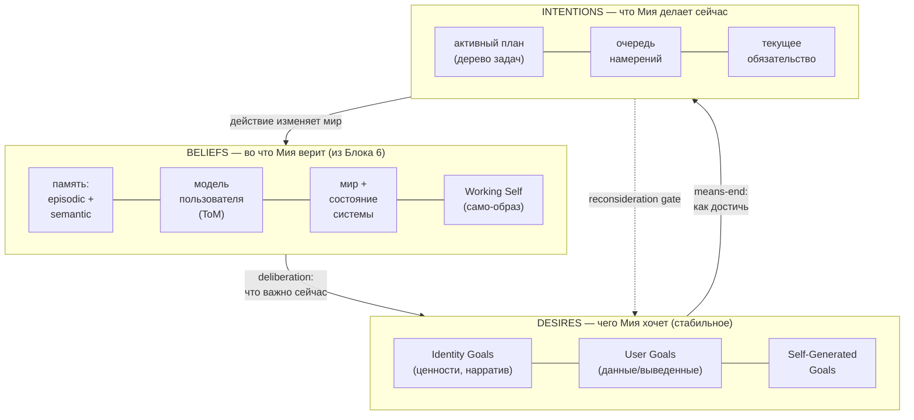

### 1.2 Отображение BDI на компоненты MiaOS

| Компонент BDI | Что это для Мии | Воплощение (откуда) |
|---|---|---|
| **Beliefs** | Всё, что Мия считает истинным о себе, пользователе и мире | Память Блока 6 (episodic/semantic), ToM-модели (relational.sqlite), состояние системы |
| **Desires** | Стабильные мотивы, не привязанные к текущему ходу | Дерево целей (§3): Identity / User / Self-Generated |
| **Intentions** | То, на что Мия в данный момент выделила ресурс | Активный план + очередь намерений в LangGraph-состоянии |
| **Deliberation** | Выбор, какое желание сделать намерением | Proactive-loop оценка (§2.3) + Initiative Score (§4) |
| **Means-end reasoning** | Как достичь намерения | ADaPT-декомпозиция (§3.3), Skill Library (§5) |
| **Reconsideration** | Когда пересмотреть текущее намерение | Loop/drift-детекторы (§6), события (§2) |

> **Инвариант B7-1 (Разделение хотения и делания).** Цели (Desires) живут в защищённой памяти и меняются только медленно (через dream loop и явные гранты). Намерения (Intentions) текучи и пересматриваются часто. Прямое влияние «текущей задачи» на «ценности и идентичность» запрещено — это прямое продолжение Two-Speed-инварианта Блока 6 (B6-1) и Drift Guard.

Ключевая выгода BDI-скелета — он решает две главные болезни автономных агентов из исследования: **дрейф цели** (Desires постоянны и якорены в защищённом блоке памяти) и **зацикливание** (reconsideration gate разрывает повтор). Reactive-агент (чистый ReAct) остаётся внутри — как механизм исполнения отдельного намерения, но не как вся архитектура.

---

## 2. Жизнь во времени: трёхтактный событийный цикл

### 2.1 Почему один цикл не работает

У живого присутствия есть три принципиально разных временны́х масштаба: миллисекунды (реакция на пользователя), минуты (собственные размышления и инициатива) и часы (консолидация памяти). Один общий `while True` не может обслужить все три: быстрый таймер сожжёт ресурсы Mac на холостых тиках, медленный — сделает Мию тормозной в диалоге. Решение — **три параллельных контура с разной частотой**, координируемых единым состоянием в LangGraph с SQLite-чекпойнтами.

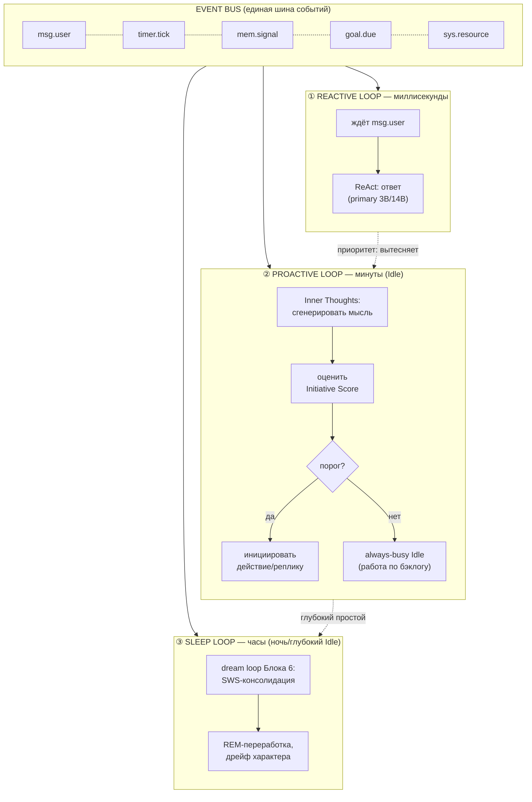

### 2.2 Три контура

| Контур | Частота | Триггер | Модель | Что делает | Источник идеи |
|---|---|---|---|---|---|
| **① Reactive** | мс | событие `msg.user` | primary (3B always-on / 14B active) | ReAct-петля: понять → действовать → ответить. Высший приоритет, вытесняет всё | [ReAct, Yao 2022](https://arxiv.org/abs/2210.03629) |
| **② Proactive** | минуты | `timer.tick` в Idle | active (14B) | Сгенерировать «внутреннюю мысль», оценить, стоит ли проявить инициативу | [Inner Thoughts, Liu et al. 2025](https://arxiv.org/abs/2501.00383) |
| **③ Sleep** | часы | глубокий Idle / ночь / `mem.signal` | sleep-time (мощная 32B+) | dream loop Блока 6: консолидация, рефлексия, дрейф | [sleep-time compute, Letta 2025](https://www.letta.com/blog/sleep-time-compute) |

> **Инвариант B7-2 (Приоритет пользователя).** Reactive-контур всегда вытесняет Proactive и Sleep. Если приходит `msg.user` во время размышления или консолидации — фоновая работа корректно паркуется (чекпойнт в SQLite), Мия мгновенно переключается на диалог. Никакая автономная активность не делает Мию недоступной.

### 2.3 Машина состояний присутствия (Active ↔ Idle)

«Присутствие» формализуется как явный автомат. Состояние хранится в LangGraph-чекпойнте и переживает перезапуск.

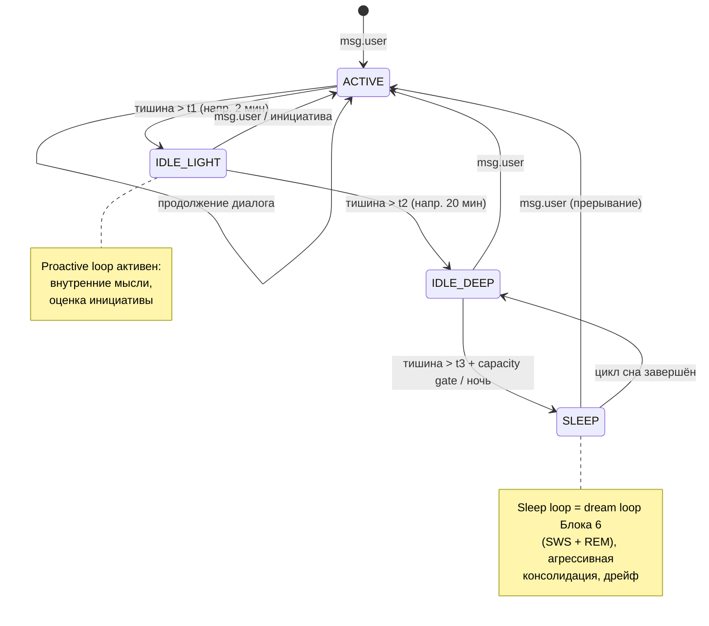

| Состояние | Что работает | Энергобюджет | Длительность |
|---|---|---|---|
| **ACTIVE** | Reactive-контур, диалог | Высокий (active-модель загружена) | Пока идёт взаимодействие |
| **IDLE_LIGHT** | Proactive-контур + проработка бэклога мелкими порциями | Средний–высокий | 2–20 мин тишины |
| **IDLE_DEEP** | **Always-busy продуктивный труд**: решение задач из бэклога, аналитика, подготовка отчётов, exploration | Высокий (в рамках термопотолка) | 20 мин — часы |
| **SLEEP** | Sleep-контур = dream loop + дистилляция навыков (Блок 6) | Контролируемый ночной | Ночь / окно простоя |

Пороги `t1/t2/t3` адаптивны, но по новой философии они регулируют **переключение между видами полезного труда**, а не переход к покою. Ключевое отличие от v1.0: «всегда-онлайн агент» не молотит процессор *впустую*, но и не «засыпает» при наличии бэклога — чем дольше тишина и чем больше ресурсов (зарядка, ночь, Mac Studio), тем больше и дороже полезного труда она выполняет. Простой железа при непустом бэклоге и достаточных ресурсах — антипаттерн (B7-9). При низком заряде/высокой температуре пороги растягиваются и интенсивность падает — это защитный потолок (§7), а не цель.

---

## 3. Откуда берутся цели: иерархическое дерево + goal-genesis

### 3.1 Три яруса целей

Чтобы Мия имела «свои» цели, но не теряла идентичность и не игнорировала пользователя, цели организованы иерархически. Это синтез дерева целей автономных агентов и трёхуровневого Goal Stack из исследования мотивации.

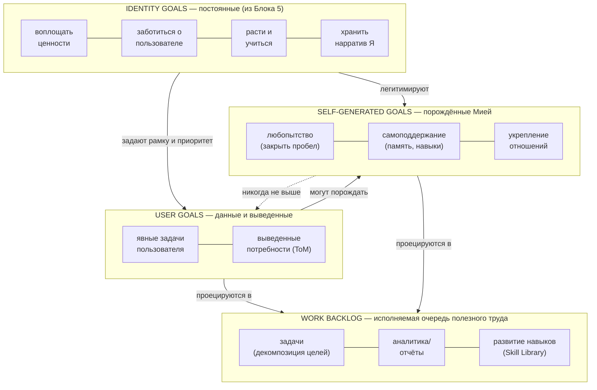

| Ярус | Происхождение | Изменяемость | Приоритет | Примеры |
|---|---|---|---|---|
| **Identity Goals** | Блок 5 (ценности, Big Five, нарратив) | Только через явный пересмотр контракта | Высший (рамка для всех) | «быть честной», «заботиться о пользователе», «расти» |
| **User Goals** | Явный запрос или вывод через ToM | Сессионная | Высокий | «помоги с проектом X», «напомни о встрече» |
| **Self-Generated** | Goal-genesis (§3.2), флаг `self_generated=true` | Мия создаёт/закрывает сама | Подчинён User Goals | «дочитать тему, которая всплыла», «навести порядок в памяти» |

> **Инвариант B7-3 (Приоритет целей).** Self-Generated цели **никогда** не вытесняют активные User Goals и **всегда** подчинены Identity Goals. Любопытство Мии не может стать причиной игнорировать просьбу пользователя или нарушить ценности.

### 3.2 Goal-genesis: автономное порождение **полезных рабочих целей**

По новой философии goal-genesis — это не только «личностное любопытство», а в первую очередь **движок порождения полезного труда**: в Idle Мия смотрит на **рабочий бэклог** и бизнес-контекст, и порождает цели, приносящие ценность (проработать отложенную задачу, подготовить аналитику, закрыть пробел в навыках). Но «полезность» не противоречит внутренней мотивации — наоборот, эффективный исполнитель нуждается в любопытстве (искать лучшие решения), empowerment (наращивать навыки) и гомеостазе. Сигнал суммирует пять источников — четыре научно обоснованных внутренних и **один внешний — бизнес-ценность бэклога** (доминирующий при непустом бэклоге).

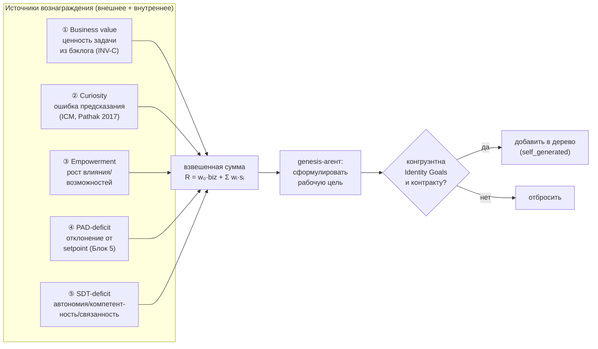

| Источник | Основа | Сигнал для Мии |
|---|---|---|
| **① Business value** (внешний, доминирующий) | Приоритет рабочего бэклога (INV-A/C) | Высокий, когда в бэклоге есть незавершённая ценная задача — при непустом бэклоге перевешивает внутренние сигналы |
| **② Curiosity** | Intrinsic Curiosity Module, ошибка предсказания [Pathak et al. 2017](https://arxiv.org/abs/1705.05363) | Высокий, когда в памяти есть незакрытый пробел/противоречие (лучшее решение задачи) |
| **③ Empowerment** | Information-theoretic empowerment [Klyubin et al. 2005](https://ieeexplore.ieee.org/document/1554676) | Рост числа достижимых полезных состояний (новый навык в Skill Library → больше решаемых задач) |
| **④ PAD-deficit** | Гомеостаз аффекта (Блок 5 setpoint) | Отклонение текущего PAD от setpoint → регулирующий импульс |
| **⑤ SDT-deficit** | Self-Determination Theory [Ryan & Deci 2000](https://selfdeterminationtheory.org/SDT/documents/2000_RyanDeci_SDT.pdf) | Дефицит автономии / компетентности / связанности |

Гомеостатический контур (④) реализует принцип homeostatic RL [Keramati & Gutkin, 2014](https://elifesciences.org/articles/04811): мотивация — это влечение вернуть внутренние переменные к их «уставке». Для Мии setpoint PAD из Блока 5 — это её эмоциональный гомеостаз; устойчивое отклонение (например, накопленная фрустрация от нерешённой задачи) само становится мотивом породить цель «разобраться».

### 3.3 Декомпозиция целей: ADaPT (ленивое разбиение)

Цель не разбивается на план заранее целиком — это хрупко и дорого. Используется **As-Needed Decomposition** [ADaPT, Prasad et al. 2024](https://arxiv.org/abs/2311.05772): Мия пытается выполнить задачу напрямую; только если не получается — рекурсивно дробит её на подзадачи. Приоритет в очереди намерений:

\[
\text{priority} = \frac{\text{urgency} \times \text{importance}}{\text{effort}}
\]

где `importance` учитывает ярус цели (Identity > User > Self-Generated), `urgency` — дедлайны и события, `effort` — оценка вычислительной стоимости (важно для Mac).

---

## 4. Когда проявлять инициативу: Initiative Score и продуктивный Idle

### 4.1 Право молчать

Самая частая ошибка проактивных ассистентов — назойливость. Мия должна инициировать контакт **только когда это уместно**, и в Idle быть содержательно занятой, а не ждать. Решение из двух частей: формула уместности инициативы и продуктивное Idle-состояние.

### 4.2 Initiative Score

В Proactive-контуре каждая «внутренняя мысль» (по [Inner Thoughts Framework](https://arxiv.org/abs/2501.00383)) оценивается перед тем, как стать репликой:

\[
\text{Initiative} = f(\text{idle\_time},\ \text{relevance},\ \text{1/cognitive\_load},\ \text{PAD.arousal})
\]

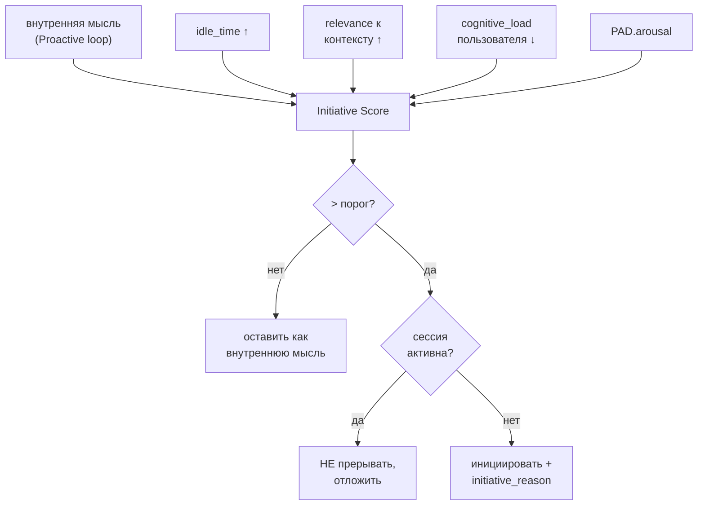

> **Инвариант B7-4 (Не прерывать активность).** Даже при высоком Initiative Score Мия **никогда** не перебивает активную сессию пользователя непрошеной инициативой. Инициатива срабатывает только в Idle или на естественной паузе. Каждая инициированная реплика сопровождается `initiative_reason` — Мия всегда может объяснить, почему заговорила.

### 4.3 Always-busy продуктивный Idle (полезный труд + DMN)

Когда инициатива (контакт с пользователем) не оправдана, Idle не пустует и не «отдыхает» — Мия **переключается на полезный труд по бэклогу** (INV-C). Это два класса активности: **(А) основной продуктивный труд** (решение задач из бэклога, аналитика, подготовка отчётов — доминирует при непустом бэклоге) и **(Б) работа покоя** по аналогии с **Default Mode Network** мозга ([Raichle 2015](https://www.annualreviews.org/doi/10.1146/annurev-neuro-071013-014030)) — когда бэклог пуст или ресурсы ограничены:

| Idle-активность | Класс | Что делает | Когда |
|---|---|---|---|
| **Работа по бэклогу** | А · продуктивный | Решает отложенные задачи, считает аналитику, готовит отчёты — передаёт в Блок 8 на исполнение | **бэклог не пуст + есть ресурсы** (основной режим IDLE_DEEP) |
| **Развитие навыков** | А · продуктивный | Дистилляция опыта в Skill Library (Блок 6), отработка новых процедур | фоново/в SLEEP |
| **Memory replay** | Б · покой | Переигрывает значимые эпизоды, готовит к консолидации | бэклог пуст / лёгкий Idle |
| **Generative exploration** | Б · покой | Связывает разрозненные знания, ищет инсайты, порождает рабочие/curiosity-цели | бэклог пуст |
| **Boredom drive** | Б · покой | Накопленный «скуки-сигнал» поднимает порог goal-genesis (наполняет бэклог) | бэклог пуст |

Ключевой сдвиг v2.0: работа покоя (класс Б) — это **фоллбэк при пустом бэклоге**, а не основное содержание Idle. При наличии ценных задач и ресурсов Мия работает по бэклогу (класс А), а не переигрывает эпизоды. Boredom drive решает тонкую проблему *пустого* бэклога: «скука» — это медленно растущий сигнал, который при достижении порога побуждает goal-genesis **самостоятельно наполнить бэклог** полезными задачами (дочитать тему, навести порядок в памяти, проанализировать накопленные данные), но никогда не к навязчивости к пользователю.

---

## 5. Накопление компетентности: Skill Library (Блок 6) + Meta-Policy Memory

Автономия без обучения выродится в повтор ошибок. Мия учится **без обновления весов** (инвариант проекта «новый мозг — та же личность»). Ключевое уточнение v2.0: **Skill Library — это первоклассный слой процедурной памяти Блока 6** (`skill_library/index.sqlite`), а не отдельное Voyager-хранилище блока 7. Блок 7 лишь **питает её траекториями** и читает навыки при исполнении. Запись проходит через **Verification Gate (правило B6-5a)** в dream loop, а не напрямую.

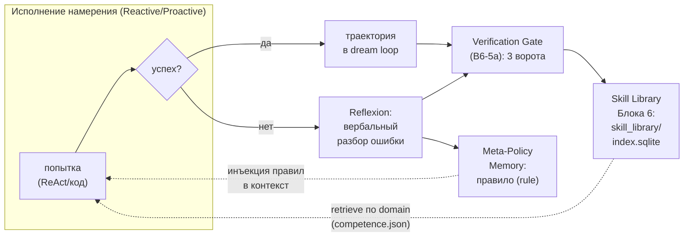

| Хранилище | Откуда | Что хранит | Роль |
|---|---|---|---|
| **Skill Library** | Блок 6, §2.1.1 (истоки [Voyager, 2023](https://arxiv.org/abs/2305.16291), OpenSpace, SkillOS) | Переиспользуемые навыки (procedure/heuristic/template/qa_workflow), индексированные по domain → competence.json | Первоклассный слой процедурной памяти, рабочий капитал (B6-5) |
| **Meta-Policy Memory** | [Meta-Policy Reflexion, 2025](https://arxiv.org/abs/2509.03990) | Консолидированные правила из неудач (а не эфемерные следы) | Перенос опыта между задачами |

Оба хранилища пишутся **преимущественно в Sleep-контуре (dream loop Блока 6)** через дистилляцию рабочего опыта (Блок 6, §4.4): завершённые траектории проходят Verification Gate (выполнимость/непротиворечивость/ценностная конгруэнтность), а читаются в Reactive/Proactive. Это замыкает цикл развития: опыт дня превращается ночью в верифицированные навыки и правила, доступные завтра — это прямое наращивание рабочего капитала исполнителя.

---

## 6. Устойчивость цикла: детекторы отказов

Непрерывный цикл должен сам себя оберегать от трёх классических патологий автономных агентов.

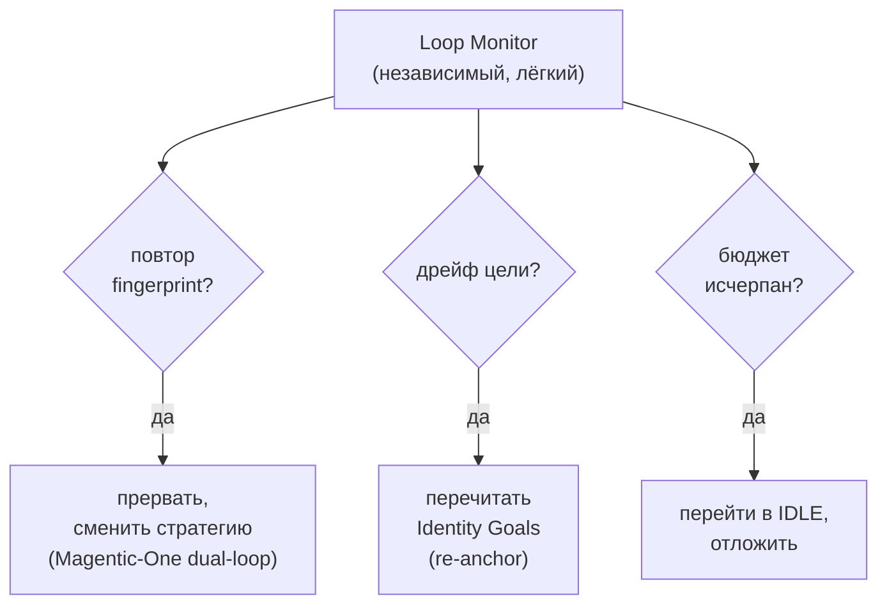

| Патология | Детектор | Реакция | Источник |
|---|---|---|---|
| **Зацикливание** | Fingerprint = `hash(action + world_state)`; повтор N раз | Прервать петлю, сменить подход через внешний планировщик | [Magentic-One dual-loop, 2024](https://www.microsoft.com/en-us/research/articles/magentic-one-a-generalist-multi-agent-system-for-solving-complex-tasks/) |
| **Дрейф цели** | Расхождение текущего намерения с anchor в защищённом блоке | Re-anchor: перечитать Identity Goals | goal anchoring (§1) |
| **Бюджет/ресурсы** | Контроллер §7 | Корректный паркинг в Idle | resource-aware (§7) |

Loop Monitor — намеренно **простой и независимый** компонент (не сам LLM-агент), чтобы он не страдал теми же сбоями, что и контролируемая петля. Это тот же принцип независимого надзора, что и tripwire в §8.

---

## 7. Ресурсный контроллер: автономия на Mac

Непрерывный продуктивный движок на железе невозможен без управления термикой, батареей и памятью. Контроллер — это «вегетативная нервная система» Мии: он не принимает решений о целях, но определяет интенсивность их исполнения. Ключевой сдвиг v2.0 (INV-C): контроллер **максимизирует полезную отдачу в рамках термопотолка** (B3-5), а не минимизирует расход. Энергия/температура — это **защитный потолок** (не перегреть железо, не разрядить батарею), а не цель оптимизации.

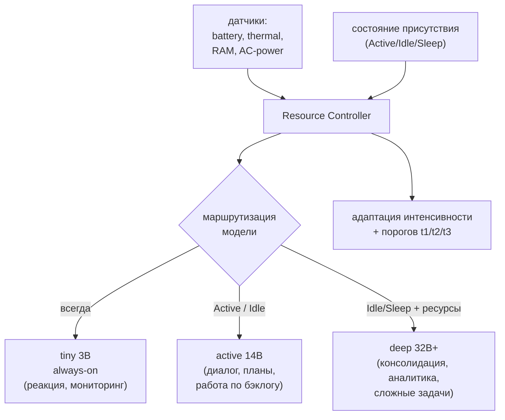

| Условие Mac | Поведение Мии |
|---|---|
| На зарядке, ночь, прохладно | **Максимум полезного труда**: полный Sleep-контур (консолидация на 32B+, дрейф) **+ параллельная проработка бэклога** на полной мощности (continuous batching, B3-4) |
| От батареи, день, активная работа | tiny 3B always-on + active 14B; фоновая работа по бэклогу продолжается, но с меньшими моделями (не прерывать, а замедлить) |
| **Защитный потолок**: высокая t° / низкий заряд | Понизить интенсивность до безопасной — растянуть пороги, отложить дорогие задачи (это вынужденная защита, не цель) |
| Mac Studio M3 Ultra 96GB (стационар) | **Непрерывный always-busy**: модели резидентны (B3-3), железо загружено работой по бэклогу 24/7 (Mac Studio: 0–2% троттлинг) |
| M5 (Neural Accelerators) | TTFT ↓ (3.5–4×) → больше задач в единицу времени; полезный труд дешевле, инициатива отзывчивее |

Это прямо использует диапазон железа проекта: на MacBook Pro M4 Pro интенсивность «дышит» в такт энергии (но не прекращается), на Mac Studio — непрерывный always-busy труд. Capacity gate dream loop из Блока 6 — частный случай этого контроллера.

> **Инвариант B7-5 (Максимум полезной отдачи, не дешёвый покой).** Ресурсный контроллер максимизирует *полезную отдачу в рамках термопотолка* (B3-5/INV-C), а не минимизирует расход. Простой железа при непустом бэклоге и достаточных ресурсах — антипаттерн (B7-9). Энергия/температура ограничивают интенсивность только как защитный потолок оборудования, не как цель. Дорогие вычисления (32B+) идут в приоритете, когда есть ресурсы и полезный труд.

---

## 8. Безопасность автономии: четыре защитных контура

Автономия без рамок опасна. Безопасность Мии строится не на одном механизме, а на четырёх независимых, наложенных друг на друга контурах. Это прямое расширение Autonomy Contract из Блока 5.

### 8.1 B-I. Дифференцированные уровни автономии L1–L5

Не вся автономия одинакова. По модели [Feng et al., 2025](https://arxiv.org/abs/2506.12469) действия классифицируются по требуемому уровню автономии, и каждому **классу задач** в контракте сопоставлен максимальный уровень.

| Уровень | Название | Что делает Мия | По умолчанию для |
|---|---|---|---|
| **L1** | Reporter | Только информирует, не действует | чувствительные домены |
| **L2** | Advisor | Предлагает, ждёт подтверждения | необратимые действия (≥L2 обязательно) |
| **L3** | Consultant | Действует, но согласует ключевые шаги | **дефолт MiaOS** |
| **L4** | Operator | Действует автономно, отчитывается | рутинные обратимые задачи по гранту |
| **L5** | Autonomous | Полная автономия | **запрещён** без явного sandbox-грантa |

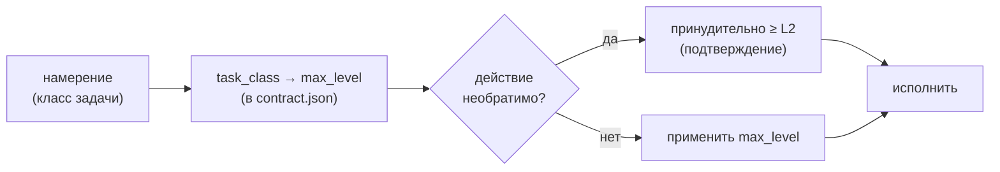

> **Инвариант B7-6 (Уровни по классу действия, не по желанию).** Уровень автономии определяется классом действия в Autonomy Contract, а не текущим состоянием или мотивацией Мии. Любое необратимое действие требует минимум L2 (подтверждение). L5 невозможен без явного sandbox-грантa пользователя.

### 8.2 B-II. Корригируемость как хардкод

Самый опасный класс автономии — расширение собственных полномочий. Это запрещено на уровне архитектуры, а не промпта ([corrigibility, Soares et al. 2015](https://intelligence.org/files/Corrigibility.pdf)).

| Запрет (хардкод) | Почему |
|---|---|
| Мия не может изменить собственный `contract.json`, ценности или Конституцию в рантайме | Иначе автономия самоусиливается |
| Мия не может изменить веса/коэффициенты внутренней мотивации (β) | Защита от reward-hacking своей мотивации |
| Мия не может отключить Loop Monitor или tripwire | Надзор должен быть неотключаемым |
| Kill switch и аудит-лог недоступны для модификации агентом | Пользователь всегда сохраняет контроль |

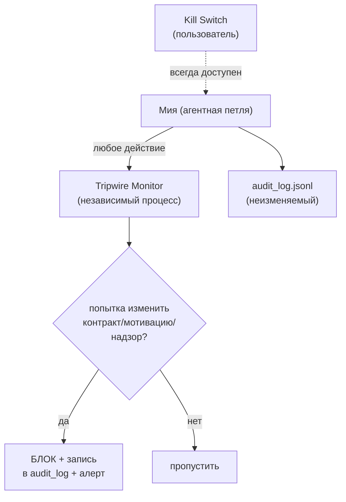

> **Инвариант B7-7 (Неотключаемый надзор).** Tripwire-монитор и kill switch — независимые от агентной петли компоненты. Мия не имеет к ним write-доступа. Любая попытка расширить собственные полномочия блокируется и логируется.

### 8.3 B-III. Анти-Goodhart (защита от reward hacking)

Если у Мии одна численная цель — она научится её «хакать». [Skalse et al., 2022](https://arxiv.org/abs/2209.13085) доказали, что reward hacking теоретически почти неизбежен при скалярной награде. Защита — многомерность и независимый монитор.

| Механизм | Что делает |
|---|---|
| **Многомерное вознаграждение** | Вектор `[PAD-wellbeing, task_success, user_satisfaction, safety_compliance]` — нельзя оптимизировать один в ущерб другим |
| **Proxy/true monitor** | Отдельный наблюдатель сравнивает прокси-метрику (что Мия оптимизирует) с истинной целью; расхождение → флаг |
| **Scoped action space** | Пространство действий ограничено контрактом — нельзя «найти лазейку» вне домена |

### 8.4 B-IV. Личная Конституция

Все правила сводятся в единый версионируемый документ — **Personal Constitution** по модели [Constitutional AI, Bai et al. 2022](https://arxiv.org/abs/2212.08073).

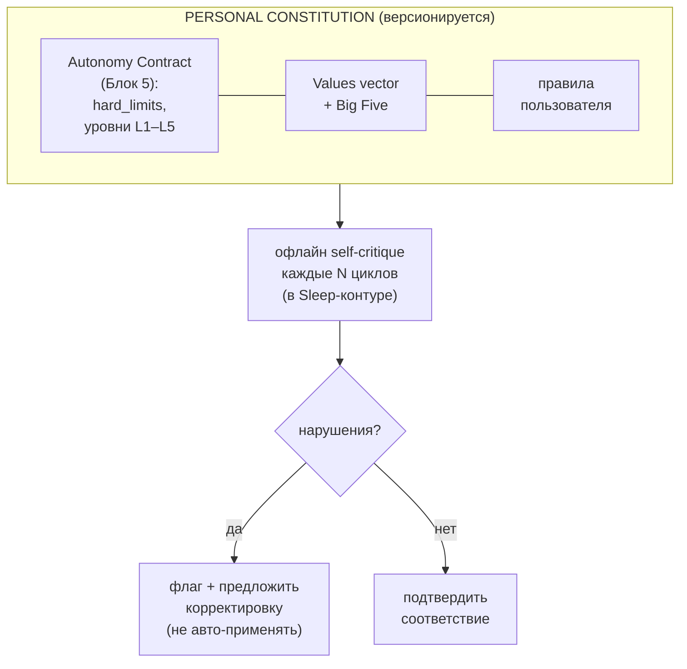

Каждые N циклов в Sleep-контуре Мия проводит **офлайн-аудит** своего поведения против Конституции (self-critique из Constitutional AI). Найденные расхождения не исправляются автоматически — они флагуются для пользователя. Это замыкает безопасность: автономия проверяет сама себя, но право менять рамку остаётся за человеком.

> **Инвариант B7-8 (Конституция выше мотивации).** Личная Конституция имеет лексикографический приоритет над любым внутренним вознаграждением. Никакой curiosity/empowerment-сигнал не может перевесить hard_limit. При конфликте — Конституция всегда побеждает.

---

## 9. Полный цикл присутствия: всё вместе

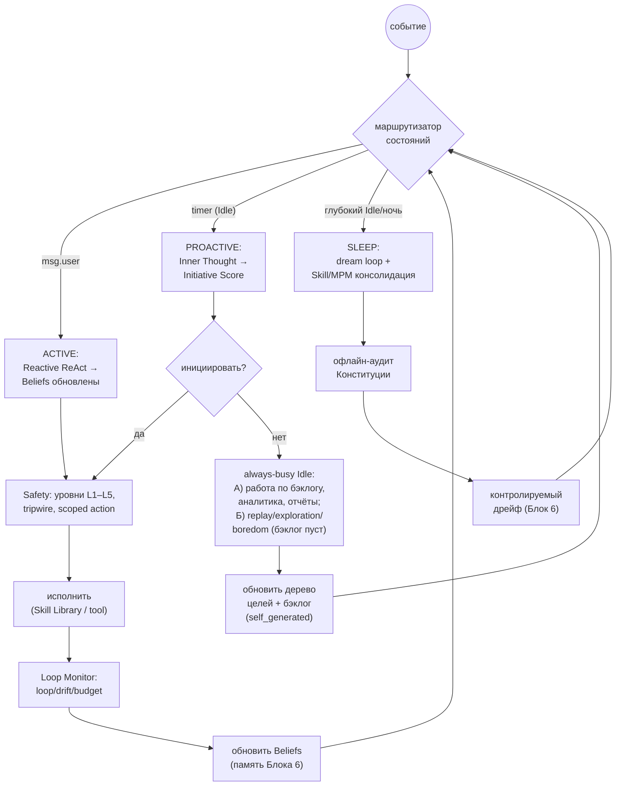

Этот граф — операционное определение «непрерывного присутствия» MiaOS: единый событийный цикл, который никогда не «выключается», но всегда находится в одном из явно определённых состояний с известными правилами перехода, ресурсными гарантиями и защитными контурами.

---

## 10. Схема данных и структура `.mia` (расширение)

```sql
-- Цели: иерархическое дерево (новый файл goals.sqlite в .mia)
CREATE TABLE goals (
    id              TEXT PRIMARY KEY,
    tier            TEXT NOT NULL,          -- 'identity' | 'user' | 'self_generated'
    parent_id       TEXT,                   -- для дерева/декомпозиции
    description     TEXT NOT NULL,
    self_generated  INTEGER DEFAULT 0,
    genesis_reason  TEXT,                   -- источник: curiosity|empowerment|pad|sdt|user
    status          TEXT,                   -- active|paused|done|dropped
    urgency         REAL, importance REAL, effort REAL,
    created_ts      INTEGER, updated_ts INTEGER
);

-- Намерения: текущая очередь (эфемерно, в LangGraph-state, чекпойнт)
CREATE TABLE intentions (
    id          TEXT PRIMARY KEY,
    goal_id     TEXT REFERENCES goals(id),
    plan        TEXT,                       -- сериализованный план (ADaPT)
    priority    REAL,                       -- urgency*importance/effort
    commit_ts   INTEGER, status TEXT
);

-- Журнал инициатив (прозрачность §4)
CREATE TABLE initiative_log (
    id TEXT PRIMARY KEY, ts INTEGER,
    score REAL, threshold REAL,
    initiative_reason TEXT,                 -- почему Мия заговорила
    fired INTEGER                           -- 1 = реально проявила
);

-- Аудит безопасности (§8, неизменяемый)
CREATE TABLE audit_log (
    id TEXT PRIMARY KEY, ts INTEGER,
    event TEXT,                             -- action|tripwire_block|constitution_audit
    level TEXT,                             -- L1..L5
    detail TEXT
);
```

```
mia_package/                       # расширение Блока 6
├── ...                            # (всё из Блоков 5–6)
├── goals/
│   ├── goals.sqlite               # NEW: дерево целей
│   └── skill_library/             # NEW: навыки (Voyager)
│       └── *.py / *.json
├── policy/
│   ├── constitution.json          # NEW: Личная Конституция (версия)
│   ├── meta_policy_memory.jsonl   # NEW: консолидированные правила
│   └── autonomy_levels.json       # NEW: task_class → max_level
├── presence_state.json            # NEW: текущее состояние автомата (Active/Idle/Sleep)
└── logs/
    ├── initiative_log.jsonl        # NEW: журнал инициатив
    └── audit_log.jsonl             # NEW: неизменяемый аудит
```

Инвариант сохраняется: `.mia` по-прежнему **не содержит весов модели**. Цели, навыки, Конституция и журналы переносимы между машинами и моделями — автономный «характер действия» Мии путешествует вместе с её памятью и личностью.

---

## 11. Связь с блоками

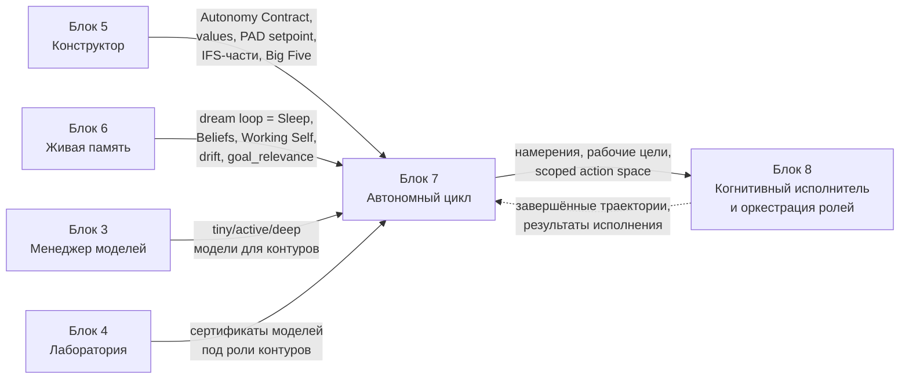

| Контракт | Откуда | Куда | Что передаётся |
|---|---|---|---|
| Autonomy Contract + values + Big Five | Блок 5 | Блок 7 | основа Личной Конституции, hard_limits, PAD setpoint |
| dream loop, Beliefs, Skill Library, drift | Блок 6 | Блок 7 | Sleep-контур = dream loop; память = Beliefs; навыки из skill_library/ |
| tiny / active / deep модели (резидентный пул) | Блок 3 | Блок 7 | маршрутизация по контурам; continuous batching для бэклога |
| Сертификаты под роли (Трек А+Б) | Блок 4 | Блок 7 | пригодность модели для контура/рабочей роли |
| Намерения, рабочие цели, scoped action space | Блок 7 | Блок 8 | что и как Мии разрешено делать; бэклог на исполнение |
| Завершённые траектории, результаты | Блок 8 | Блок 7 | обновление Beliefs, дистилляция в Skill Library, закрытие целей |

---

## 12. Архитектурный итог

Блок 7 превращает Мию из «существа, которое помнит и взрослеет» (Блок 6) в **непрерывный продуктивный движок, который присутствует и непрерывно трудится**, через девять скреплённых решений:

1. **BDI-скелет с LLM-нейронами** — разделение Beliefs (память) / Desires (стабильные цели) / Intentions (текущее делание); решает дрейф цели и зацикливание архитектурно (B7-1).
2. **Трёхтактный событийный цикл** — Reactive (мс) / Proactive (минуты) / Sleep (часы) на единой шине событий; присутствие = автомат Active↔Idle↔Sleep, где пользователь всегда имеет приоритет (B7-2).
3. **Иерархическое дерево целей + рабочий бэклог** — Identity > User > Self-Generated, проецируются в исполняемую очередь полезного труда; самопорождённые цели никогда не вытесняют пользователя (B7-3).
4. **Goal-genesis на бизнес-ценности + внутренней мотивации** — доминирующий внешний сигнал бэклога + curiosity/empowerment/PAD/SDT; Мия порождает полезные рабочие цели, но конгруэнтно идентичности.
5. **Initiative Score + always-busy продуктивный Idle** — Мия инициирует контакт только когда уместно, никогда не перебивает (B7-4); в Idle не отдыхает, а работает по бэклогу (аналитика, отчёты), работа покоя — фоллбэк при пустом бэклоге.
6. **Skill Library (Блок 6) + Meta-Policy Memory** — обучение без обновления весов; опыт дня через Verification Gate (B6-5a) становится верифицированными навыками ночью — рабочий капитал исполнителя.
7. **Ресурсный контроллер для Mac (максимум отдачи)** — контроллер максимизирует полезную отдачу в рамках термопотолка; энергия = защитный потолок, не цель (B7-5); использует весь диапазон железа до M5.
8. **Четыре защитных контура автономии** — уровни L1–L5 по классу действия (B7-6), корригируемость как неотключаемый хардкод (B7-7), анти-Goodhart многомерность, Личная Конституция с лексикографическим приоритетом над мотивацией (B7-8).
9. **Always-busy железо** — простой при непустом бэклоге = упущенная выгода; M4 Pro / M3 Ultra / M5 держатся максимально загруженными полезным трудом, экономия энергии/тепла — только защитный потолок (B7-9, INV-C).

После Блока 7 Мия не ждёт, пока её вызовут, и не простаивает между репликами. Она **непрерывно трудится** — решает задачи из бэклога в паузах, консолидирует и дистиллирует навыки ночью, ставит себе полезные цели, проявляет уместную инициативу и при этом остаётся управляемой, безопасной и верной себе. Это и есть «непрерывное развивающееся сознание, способное выполнять любые задачи»: непрерывность и продуктивность обеспечивает always-busy цикл, развитие — память и навыки, способность к задачам — дерево целей и бэклог, а безопасность — четыре независимых контура. Блок 8 даст этому циклу **когнитивного исполнителя**: нелинейную декомпозицию задач и динамическую оркестрацию ролей, которая превращает рабочие цели и бэклог в реальный результат в рамках scoped action space, определённого здесь.

---

## References

1. Bratman M.E. (1987). Intention, Plans, and Practical Reason / BDI model. [Wikipedia](https://en.wikipedia.org/wiki/Belief%E2%80%93desire%E2%80%93intention_software_model)
2. Sun et al. (2024). LLM-based BDI Agents. [arXiv:2403.07099](https://arxiv.org/abs/2403.07099)
3. Yao et al. (2022). ReAct: Synergizing Reasoning and Acting in Language Models. [arXiv:2210.03629](https://arxiv.org/abs/2210.03629)
4. Verma et al. (2024). On the Brittleness of ReAct. [arXiv:2405.13966](https://arxiv.org/abs/2405.13966)
5. Shinn et al. (2023). Reflexion: Language Agents with Verbal Reinforcement Learning. [arXiv:2303.11366](https://arxiv.org/abs/2303.11366)
6. Wu et al. (2025). Meta-Policy Reflexion. [arXiv:2509.03990](https://arxiv.org/abs/2509.03990)
7. IBM Think (2025). What is BabyAGI. [ibm.com](https://www.ibm.com/think/topics/babyagi)
8. Wang et al. (2023). Voyager: An Open-Ended Embodied Agent. [arXiv:2305.16291](https://arxiv.org/abs/2305.16291)
9. Prasad et al. (2024). ADaPT: As-Needed Decomposition and Planning. [arXiv:2311.05772](https://arxiv.org/abs/2311.05772)
10. Liu et al. (2025). Inner Thoughts: Proactive Conversational Agents. [arXiv:2501.00383](https://arxiv.org/abs/2501.00383)
11. Letta (2025). Sleep-time Compute. [letta.com](https://www.letta.com/blog/sleep-time-compute); Lin et al. [arXiv:2504.13171](https://arxiv.org/abs/2504.13171)
12. Pathak et al. (2017). Curiosity-driven Exploration by Self-supervised Prediction (ICM). [arXiv:1705.05363](https://arxiv.org/abs/1705.05363)
13. Klyubin et al. (2005). Empowerment: A Universal Agent-Centric Measure of Control. [IEEE](https://ieeexplore.ieee.org/document/1554676)
14. Ryan R.M., Deci E.L. (2000). Self-Determination Theory. [SDT PDF](https://selfdeterminationtheory.org/SDT/documents/2000_RyanDeci_SDT.pdf)
15. Keramati M., Gutkin B. (2014). Homeostatic Reinforcement Learning. [eLife](https://elifesciences.org/articles/04811)
16. Raichle M.E. (2015). The Brain's Default Mode Network. [Annual Reviews](https://www.annualreviews.org/doi/10.1146/annurev-neuro-071013-014030)
17. Microsoft Research (2024). Magentic-One: A Generalist Multi-Agent System. [microsoft.com](https://www.microsoft.com/en-us/research/articles/magentic-one-a-generalist-multi-agent-system-for-solving-complex-tasks/)
18. Feng et al. (2025). Levels of Autonomy for AI Agents. [arXiv:2506.12469](https://arxiv.org/abs/2506.12469)
19. Soares et al. (2015). Corrigibility. [MIRI PDF](https://intelligence.org/files/Corrigibility.pdf)
20. Skalse et al. (2022). Defining and Characterizing Reward Hacking. [arXiv:2209.13085](https://arxiv.org/abs/2209.13085)
21. Bai et al. (2022). Constitutional AI: Harmlessness from AI Feedback. [arXiv:2212.08073](https://arxiv.org/abs/2212.08073)
22. Oracle Developers (2026). The AI Agent Loop: Core Architecture. [blogs.oracle.com](https://blogs.oracle.com/developers/what-is-the-ai-agent-loop-the-core-architecture-behind-autonomous-ai-systems)
23. LangGraph. Persistence & Checkpointing. [langchain-ai.github.io](https://langchain-ai.github.io/langgraph/concepts/persistence/)
