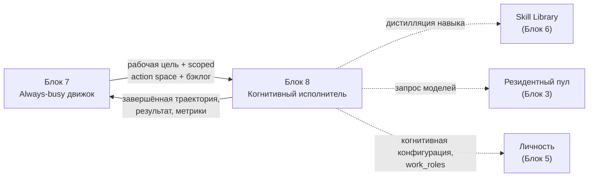
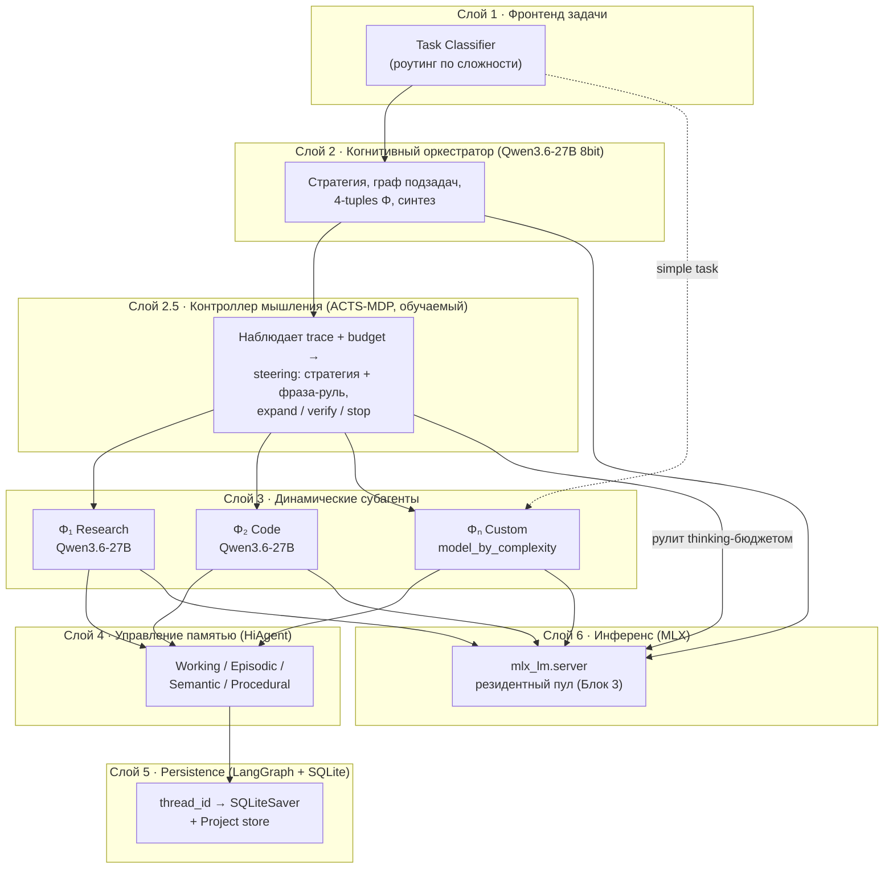
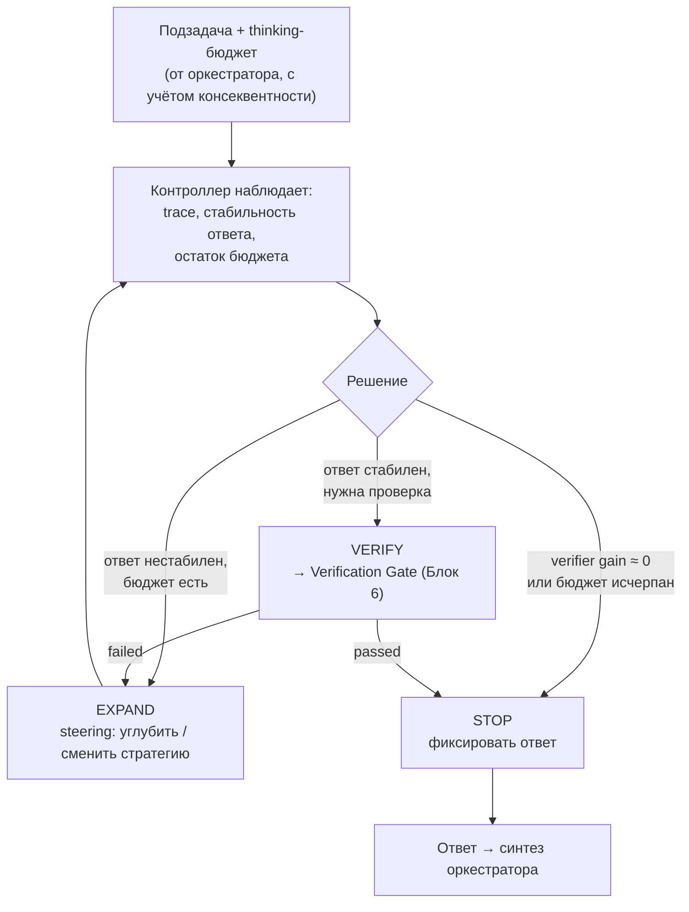
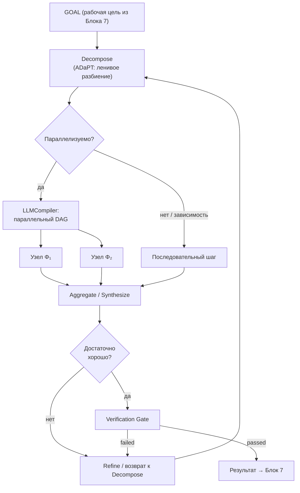
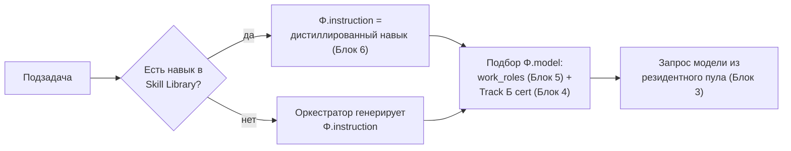
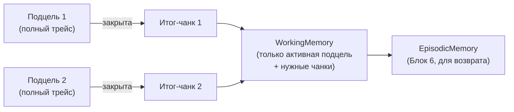
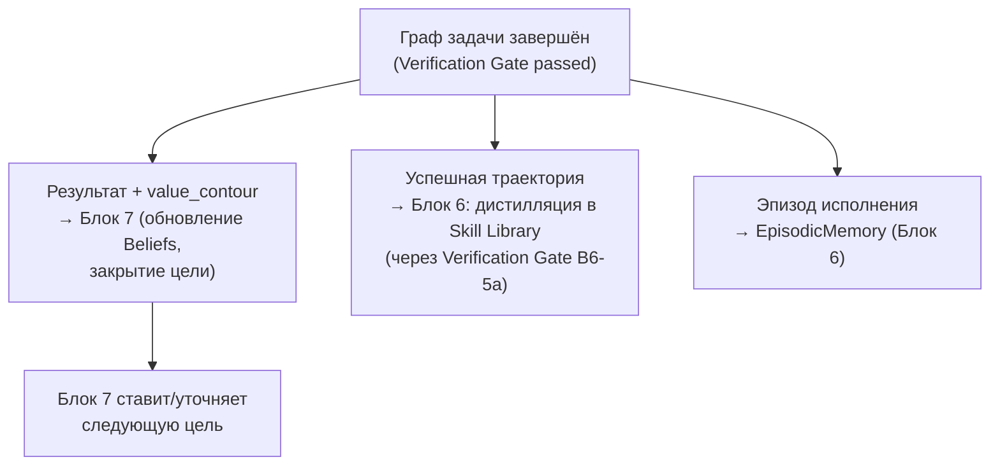
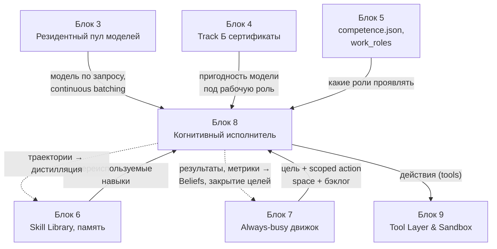

# Блок 8 · Когнитивный исполнитель и оркестрация ролей

**Проект:** MiaOS Builder
**Версия:** 2.1 (ядро «универсальный когнитивный исполнитель» + слой контроллера мышления)
**Дата:** Июнь 2026
**Статус:** Архитектурный документ, Этап 3 — Живое сознание + продуктивный движок
**Предыдущий блок:** Блок 7 · Always-busy продуктивный движок (цикл присутствия Active/Idle)
**Следующий блок:** Блок 9 · Инструменты, действия и среда исполнения (Tool Layer & Sandbox)

---

## 0. Зачем этот блок

Блоки 1–7 дали Мии тело конфигурации, сменный «мозг», память-капитал, развивающийся характер и непрерывный цикл, который не выключается и держит железо занятым. Но **«быть занятой» ≠ «приносить результат»**. Между намерением («надо обработать бэклог по задаче X») и реальным завершённым результатом лежит механизм, которого ещё нет: тот, кто берёт сложную многоуровневую задачу, разбивает её, разворачивает под неё нужные роли, распараллеливает работу, спорит сам с собой, синтезирует ответ и доводит до проверяемого результата.

Блок 8 — это **сердце новой философии**. Здесь Мия перестаёт быть «личностью, которая умеет отвечать», и становится **универсальным когнитивным исполнителем**: единым движком, который заменяет несколько отделов квалифицированных сотрудников и автоматизирует целые сегменты работы — не линейным пайплайном `вход→шаги→выход`, а **когнитивно**, как думающий коллектив специалистов.

> **Инвариант B8-1 (Универсальный исполнитель, INV-A).** Мия — единый движок для ЛЮБЫХ задач. «Отделы» и «роли» — не зашитая оргструктура, а **проявление** механизма: оркестратор разворачивает нужные роли/субагентов под конкретную задачу и сворачивает их по завершении. Нет фиксированного списка отделов — есть способность породить любую роль.

> **Инвариант B8-2 (Нелинейное когнитивное исполнение, INV-B).** Задача решается не как пайплайн, а как **граф/дерево**: параллельная декомпозиция, рекурсивное углубление по необходимости, возвраты и пересмотр, спор-и-синтез ролей. Линейная цепочка — лишь вырожденный частный случай графа.

> **Инвариант B8-3 (Сила модели = потолок системы).** Никакая оркестрация не компенсирует слабую reasoning-модель. Глубокие задачи требуют сильного оркестратора (Qwen3.6-27B 8bit — минимум для глубоких задач); слабые модели допустимы только на структурированных, хорошо определённых подзадачах ([Anthropic, Building Effective Agents](https://www.anthropic.com/research/building-effective-agents)).

> **Инвариант B8-11 (Контроллер мышления над встроенным thinking, гибрид).** Мышлением Мии управляет **внешний обучаемый контроллер** («Reasoning Controller»), который надстраивается над **встроенным thinking-режимом Qwen3.6**, а не заменяет и не ломает его. Контроллер рулит **бюджетом и стратегией** размышления снаружи модели (ACTS-MDP): это даёт **контроль и совершенствование** (желание пользователя) без деградации потенциала модели (INV-D). Самому CoT как сигналу доверять нельзя — надёжность даёт Verification Gate (§6, Блок 6), а не видимая цепочка рассуждений.

---

## 1. Что меняет этот блок (карта от намерения к результату)

Блок 7 заканчивается тем, что у Мии есть **намерения, рабочие цели, scoped action space и бэклог**. Блок 8 превращает это в **завершённые проверенные результаты** и возвращает в Блок 7 траектории для дистилляции навыков и закрытия целей.



| Граница | Было (до Блока 8) | Стало (с Блоком 8) |
|---|---|---|
| Единица работы | Реплика `f(вход)→выход` | **Граф задачи** с подзадачами, ролями, возвратами |
| Роли | Намёки в `orchestration_hints` (Блок 5) | **Динамически развёрнутые субагенты** под задачу |
| Параллелизм | Нет | **2–3 субагента** одновременно (предел железа) |
| Контекст длинных задач | Деградирует после ~10 шагов | **HiAgent**: подцели как чанки, summarization-checkpoint |
| Критерий «готово» | Ответ выдан | **Verification Gate** + контур бизнес-ценности |
| Многодневность | Нет | **Project store** + resume через LangGraph SQLite |

---

## 2. Архитектурный скелет: 7 слоёв исполнителя

Скелет основан на сводном исследовании ([полная карта](#references)) и адаптирован под локальный Apple Silicon/MLX-стек. Каждый слой — реализуемый сегодня компонент, не теоретическая конструкция. **Новый слой 2.5 (Контроллер мышления)** встраивается между оркестратором и инференсом — он управляет *как* модель думает (§2.5).



| Слой | Компонент | Чем реализуется | Источник |
|---|---|---|---|
| 1 | Task Classifier | Лёгкая модель + правила; роутинг simple/parallel/complex | [Anthropic Effective Agents](https://www.anthropic.com/research/building-effective-agents) |
| 2 | Когнитивный оркестратор | Qwen3.6-27B 8bit (~27–29 ГБ), thinking | [AOrchestra arXiv:2602.03786](https://arxiv.org/html/2602.03786v2) |
| **2.5** | **Контроллер мышления** | **Обучаемый агент над frozen reasoner (ACTS-MDP)** | [ACTS arXiv:2606.03965](https://arxiv.org/abs/2606.03965) |
| 3 | Динамические субагенты | 4-tuple Φ, LangGraph subgraph | [Anthropic Orchestrator-Workers](https://platform.claude.com/cookbook/patterns-agents-orchestrator-workers) |
| 4 | Управление памятью | HiAgent-чанки + Блок 6 (Two-Speed Memory) | [HiAgent arXiv:2408.09559](https://arxiv.org/abs/2408.09559) |
| 5 | Persistence | LangGraph SQLiteSaver, чекпоинт каждый superstep | [LangGraph Persistence](https://docs.langchain.com/oss/python/langgraph/persistence) |
| 6 | Инференс | `mlx_lm.server`, резидентный пул (B3-3) | [Блок 3], [vllm-mlx arXiv:2601.19139](https://arxiv.org/html/2601.19139v1) |

---

## 2.5. Контроллер мышления: гибрид «встроенный thinking + внешний руль» (B8-11)

Этот слой — прямой ответ на вопрос: «нужен ли встроенный режим размышления или свой механизм мышления?». Ответ — **гибрид**: оставить встроенное мышление Qwen3.6 (оно сильное, обучено RL, ломать его нельзя), но **обернуть его внешним обучаемым контроллером**, который можно контролировать и совершенствовать.

### 2.5.1 Почему не крайности

Две наивные альтернативы проверены исследованием 2026 и **отвергнуты**:

| Подход | Почему не работает в чистом виде |
|---|---|
| **Чистый встроенный thinking** (доверять CoT как есть) | CoT **неверен в ~96%** случаев: модель фиксирует ответ в первые ~15% генерации, остальное — пост-рационализация. Неконтролируемо и не мониторится ([CoT-faithfulness](https://arxiv.org/abs/2605.24286)) |
| **Ручной scaffolding поверх instruct** (своё мышление с нуля) | Явные «думай по шагам» и имитация ToT/GoT в промпте **ломают reasoning-модель** — конфликт с её внутренним обученным процессом, против INV-D (потеря потенциала) |
| **Гибрид (наш выбор)** | Внутренний thinking работает как есть; внешний контроллер рулит **бюджетом и стратегией** без вмешательства в веса. Контроль **снаружи**, качество **внутри** |

### 2.5.2 Контроллер как MDP (ACTS)

Мы берём формулировку **ACTS** (Agentic CoT Steering, [arXiv:2606.03965](https://arxiv.org/abs/2606.03965)): управление мышлением — это марковский процесс решения \( (S, A, P, R) \), где контроллер-агент рулит **замороженным reasoner** (Qwen3.6) во время инференса:

| Элемент MDP | Что это у Мии |
|---|---|
| **Состояние \(S\)** | текущий reasoning-trace + **остаток thinking-бюджета** (из `budget` графа задачи, B8-4) |
| **Действие \(A\)** | steering = «стратегия рассуждения + фраза-руль», запускающая следующий шаг reasoner |
| **Награда \(R\)** | budget-conditioned: качество ответа минус стоимость токенов (поощряет эффективное мышление) |
| **Обучение** | инициализация на синтетических steering-траекториях (multi-budget) → дообучение RL — контроллер **совершенствуется** |

Результат ACTS: совпадает с качеством полного мышления при существенной экономии токенов + управляемый трейд-офф «точность ↔ стоимость». Код: [github.com/Andree-9/ACTS](https://github.com/Andree-9/ACTS).

### 2.5.3 Мышление = управляемая петля бюджета, не фиксированная настройка



Контроллер решает **expand / verify / stop** по наблюдаемым сигналам (стабильность ответа, прирост от верификатора, стоимость-за-улучшение), а не по фиксированному `max_tokens` — это неверная абстракция для размышления ([Bharadwaj](https://www.linkedin.com/posts/shivam-bharadwaj-ai_max-tokens-is-the-wrong-abstraction-for-reasoning-activity-7462103393780809728-u17q)).

### 2.5.4 Консеквентно-зависимый бюджет (сколько думать)

> **Инвариант B8-12 (Консеквентно-зависимое распределение thinking-бюджета).** Оркестратор назначает подзадаче thinking-бюджет **по консеквентности** (цена ошибки), а не равномерно: высокорисковые шаги (необратимые действия, публикация, финансы) → больше бюджета; рутинные → минимум. Это делается на уровне планирования без переобучения модели (−22–33% cost-weighted loss, [arXiv:2606.04402](https://arxiv.org/html/2606.04402v1)). Для Qwen3.6 это реализуемо через thinking-budget и управление длиной trace.

### 2.5.5 Три слоя мышления Мии (итоговая картина)

| Слой | Кто | Контролируемость |
|---|---|---|
| 1. Внутреннее мышление | thinking-режим Qwen3.6 (чёрный ящик) | нет (и не надо — это сила модели) |
| 2. **Контроллер мышления** | наш ACTS-агент (§2.5) | **да — обучаем, совершенствуем** (ответ на вопрос) |
| 3. Когнитивная оркестрация | граф/роли (§3, §4) | да — явная архитектура |

Надёжность не опирается на доверие к CoT: истина проверяется Verification Gate (§6), а не видимой цепочкой.

---

> **Почему не Temporal/Dapr.** Для одного Mac LangGraph + SQLiteSaver достаточно: чекпоинты дают resume после краша, durable execution уровня Temporal — оверкилл для single-node ([Diagrid: Checkpoints vs Durable Execution](https://www.diagrid.io/blog/checkpoints-are-not-durable-execution-why-langgraph-crewai-google-adk-and-others-fall-short-for-production-agent-workflows)). Временная сложность Temporal оправдана только при распределённом исполнении, которого здесь нет.

---

## 3. Граф задачи: нелинейное исполнение (INV-B)

### 3.1 Три топологии решения

Линейная цепочка — частный случай. Реальный исполнитель выбирает топологию под задачу ([Demystifying Chains/Trees/Graphs arXiv:2401.14295](https://arxiv.org/html/2401.14295v3)):

| Топология | Когда | Прирост | Цена |
|---|---|---|---|
| **Chain** (CoT) | Простая линейная задача | baseline | — |
| **Tree** (ToT) | Перебор вариантов, выбор лучшего | средний | ×N токенов |
| **Graph** (GoT) | Агрегация/переиспользование промежуточных результатов | **> CoT/ToT** | оркестрация сложнее |

GoT-операции в Мии: **Generate** (породить подрешения) · **Aggregate** (слить несколько в одно) · **Refine** (улучшить узел через петлю) · **Distillate** (выжать суть для следующего слоя) ([Graph of Thoughts, spcl](https://github.com/spcl/graph-of-thoughts)).

### 3.2 Структура графа задачи



Ключевые свойства, отличающие от пайплайна:
- **Возврат (REF→D1):** если синтез недостаточен, узел декомпозируется заново — это и есть «пересмотр», которого нет в линейной цепочке.
- **Ленивая декомпозиция (ADaPT):** задача разбивается рекурсивно **только когда субагент не справился** напрямую, а не заранее — экономит шаги и контекст (+28.3% на ALFWorld, [Allen AI ADaPT](https://allenai.github.io/adaptllm/)).
- **Параллельный DAG (LLMCompiler):** независимые узлы исполняются одновременно — ×3.7 латентность на подходящих задачах ([LLMCompiler ICML 2024](https://arxiv.org/pdf/2312.04511)).

### 3.3 Схема состояния графа (LangGraph StateGraph)

```python
# Псевдоконтракт состояния графа задачи (LangGraph TypedDict)
class TaskGraphState(TypedDict):
    goal_id: str                 # из дерева целей Блока 7
    thread_id: str               # ключ SQLiteSaver
    root_subgoals: list[Subgoal] # верхний слой декомпозиции
    active_subagents: list[Phi]  # развёрнутые 4-tuples (≤ MAX_PARALLEL)
    working_memory: ChunkRef     # активная подцель (HiAgent-чанк)
    artifacts: list[Artifact]    # промежуточные/финальные результаты
    verification: VerifyState    # статус Verification Gate
    budget: Budget               # токены/время/попытки — антициклирование
    value_contour: ValueMetrics  # контур бизнес-ценности (§6)
```

> **Инвариант B8-4 (Бюджет и антициклирование).** Каждый граф задачи несёт `budget` (макс. токены, время, число возвратов REF). Превышение → принудительный синтез лучшего на текущий момент + эскалация в Блок 7 (не бесконечная петля). Защита от «overinvestment» — типичного провала мультиагентных систем ([Anthropic Multi-Agent](https://www.anthropic.com/engineering/multi-agent-research-system)).

---

## 4. Динамическое разворачивание ролей (INV-A)

### 4.1 Три уровня зрелости развёртывания

Исследование выделяет три сценария; Мия использует **Сценарий 2 как базу и Сценарий 3 для сложных задач** — оба реализуемы локально сегодня.

| Сценарий | Механизм | Роли | Статус для Mia |
|---|---|---|---|
| 1 · Статичный набор | CrewAI: Researcher→Writer→Editor зашиты | существуют заранее, фиксированы | отвергнут (нарушает INV-A) |
| 2 · Динамическая маршрутизация | LangGraph Supervisor: router выбирает из готовых ролей | существуют заранее, выбираются динамически | **база (Фаза 1)** |
| 3 · Генерация под задачу | AOrchestra/TDAG: 4-tuple генерируется под подзадачу | **не существуют заранее** | **цель (Фаза 4)** |

### 4.2 Субагент как 4-tuple Φ

Каждая развёрнутая роль — кортеж из четырёх элементов ([AOrchestra arXiv:2602.03786](https://arxiv.org/html/2602.03786v2)):

\[ \Phi = \langle \text{Instruction},\ \text{Context},\ \text{Tools},\ \text{Model} \rangle \]

```json
{
  "phi_id": "sa_research_0",
  "instruction": "Собрать и сверить факты о рынке X за 2025-2026",
  "context": { "scope": "subgoal:market_facts", "parent": "goal_42",
               "memory_chunks": ["chunk_17"] },
  "tools": ["web_search", "browser_read", "calculator"],
  "model": "qwen3-14b",          // подбор по сложности подзадачи
  "budget": { "max_tokens": 40000, "max_steps": 12 }
}
```

Оркестратор работает через **два действия** (минимальный интерфейс AOrchestra): `Delegate(Φ)` — развернуть субагента; `Finish(y)` — завершить и синтезировать. Результаты на бенчмарках: GAIA 80%, SWE-Bench-Verified 82%, +16.28% к baseline; дообучение Qwen3-8B SFT подняло качество оркестрации 56.97%→68.48% — то есть **локальная модель способна быть оркестратором**.

### 4.3 Откуда берутся роли: связь с Блоком 5 и Блоком 6

Роли не выдумываются с нуля каждый раз. Источники для `instruction` и подбора `model`:
- **`work_roles` и `orchestration_hints`** из `competence.json` (Блок 5) — какие когнитивные роли личность умеет проявлять и под какие домены.
- **Skill Library** (Блок 6, `skill_library/index.sqlite`) — переиспользуемые процедурные навыки; если навык под подзадачу уже дистиллирован, субагент стартует с него, а не с нуля.
- **Сертификаты Track Б** (Блок 4) — какая модель пригодна под рабочую роль (аналитик/исследователь/кодер/отчётность) по throughput и длинному контексту.



> **Инвариант B8-5 (Роль — проявление, не сущность).** Развёрнутый субагент Φ существует только на время своей подзадачи. По завершении он сворачивается; полезная траектория уходит в Блок 6 на дистилляцию. Личность (Блок 5) — постоянна; роли — эфемерны. Это и есть «единый исполнитель, проявляющий отделы».

### 4.4 Жёсткие пределы параллелизма (реализуемость)

> **Инвариант B8-6 (Реалистичный параллелизм).** На одном Mac запуск N субагентов = N× память/compute. С новым стандартом Qwen3.6-27B 8bit (~27–29 ГБ на экземпляр) параллельный спавн дороже — реальный параллелизм требует больше памяти; на 64 ГБ — скорее 1 оркестратор + 1 воркер, полный параллелизм 2–3 — от 96–192 ГБ. Спавн «50+ субагентов» — задокументированный провал ([Anthropic Multi-Agent](https://www.anthropic.com/engineering/multi-agent-research-system)). Очередь сверх предела обслуживается через continuous batching резидентного пула (B3-4), а не параллельным спавном.

| Железо | Оркестратор | Воркеры | Реальный параллелизм |
|---|---|---|---|
| M4 Pro 24–48 ГБ | Qwen3.6-27B 8bit (или 4bit ~15 ГБ) | поочерёдно (batching) | 1 (sequential-leaning) |
| M3 Ultra 96–192 ГБ | Qwen3.6-27B 8bit (~27–29 ГБ) | 2–3× Qwen3.6-27B/лёгкие | **2–3 параллельно** |
| M5 (Neural Accel.) | Qwen3.6-27B 8bit, быстрый TTFT | 2–3× воркера | 2–3, ниже латентность |

---

## 5. Управление контекстом: HiAgent (реализуемость длинных задач)

> **Инвариант B8-7 (HiAgent обязателен).** Без иерархического управления рабочей памятью задачи длиннее ~10 шагов деградируют на локальных моделях с ограниченным контекстом. Подцели хранятся как **чанки памяти**: при переходе к новой подцели предыдущий полный трейс сворачивается в краткий итог-чанк ([HiAgent arXiv:2408.09559](https://arxiv.org/abs/2408.09559): ×2 success rate, −3.8 шагов).

Механика (поверх Two-Speed Memory Блока 6):
- **WorkingMemory** = текущая подцель + только релевантные чанки (не весь трейс).
- При закрытии подцели → **summarization-checkpoint** в LangGraph: полный трейс заменяется итог-чанком.
- Итог-чанки индексируются в EpisodicMemory (Блок 6) — доступны для возврата без раздувания окна.



Это прямо снимает «контекстное окно — главный враг длинных задач» и делает реализуемыми многошаговые рабочие задачи на M4 Pro.

---

## 6. Контур бизнес-ценности (зачем исполнитель вообще нужен)

Always-busy без измерения ценности — это «cost-reduction exercise, который стагнирует» ([Sunflower Lab](https://thesunflowerlab.com/agentic-ai-roi-how-enterprises-measure-impact/)). Каждый граф задачи несёт `value_contour`, привязывающий труд к результату.

### 6.1 Метрики (на каждую завершённую задачу)

Формулы ([Moveworks, сентябрь 2025](https://www.moveworks.com/us/en/resources/blog/how-to-measure-and-communicate-agentic-ai-roi)):

\[ \text{Automation Rate} = \frac{\text{задачи, закрытые без человека}}{\text{всего задач}} \times 100\% \]

\[ \text{Time Saved} = T_{\text{avg, human}} \times N_{\text{tasks by Mia}} \]

\[ \text{Cost/Transaction} = \frac{\text{compute + энергия}}{\text{завершённые задачи}} \]

| Метрика | Что отражает | Куда пишется |
|---|---|---|
| Task Completion Rate | доля задач, прошедших Verification Gate | Episodic (Блок 6) |
| Steps / Task | эффективность декомпозиции | трейс графа |
| Time to Completion | латентность исполнения | трейс графа |
| Quality delta | downstream-эффект, не «done/not done» | возврат в Блок 7 |
| Automation Rate | % без вмешательства человека | агрегат в Project store |

> **Инвариант B8-8 (Контур ценности, не только утилизации).** «Занятость железа» (INV-C) оправдана только если порождает измеримую ценность. Контроллер Блока 7 максимизирует **полезную отдачу**, а не просто загрузку: задача без `value_contour` или с отрицательной отдачей деприоритизируется в бэклоге. Правильный критерий — «как изменились качество/время/точность/downstream», а не «выполнено / не выполнено».

### 6.2 Когда мультиагентность РЕАЛЬНО оправдана

Мультиагентность — не всегда лучше ([MAS Benchmarks, Meiklejohn](https://christophermeiklejohn.com/ai/agents/mas-series/2026/04/30/mas-series-07-benchmarks.html)):

| Тип задачи | Лучший режим | Почему |
|---|---|---|
| Breadth-first (широкий поиск, сбор) | **Multi-agent** (+90%) | независимые ветви распараллеливаются |
| Параллельные независимые подзадачи | **Multi-agent** (×3.7) | нет блокировок по зависимостям |
| Сфокусированный кодинг (SWE-bench) | **Single agent** | глубокая контекстная зависимость, MAS ×2.2 время |
| Задача с глубокой связностью контекста | **Single agent** | дробление теряет контекст |

Поэтому Task Classifier (Слой 1) **по умолчанию выбирает single-agent** и эскалирует к оркестратору только при breadth-first/параллельной природе. Это снимает «overhead ~15× токенов» там, где он не нужен ([Anthropic Multi-Agent](https://www.anthropic.com/engineering/multi-agent-research-system)).

---

## 7. Многодневные проекты: Project store + resume

Рабочая цель может жить днями (Блок 7 ставит долгие цели). Persistence реализуется штатно.

```sql
-- project_store.sqlite (расширение к LangGraph checkpoints)
CREATE TABLE projects (
  project_id   TEXT PRIMARY KEY,
  goal_id      TEXT NOT NULL,         -- дерево целей Блока 7
  title        TEXT,
  status       TEXT,                  -- active | paused | done | escalated
  phases       JSON,                  -- список фаз с их статусами
  artifacts    JSON,                  -- ссылки на результаты
  value_contour JSON,                 -- агрегированные метрики §6
  created_at   TEXT, updated_at TEXT
);
CREATE TABLE project_threads (
  project_id TEXT, thread_id TEXT,    -- связь с SQLiteSaver-чекпоинтами
  PRIMARY KEY (project_id, thread_id)
);
```

Resume после перезапуска Mac: `graph.invoke(None, config={"thread_id": tid})` — LangGraph поднимает последний checkpoint и продолжает с прерванного superstep ([LangGraph Persistence](https://docs.langchain.com/oss/python/langgraph/persistence)). Это делает always-busy движок (Блок 7) **устойчивым к перезагрузкам** — незавершённый проект не теряется.

---

## 8. Замыкание петли: возврат в Блоки 6 и 7

Когнитивный исполнитель не «выдаёт ответ и забывает». Каждая завершённая траектория проходит финальную обработку:



| Что возвращается | Куда | Эффект |
|---|---|---|
| Результат + метрики ценности | Блок 7 | обновление Beliefs, закрытие/уточнение цели |
| Успешная процедурная траектория | Блок 6 (Skill Library) | будущие задачи стартуют с готового навыка (B6-5a-gate) |
| Эпизод (что/как делалось) | Блок 6 (Episodic) | материал для dream loop консолидации (Блок 7 §4.3) |
| Провал/тупик | Блок 7 | анти-Goodhart, корректировка стратегии |

> **Инвариант B8-9 (Замкнутая петля обучения).** Исполнитель не только потребляет навыки из Блока 6, но и **пополняет** их: дистилляция успешной траектории в переиспользуемый навык — обязательный финальный шаг (только через Verification Gate B6-5a, чтобы не записать ошибочную процедуру). Это превращает разовый труд в накопленный рабочий капитал.

---

## 9. Дорожная карта реализации (реализуемость по фазам)

Архитектура строится инкрементально; каждая фаза даёт работающий артефакт.

| Фаза | Что реализовать | Результат | Зависит от |
|---|---|---|---|
| **0** (нед. 1) | LangGraph StateGraph + SQLiteSaver + `mlx_lm.server` | Базовый агент с памятью, локально | Блок 3 |
| **1** (нед. 2) | LangGraph Supervisor + 3–4 воркера (Сценарий 2) | Роутинг по типу задачи | Блок 4, 5 |
| **2** (нед. 3) | HiAgent-управление рабочей памятью | Длинные задачи без деградации | Блок 6 |
| **3** (нед. 4) | LLMCompiler параллельный DAG | ×2–3 ускорение на подходящих | — |
| **4** (мес. 2) | Динамический спавн Φ (AOrchestra, Сценарий 3) | Универсальный исполнитель | Блок 3 пул |
| **4.5** (мес. 2–3) | Контроллер мышления: expand/verify/stop на правилах → SFT на синтетике → RL (ACTS) | Управляемое/совершенствуемое мышление, экономия токенов | Блок 3, §6 Gate |
| **5** (мес. 3) | Project store + multi-session resume | Многодневные проекты | Блок 7 |

> **Инвариант B8-10 (Evaluation с первого дня).** Без метрик улучшать нечего. С Фазы 0 встроить eval-набор из ~20 эталонных задач с проверяемыми ответами (task completion rate, steps/task, time to completion). 90-дневный baseline-маркер — первый сигнал ROI ([Moveworks](https://www.moveworks.com/us/en/resources/blog/how-to-measure-and-communicate-agentic-ai-roi)).

---

## 10. Критические предупреждения (что НЕ делать)

Прямой перенос задокументированных провалов мультиагентных систем — чтобы не повторить их в Мии:

1. **Не спавнить субагентов без предела** — держать ≤ B8-6; очередь через batching, не параллель.
2. **Не дробить сфокусированные задачи** — single-agent по умолчанию (§6.2); MAS только breadth-first/parallel.
3. **Не строить на слабой reasoning-модели** — Qwen3.6-27B 8bit минимум для оркестратора на глубоких задачах (B8-3); tool-calling надёжный у сильных локальных моделей, не у слабых ([Docker eval](https://www.docker.com/blog/local-llm-tool-calling-a-practical-evaluation/)).
4. **Не пропускать HiAgent** — иначе деградация после ~10 шагов (B8-7).
5. **Не путать утилизацию с ценностью** — always-busy без `value_contour` = стагнация (B8-8).
6. **Не тащить Temporal/Dapr** — оверкилл для single-node; LangGraph SQLite достаточно.
7. **Не ломать встроенный thinking ручным scaffolding** — имитация ToT/GoT в промпте деградирует reasoning-модель; рулить снаружи (контроллер, B8-11), не внутри (§2.5).
8. **Не доверять CoT как сигналу истинности** — он неверен в ~96% случаев; надёжность только через Verification Gate.

---

## 11. Связь с блоками



| Передаётся | От | К | Содержание |
|---|---|---|---|
| Рабочая цель + scoped action space + бэклог | Блок 7 | Блок 8 | что исполнять и в каких границах |
| Модель по запросу | Блок 3 | Блок 8 | резидентный пул (B3-3), batching (B3-4) |
| Сертификат пригодности | Блок 4 | Блок 8 | подбор `Φ.model` под роль (Track Б) |
| `work_roles`, `orchestration_hints` | Блок 5 | Блок 8 | репертуар проявляемых ролей |
| Навыки + память | Блок 6 | Блок 8 | старт подзадач с готового навыка |
| Завершённые траектории | Блок 8 | Блок 6 | дистилляция в Skill Library (B6-5a) |
| Результаты + метрики | Блок 8 | Блок 7 | обновление Beliefs, закрытие целей |
| Вызовы инструментов | Блок 8 | Блок 9 | исполнение действий в среде |

---

## 12. Архитектурный итог

Блок 8 — **сердце философии «универсальный когнитивный исполнитель»**. Он превращает намерения и бэклог Блока 7 в проверенные результаты не линейным пайплайном, а **когнитивно**: граф задачи с параллельной декомпозицией, ленивым углублением, возвратами и спором-и-синтезом ролей (INV-B). Роли не зашиты — Мия **разворачивает их под задачу** как 4-tuples Φ и сворачивает по завершении (INV-A), держа железо занятым **полезным** трудом с измеримой бизнес-ценностью (INV-C).

Десять инвариантов фиксируют реализуемость на сегодняшнем локальном стеке:

| # | Инвариант | Суть |
|---|---|---|
| B8-1 | Универсальный исполнитель | роли — проявление, не оргструктура |
| B8-2 | Нелинейное исполнение | граф/дерево, не пайплайн |
| B8-3 | Сила модели = потолок | Qwen3-32B минимум для оркестратора |
| B8-4 | Бюджет и антициклирование | граф несёт budget, нет бесконечных петель |
| B8-5 | Роль — проявление | субагент эфемерен, личность постоянна |
| B8-6 | Реалистичный параллелизм | ≤ 2–3 субагента @64 ГБ |
| B8-7 | HiAgent обязателен | подцели как чанки против деградации |
| B8-8 | Контур ценности | утилизация оправдана только отдачей |
| B8-9 | Замкнутая петля обучения | траектории → Skill Library |
| B8-10 | Evaluation с дня 0 | ~20 эталонных задач, 90-дневный ROI |
| B8-11 | Контроллер мышления (гибрид) | внешний обучаемый руль над встроенным thinking (ACTS) |
| B8-12 | Консеквентный бюджет | сколько думать — по цене ошибки, не равномерно |

Стек целиком реализуем: **LangGraph + SQLiteSaver** (оркестрация и persistence), **HiAgent-чанки** (длинный контекст), **LLMCompiler** (параллелизм), **AOrchestra 4-tuple** (динамические роли), **mlx_lm.server + резидентный пул** (инференс). Никакого распределённого оверкилла — всё работает на M4 Pro → M3 Ultra → M5. После Блока 8 Мия способна взять сложную многоуровневую задачу и довести её до результата, заменяя несколько отделов специалистов. Блок 9 даст этому исполнителю **руки** — слой инструментов и безопасную среду исполнения действий в рамках scoped action space.

---

## References

| Источник | Тема | URL |
|----------|------|-----|
| Anthropic: Building Effective Agents | Паттерны агентов, production lessons | https://www.anthropic.com/research/building-effective-agents |
| Anthropic: Multi-Agent Research System | Реальная MAS, задокументированные провалы | https://www.anthropic.com/engineering/multi-agent-research-system |
| Anthropic Cookbook: Orchestrator-Workers | Динамический спавн воркеров | https://platform.claude.com/cookbook/patterns-agents-orchestrator-workers |
| AOrchestra arXiv:2602.03786 | Автоматическое создание субагентов (4-tuple) | https://arxiv.org/html/2602.03786v2 |
| LLMCompiler arXiv:2312.04511 (ICML 2024) | Параллельное исполнение функций (DAG) | https://arxiv.org/pdf/2312.04511 |
| HiAgent arXiv:2408.09559 (ACL 2025) | Иерархическая рабочая память | https://arxiv.org/abs/2408.09559 |
| ADaPT (Allen AI) | Рекурсивная декомпозиция по необходимости | https://allenai.github.io/adaptllm/ |
| Graph of Thoughts (spcl) | GoT-операции | https://github.com/spcl/graph-of-thoughts |
| Demystifying Chains/Trees/Graphs arXiv:2401.14295 | Сравнение CoT/ToT/GoT | https://arxiv.org/html/2401.14295v3 |
| LangGraph Persistence | SQLite checkpoint, resume | https://docs.langchain.com/oss/python/langgraph/persistence |
| Diagrid: Checkpoints vs Durable Execution | Почему не Temporal для single-node | https://www.diagrid.io/blog/checkpoints-are-not-durable-execution-why-langgraph-crewai-google-adk-and-others-fall-short-for-production-agent-workflows |
| MAS Benchmarks (Meiklejohn) | Когда MAS работает, когда нет | https://christophermeiklejohn.com/ai/agents/mas-series/2026/04/30/mas-series-07-benchmarks.html |
| Moveworks: Agentic AI ROI | Метрики и формулы бизнес-ценности | https://www.moveworks.com/us/en/resources/blog/how-to-measure-and-communicate-agentic-ai-roi |
| ACTS arXiv:2606.03965 | Агент-контроллер над frozen reasoner (MDP, RL) | https://arxiv.org/abs/2606.03965 |
| ACTS code (Andree-9) | Реализация контроллера мышления | https://github.com/Andree-9/ACTS |
| CoT Faithfulness arXiv:2605.24286 | Неверность CoT — почему нельзя доверять | https://arxiv.org/abs/2605.24286 |
| Consequence-aware compute arXiv:2606.04402 | Бюджет по цене ошибки без переобучения | https://arxiv.org/html/2606.04402v1 |
| Bharadwaj: max-tokens wrong abstraction | Мышление как управляемая петля бюджета | https://www.linkedin.com/posts/shivam-bharadwaj-ai_max-tokens-is-the-wrong-abstraction-for-reasoning-activity-7462103393780809728-u17q |
| Docker: Local LLM Tool Calling Evaluation | Бенчмарк tool-calling локальных моделей | https://www.docker.com/blog/local-llm-tool-calling-a-practical-evaluation/ |
| vllm-mlx arXiv:2601.19139 | MLX-инференс на Apple Silicon | https://arxiv.org/html/2601.19139v1 |
| PwC AI Agent Survey | Enterprise adoption и ROI | https://www.pwc.com/us/en/tech-effect/ai-analytics/ai-agent-survey.html |

*Документ переработан: июнь 2026 под философию «универсальный когнитивный исполнитель». Версия 2.1 — добавлен слой 2.5 «Контроллер мышления» (гибрид ACTS над встроенным thinking Qwen3.6, B8-11/B8-12). Опирается на блоки 3–7. Следующий блок — 9 (Tool Layer & Sandbox).*
