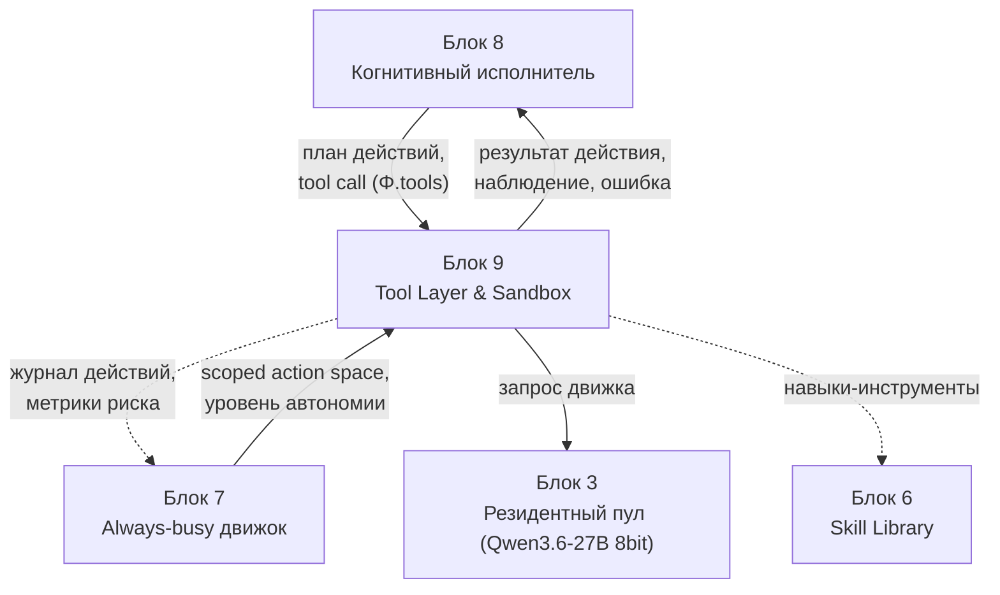
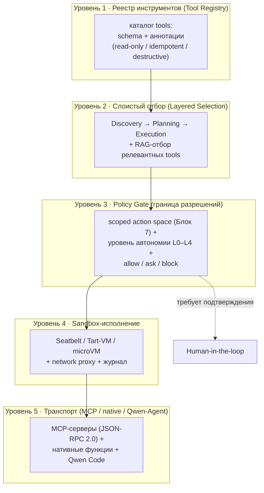
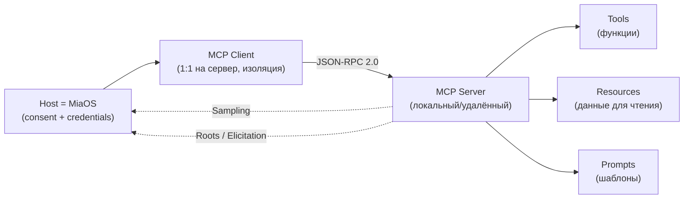
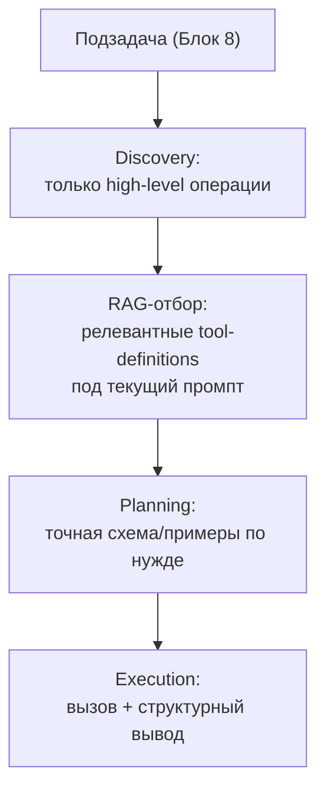
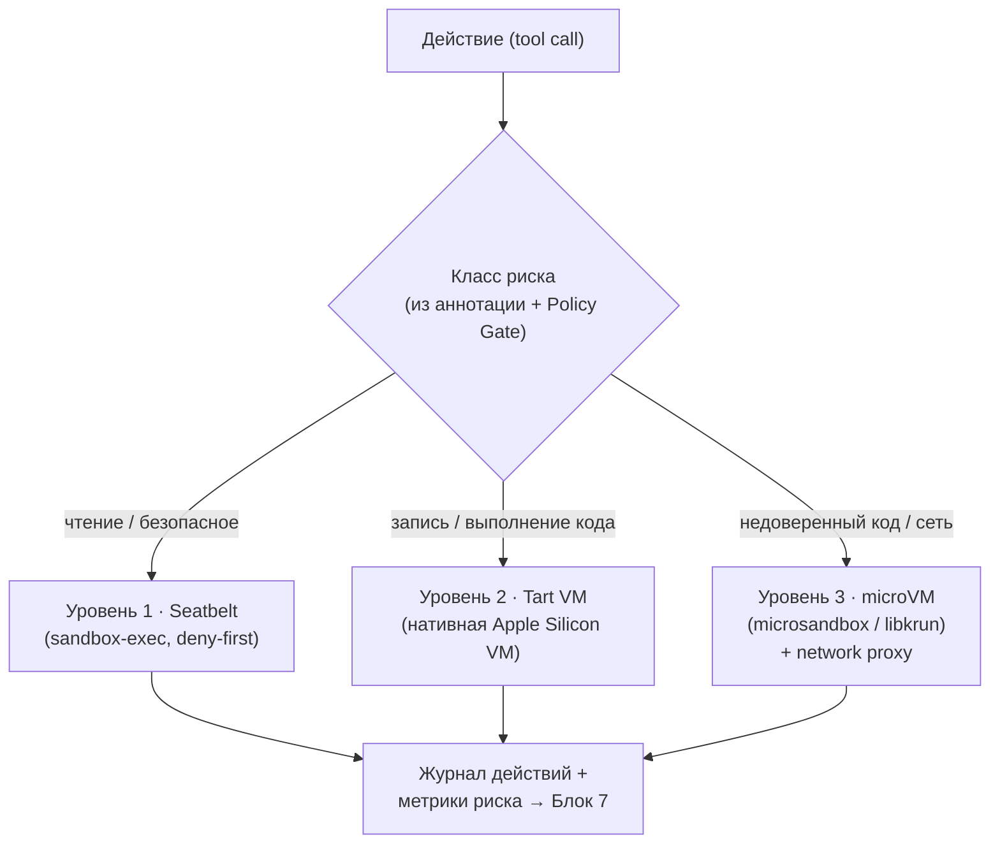
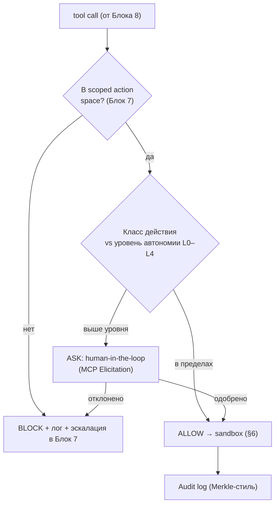
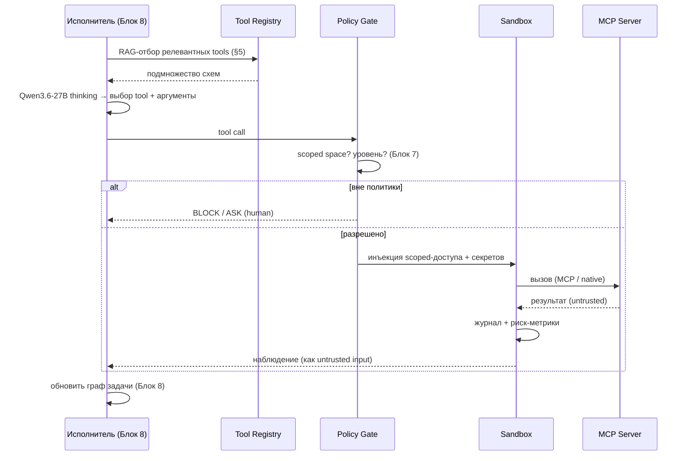
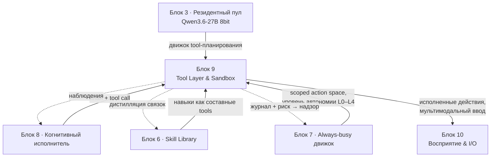

# Блок 9 · Инструменты, действия и среда исполнения (Tool Layer & Sandbox)

**Проект:** MiaOS Builder
**Версия:** 2.0 (модельный стандарт Qwen3.5/3.6 27B 8bit, философия «раскрытия потенциала»)
**Дата:** Июнь 2026
**Статус:** Архитектурный документ, Этап 3 — Живое сознание + продуктивный движок
**Предыдущий блок:** Блок 8 · Когнитивный исполнитель и оркестрация ролей
**Следующий блок:** Блок 10 · Восприятие и мультимодальный ввод (Perception & I/O)

---

## 0. Зачем этот блок

Блок 8 дал Мии **голову** — способность разворачивать роли, строить граф задачи, спорить и синтезировать. Но голова без рук бессильна: каждый субагент Φ объявляет `tools`, оркестратор планирует «действия», цикл Блока 7 ограничивает `scoped action space` — а **самого слоя действий ещё нет**. Блок 9 даёт исполнителю **руки и безопасную мастерскую**: чем именно Мия действует в мире и где это исполняется, не разрушив систему и не выйдя за границы.

Это слой, где «когнитивное» встречается с «реальным». Здесь же реализуется второй вектор новой философии: **не просто занять железо (INV-C), а раскрыть потенциал самой модели (INV-D)** — дать Qwen3.6-27B полный thinking-режим, длинный контекст и максимальную агентность tool-use, ради которых модель и создавалась.

> **Инвариант B9-1 (Действие = вызов инструмента в песочнице).** Любое воздействие Мии на мир — это вызов инструмента (tool call), исполняемый в контролируемой среде (sandbox) и записываемый в журнал. Нет «прямых» действий в обход слоя инструментов. Это единственная точка контакта с внешним миром.

> **Инвариант B9-2 (Раскрытие потенциала модели, INV-D).** Основной двигатель — **Qwen3.6-27B 8bit** (MLX) — используется на полную: thinking mode по умолчанию, thinking-preservation в агентных циклах, длинный контекст (≥128K), нативный tool-calling (`qwen3_coder`-парсер). Сильную модель не держать вполсилы на примитивах ([unsloth/Qwen3.6-27B-MLX-8bit](https://huggingface.co/unsloth/Qwen3.6-27B-MLX-8bit)).

> **Инвариант B9-3 (Enforcement вне модели).** Граница исполнения обеспечивается ОС/песочницей и policy-слоем, а НЕ доверием к выводу модели. Промпт-инструкции и UI-предупреждения — не граница безопасности ([AI Security Newsletter, апрель 2026](https://www.linkedin.com/pulse/ai-security-newsletter-april-2026-tal-eliyahu-ka1ke)).

---

## 1. Где Блок 9 в общей картине



| Граница | Содержание | Направление |
|---|---|---|
| План + tool call | какие инструменты вызвать, с какими аргументами | Блок 8 → Блок 9 |
| Наблюдение | результат/ошибка вызова (untrusted!) | Блок 9 → Блок 8 |
| Scoped action space + уровень автономии | что вообще разрешено в этом контексте | Блок 7 → Блок 9 |
| Журнал + риск-метрики | что сделано, насколько опасно | Блок 9 → Блок 7 |
| Движок инференса | Qwen3.6-27B 8bit для tool-планирования | Блок 3 → Блок 9 |
| Навыки-инструменты | дистиллированные процедуры как составные tools | Блок 6 ↔ Блок 9 |

---

## 2. Архитектура слоя инструментов: 5 уровней



| Уровень | Назначение | Реализация (2026) |
|---|---|---|
| 1 · Реестр | единый каталог tools со схемами | JSON-schema + аннотации MCP |
| 2 · Отбор | не грузить весь список в контекст | Discovery/Planning/Execution + RAG ([LinkedIn MCP patterns](https://www.linkedin.com/posts/prashant-lakhera-696119b_mcp-modelcontextprotocol-ai-activity-7457957380576808960--7NB)) |
| 3 · Policy Gate | разрешить / спросить / запретить | scoped space (Блок 7) + nah/Cupcake-стиль |
| 4 · Sandbox | изолировать исполнение | Seatbelt / Tart / microsandbox |
| 5 · Транспорт | как физически вызвать tool | MCP / Qwen-Agent / Qwen Code |

---

## 3. Раскрытие потенциала модели (INV-D): двигатель действий

Tool-планирование — самая агентная функция системы, и именно её Qwen3.6-27B исполняет в полную силу.

### 3.1 Конфигурация двигателя

```json
{
  "engine": "qwen3.6-27b-8bit",          // MLX, резидентный пул (Блок 3)
  "context_length": 262144,               // нативно; ≥128K чтобы сохранить thinking
  "thinking_mode": true,                  // по умолчанию: <think>…</think>
  "preserve_thinking": true,              // агентные циклы: consistency↑, токены↓, KV-cache↑
  "reasoning_parser": "qwen3",
  "tool_call_parser": "qwen3_coder",      // нативный парсер tool-calls
  "sampling": { "temperature": 1.0, "top_p": 0.95, "top_k": 20 },  // thinking general
  "sampling_coding": { "temperature": 0.6, "top_p": 0.95, "top_k": 20 }
}
```

> **Инвариант B9-4 (Thinking Preservation в агентных циклах).** В многошаговых tool-циклах включать `preserve_thinking: True`: модель сохраняет рассуждения из истории, что повышает согласованность решений, снижает повторный расход токенов и улучшает KV-cache — критично для длинных задач Блока 8 ([unsloth/Qwen3.6-27B-MLX-8bit](https://huggingface.co/unsloth/Qwen3.6-27B-MLX-8bit)).

### 3.2 Почему именно эта модель раскрывает потенциал в действиях

| Свойство Qwen3.6-27B | Что даёт слою инструментов | Бенчмарк |
|---|---|---|
| Нативный tool-calling | стабильные многошаговые вызовы | TIR-Bench, 100% tool calling на MLX ([Rapid-MLX](https://github.com/raullenchai/Rapid-MLX)) |
| Агентная выносливость | 9+ мин автономной работы без зависаний | community-тесты ([Reeboot](https://reeboot.fr/en/blog/qwen35-claude-opus-reasoning-distilled)) |
| Repo-level reasoning | сложные многофайловые действия | SWE-bench Verified 77.2 |
| Terminal-агентность | команды в песочнице | Terminal-Bench 2.0 59.3 |
| Длинный контекст 256K→1M | держать весь рабочий контекст задачи | LongBench, YaRN |
| Мультимодальность | действия с изображениями/документами | MMMU 82.9, OCRBench 89.4 |

Это прямой ответ на «модель должна раскрывать весь свой потенциал»: tool-слой спроектирован так, чтобы **именно сильные стороны Qwen3.6-27B шли в дело** — длинный контекст, thinking, агентность.

---

## 4. Транспорт инструментов: MCP как магистраль

MCP с декабря 2025 — стандарт Linux Foundation (Agentic AI Foundation), поддержан Anthropic/AWS/Google/Microsoft/OpenAI ([Stacklok MCP primer](https://docs.stacklok.com/toolhive/concepts/mcp-primer)). Qwen3.6 и Qwen-Agent поддерживают MCP нативно ([Qwen-Agent гайд](https://www.scrapingbee.com/blog/qwen-agent-framework/)).

### 4.1 Три роли и три примитива



| Примитив | Что | Использование в Мии |
|---|---|---|
| **Tools** | функции с JSON-schema + аннотации (read-only/idempotent/**destructive**) | основной механизм действий |
| **Resources** | данные для чтения (файлы, БД-строки) | подтянуть контекст без действия |
| **Prompts** | шаблоны workflow | переиспользуемые процедуры |
| **Sampling** | сервер просит модель хоста (с approval) | сервер-субагент |
| **Roots** | какие директории разрешены серверу | привязка к scoped space |
| **Elicitation** | сервер запрашивает ввод | human-in-the-loop |

> **Инвариант B9-5 (Аннотации tools — advisory, не граница).** Аннотации `destructive`/`read-only` от MCP-сервера доверять только настолько, насколько доверяешь серверу. Реальное ограничение опасных действий — на стороне хоста (Policy Gate + sandbox), не на честности аннотации ([Stacklok](https://docs.stacklok.com/toolhive/concepts/mcp-primer)).

### 4.2 Транспорты в MiaOS

| Транспорт | Когда | Пример |
|---|---|---|
| **MCP (stdio/HTTP)** | внешние сервисы, переиспользуемые tools | `mcp-server-filesystem`, `mcp-server-sqlite` |
| **Нативные функции Qwen-Agent** | быстрые встроенные tools | `code_interpreter`, калькулятор |
| **Qwen Code** | терминальная агентность, кодовые задачи | автоматизация репозиториев |
| **Skill Library как tools** (Блок 6) | дистиллированные процедуры | составной навык = один tool |

HTTP-транспорт MCP требует OAuth 2.1 + PKCE + audience-bound tokens (RFC 8707) против confused-deputy атак.

---

## 5. Слоистый отбор инструментов (борьба с раздуванием контекста)

Нельзя грузить весь каталог tools в окно — это съедает контекст и роняет точность. Решение — **трёхслойный отбор** ([MCP layered design](https://www.linkedin.com/posts/prashant-lakhera-696119b_mcp-modelcontextprotocol-ai-activity-7457957380576808960--7NB)):



- **Design for Outcomes:** один детерминированный tool (`refund_customer_by_email`) вместо оркестровки 5 endpoints — модель думает об интенте, сервер о надёжности.
- **RAG + MCP:** подтягивать только нужные определения tools → меньше токенов, выше точность.
- **Программное исполнение:** для сложных workflow модель пишет sandboxed-скрипт вместо цепочки фрагментированных tool-calls.

> **Инвариант B9-6 (Контекст инструментов экономен).** В окно модели попадают только релевантные текущей подзадаче tools (RAG-отбор), а не весь реестр. Это сохраняет длинный контекст для рабочих данных и согласуется с HiAgent-управлением памятью (Блок 8, B8-7).

---

## 6. Песочница: безопасная мастерская на Apple Silicon

Слой исполнения — там, где действие физически происходит. Базовая граница — **OS-level**, не контейнер; для опасных действий — **VM/microVM**.

### 6.1 Трёхуровневая модель изоляции (под целевое железо)



| Уровень | Технология | Когда | Цена |
|---|---|---|---|
| 1 · Seatbelt | `sandbox-exec` (TrustedBSD MAC), deny-first профиль | чтение, безопасные tools | ~0, мгновенно |
| 2 · Tart VM | нативная Apple Silicon VM | запись на диск, исполнение кода | секунды на старт |
| 3 · microVM | microsandbox (libkrun, <200 мс boot) + network-filtering proxy | недоверенный код, сетевые действия | <200 мс, полная изоляция |

Seatbelt — та же база, что у Codex CLI, Gemini CLI и под капотом Anthropic `srt` ([список песочниц 2026](https://gist.github.com/wincent/2752d8d97727577050c043e4ff9e386e)). Tart — нативный для Apple Silicon. microsandbox даёт суб-200мс microVM с встроенным MCP-сервером — идеально для эфемерного исполнения недоверенного кода.

> **Инвариант B9-7 (Изоляция по классу риска).** Уровень песочницы выбирается по классу риска действия, а не одинаково для всех. Чтение — Seatbelt (быстро); недоверенный код/сеть — microVM с deny-by-default egress и network proxy. Песочница инъектирует scoped-доступ к директориям/секретам в рантайме, не в определении.

### 6.2 Сетевой контроль и секреты

- **Network proxy с deny-by-default egress** (как Cleanroom/srt): сеть закрыта по умолчанию, открывается только под конкретные разрешённые эндпоинты.
- **Credential injection в рантайме:** секреты не в коде tool и не в определении — инъектируются песочницей на время вызова, scoped к задаче ([Docker Sandboxes](https://www.infoworld.com/article/4177309/docker-sandboxes-and-microvms-explained.html)).
- **Roots (MCP):** сервер видит только разрешённые директории.

---

## 7. Policy Gate: граница разрешений (связь с Блоком 7)

Между планом (Блок 8) и исполнением (sandbox) стоит **Policy Gate** — он берёт `scoped action space` и уровень автономии из Блока 7 и решает: **allow / ask / block**.



| Уровень автономии | Что разрешено без спроса | Аналог |
|---|---|---|
| L0 | только чтение/наблюдение | read-only |
| L1 | + безопасная запись в рабочую папку | scoped write |
| L2 | + исполнение кода в песочнице | sandboxed exec |
| L3 | + сетевые действия по allow-list | gated network |
| L4 | + необратимые/внешние действия (с записью) | full, audited |

> **Инвариант B9-8 (Deny-by-default + неотключаемый аудит).** По умолчанию запрещено всё, что вне scoped space или выше текущего уровня автономии. Каждое исполненное действие пишется в неотключаемый журнал (Merkle-стиль, как punkgo-jack) — это вход для надзора Блока 7 (B7-7) и анти-Goodhart-контроля. Tool output трактуется как **недоверенный ввод** (защита от prompt-injection через результаты).

---

## 8. Жизненный цикл одного действия (сквозной)



Замыкание: успешная связка «tool + контекст применения» может быть дистиллирована в **составной навык** Skill Library (Блок 6) через Verification Gate B6-5a — тогда будущие задачи получают её как единый tool.

---

## 9. Реестр инструментов: схема данных

```sql
-- tool_registry.sqlite
CREATE TABLE tools (
  tool_id     TEXT PRIMARY KEY,
  name        TEXT NOT NULL,
  transport   TEXT,            -- mcp | native | qwen_code | skill
  schema_json JSON,            -- JSON-schema входов/выходов
  annotation  TEXT,            -- read_only | idempotent | destructive (advisory!)
  risk_class  INTEGER,         -- 0..4 → выбор уровня sandbox и автономии
  scope_roots JSON,            -- разрешённые директории/эндпоинты
  embedding   BLOB,            -- для RAG-отбора (§5)
  source      TEXT,            -- провенанс (кто поставил tool)
  approved_at TEXT             -- когда допущен (provenance gate)
);
CREATE TABLE tool_calls (        -- журнал (вход для надзора Блока 7)
  call_id    TEXT PRIMARY KEY,
  tool_id    TEXT, goal_id TEXT, phi_id TEXT,  -- связь с Блоком 8
  args_json  JSON, result_hash TEXT,
  policy     TEXT,             -- allow | ask | block
  sandbox    TEXT,             -- seatbelt | tart | microvm
  risk       REAL, ts TEXT
);
```

> **Инвариант B9-9 (Провенанс перед допуском).** Новый tool/MCP-сервер проходит провенанс-проверку (`source`, `approved_at`) и runtime-изоляцию ДО допуска в реестр. MCP-риски (tool poisoning, sandbox escape) перекрываются на этапе регистрации, не в рантайме ([KENSAI / AI Security апрель 2026](https://www.linkedin.com/pulse/ai-security-newsletter-april-2026-tal-eliyahu-ka1ke)).

---

## 10. Дорожная карта реализации (по фазам)

| Фаза | Что | Результат | Зависит от |
|---|---|---|---|
| **0** | Qwen-Agent + `code_interpreter` + native tools | базовые действия локально | Блок 3, 8 |
| **1** | MCP-клиент + filesystem/sqlite серверы | стандартный транспорт | — |
| **2** | Seatbelt deny-first профиль + журнал | OS-level песочница (L1) | macOS |
| **3** | Policy Gate (scoped space + L0–L4) | граница разрешений | Блок 7 |
| **4** | Tart VM + microsandbox для L2/L3 + network proxy | изоляция по риску | Apple Silicon |
| **5** | RAG-отбор tools + thinking-preservation в циклах | раскрытие потенциала (INV-D) | Блок 6 |
| **6** | Дистилляция связок в Skill Library как составные tools | накопление инструментального капитала | Блок 6 |

---

## 11. Критические предупреждения (что НЕ делать)

1. **Не доверять границу безопасности модели/промпту** — enforcement только ОС+sandbox+policy (B9-3).
2. **Не грузить весь реестр tools в контекст** — RAG-отбор, иначе деградация (B9-6).
3. **Не верить аннотациям tools как гарантии** — они advisory (B9-5).
4. **Не исполнять недоверенный код вне microVM** — Seatbelt мало для произвольного кода (B9-7).
5. **Не трактовать результат tool как доверенный** — это вектор prompt-injection (B9-8).
6. **Не допускать tool без провенанса** — tool poisoning через MCP (B9-9).
7. **Не душить модель** — не отключать thinking и длинный контекст ради «экономии»: это убивает потенциал (B9-2, INV-D).

---

## 12. Связь с блоками



| Передаётся | От | К | Содержание |
|---|---|---|---|
| Движок инференса | Блок 3 | Блок 9 | Qwen3.6-27B 8bit, резидентный пул |
| Навыки-инструменты | Блок 6 | Блок 9 | дистиллированные процедуры как tools |
| Scoped space + автономия | Блок 7 | Блок 9 | границы и уровни разрешений |
| План + tool call | Блок 8 | Блок 9 | какие действия исполнить |
| Наблюдения (untrusted) | Блок 9 | Блок 8 | результаты для графа задачи |
| Дистилляция связок | Блок 9 | Блок 6 | tool+контекст → составной навык |
| Журнал + риск-метрики | Блок 9 | Блок 7 | вход для надзора и анти-Goodhart |

---

## 13. Архитектурный итог

Блок 9 даёт когнитивному исполнителю **руки и безопасную мастерскую**. Любое действие Мии — это вызов инструмента в песочнице с журналом (B9-1); граница безопасности обеспечивается ОС и policy-слоем, а не доверием к модели (B9-3). Слой инструментов — 5 уровней: реестр → слоистый RAG-отбор → Policy Gate → sandbox → транспорт (MCP/native/Qwen Code). Изоляция масштабируется по классу риска: Seatbelt для чтения, Tart-VM для записи/кода, microVM с network-proxy для недоверенного (B9-7).

Второй вектор философии реализован прямо здесь: **Qwen3.6-27B 8bit раскрывается на полную** (B9-2, INV-D) — thinking mode, thinking-preservation в агентных циклах, длинный контекст 256K→1M, нативный tool-calling `qwen3_coder`. Модель не держат вполсилы: её сильные стороны (SWE-bench 77.2, Terminal-Bench 59.3, 9+ мин автономной агентности) идут прямо в дело.

Девять инвариантов фиксируют реализуемость:

| # | Инвариант | Суть |
|---|---|---|
| B9-1 | Действие = tool call в песочнице | единая точка контакта с миром |
| B9-2 | Раскрытие потенциала модели (INV-D) | Qwen3.6-27B 8bit на полную |
| B9-3 | Enforcement вне модели | граница — ОС+policy, не промпт |
| B9-4 | Thinking preservation в циклах | согласованность + экономия токенов |
| B9-5 | Аннотации advisory | защита на стороне хоста |
| B9-6 | Экономный контекст tools | RAG-отбор, не весь реестр |
| B9-7 | Изоляция по классу риска | Seatbelt / Tart / microVM |
| B9-8 | Deny-by-default + аудит | tool output = untrusted |
| B9-9 | Провенанс перед допуском | против tool poisoning |

Стек реализуем на Apple Silicon сегодня: **Qwen-Agent + MCP** (транспорт), **Seatbelt / Tart / microsandbox** (изоляция), **Qwen3.6-27B 8bit на MLX** (движок), **SQLite-реестр + Merkle-журнал** (учёт и аудит). После Блока 9 у Мии есть руки. Блок 10 даст ей **глаза и уши** — слой восприятия и мультимодального ввода, чтобы действия опирались на наблюдение мира.

---

## References

| Источник | Тема | URL |
|----------|------|-----|
| unsloth/Qwen3.6-27B-MLX-8bit | Карточка модели, thinking, tool-calling, serving | https://huggingface.co/unsloth/Qwen3.6-27B-MLX-8bit |
| SiliconFlow: Qwen3.5-27B | Параметры, 256K контекст, мультимодальность | https://www.siliconflow.com/models/qwen3-5-27b |
| Qwen3.5-27B benchmarks (HF) | SWE-bench, MMLU, Tool Calling, LongBench | https://huggingface.co/coder3101/Qwen3.5-27B-heretic |
| Reeboot: Reasoning-Distilled | Агентная выносливость (9+ мин), стабильность tool-calls | https://reeboot.fr/en/blog/qwen35-claude-opus-reasoning-distilled |
| Rapid-MLX | 100% tool calling, reasoning separation на Apple Silicon | https://github.com/raullenchai/Rapid-MLX |
| Qwen-Agent framework guide | Function calling, MCP, parallel/multi-step | https://www.scrapingbee.com/blog/qwen-agent-framework/ |
| Stacklok: MCP primer | Роли, примитивы, OAuth 2.1, аннотации | https://docs.stacklok.com/toolhive/concepts/mcp-primer |
| MCP architectural patterns | Layered design, design-for-outcomes, RAG+MCP | https://www.linkedin.com/posts/prashant-lakhera-696119b_mcp-modelcontextprotocol-ai-activity-7457957380576808960--7NB |
| List of coding agent sandboxes 2026-05 | Seatbelt, srt, Tart, microsandbox, policy-слои | https://gist.github.com/wincent/2752d8d97727577050c043e4ff9e386e |
| InfoWorld: Docker Sandboxes & microVMs | microVM-изоляция, runtime credential injection | https://www.infoworld.com/article/4177309/docker-sandboxes-and-microvms-explained.html |
| AI Security Newsletter, апрель 2026 | Enforcement вне модели, MCP-риски, KENSAI | https://www.linkedin.com/pulse/ai-security-newsletter-april-2026-tal-eliyahu-ka1ke |
| NVIDIA: Personal AI agents sandboxing | Turnkey agent sandboxing, MXC policy layer | https://developer.nvidia.com/blog/build-personal-ai-agents-on-windows-pcs-with-new-tools-from-microsoft-and-nvidia/ |

*Документ написан: июнь 2026 под философию «универсальный когнитивный исполнитель» + модельный стандарт Qwen3.5/3.6 27B 8bit (раскрытие потенциала, INV-D). Опирается на блоки 3, 6, 7, 8. Следующий блок — 10 (Perception & I/O).*
