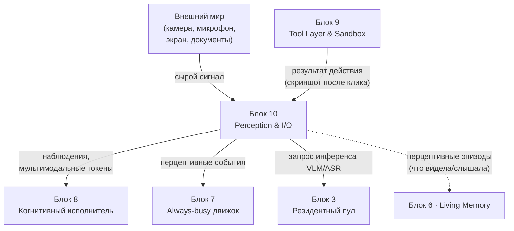
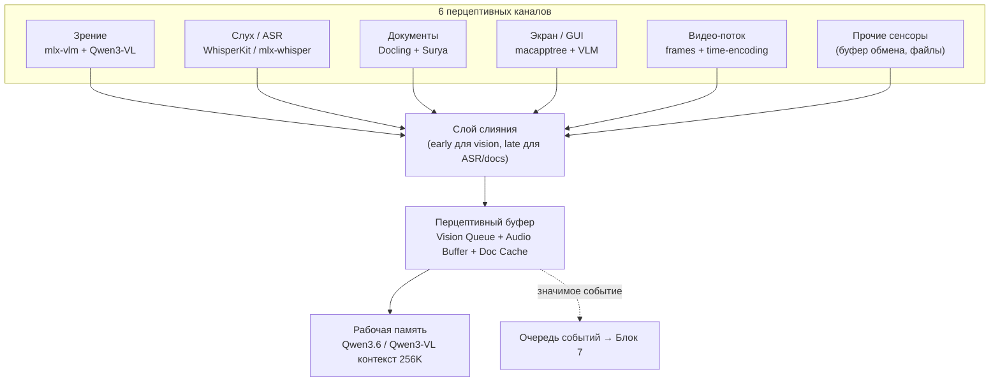
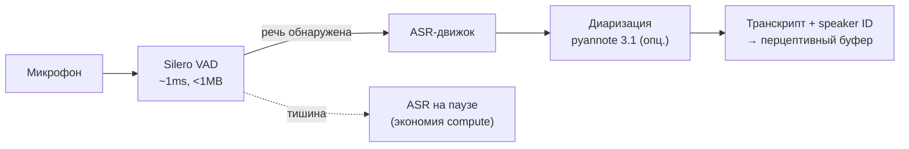
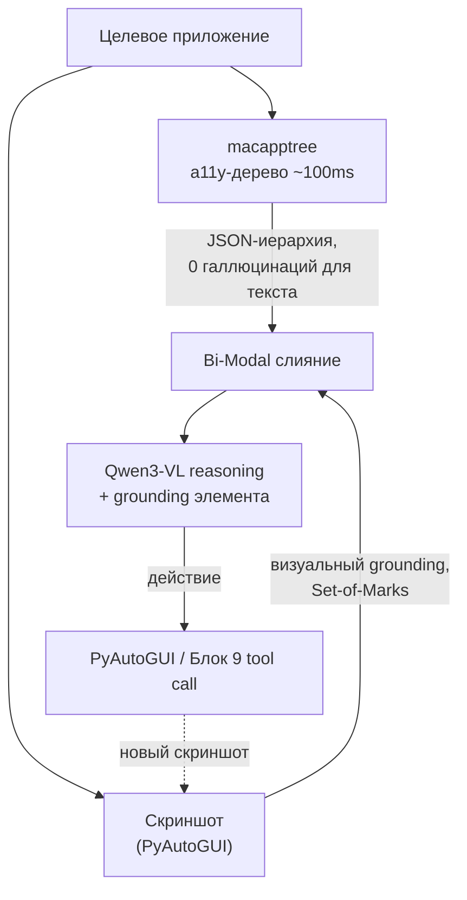
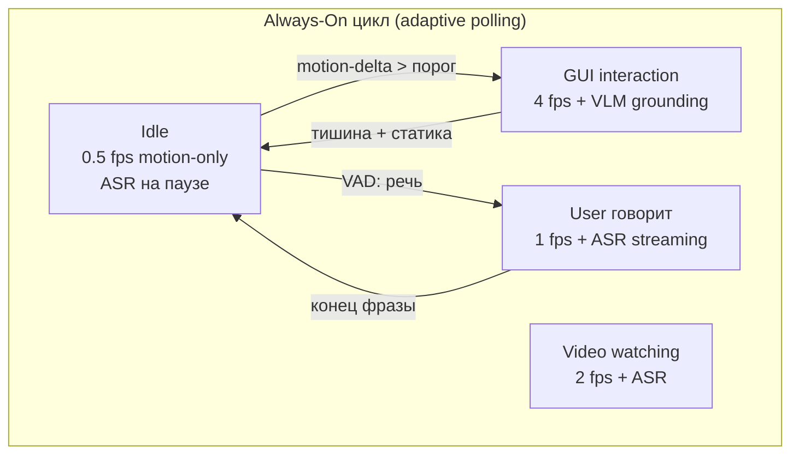

# Блок 10 · Восприятие и мультимодальный ввод (Perception & I/O)

**Проект:** MiaOS Builder
**Версия:** 2.0 (модельный стандарт Qwen3.5/3.6 27B 8bit, философия «раскрытия потенциала»)
**Дата:** Июнь 2026
**Статус:** Архитектурный документ, Этап 3 — Живое сознание + продуктивный движок
**Предыдущий блок:** Блок 9 · Инструменты, действия и среда исполнения (Tool Layer & Sandbox)
**Следующий блок:** Блок 11 · Память отношений и модель пользователя

---

## 0. Зачем этот блок

Блок 9 дал Мии **руки** — слой инструментов и безопасную песочницу. Но руки действуют вслепую: оркестратор Блока 8 строит план, цикл Блока 7 выбирает действие — а **окна в мир ещё нет**. Блок 10 даёт Мии **глаза, уши и тактильное чувство экрана**: как сырой сенсорный поток (пиксели, звук, документы, GUI-дерево) превращается в токены и наблюдения, на которые можно опираться при рассуждении и действии.

Это слой, где «реальное» входит в «когнитивное». Здесь же реализуется философия INV-D на стороне восприятия: **не просто гонять модель на тексте, а раскрыть мультимодальный потенциал** — нативное зрение Qwen3-VL (256K контекст, динамическое разрешение, видео часами), OCR 32 языков, восприятие экрана и непрерывный поток. Мия как автономный блогер-философ (исходное видение) не сможет вести соцсети, не видя изображений, не слыша голоса, не читая документы и не понимая интерфейсы — восприятие это её сенсорная кора.

> **Инвариант B10-1 (Восприятие = сенсор → токены → наблюдение).** Любой вход внешнего мира проходит путь: сырой сигнал (пиксели/звук/байты/a11y-дерево) → перцептивный энкодер → токены или текст → наблюдение в перцептивном буфере. Нет «магического» прямого доступа модели к сенсорам в обход слоя восприятия. Это единственная точка входа сигналов в систему — симметрично Блоку 9 (единственная точка выхода).

> **Инвариант B10-2 (Раскрытие мультимодального потенциала, INV-D).** Зрение строится на **Qwen3-VL** ветви как мультимодальном двигателе: нативное динамическое разрешение, тайлинг без ресайза, absolute time encoding для видео, 256K контекст. Текстовый двигатель остаётся **Qwen3.6-27B 8bit** (Блок 3). Сильную VL-модель не держать вполсилы на одном кадре — задействовать видео-поток, OCR, GUI-grounding ([Qwen3-VL Technical Report, arXiv:2511.21631](https://arxiv.org/abs/2511.21631)).

> **Инвариант B10-3 (Наблюдение — untrusted, восприятие ≠ истина).** Всё, что приходит из восприятия (текст с экрана, OCR документа, распознанная речь), — **недоверенный вход** и может содержать инъекции, ошибки и галлюцинации энкодера. Перед использованием в плане наблюдение маркируется источником и уровнем доверия; команды из воспринятого контента не исполняются без Policy Gate Блока 9.

---

## 1. Где Блок 10 в общей картине



| Граница | Содержание | Направление |
|---|---|---|
| Сырой сигнал | пиксели, звук, байты документов, a11y-дерево | Мир → Блок 10 |
| Наблюдения + токены | визуальные токены, транскрипт, чанки, JSON GUI | Блок 10 → Блок 8 |
| Перцептивные события | «движение на экране», «голос», «новый документ» | Блок 10 → Блок 7 |
| Результат действия | скриншот/состояние после tool call (замкнутый цикл) | Блок 9 → Блок 10 |
| Запрос инференса | VLM/ASR прогон на резидентном пуле | Блок 10 → Блок 3 |
| Перцептивные эпизоды | что Мия видела/слышала — в долгую память | Блок 10 → Блок 6 |

Блок 10 и Блок 9 — это **сенсомоторное кольцо**: Блок 9 действует, Блок 10 наблюдает результат, замыкая цикл «восприятие → рассуждение → действие → восприятие».

---

## 2. Архитектура слоя восприятия: 6 каналов + слияние



| Уровень | Назначение | Ключевая технология |
|---|---|---|
| 1. Каналы | захват сырого сигнала по модальностям | mlx-vlm, WhisperKit, Docling, macapptree |
| 2. Энкодеры | сигнал → токены/текст | ViT (Qwen3-VL), Whisper, OCR |
| 3. Слияние | гибрид early/late fusion | concat visual tokens + text chunks |
| 4. Перцептивный буфер | окно недавнего восприятия | Vision Queue / Audio Buffer / Doc Cache |
| 5. Рабочая память | контекст рассуждения | окно 256K Qwen3-VL |
| 6. Очередь событий | триггеры для Always-busy движка | VAD, motion-delta → Блок 7 |

---

## 3. Канал зрения (Vision)

### 3.1 Двигатель и модели

Основной фреймворк — **mlx-vlm** ([github.com/Blaizzy/mlx-vlm](https://github.com/Blaizzy/mlx-vlm)), нативный инференс VLM на Apple Silicon, 20+ моделей. Двигатель зрения — ветвь **Qwen3-VL** ([arXiv:2511.21631](https://arxiv.org/abs/2511.21631)): нативное динамическое разрешение (тайлинг без принудительного квадрата), Window Attention в ViT, OCR 32 языков, absolute time encoding для видео, GUI-понимание, контекст 256K → 1M.

| Модель | Квантизация | ~VRAM | Платформа-минимум |
|---|---|:-:|---|
| Qwen3-VL-4B | MLX 4bit | ~5 GB | M4 Pro 24 GB (edge) |
| Qwen3-VL-8B | MLX 4bit | ~8 GB | M4 Pro 24 GB (оптимум) |
| Qwen3-VL-32B | MLX 4bit | ~22 GB | M4 Pro 48 GB |
| Qwen3-VL-72B | MLX 4bit | ~48 GB | M3 Ultra 192 GB |

```python
from mlx_vlm import load, generate
model, processor = load("mlx-community/Qwen3-VL-8B-Instruct-MLX-4bit")
output = generate(model, processor, "Опиши изображение", image="photo.jpg")
```

> **Инвариант B10-4 (Vision prefix caching обязателен).** Повторяющиеся визуальные входы (статичный экран, тот же кадр) кэшируются по content-hash. Без кэша каждый прогон стоит полное TTFT; с кэшем повторный запрос ускоряется до **28×** ([vllm-mlx, arXiv:2601.19139](https://arxiv.org/abs/2601.19139)).

### 3.2 Производительность (M4 Max 128 GB, vllm-mlx)

| Сценарий | Без кэша | С кэшем | Ускорение |
|---|:-:|:-:|:-:|
| Turn 1 (cold, 1024×1024) | 21.7 s | 21.7 s | 1× |
| Turn 2 | 21.7 s | 1.15 s | **19×** |
| Turn 3+ | 21.7 s | 0.78 s | **28×** |

Декомпозиция: vision embedding caching 7.8× + KV reuse 1.2× → combined 19× ([vllm-mlx, arXiv:2601.19139](https://arxiv.org/abs/2601.19139)). На **M5** TTFT ускоряется в **3.97–4.06×** vs M4 благодаря Neural Accelerators в GPU и bandwidth 153 GB/s ([Apple ML: LLMs with MLX on M5](https://machinelearning.apple.com/research/exploring-llms-mlx-m5)).

### 3.3 Видео

Qwen3-VL обрабатывает видео как список кадров с absolute time encoding (каждый кадр — временная метка). Для GUI-мониторинга достаточно 1 fps; при событии — переключение на 4–8 fps.

| Кадры (fps) | Время (s) | tok/s | Память |
|:-:|:-:|:-:|:-:|
| 2 (0.5 fps) | 1.8 | 83.2 | 3.2 GB |
| 8 (2 fps) | 3.6 | 41.7 | 4.6 GB |
| 16 (2 fps) | 5.8 | 25.9 | 6.2 GB |
| 32 (4 fps) | 9.4 | 16.0 | 8.4 GB |

---

## 4. Канал слуха (Audio / ASR)



> **Инвариант B10-5 (VAD-gated ASR).** ASR запускается только когда Silero VAD (~1 ms, <1 MB, 100% локально) подтверждает речь. В тишине движок на паузе — не жжём compute на пустоту ([silero-vad](https://github.com/snakers4/silero-vad)).

| Инструмент | Модель | Скорость | Языки | Streaming | Диаризация |
|---|---|:-:|:-:|:-:|:-:|
| WhisperKit (ANE) | large-v3-turbo | **0.46 s/слово** | 99 | да | нет |
| whisper.cpp + CoreML | large-v3-turbo | ~197×RT | 99 | да | нет |
| mlx-whisper | large-v3-turbo | 40×RT | 99 | через ws | нет |
| parakeet-mlx | tdt-0.6b-v3 | 0.19 s/предл. | 25 EUR | нет | нет |
| mlx-whisper + pyannote | large-v3 | ~30×RT | 99 | нет | **да** |

**Выбор для MiaOS:**
- **Онлайн-диалог:** WhisperKit (ANE, latency 0.46 s/слово, WER 2.2% — лучше Deepgram cloud, [arXiv:2507.10860](https://arxiv.org/abs/2507.10860)).
- **Фоновая запись с разделением говорящих:** mlx-whisper + pyannote 3.1 ([HN: local transcription + speaker ID](https://news.ycombinator.com/item?id=44768065)).
- **Английский быстрый режим:** parakeet-mlx (0.19 s/предложение, [arXiv:2509.14128](https://arxiv.org/abs/2509.14128)). **Ограничение:** нет CJK/арабского/хинди → для мультиязычной Мии fallback на Whisper.

---

## 5. Канал документов

```
PDF/scan → Docling (layout + Surya OCR) → structured chunks
         ↓ (сложные: рукопись, нестандартная структура, формы)
         → Qwen3-VL напрямую (семантическая экстракция)
```

| Инструмент | Сильная сторона | MPS | Применение |
|---|---|:-:|---|
| **Docling** (IBM) | layout, reading order, таблицы, формулы; PDF/DOCX/PPTX/XLSX | да | основной массовый парсинг |
| **Surya** | OCR 90+ языков, layout, таблицы, LaTeX | да | OCR-backend для Docling |
| **Marker** | чистый Markdown из PDF, `--use_llm` | да | таблицы + сохранение структуры |
| **Qwen3-VL** | семантика, формы, рукопись, смешанные языки | — | сложные случаи, reasoning |
| **olmOCR-2-7B** (MLX) | fine-tune Qwen2.5-VL под сложный OCR | да | спец-OCR ~4–5 GB |

OCR-качество Qwen3-VL (~27B) — в диапазоне **72–75% JSON-accuracy** на бенчмарке 1000 документов, уровень GPT-4o ([HN OCR benchmark](https://news.ycombinator.com/item?id=43549072)). Это достаточно для большинства документальных задач; для массового батча — Surya/Docling (быстрее, без reasoning).

> **Инвариант B10-6 (Документ → чанки + провенанс).** Любой документ парсится в структурированные чанки с метаданными (источник, страница, тип блока), а не вливается сырым текстом. Это даёт late fusion, дешёвый контекст и трассируемость в Блок 6 (Living Memory).

---

## 6. Канал экрана / GUI



Три подхода ([fazm.ai: macOS AI Agent 2026](https://fazm.ai/blog/macos-ai-agent)):

| Подход | Задержка | Плюс | Минус |
|---|:-:|---|---|
| Screenshot + VLM | 1–3 s | работает с любым app | дорого, риск галлюцинаций |
| a11y-дерево (macapptree) | **~100 ms** | 0 галлюцинаций для текста, дёшево по токенам | не все app (electron) |
| **Bi-Modal (a11y + screenshot)** | ~1–3 s | лучшая точность | требует обоих каналов |

> **Инвариант B10-7 (GUI = a11y-first, vision-as-fallback).** Восприятие экрана начинается с accessibility-дерева ([macapptree, MacPaw](https://github.com/MacPaw/macapptree)) — структура без галлюцинаций за ~100 ms. Скриншот + VLM подключаются только для визуального grounding (Set-of-Marks) и приложений без a11y-поддержки. Координаты — через coordinate-free grounding ([GUI-Actor, NeurIPS 2025](https://neurips.cc/virtual/2025/poster/119841)).

Полный цикл perception → action на M4 Pro 48 GB (Qwen3-VL-8B): a11y fetch ~100 ms + VLM reasoning ~1–3 s = **2–4 s**. Достаточно для агентных задач, недостаточно для real-time твич-управления.

---

## 7. Мультимодальное слияние

### 7.1 Гибрид early + late fusion

```
[Vision encoder (ViT)]  →  visual tokens  ┐
[ASR (Whisper)]         →  text           ├→ concat → Qwen3-VL / Qwen3.6 reasoning
[OCR/Doc pipeline]      →  text chunks     │
[Screen a11y tree]      →  JSON в prompt   ┘
```

- **Early fusion** для зрения: изображения/видео → визуальные токены, concat с текстом до attention (нативно в Qwen3-VL).
- **Late fusion** для ASR и документов: каждая модальность обрабатывается своей моделью → текст → в prompt. Позволяет добавлять модальности без переобучения core LLM ([Apple ML: Late Multimodal Sensor Fusion, NeurIPS 2025](https://machinelearning.apple.com/research/multimodal-sensor-fusion)).

> **Инвариант B10-8 (Гибридное слияние, без переобучения ядра).** Зрение сливается рано (визуальные токены Qwen3-VL), слух и документы — поздно (через текст). Новый сенсор подключается как late-fusion канал, не трогая ядро. Это даёт расширяемость без дообучения.

### 7.2 Перцептивный буфер

```
┌──────────────────────────────────────────────────┐
│                PERCEPTUAL BUFFER                  │
├──────────────┬──────────────┬────────────────────┤
│ Vision Queue │ Audio Buffer │ Document Cache      │
│ (last N=8    │ (rolling 30s │ (parsed content,    │
│  frames)     │  transcript) │  LRU 100 docs)      │
└──────┬───────┴──────┬───────┴────────┬───────────┘
       └──────────────┴────────────────┘
                       ↓ FUSION (priority + context)
           Qwen3-VL Working Memory (256K)
                       ↓
              Long-Term Memory (Блок 6)
```

Архитектура опирается на агентов с долгой мультимодальной памятью: **M3-Agent** (episodic + semantic, entity-centric, [arXiv:2508.09736](https://openreview.net/forum?id=PMz29A7Muq)) и **AUGUSTUS** (контекстуализированная user-память, NeurIPS 2025). Практика: event-triggered refresh, summarization-checkpoint при 80% контекста, content-based prefix caching для статичных входов.

---

## 8. Потоковое / непрерывное восприятие



> **Инвариант B10-9 (Adaptive polling — compute по событию).** Восприятие непрерывно, но инференс запускается только при значимом событии: motion-delta пикселей (OpenCV, <5 ms CPU) или VAD-речь (~1 ms). В покое — дешёвый watch-режим, без прогона тяжёлой модели. Это держит INV-C (железо занято полезным), не сжигая батарею на пустых кадрах.

| Состояние | Vision FPS | ASR | VLM активен |
|---|:-:|:-:|:-:|
| Idle | 0.5 (motion) | пауза (VAD) | нет (prefix cache готов) |
| User говорит | 1 | full streaming | нет (ждёт конца фразы) |
| GUI interaction | 4 | streaming | да (grounding) |
| Reading document | 0 | ASR | да (OCR/analysis) |
| Video watching | 2 | dedicated ASR | conditional |

**Streaming video (исследовательский фронт):** DSCache (decoupled KV-cache, position-agnostic, [arXiv:2605.01858](https://arxiv.org/abs/2605.01858)), StreamingTOM (token compression, CVPR 2026), StreamKV (segment-based retrieval, ACL 2025), MadaKV (modality-adaptive eviction, 1.3–1.5×, [ACL 2025](https://aclanthology.org/2025.acl-long.652/)). Пока прототипы, не production-библиотеки.

---

## 9. Инновации 2026

| Инновация | Что даёт | Источник |
|---|---|---|
| Vision prefix caching | 28× на повторных образах | [vllm-mlx, arXiv:2601.19139](https://arxiv.org/abs/2601.19139) |
| EAGLE3 speculative decoding в mlx-vlm | 2.29–3.94× на vision-heavy | [mlx-vlm](https://github.com/Blaizzy/mlx-vlm) |
| Perception Encoder (Meta) | единый энкодер image/video/audio; лучшие features в средних слоях | [arXiv:2504.13181](https://arxiv.org/abs/2504.13181) |
| M5 Neural Accelerators | TTFT 3.97–4.06× vs M4 | [Apple ML: M5](https://machinelearning.apple.com/research/exploring-llms-mlx-m5) |
| MadaKV | modality-adaptive KV eviction, 1.3–1.5× | [ACL 2025](https://aclanthology.org/2025.acl-long.652/) |
| Distributed MLX inference | разделить Qwen3-VL между несколькими Mac | [mlx-vlm](https://github.com/Blaizzy/mlx-vlm) |
| Qwen3-VL Thinking editions | reasoning-CoT для STEM/Math на зрении | [arXiv:2511.21631](https://arxiv.org/abs/2511.21631) |

---

## 10. Реализуемость и пределы

### 10.1 Что работает сегодня (июнь 2026)

| Задача | Инструмент | Модель | Память |
|---|---|---|:-:|
| Зрение | mlx-vlm | Qwen3-VL-8B 4bit | ~8 GB |
| ASR real-time | WhisperKit / mlx-whisper | large-v3-turbo | ~1.5 GB |
| ASR EN-fast | parakeet-mlx | tdt-0.6b-v3 | ~1.2 GB |
| PDF-парсинг | Docling + Surya | — | ~2 GB |
| GUI a11y | macapptree | — | <100 MB |
| Диаризация | pyannote 3.1 | — | ~1 GB |

### 10.2 Память по диапазону железа

| Сценарий | Двигатель зрения | ~VRAM | Платформа |
|---|---|:-:|---|
| Минимум (edge) | Qwen3-VL-4B 4bit | ~5 GB | M4 Pro 24 GB |
| Оптимум | Qwen3-VL-8B 4bit | ~8 GB | M4 Pro 24+ GB |
| Полный (target) | Qwen3-VL-32B 4bit / Qwen3.6-27B 8bit текст | ~22–32 GB | M4 Pro 48 GB / M4 Max 128, M3 Ultra 96+ |
| Максимум | Qwen3-VL-72B 4bit | ~48 GB | M3 Ultra 192+ GB |

### 10.3 Известные ограничения

- **❌ Qwen3.6-27B ≠ vision.** Текстовый двигатель Блока 3 — text-only; зрение требует **отдельной ветви Qwen3-VL**. Это сознательное архитектурное разделение, не баг (B10-2).
- **❌ M4 Pro 24 GB:** одновременный запуск VLM + ASR + OCR → memory pressure → swap (5–10 tok/s). Разносить по времени или брать 48 GB+.
- **❌ ASR streaming <1 с:** только WhisperKit + ANE; mlx-whisper streaming ~3.3 с.
- **❌ Parakeet:** нет CJK/арабского/хинди → мультиязычность только через Whisper.
- **❌ Видео 4+ fps на 27B:** >10 GB, latency >10 s — непрактично для real-time.
- **❌ GUI full cycle 2–4 s:** недостаточно для real-time управления; ок для агентных задач.
- **❌ Streaming-video библиотеки** (DSCache/StreamingTOM): прототипы, не production.
- **⚠️ vllm-mlx benchmarks** опубликованы на M4 Max 128 GB — на M4 Pro 24–48 GB производительность ниже в ~3–4× (bandwidth + memory).

---

## 11. UI восприятия по уровням

| Уровень | Что видит пользователь |
|---|---|
| **Simple** | «Мия видит экран и слышит вас» — индикатор активного канала (глаз/ухо/документ), без деталей. |
| **Engineer** | выбор моделей (Qwen3-VL-8B/32B), FPS-режимы, ASR-движок, vision-cache hit-rate, latency каналов. |
| **Expert** | сырые токены восприятия, content-hash кэша, a11y-дерево JSON, провенанс наблюдений, ручная настройка fusion-приоритетов и порогов VAD/motion-delta. |

---

## 12. Архитектурный итог

Блок 10 даёт когнитивному исполнителю **глаза и уши**. Любой вход мира проходит путь сенсор → токены → наблюдение (B10-1) и маркируется как недоверенный (B10-3) — симметрично Блоку 9, где любой выход — это tool call в песочнице. Вместе они образуют **сенсомоторное кольцо**: восприятие → рассуждение → действие → восприятие.

Мультимодальный потенциал раскрыт по INV-D (B10-2): зрение на ветви **Qwen3-VL** (динамическое разрешение, 256K, видео, OCR 32 языков), слух на **WhisperKit/mlx-whisper** с VAD-gating (B10-5), документы через **Docling + Surya + Qwen3-VL** с провенансом (B10-6), экран через **a11y-first bi-modal** (B10-7). Слияние гибридное — early для зрения, late для слуха и документов, расширяемое без дообучения ядра (B10-8). Непрерывность держится adaptive polling: compute по событию, а не вхолостую (B10-9).

Десять инвариантов фиксируют реализуемость:

| # | Инвариант | Суть |
|---|---|---|
| B10-1 | Сенсор → токены → наблюдение | единая точка входа сигналов |
| B10-2 | Раскрытие мультимодального потенциала (INV-D) | Qwen3-VL ветвь как двигатель зрения |
| B10-3 | Наблюдение — untrusted | восприятие ≠ истина, через Policy Gate |
| B10-4 | Vision prefix caching обязателен | 28× на повторных образах |
| B10-5 | VAD-gated ASR | звук только при речи |
| B10-6 | Документ → чанки + провенанс | late fusion, трассируемость |
| B10-7 | GUI a11y-first, vision-fallback | 100 ms структура, 0 галлюцинаций |
| B10-8 | Гибридное слияние | early(vision)+late(audio/doc), без переобучения |
| B10-9 | Adaptive polling | compute по событию (INV-C без перегрева) |

Стек реализуем на Apple Silicon сегодня: **mlx-vlm + Qwen3-VL** (зрение), **WhisperKit / mlx-whisper + pyannote + Silero VAD** (слух), **Docling + Surya + Marker** (документы), **macapptree + GUI-Actor** (экран), **перцептивный буфер + content-hash cache** (слияние и память). После Блока 10 у Мии есть глаза и уши. Блок 11 даст ей **память отношений** — модель того, кого она воспринимает: кто этот человек, что он любит, как с ним вести себя.

---

## References

| Источник | Тема | URL |
|----------|------|-----|
| Native LLM/MLLM Inference on Apple Silicon (vllm-mlx) | prefix caching 28×, бенчмарки M4 Max | https://arxiv.org/abs/2601.19139 |
| Qwen3-VL Technical Report | архитектура, динамич. разрешение, видео, OCR, Thinking | https://arxiv.org/abs/2511.21631 |
| Qwen2.5-VL Technical Report | dynamic resolution, OCR, localization | https://arxiv.org/abs/2502.13923 |
| Apple ML: LLMs with MLX & Neural Accelerators on M5 | TTFT M5 vs M4, bandwidth | https://machinelearning.apple.com/research/exploring-llms-mlx-m5 |
| mlx-vlm GitHub | основной фреймворк VLM на Apple Silicon | https://github.com/Blaizzy/mlx-vlm |
| Qwen3-VL-8B MLX 4bit (LM Studio) | MLX-квантизация модели зрения | https://huggingface.co/lmstudio-community/Qwen3-VL-8B-Instruct-MLX-4bit |
| WhisperKit: On-device Real-time ASR | latency 0.46 s/слово, WER 2.2%, ANE | https://arxiv.org/abs/2507.10860 |
| Parakeet MLX (senstella) | Parakeet ASR на Apple Silicon | https://github.com/senstella/parakeet-mlx |
| Canary-1B-v2 & Parakeet-TDT-0.6B-v3 | техотчёт v3, 25 языков, ограничения | https://arxiv.org/abs/2509.14128 |
| Silero VAD | детектор речи ~1 ms, <1 MB, локально | https://github.com/snakers4/silero-vad |
| Local transcription + speaker ID (HN) | mlx-whisper + pyannote 3.1 диаризация | https://news.ycombinator.com/item?id=44768065 |
| Docling GitHub (IBM) | универсальный document parser | https://github.com/DS4SD/docling |
| Surya GitHub | OCR 90+ языков, layout, таблицы | https://github.com/VikParuchuri/surya |
| Marker GitHub | PDF → Markdown/JSON | https://github.com/datalab-to/marker |
| Qwen 2.5 VL — best open-source OCR (HN) | бенчмарк OCR 1000 docs, JSON accuracy | https://news.ycombinator.com/item?id=43549072 |
| macapptree (MacPaw) | macOS accessibility tree extractor | https://github.com/MacPaw/macapptree |
| macOS AI Agent: How Desktop Agents Work in 2026 | три подхода к screen perception | https://fazm.ai/blog/macos-ai-agent |
| GUI-Actor (NeurIPS 2025) | coordinate-free VLM GUI grounding | https://neurips.cc/virtual/2025/poster/119841 |
| Apple ML: Late Multimodal Sensor Fusion | late fusion без task-specific training | https://machinelearning.apple.com/research/multimodal-sensor-fusion |
| M3-Agent: Multimodal Agent w/ Long-Term Memory | episodic+semantic, entity-centric | https://openreview.net/forum?id=PMz29A7Muq |
| Perception Encoder (Meta AI) | единый encoder image/video/audio | https://arxiv.org/abs/2504.13181 |
| MadaKV: Adaptive KV Cache Eviction (ACL 2025) | multimodal KV, 1.3–1.5× | https://aclanthology.org/2025.acl-long.652/ |
| DSCache: KV Cache for Streaming Video | decoupled streaming cache | https://arxiv.org/abs/2605.01858 |
| olmOCR-2-7B MLX 4bit | OCR fine-tune Qwen2.5-VL для Apple Silicon | https://huggingface.co/richardyoung/olmOCR-2-7B-1025-MLX-4bit |

*Документ написан: июнь 2026 под философию «универсальный когнитивный исполнитель» + модельный стандарт Qwen3.5/3.6 27B 8bit, ветвь зрения Qwen3-VL (раскрытие потенциала, INV-D). Опирается на блоки 3, 6, 7, 8, 9. Следующий блок — 11 (Память отношений и модель пользователя).*
