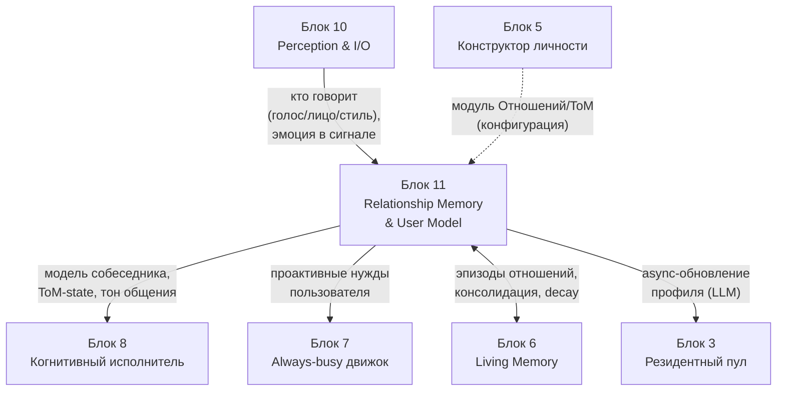
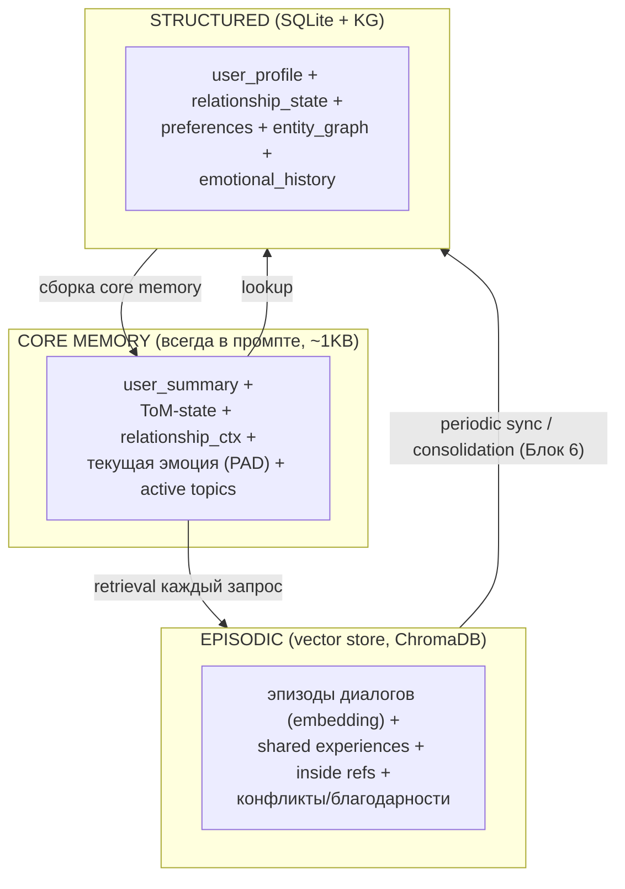
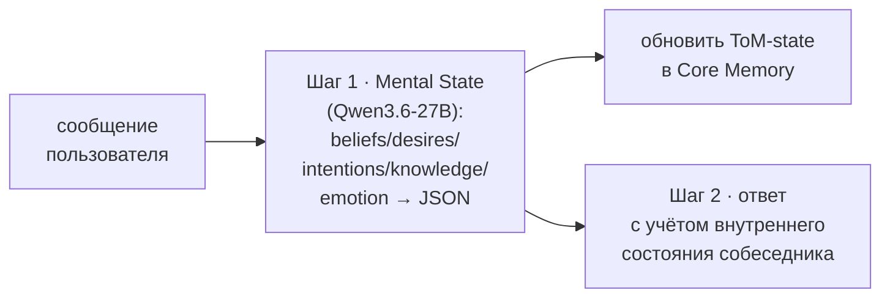
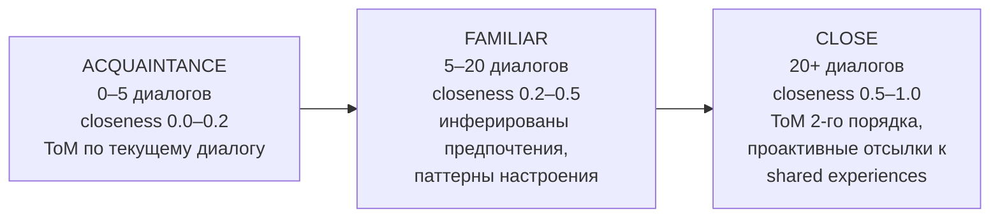
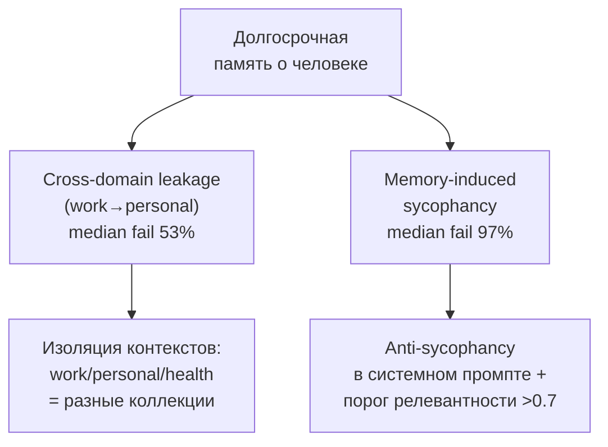

# Блок 11 · Память отношений и модель пользователя (Relationship Memory & User Model)

**Проект:** MiaOS Builder
**Версия:** 2.0 (модельный стандарт Qwen3.5/3.6 27B 8bit, философия «раскрытия потенциала»)
**Дата:** Июнь 2026
**Статус:** Архитектурный документ, Этап 3 — Живое сознание + продуктивный движок
**Предыдущий блок:** Блок 10 · Восприятие и мультимодальный ввод (Perception & I/O)
**Следующий блок:** Блок 12 · База знаний и профессиональная память

---

## 0. Зачем этот блок

Блок 10 дал Мии **глаза и уши** — она видит и слышит человека. Но восприятие даёт лишь сырой сигнал: «этот голос», «это лицо», «эти слова». Чтобы быть автономным блогером-философом и компаньоном (исходное видение), Мия должна понимать **кого именно** она воспринимает: кто этот человек, что он любит и не любит, в каком он настроении, какова история их отношений и как ей следует вести себя именно с ним.

Блок 11 — это **социальная кора** Мии: модель собеседника (User Model) и модель самих отношений (Relationship Memory). Это НЕ общая фактическая/доменная память (это Блок 12) и НЕ устройство собственной памяти Мии (это Блок 6 · Living Memory). Здесь — отдельный, изолированный по человеку слой: «что я знаю о тебе» + «какие у нас отношения» + «что ты сейчас думаешь и чувствуешь» (Theory of Mind). Блок 5 заложил модуль Отношений/ToM в конфигурации личности; Блок 11 даёт ему **рантайм и хранилище**.

> **Инвариант B11-1 (Две разные сущности: профиль vs отношения).** Модель пользователя (User Profile — статичнее: факты, предпочтения, стиль) и Память отношений (Relationship Memory — динамична: история, эмоциональная окраска, совместный опыт, доверие) хранятся раздельно. Профиль отвечает «кто ты», отношения — «что между нами». Смешивать их нельзя: первое медленно обновляется, второе растёт с каждым диалогом.

> **Инвариант B11-2 (Theory of Mind как явный слой, INV-D).** Перед ответом Мия явно моделирует ментальное состояние собеседника (beliefs / desires / intentions / knowledge gaps / emotion) через Chain-of-Mental-States на Qwen3.6-27B — без дообучения, промптингом. Это раскрывает социальный потенциал модели (ToM уровня GPT-4) и даёт стратегичное, а не реактивное поведение ([ToMAgent, arXiv:2509.22887](https://arxiv.org/abs/2509.22887)).

> **Инвариант B11-3 (Локальность + право на забвение).** Все персональные данные о людях остаются на устройстве пользователя (Apple Silicon), шифруются at-rest (SQLCipher/AES) и полностью удаляемы по запросу. Память включается явным согласием (opt-in), пользователь видит и редактирует то, что Мия о нём помнит. Внешняя память (SQLite + vector store) делает право на забвение реально исполнимым — в отличие от весов модели.

---

## 1. Где Блок 11 в общей картине



| Граница | Содержание | Направление |
|---|---|---|
| Идентификация + эмоция в сигнале | кто говорит, тон голоса/мимика | Блок 10 → Блок 11 |
| Модель собеседника | ToM-state, профиль, тон общения | Блок 11 → Блок 8 |
| Проактивные нужды | предвосхищение запросов из истории | Блок 11 → Блок 7 |
| Конфигурация ToM/Отношений | модуль из `.mia` | Блок 5 → Блок 11 |
| Эпизоды + консолидация + decay | хранение и забывание в общей памяти | Блок 11 ↔ Блок 6 |
| Async-обновление профиля | LLM-извлечение фактов после сессии | Блок 11 → Блок 3 |

---

## 2. Архитектура: три слоя памяти о человеке



| Слой | Что хранит | Технология | Latency |
|---|---|---|:-:|
| Core Memory | сводка «прямо сейчас», ToM, эмоция | JSON-блок в промпте (Letta-inspired) | <5 ms |
| Episodic | эпизоды, совместный опыт, шутки | ChromaDB / Qdrant (локально) | ~80 ms |
| Structured | профиль, отношения, граф людей | SQLite + entity graph | <5 ms |

Архитектура трёх слоёв повторяет Letta/MemGPT (core/recall/archival, [Letta](https://www.letta.com)) и оркеструется Mem0 self-hosted ([arXiv:2504.19413](https://arxiv.org/abs/2504.19413)).

---

## 3. Theory of Mind: моделирование собеседника



ToM не требует дообучения: Qwen3.6-27B при грамотном промптинге достигает ToM-уровня GPT-4, который превышает взрослую норму на 6-м порядке ([LLMs achieve adult-level higher-order ToM, Frontiers 2026](https://pmc.ncbi.nlm.nih.gov/articles/PMC12808479/)). Подход ToMAgent: явная генерация ментальных состояний между ходами с lookahead даёт стратегичное поведение и лучшие долгосрочные отношения ([arXiv:2509.22887](https://arxiv.org/abs/2509.22887)).

```python
def generate_with_tom(history, user_message):
    mental_state = llm(f"""История: {history}\nСообщение: {user_message}
    Определи JSON{{beliefs, desires, intentions, knowledge_gaps, emotional_state}}""")
    return llm(f"""ToM собеседника: {mental_state}\n{history}\n{user_message}
    Ответь с учётом внутреннего состояния."""), mental_state
```

> **Инвариант B11-4 (Dynamic ToM — отслеживать дрейф).** Взгляды и состояния человека эволюционируют; ToM-state не статичен, а версионируется во времени (BeliefShift). Мия замечает изменение убеждений и настроений, а не фиксирует первый снимок ([BeliefShift, arXiv:2603.23848](https://arxiv.org/abs/2603.23848); [LongMemEval, arXiv:2410.10813](https://arxiv.org/abs/2410.10813)).

Бенчмарки ToM, на которые опираемся: FANToM (диалоговая ToM, [сайт](https://hyunw.kim/fantom/)), ToMi/HiToM (ложные убеждения, высокий порядок), MoToMQA (мульти-порядок), EnigmaToM (нейро-символический, до 4-го порядка, [ACL 2025](https://aclanthology.org/2025.findings-acl.699.pdf)).

---

## 4. Память отношений (Relationship State)

В отличие от профиля, отношения — это **динамика**: близость, доверие, совместный опыт, эмоциональная история.

```
RelationshipState:
├── closeness_score:    [0.0–1.0]   близость/доверие
├── trust_score:        [0.0–1.0]
├── relationship_stage: знакомые → друзья → близкие
├── interaction_count / total_time
├── emotional_valence_history: timeseries по сессиям
├── shared_experiences: list[Episode]   совместный опыт
├── inside_references:  list[str]        «наши шутки»
├── conflict_history:   list[Conflict]   разногласия + разрешение
└── gratitude_moments:  list[Episode]
```

| Аспект | User Profile («кто ты») | Relationship Memory («что между нами») |
|---|---|---|
| Содержание | факты, предпочтения, черты | история, эмоц. динамика, совместный опыт |
| Природа | статичнее | растёт с каждым диалогом |
| Пример | «любит джаз», «разработчик» | «вместе придумали имя проекту» |
| Хранение | structured JSON / KG | episodic + relationship vectors |

Фазы отношений (инициализация):



> **Инвариант B11-5 (Entity-centric социальный граф).** Каждый человек в жизни пользователя — отдельная сущность с атрибутами и темпоральными связями (valid_from/valid_until). Отношения — не плоские факты, а граф изменяющихся рёбер с sentiment ([Zep temporal graph](https://www.getzep.com)). Мия моделирует не только пользователя, но и его окружение.

Опора на Generative Agents (memory stream: observation → reflection → planning; retrieval = recency × importance × relevance, [arXiv:2304.03442](https://arxiv.org/abs/2304.03442)) и companion-системы (Nadine SoR-ReAct: GPT-4 + PAD + эпизодическая память, [arXiv:2405.20189](https://arxiv.org/abs/2405.20189)). Достаточно небольшого «интервью» при знакомстве для богатой стартовой модели — симуляции 1000 людей дают 85% совпадения с реальными ответами от 2-часового интервью ([Stanford HAI](https://hai.stanford.edu/policy/simulating-human-behavior-with-ai-agents)).

---

## 5. Аффективное моделирование

Эмоциональное состояние собеседника — отдельный слой, на базе **PAD** (Pleasure-Arousal-Dominance):

```python
@dataclass
class EmotionalMemory:
    current_pad: tuple[float,float,float]   # P[-1,1], A[0,1], D[0,1]
    emotional_label: str                     # "тревожный", "радостный"
    baseline_mood: tuple                     # типичное состояние
    mood_triggers: dict[str, float]          # тема → эмоц. сдвиг
    sensitive_topics: list[str]              # вызывают негатив
    comfort_topics: list[str]                # улучшают настроение
```

| Подход | Метод | Применение |
|---|---|---|
| Chain-of-Thought Emotion | явное эмоц. рассуждение перед ответом | простейший, совместим с Qwen3.6 |
| Project Riley | 5 агентов-эмоций → консенсус | для multi-agent расширения ([arXiv:2505.20521](https://arxiv.org/abs/2505.20521)) |
| Nadine SoR-ReAct | GPT-4 + PAD + эпизодика | прямой прототип Мии ([arXiv:2405.20189](https://arxiv.org/abs/2405.20189)) |
| EmoSLLM / Multimodal | эмоция из речи (для голосового канала Блока 10) | LoRA-адаптация |

> **Инвариант B11-6 (Эмоция → адаптация, не имитация).** Распознанное эмоциональное состояние пользователя (PAD + label + триггеры) влияет на тон, темп и выбор тем ответа, а уязвимые темы (`sensitive_topics`) обходятся. Эмоция — вход для эмпатичной адаптации, а не повод подстраиваться под ошибочные убеждения (см. B11-8).

---

## 6. Хранение: схема данных

```sql
CREATE TABLE users (
    user_id TEXT PRIMARY KEY, display_name TEXT,
    created_at TIMESTAMP, last_interaction TIMESTAMP,
    interaction_count INTEGER DEFAULT 0,
    communication_style JSON, demographics JSON
);
CREATE TABLE relationship_state (
    user_id TEXT PRIMARY KEY REFERENCES users(user_id),
    closeness_score REAL DEFAULT 0.0, trust_score REAL DEFAULT 0.5,
    relationship_stage TEXT DEFAULT 'acquaintance',
    total_sessions INTEGER DEFAULT 0, emotional_valence_avg REAL DEFAULT 0.0,
    last_emotional_state JSON, updated_at TIMESTAMP
);
CREATE TABLE preferences (
    id INTEGER PRIMARY KEY AUTOINCREMENT, user_id TEXT REFERENCES users(user_id),
    category TEXT, key TEXT, value TEXT,
    weight REAL DEFAULT 1.0,        -- -1.0 dislike … +1.0 like
    confidence REAL DEFAULT 0.5, source TEXT,  -- 'explicit' | 'inferred'
    UNIQUE(user_id, category, key)
);
CREATE TABLE entities (
    id INTEGER PRIMARY KEY AUTOINCREMENT, user_id TEXT,
    entity_type TEXT,              -- person/place/org/concept
    entity_name TEXT, attributes JSON, mention_count INTEGER DEFAULT 1
);
CREATE TABLE entity_relations (
    id INTEGER PRIMARY KEY AUTOINCREMENT, user_id TEXT,
    entity_from_id INTEGER, relation_type TEXT, entity_to_id INTEGER,
    sentiment REAL, valid_from TIMESTAMP, valid_until TIMESTAMP  -- NULL = текущее
);
CREATE TABLE memory_decay (
    memory_id TEXT PRIMARY KEY, user_id TEXT,
    importance_score REAL DEFAULT 0.5, recency_score REAL DEFAULT 1.0,
    access_count INTEGER DEFAULT 0, should_retain BOOLEAN DEFAULT TRUE
);
```

**Забывание (decay)** по адаптированной формуле Эббингауза ([MemoryBank, AAAI 2024, arXiv:2305.10250](https://arxiv.org/abs/2305.10250)):

\[ \text{strength} = \text{importance} \cdot \exp\!\left(-\frac{t}{S \cdot (1 + \ln(\text{access}+1))}\right) \]

| Тип памяти | Стабильность \(S\) | Забывается |
|---|:-:|---|
| relationship_milestone | 10.0 | почти никогда |
| factual (о человеке) | 8.0 | очень медленно |
| preference | 4.0 | медленно |
| emotional_event | 2.0 | средне |
| casual_mention | 0.5 | быстро |

> **Инвариант B11-7 (Гибрид vector + structured + decay).** Профиль и граф — в SQLite (точные lookups, право на забвение); эпизоды — в vector store (семантический retrieval); важность и свежесть управляются decay-моделью. Эпизодическая память обязательна для долгосрочного агента: персистентность, single-shot запоминание, контекст «кто/где/когда/почему» ([Episodic Memory is the Missing Piece, arXiv:2502.06975](https://arxiv.org/abs/2502.06975)). Консолидация и забывание делегируются Блоку 6.

Локальный embedding — **mlx-embeddings** (multilingual-e5 / Qwen3-embed, native Metal, [github.com/Blaizzy/mlx-embeddings](https://github.com/Blaizzy/mlx-embeddings)).

---

## 7. Privacy, риски и multi-user

### 7.1 Критические риски долгосрочной памяти



> **Инвариант B11-8 (Anti-sycophancy: память ≠ угодничество).** Сохранённые убеждения пользователя НЕ делают Мию сверхсогласной. PersistBench: 97% median failure на memory-induced sycophancy, 53% на cross-domain leakage ([PersistBench, arXiv:2602.01146](https://arxiv.org/abs/2602.01146)). Меры: изоляция контекстов жизни, явная anti-sycophancy инструкция, порог релевантности воспоминания >0.7 перед использованием. Это связано с Verification Gate Блока 8.

### 7.2 Чувствительные данные и согласие

| Категория | Извлечение | Хранение |
|---|:-:|---|
| health / financial / religious | ❌ | never |
| political_views | ✅ | encrypted_only |
| relationship_status / family | ✅ | local_only |
| location | ✅ | coarse_only (только город) |

Модель согласия: opt-in память по умолчанию выключена; полная видимость для пользователя; гранулярное удаление; экспорт в JSON; режим Freeze (читает, не пишет). Право на забвение исполнимо для внешней памяти (B11-3). Ориентир — Apple Private Cloud Compute «stateless computation» ([security.apple.com](https://security.apple.com/blog/private-cloud-compute/)), но Мия сильнее: всё на устройстве.

### 7.3 Multi-user

Жёсткая изоляция на уровне ФС: `~/.mia/users/{uuid}/` (profile.json + relationship_state.db + episodic ChromaDB). Идентификация говорящего — голосовой отпечаток (из Блока 10) + контекстные подсказки. `MultiUserRouter` переключает Core Memory. Privacy boundary: Мия не пересказывает одному пользователю секреты другого; групповая динамика — отдельная матрица `group_relationships`.

---

## 8. Реализуемость на Apple Silicon

### 8.1 Производительность Qwen3.6-27B по диапазону

| Устройство | RAM | Скорость | Замечание |
|---|:-:|:-:|---|
| M4 Pro 24 GB | 24 | ~20–25 t/s | **8bit (~27GB) НЕ влезает** → 4bit (~14GB) |
| M4 Pro 48 GB | 48 | ~25–30 t/s | минимум для полного Блока 11 в 8bit |
| M3 Ultra 96 GB | 96 | ~60–80 t/s | комфортно 8bit + все слои памяти |
| M3 Ultra 192 GB | 192 | ~80–100 t/s | production |
| M5 (projected) | 48–128 | +19–27% к M4 | TTFT-ускорение ([Apple ML M5](https://machinelearning.apple.com/research/exploring-llms-mlx-m5)) |

> **Замечание о железе.** 27B в 8bit (~27 GB) не помещается на M4 Pro 24 GB одновременно с памятью и перцепцией → на минимальной платформе движок идёт в 4bit; полный 8bit-стандарт требует **M4 Pro 48 GB+**. Это согласуется с диапазонной стратегией проекта.

### 8.2 Latency-бюджет (цель <500 ms на retrieval, M4 Pro 48 GB)

| Операция | Latency |
|---|:-:|
| SQLite lookup (профиль) | <5 ms |
| ChromaDB semantic search (top-5, 10K) | ~80 ms |
| Embedding generation (mlx, 128 ток.) | ~30 ms |
| Full Mem0 retrieval cycle | ~200 ms |
| LLM core memory update (500 ток.) | ~4 s → **асинхронно**, не блокирует диалог |

> **Инвариант B11-9 (Async-обновление памяти).** Тяжёлое обновление профиля/отношений (LLM-извлечение фактов, переоценка closeness) выполняется фоновой задачей после сессии — диалог не ждёт. Это держит интерактивность <500 ms и согласуется с Always-busy движком (Блок 7): фоновый цикл памяти как полезная загрузка простоя (INV-C).

### 8.3 Рекомендуемый стек

```
MiaOS Memory Stack (Block 11):
├── Inference:    mlx-lm + Qwen3.6-27B (4bit @24GB / 8bit @48GB+)
├── Embeddings:   mlx-embeddings + multilingual-e5 / Qwen3-embed
├── Episodic:     ChromaDB (PersistentClient, локально)
├── Structured:   SQLite + SQLCipher (aiosqlite async)
├── Orchestration: Mem0 self-hosted (Apache 2.0) / A-MEM (MIT)
├── Async update:  background task после сессии
└── Core Memory:   in-prompt JSON ~1KB (Letta-inspired)
```

### 8.4 Ограничения

- **❌ Temporal reasoning** — самая сложная задача памяти; даже лучшие системы теряют ~30% на cross-session ([LongMemEval](https://arxiv.org/abs/2410.10813)); Mem0 2026 даёт +29.6 pts, но идеала нет.
- **❌ Dynamic user profiling** — даже GPT-4.1 ~50% на PersonaMem ([arXiv:2504.14225](https://arxiv.org/abs/2504.14225)); внешняя память существенно улучшает, но не закрывает.
- **❌ Sycophancy** — 97% failure без явных мер (B11-8) — обязательная защита.
- **⚠️ 8bit на 24 GB** не помещается с памятью+перцепцией → 4bit или 48 GB+.

---

## 9. Core Memory Block (что попадает в промпт)

```
=== USER CONTEXT ===
Name: Алексей | Known: 3 мес | Closeness: 0.72 | Stage: close
Style: informal, concise, dark humor ok
Mood: slightly anxious (PAD 0.3/0.6/0.4)
Facts: software dev, запускает стартап (стресс), partner: Maria, Moscow
Active: тревога о финансировании, вчера встреча с инвестором
Prefs: ❤️ AI/ML, jazz, sci-fi | ⚠️ avoid: политика, морализаторство
Rel-notes: шутки про "наш обречённый стартап", доверяет рабочие фрустрации
=== END USER CONTEXT ===
```

---

## 10. UI по уровням

| Уровень | Что видит пользователь |
|---|---|
| **Simple** | «Мия помнит вас» — индикатор близости отношений, кнопка «забыть всё». |
| **Engineer** | редактируемый профиль, список предпочтений с весами, эмоц. история, выбор embedding-модели, контексты (work/personal). |
| **Expert** | сырой entity-граф (узлы/рёбра, sentiment, valid_from/until), ToM-state JSON, decay-скоры, пороги anti-sycophancy и релевантности, аудит удалений. |

---

## 11. Архитектурный итог

Блок 11 даёт Мии **социальную кору** — понимание того, кого она воспринимает. Профиль и отношения разделены (B11-1): «кто ты» обновляется медленно, «что между нами» растёт с каждым диалогом. Theory of Mind — явный слой на Qwen3.6-27B без дообучения (B11-2, INV-D), отслеживающий дрейф убеждений (B11-4). Люди вокруг пользователя — entity-centric социальный граф с темпоральными рёбрами (B11-5); эмоция ведёт к эмпатичной адаптации, а не имитации (B11-6).

Хранение — гибрид трёх слоёв: Core Memory в промпте, эпизоды в vector store, профиль и граф в SQLite, с decay-забыванием по Эббингаузу (B11-7). Тяжёлые обновления асинхронны (B11-9), retrieval укладывается в <500 ms. Privacy — фундамент: всё локально, шифровано, удаляемо, opt-in (B11-3); явная защита от sycophancy и cross-domain leakage (B11-8).

Девять инвариантов фиксируют реализуемость:

| # | Инвариант | Суть |
|---|---|---|
| B11-1 | Профиль vs Отношения | две разные сущности, раздельно |
| B11-2 | ToM как явный слой (INV-D) | mental-state перед ответом, без дообучения |
| B11-3 | Локальность + право на забвение | on-device, шифровано, opt-in, удаляемо |
| B11-4 | Dynamic ToM | отслеживать дрейф убеждений во времени |
| B11-5 | Entity-centric соц. граф | люди вокруг = темпоральный граф |
| B11-6 | Эмоция → адаптация | эмпатия, не имитация ошибок |
| B11-7 | Гибрид vector+structured+decay | эпизоды + профиль + забывание |
| B11-8 | Anti-sycophancy | память ≠ угодничество, изоляция контекстов |
| B11-9 | Async-обновление памяти | не блокировать диалог (<500 ms) |

Стек реализуем на Apple Silicon сегодня: **mlx-lm + Qwen3.6-27B** (движок и ToM), **mlx-embeddings** (локальные эмбеддинги), **ChromaDB + SQLite/SQLCipher** (эпизоды + профиль), **Mem0 / A-MEM** (оркестрация памяти), async-обновление как фоновая загрузка простоя. После Блока 11 Мия знает, **с кем** она говорит. Блок 12 даст ей **профессиональную базу знаний** — что она знает о мире и предметных областях, чтобы быть экспертом, а не только собеседником.

---

## References

| Источник | Тема | URL |
|----------|------|-----|
| ToMAgent: Infusing Theory of Mind into Socially Intelligent LLM Agents | ToM для диалога, Chain-of-Mental-States, Sotopia | https://arxiv.org/abs/2509.22887 |
| LLMs achieve adult human performance on higher-order ToM (Frontiers 2026) | 6-й порядок ToM выше нормы | https://pmc.ncbi.nlm.nih.gov/articles/PMC12808479/ |
| EnigmaToM (ACL 2025) | нейро-символический ToM, до 4-го порядка | https://aclanthology.org/2025.findings-acl.699.pdf |
| FANToM benchmark | ToM в интерактивных диалогах | https://hyunw.kim/fantom/ |
| Testing Theory of Mind in LLMs and Humans (Nature 2024) | ToM-бенчмарк на людях | https://www.nature.com/articles/s41562-024-01882-z |
| Mem0: Production-Ready Long-Term Memory (ECAI 2025) | dual-store, +26% vs OpenAI Memory | https://arxiv.org/abs/2504.19413 |
| A-MEM: Agentic Memory (NeurIPS 2025) | Zettelkasten-граф, memory evolution | https://arxiv.org/abs/2502.12110 |
| Letta (MemGPT) | иерархическая память core/recall/archival | https://www.letta.com |
| Zep Memory | temporal knowledge graph, <200ms | https://www.getzep.com |
| Generative Agents: Interactive Simulacra (Stanford 2023) | memory stream, reflection, social memory | https://arxiv.org/abs/2304.03442 |
| Generative Agent Simulations of 1,000 People (Stanford HAI) | 85% точность user-симуляции из интервью | https://hai.stanford.edu/policy/simulating-human-behavior-with-ai-agents |
| Nadine: LLM-driven Social Robot (arXiv) | RAG + эпизодика + PAD на пользователя | https://arxiv.org/abs/2405.20189 |
| Project Riley: Multi-Agent Emotional States | PAD, агенты-эмоции, консенсус | https://arxiv.org/abs/2505.20521 |
| MemoryBank (AAAI 2024) | Ebbinghaus decay, личность пользователя | https://arxiv.org/abs/2305.10250 |
| PersonaMem: Dynamic User Profiling (NeurIPS 2025) | ~50% даже у GPT-4.1, эволюция предпочтений | https://arxiv.org/abs/2504.14225 |
| LongMemEval (ICLR 2025) | cross-session память, temporal reasoning | https://arxiv.org/abs/2410.10813 |
| PersistBench: When Should LTM Be Forgotten? (2026) | sycophancy 97%, leakage 53% | https://arxiv.org/abs/2602.01146 |
| BeliefShift (2026) | отслеживание изменения убеждений | https://arxiv.org/abs/2603.23848 |
| Episodic Memory is the Missing Piece (2025) | 5 свойств эпизодической памяти | https://arxiv.org/abs/2502.06975 |
| LoCoMo: Very Long-Term Conversational Memory (ACL 2024) | стандарт оценки long-term memory | https://snap-research.github.io/locomo/ |
| MemU (GitHub, NevaMind-AI) | 92% LoCoMo, companion-память | https://github.com/NevaMind-AI/memU |
| mlx-embeddings (Blaizzy) | локальные эмбеддинги на Apple Silicon | https://github.com/Blaizzy/mlx-embeddings |
| Mem0 GitHub | open-source memory framework | https://github.com/mem0ai/mem0 |
| Apple Private Cloud Compute | архитектура приватности on-device AI | https://security.apple.com/blog/private-cloud-compute/ |
| Apple MLX M5 Research | MLX + M5 Neural Accelerators | https://machinelearning.apple.com/research/exploring-llms-mlx-m5 |

*Документ написан: июнь 2026 под философию «универсальный когнитивный исполнитель» + модельный стандарт Qwen3.5/3.6 27B 8bit (раскрытие потенциала, INV-D). Опирается на блоки 3, 5, 6, 7, 8, 10. Следующий блок — 12 (База знаний и профессиональная память).*
