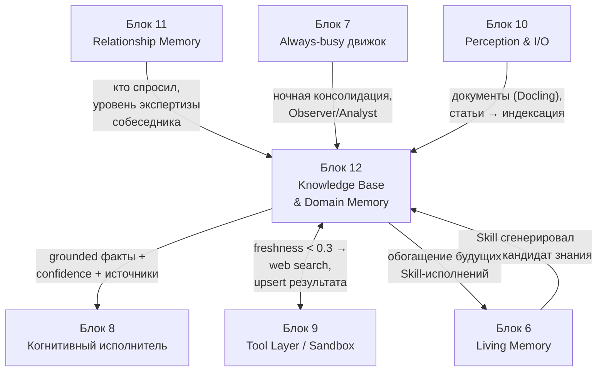
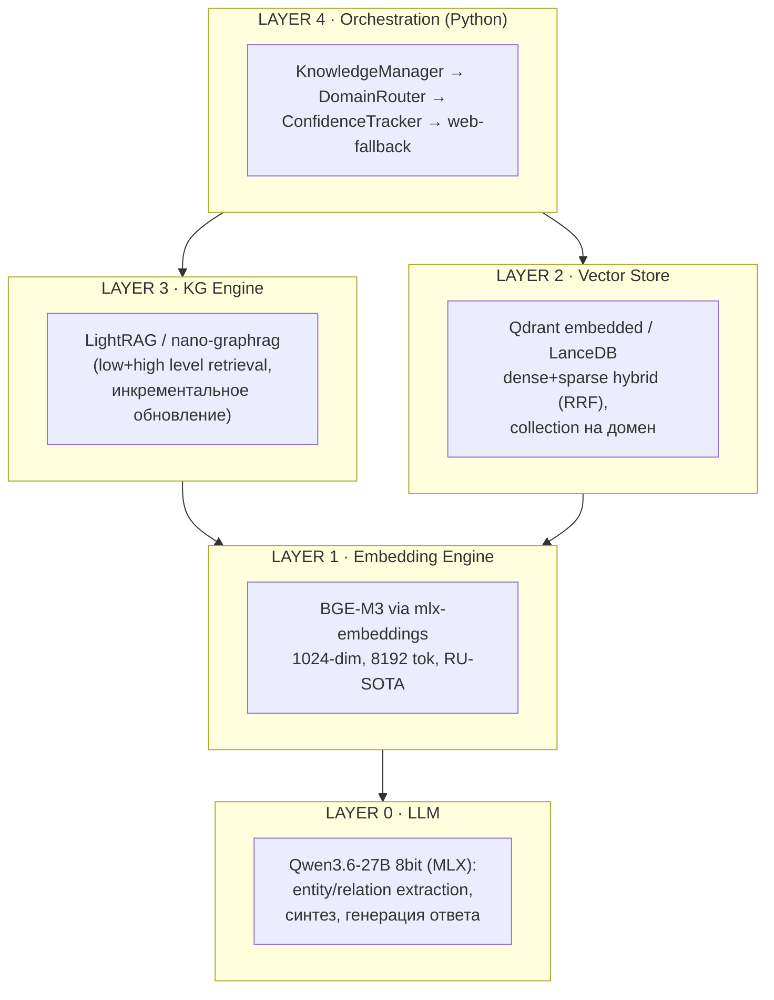
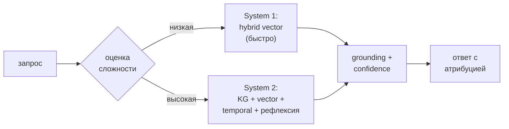
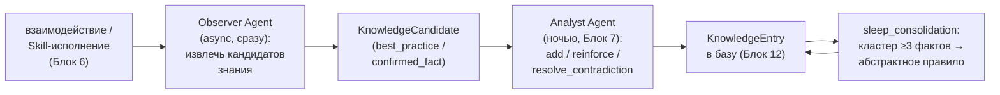

# Блок 12 · База знаний и профессиональная память (Knowledge Base & Domain Memory)

**Проект:** MiaOS Builder
**Версия:** 2.0 (модельный стандарт Qwen3.5/3.6 27B 8bit, философия «раскрытия потенциала»)
**Дата:** Июнь 2026
**Статус:** Архитектурный документ, Этап 3 — Живое сознание + продуктивный движок
**Предыдущий блок:** Блок 11 · Память отношений и модель пользователя (Relationship Memory & User Model)
**Следующий блок:** Блок 13 · Контракт автономности и безопасность

---

## 0. Зачем этот блок

Блок 11 дал Мии **социальную кору** — она знает, *с кем* говорит. Но автономный блогер-философ (исходное видение) обязан не только понимать собеседника, а быть **экспертом**: знать *о мире* — про SEO и алгоритмы соцсетей, про философские школы, про любой домен, в котором она работает. Без этого слоя Мия — приятный собеседник без компетенции; с ним она становится универсальным когнитивным исполнителем (INV-A), способным заменить целую команду профессионалов.

Блок 12 — это **профессиональная/доменная память**: что Мия знает о предметных областях. Это принципиально иной слой, чем два уже существующих хранилища памяти, и их нельзя смешивать:

| Слой | Вопрос, на который отвечает | Блок |
|---|---|---|
| Автобиографическая память | «Что *со мной* было? Что я *умею*?» | Блок 6 · Living Memory |
| Персональная память о людях | «Что я знаю *о тебе*? Что *между нами*?» | Блок 11 · Relationship Memory |
| **Доменная база знаний** | «Что я знаю *о мире* и предметных областях?» | **Блок 12 (этот)** |

> **Инвариант B12-1 (Три раздельных контура памяти).** Доменное знание (мир), автобиографическое знание (Блок 6) и персональное знание о людях (Блок 11) хранятся в физически раздельных контурах с разными политиками TTL, приватности и обновления. Факт «E-E-A-T влияет на ранжирование» не смешивается с фактом «Алексей запускает стартап» и с фактом «я однажды ошиблась в прогнозе». Смешение разрушает и приватность, и эпистемическую гигиену.

> **Инвариант B12-2 (RAG, а не дообучение — нет катастрофического забывания).** Доменное знание живёт во *внешней* базе (vector store + KG), не в весах модели. Новые знания добавляются (append-only / soft-invalidation), а не «перетирают» старые. Катастрофическое забывание ([Lifelong LLM Agents, arXiv:2501.07278](https://arxiv.org/html/2501.07278v1)) затрагивает только организацию базы, никогда — параметры Qwen3.6-27B. Это делает право на забвение и аудит знаний реально исполнимыми.

> **Инвариант B12-3 (Эпистемическая честность — confidence-first).** Каждый факт несёт `confidence` и `freshness`; Мия всегда отличает «знаю точно» (верифицированный источник) от «предполагаю» (низкая уверенность или устаревшие данные) и явно маркирует это в ответе. Эксперт, который не знает границ своего знания, опаснее новичка.

---

## 1. Где Блок 12 в общей картине



| Граница | Содержание | Направление |
|---|---|---|
| Контекст запроса | кто спросил, уровень экспертизы | Блок 11 → Блок 12 |
| Grounded-знание | факты + confidence + attribution | Блок 12 → Блок 8 |
| Web-fallback | устарело/неуверенно → веб-поиск, upsert | Блок 12 ↔ Блок 9 |
| Опыт → знание | Skill-исполнение порождает кандидата | Блок 6 → Блок 12 |
| Знание → навык | факты обогащают будущие Skill | Блок 12 → Блок 6 |
| Консолидация | Observer/Analyst в простое | Блок 7 → Блок 12 |
| Поглощение источников | документы из перцепции в индекс | Блок 10 → Блок 12 |

---

## 2. Архитектура: доменные модули + 4 слоя стека

Принцип — **доменная изоляция**: каждый домен (blogging, philosophy, custom) — независимый namespace со своим KG, vector store и онтологией. Поверх — мета-слой межсдоменных связей.



```
mia_knowledge/
├── domains/
│   ├── blogging/   { ontology.json · kg/ · vectors/ (qdrant: mia_blogging) · metadata.json }
│   ├── philosophy/ { ontology.json · kg/ · vectors/ · metadata.json }
│   └── [new_domain]/   ← создаётся динамически под задачу
├── cross_domain/   { bridges.json · meta_kg/ }
└── index.json      ← реестр доменов
```

> **Инвариант B12-4 (Доменная изоляция как namespace).** Каждый домен — отдельная коллекция vector store + отдельный KG + собственная онтология. Это даёт точечный retrieval (не «всё про всё»), независимые TTL-политики по домену, чистое добавление/удаление целого домена и отсутствие межсдоменного шума. Связи между доменами выражаются явно через `cross_domain/bridges.json`, а не размытием границ.

---

## 3. Retrieval: гибрид + контекстуализация + графовый слой

Эволюция RAG прошла путь Naive → Advanced → Modular → **Agentic** ([Agentic RAG Survey, arXiv:2501.09136](https://arxiv.org/abs/2501.09136)). Мия использует гибридную архитектуру: быстрый dense+sparse retrieval по умолчанию, графовый слой для multi-hop, агентная рефлексия для сложных запросов.

| Метод | Качество | Подходит для Мии |
|---|---|:-:|
| Dense (Qdrant/LanceDB) | хорошее | базовый слой |
| Sparse (BM25/lexical) | хорошо по ключевым словам | гибрид |
| **Hybrid (dense+sparse, RRF)** | отличное | **default** |
| **Contextual Retrieval** | −49% провалов (−67% с reranking) | **обязательно** |
| HippoRAG 2 (KG+PPR) | лучшее на multi-hop, +7% ассоциативных | сложные запросы |
| LightRAG / E²GraphRAG | темы домена, инкрементально | KG-слой |

> **Инвариант B12-5 (Hybrid + Contextual всегда, pure dense — никогда).** Любой retrieval идёт минимум как dense+sparse с RRF-слиянием, а чанки контекстуализируются до индексации. [Contextual Retrieval от Anthropic](https://www.anthropic.com/engineering/contextual-retrieval) снижает провалы поиска на 49% (до 67% с reranking) — для базы, на которой Мия строит экспертные ответы, это не опция, а норма. BGE-M3 даёт dense+sparse+ColBERT в одной модели ([arXiv:2402.03216](https://arxiv.org/abs/2402.03216)).

```python
# Contextual chunking (Anthropic): контекст документа → перед чанком, ДО индексации
for chunk in document.chunks:
    context = llm(f"Документ:\n{document.full_text}\n\nДай краткий контекст "
                  f"для фрагмента (1–2 предложения): {chunk}")
    index.add(embed(f"{context}\n\n{chunk}"), metadata={"source": document.id})
```

```python
# Qdrant hybrid: dense + sparse → RRF fusion (Query API, embedded режим)
results = client.query_points(
    collection_name="mia_blogging",
    prefetch=[
        models.Prefetch(query=dense_vec,  using="dense",  limit=20),
        models.Prefetch(query=sparse_vec, using="sparse", limit=20),
    ],
    query=models.FusionQuery(fusion=models.Fusion.RRF),
    limit=5, with_payload=True,
)
```

### 3.1 Графовый слой и адаптивный режим

Vanilla RAG не видит связей между концептами; KG-слой даёт multi-hop reasoning и глобальные темы домена. Полная индексация Microsoft GraphRAG непрактична (~4 ч на 200K токенов, [Microsoft Research](https://www.microsoft.com/en-us/research/blog/graphrag-unlocking-llm-discovery-on-narrative-private-data/)) — поэтому Мия берёт инкрементальный **LightRAG** ([github.com/hkuds/lightrag](https://github.com/hkuds/lightrag)) или **nano-graphrag**, с заделом на **E²GraphRAG** (10× индексация, 100× retrieval, [arXiv:2505.24226](https://arxiv.org/html/2505.24226v3)). Концептуальная основа — **HippoRAG 2** ([arXiv:2502.14802](https://arxiv.org/html/2502.14802v2)): KG + Personalized PageRank, нейробиологически корректная долгосрочная ассоциативная память — прямо соответствует задаче доменной экспертизы Мии.

> **Инвариант B12-6 (Адаптивный retrieval — System 1 / System 2, INV-D).** Простые фактологические запросы идут через быстрый vector-путь (System 1); сложные multi-hop, философские и аналитические — через KG + temporal + рефлексию (System 2), где Qwen3.6-27B сам выбирает стратегию и инструменты ([Reasoning Agentic RAG, arXiv:2506.10408](https://arxiv.org/html/2506.10408v1)). Это раскрывает агентный потенциал модели, не тратя её на тривиальном поиске.



---

## 4. Схема знания, версионирование и temporal-граф

Факты устаревают неравномерно: алгоритм соцсети живёт ~30 дней, философский концепт — вечен. Каждая запись несёт метаданные жизненного цикла.

```python
@dataclass
class KnowledgeEntry:
    id: str
    domain: str               # "blogging" | "philosophy" | "finance"
    subdomain: str            # "SEO" | "ancient_greek" | "valuation"
    content: str              # сам факт
    source_url: Optional[str]
    source_date: Optional[datetime]
    confidence: float         # 0.0–1.0 — насколько Мия уверена
    freshness: float          # 0.0–1.0 — насколько актуально
    ttl_days: Optional[int]   # None = вечный факт
    verification_status: str  # "verified" | "unverified" | "contradicted"
    tags: List[str]
    related_entries: List[str]
    created_at: datetime
    updated_at: datetime
    embedding: Optional[List[float]]
```

```sql
-- Реестр доменного знания (структурный слой, рядом с vector store)
CREATE TABLE knowledge_entry (
    id            TEXT PRIMARY KEY,
    domain        TEXT NOT NULL,
    subdomain     TEXT,
    content       TEXT NOT NULL,
    source_url    TEXT,
    source_date   TEXT,
    confidence    REAL  CHECK(confidence BETWEEN 0 AND 1),
    freshness     REAL,
    ttl_days      INTEGER,                 -- NULL = вечный
    verification  TEXT DEFAULT 'unverified',
    valid_from    TEXT NOT NULL,
    valid_until   TEXT,                    -- NULL = действует; инвалидация, не удаление
    created_at    TEXT, updated_at TEXT
);
CREATE INDEX idx_domain_fresh ON knowledge_entry(domain, freshness);
```

| Категория (blogging) | TTL | Источники |
|---|---|---|
| Вечные принципы (storytelling, hooks) | ∞ | классические книги, исследования |
| Platform mechanics (алгоритмы, форматы) | 30–90 дн | официальные блоги, эксперименты |
| SEO knowledge (E-E-A-T, keywords) | 90 дн | GSC, SEMrush, Ahrefs |
| Тренды аудитории | 14 дн | BuzzSumo, Google Trends |
| Рыночные данные | 7 дн | live-источники |

> **Инвариант B12-7 (Temporal-граф — инвалидация, не удаление).** При противоречии старый факт не стирается, а помечается `valid_until` (паттерн [Zep](https://www.getzep.com)). Это позволяет спрашивать «что было правдой 3 месяца назад?», сохранять историю изменений алгоритмов и аудировать, почему Мия думала так-то тогда-то. Decay снижает вес устаревшего, не теряя его. Разрешение противоречий: `supersede` (новее + надёжнее), `coexist` (близкая уверенность), `flag_human` (спорно).

---

## 5. Continual learning: накопление знаний без дообучения

Мия должна *становиться* экспертнее со временем. Паттерн **Observer + Analyst** ([Lifelong LLM Agents, arXiv:2501.07278](https://arxiv.org/html/2501.07278v1)) работает поверх RAG, не трогая веса, и привязан к always-busy движку (Блок 7) — тяжёлый анализ идёт в простое/ночью.



| Стратегия против забывания | Механизм | Эффективность |
|---|---|---|
| Append-only KB | новые знания только добавляются | высокая |
| Soft-invalidation | устаревшее помечается, не стирается | высокая |
| Temporal tagging | timestamp + recency в retrieval | средняя |
| Contradiction resolution | разрешение с сохранением истории | высокая |
| Knowledge distillation | эпизоды → абстрактные правила | высокая |

> **Инвариант B12-8 (Lifelong-накопление в простое, не блокируя диалог).** Observer извлекает кандидатов знания асинхронно сразу после взаимодействия; Analyst и sleep-консолидация (абстрагирование частых паттернов в правила) запускаются в простое движком Блока 7. Основной диалоговый поток никогда не ждёт обучения. Так Мия растёт как эксперт, оставаясь отзывчивой (связь INV-C: железо занято полезной консолидацией, а не простаивает).

---

## 6. Grounding и борьба с галлюцинациями

Экспертная база бесполезна, если Мия выдаёт устаревшее или придуманное за факт. Каждый ответ проходит confidence-фильтр, freshness-проверку и атрибуцию к источнику.

```python
CONFIDENCE_THRESHOLDS = {
    "fact_certain":   0.85,   # цитируем как факт
    "fact_probable":  0.65,   # "по данным источника..."
    "fact_uncertain": 0.40,   # "предположительно..."
    "speculation":    0.0,    # "это моя интерпретация..."
}
# Эпистемические маркеры в ответе — Мия явно отделяет «знаю» от «думаю»
PREFIX = {
    "fact_certain":   "",
    "fact_probable":  "По имеющимся данным, ",
    "fact_uncertain": "Предположительно (требует проверки): ",
    "speculation":    "Моя интерпретация (не верифицированный факт): ",
}
```

| Техника anti-hallucination | Механизм | Эффективность |
|---|---|---|
| Source attribution | каждое утверждение → ссылка на chunk | высокая |
| Confidence filtering | не выдавать факты ниже порога | высокая |
| Freshness decay | снижать вес устаревшего | средняя |
| Contradiction detection | сверять новое со существующим | высокая |
| Self-RAG reflection | агент сам оценивает достоверность | высокая |
| Temporal context | «по состоянию на [дата]…» | средняя |

> **Инвариант B12-9 (Freshness-triggered web-fallback в Блок 9).** Если локальный ответ имеет `confidence < 0.5`, `freshness < 0.3`, пуст или запрос — про текущие события, Мия обращается к web-поиску через Tool Layer (Блок 9), сливает результат с локальным и upsert-ит свежие данные обратно в базу (с TTL). База знаний — живая: она не только отдаёт, но и пополняется в момент дефицита. Это замыкает контур «знание ↔ инструменты ↔ знание».

```python
def retrieve_with_web_fallback(query, domain, web_search_tool):  # web_search из Блока 9
    local = kb.retrieve(query, domain)
    if (local.confidence < 0.5 or local.freshness < 0.3
            or local.is_empty() or is_current_events(query)):
        web = web_search_tool.search(query)
        kb.upsert_from_web(web, domain=domain, ttl_days=14)   # пополняем базу
        return merge_responses(local, web)
    return local.formatted_answer
```

---

## 7. Эмбеддинги, chunking и vector DB на Apple Silicon

**Эмбеддинги — BGE-M3** ([BAAI/bge-m3](https://huggingface.co/BAAI/bge-m3), [arXiv:2402.03216](https://arxiv.org/abs/2402.03216)): 1024-dim, до 8192 токенов, 100+ языков, MIT, dense+sparse+ColBERT в одной модели, SOTA на русском ([ruMTEB, ACL 2025](https://aclanthology.org/2025.naacl-long.12/)). Запуск нативно через **mlx-embeddings** ([github.com/Blaizzy/mlx-embeddings](https://github.com/Blaizzy/mlx-embeddings), ~2.2 ГБ fp16).

**Chunking:** Recursive 512-token (69% точности, default) + Contextual; Late Chunking ([Jina, arXiv:2409.04701](https://arxiv.org/html/2409.04701v3)) для длинных документов; Semantic/Adaptive (до 87%) для философских нарративов ([бенчмарк chunking 2026](https://www.firecrawl.dev/blog/best-chunking-strategies-rag)).

| Vector DB | Тип | Hybrid | M4 Pro 24GB | M3 Ultra 96GB |
|---|---|:-:|---|---|
| **Qdrant** (embedded) | Rust | native RRF | ~1ms p99 @500K | ~1ms p99 @2M |
| **LanceDB** | Rust/embedded | dense+BM25 | ~0.5ms @100K | ~1ms @1M |
| **sqlite-vec** | SQLite ext | через FTS5 | <1ms @100K | <1ms @500K |
| ChromaDB | Python (Rust 2025) | частично | ~5ms @100K | ~3ms @500K |

| Устройство | RAM | Конфигурация |
|---|---|---|
| M4 Pro 24GB | 24 | sqlite-vec/LanceDB + BGE-M3 fp16 + LightRAG (NetworkX) |
| M4 Pro 48GB | 48 | Qdrant embedded + LightRAG KG + BGE-M3 fp16 |
| M3 Ultra 96GB | 96 | Qdrant server + LightRAG/GraphRAG + BGE-M3 fp32 |
| M3/M5 Ultra 192GB | 192 | Qdrant server + full GraphRAG + ColBERT reranking |

### 7.1 Бюджет памяти полного стека (M4 Pro 24GB)

| Компонент | Память |
|---|---|
| Qwen3.6-27B 8bit | ~14 GB |
| BGE-M3 fp16 | ~2.2 GB |
| Qdrant index (500K) | ~2 GB |
| LightRAG KG | ~200 MB |
| OS + Python | ~4 GB |
| **Итого** | **~22.4 GB ✓** (помещается на 24 GB) |

Точный бюджет: \( 14 + 2.2 + 2 + 0.2 + 4 = 22.4 \) ГБ — базовый стек работает даже на минимальной конфигурации; запас роста \( 24 - 22.4 = 1.6 \) ГБ. На 48GB+ — комфортно, на M3 Ultra — полный графовый стек без ограничений.

| Ограничение Apple Silicon | Серьёзность | Обход |
|---|---|---|
| GraphRAG полная индексация (4ч/200Кт) | высокая | LightRAG / E²GraphRAG |
| Нет CUDA | средняя | MLX-альтернативы (mlx-embeddings) |
| Unified memory: LLM конкурирует с вектором | средняя | quantization, mmap |
| ⚠️ 8bit + полный KG на 24GB впритык | средняя | LanceDB вместо Qdrant, либо 48GB+ |

---

## 8. UI по уровням

| Уровень | Что видит пользователь |
|---|---|
| **Simple** | список доменов Мии («блогинг», «философия»), индикатор «свежесть знаний», кнопка «обновить из веба». |
| **Engineer** | редактор записей знания (content/source/confidence/TTL), управление доменами, выбор chunking-стратегии и embedding-модели, лог Observer/Analyst-обновлений. |
| **Expert** | сырой KG (узлы/рёбра, PPR-веса), temporal-граф с `valid_from/until`, пороги confidence/freshness, настройка RRF и reranking, ручное разрешение `flag_human`-противоречий, аудит web-upsert. |

---

## 9. Архитектурный итог

Блок 12 даёт Мии **профессиональную компетенцию** — то, что превращает её из собеседника в эксперта и приближает к исходному видению автономного блогера-философа. Доменное знание изолировано от автобиографического (Блок 6) и персонального (Блок 11) в трёх раздельных контурах (B12-1, B12-4). Оно живёт во внешней базе на RAG, а не в весах — значит, нет катастрофического забывания, а право на забвение и аудит исполнимы (B12-2).

Retrieval — всегда гибрид (dense+sparse) с контекстуализацией чанков (B12-5), с адаптивным переключением System 1 / System 2 для раскрытия агентного потенциала Qwen3.6-27B (B12-6). Знание темпорально: противоречия инвалидируются, а не стираются (B12-7); база растёт сама через Observer/Analyst-цикл в простое движка (B12-8). Эпистемическая честность — фундамент: confidence-first, явные маркеры «знаю/предполагаю» (B12-3), и web-fallback в Блок 9 при дефиците свежести (B12-9).

Девять инвариантов фиксируют реализуемость:

| # | Инвариант | Суть |
|---|---|---|
| B12-1 | Три раздельных контура | мир / автобиография / люди — раздельно |
| B12-2 | RAG, не дообучение | нет катастрофического забывания |
| B12-3 | Confidence-first | «знаю точно» ≠ «предполагаю» |
| B12-4 | Доменная изоляция | домен = namespace (KG+vectors+ontology) |
| B12-5 | Hybrid + Contextual всегда | −49% провалов retrieval, никогда pure dense |
| B12-6 | Адаптивный System 1/2 (INV-D) | сложность → стратегия retrieval |
| B12-7 | Temporal — инвалидация, не удаление | история + аудит знаний |
| B12-8 | Lifelong-накопление в простое | Observer/Analyst, не блокирует диалог |
| B12-9 | Freshness-triggered web-fallback | дефицит → Блок 9 → upsert в базу |

Стек реализуем на Apple Silicon сегодня: **mlx-lm + Qwen3.6-27B 8bit** (extraction и синтез), **BGE-M3 via mlx-embeddings** (1024-dim, RU-SOTA), **Qdrant embedded** (или LanceDB @24GB) с гибридным RRF-поиском, **LightRAG / nano-graphrag** (инкрементальный KG), Recursive512+Contextual chunking, Observer/Analyst-цикл на движке Блока 7. Базовый стек умещается в ~22.4 ГБ — работает даже на M4 Pro 24GB. После Блока 12 Мия знает **о чём** говорит как эксперт. Блок 13 определит **границы её автономии и безопасность** — что ей позволено делать с этими знаниями и инструментами без надзора человека.

---

## References

| Источник | Тема | URL |
|----------|------|-----|
| Agentic RAG Survey (arXiv:2501.09136) | обзор Agentic RAG архитектур | https://arxiv.org/abs/2501.09136 |
| Reasoning Agentic RAG (arXiv:2506.10408) | System 1/2 для RAG-агентов | https://arxiv.org/html/2506.10408v1 |
| HippoRAG (NeurIPS 2024, arXiv:2405.14831) | нейробиологический RAG, KG+PPR | https://arxiv.org/abs/2405.14831 |
| HippoRAG 2 (arXiv:2502.14802) | non-parametric continual learning, +7% | https://arxiv.org/html/2502.14802v2 |
| HippoRAG — GitHub | открытый код | https://github.com/OSU-NLP-Group/HippoRAG |
| RAPTOR (arXiv:2401.18059) | рекурсивное дерево суммаризации | https://arxiv.org/abs/2401.18059 |
| Microsoft GraphRAG — Blog | граф-RAG для нарративных данных | https://www.microsoft.com/en-us/research/blog/graphrag-unlocking-llm-discovery-on-narrative-private-data/ |
| Microsoft GraphRAG — GitHub | код GraphRAG | https://github.com/microsoft/graphrag |
| LightRAG — GitHub | быстрый инкрементальный граф-RAG | https://github.com/hkuds/lightrag |
| nano-graphrag — GitHub | hackable GraphRAG (~1100 строк) | https://github.com/gusye1234/nano-graphrag |
| E²GraphRAG (arXiv:2505.24226) | 10× индексация, 100× retrieval | https://arxiv.org/html/2505.24226v3 |
| Contextual Retrieval — Anthropic | −49% (−67% с reranking) провалов | https://www.anthropic.com/engineering/contextual-retrieval |
| BGE-M3 — HuggingFace | мультиязычная embedding-модель | https://huggingface.co/BAAI/bge-m3 |
| M3-Embedding (arXiv:2402.03216) | dense+sparse+ColBERT в одной модели | https://arxiv.org/abs/2402.03216 |
| Late Chunking (arXiv:2409.04701) | контекстные эмбеддинги чанков | https://arxiv.org/html/2409.04701v3 |
| mlx-embeddings — GitHub | эмбеддинги нативно на Apple Silicon | https://github.com/Blaizzy/mlx-embeddings |
| Qdrant hybrid search | Query API prefetch + RRF | https://qdrant.tech/articles/hybrid-search/ |
| LanceDB hybrid search | embedded vector + FTS/BM25 | https://www.lancedb.com/blog/hybrid-search-rag-for-real-life-production-grade-applications-e1e727b3965a |
| sqlite-vec — GitHub | ультралёгкий vector search в SQLite | https://github.com/asg017/sqlite-vec |
| Lifelong LLM Agents (arXiv:2501.07278) | continual learning без fine-tuning | https://arxiv.org/html/2501.07278v1 |
| Awesome Lifelong Learning LLM — GitHub | методы + LifelongAgentBench 2025 | https://github.com/zzz47zzz/awesome-lifelong-learning-methods-for-llm |
| Zep — temporal context graph | invalidate-not-delete, история фактов | https://www.getzep.com |
| ruMTEB (ACL 2025) | русский embedding benchmark | https://aclanthology.org/2025.naacl-long.12/ |
| MMTEB (arXiv:2502.13595) | massive multilingual embedding benchmark | https://arxiv.org/html/2502.13595v3 |
| Best chunking strategies 2026 | бенчмарк 7 стратегий chunking | https://www.firecrawl.dev/blog/best-chunking-strategies-rag |
| When to use Graphs in RAG (arXiv:2506.05690) | применимость GraphRAG | https://arxiv.org/html/2506.05690v3 |
| RAG vs GraphRAG (arXiv:2502.11371) | систематическая оценка | https://arxiv.org/html/2502.11371v3 |
| Apple MLX M5 Research | MLX + M5 Neural Accelerators | https://machinelearning.apple.com/research/exploring-llms-mlx-m5 |

*Документ написан: июнь 2026 под философию «универсальный когнитивный исполнитель» + модельный стандарт Qwen3.5/3.6 27B 8bit (раскрытие потенциала, INV-D). Опирается на блоки 6, 7, 8, 9, 10, 11. Следующий блок — 13 (Контракт автономности и безопасность).*
