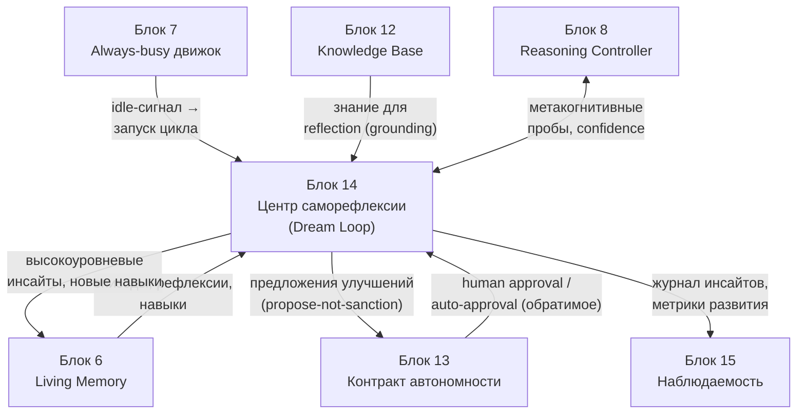
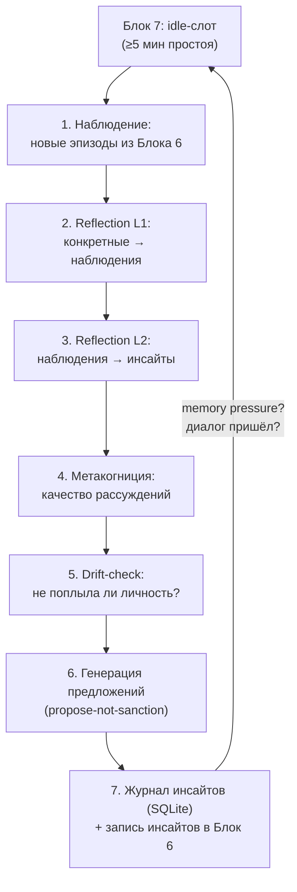
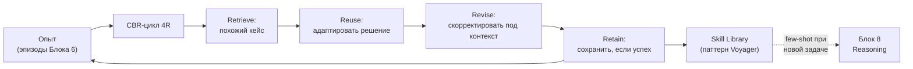
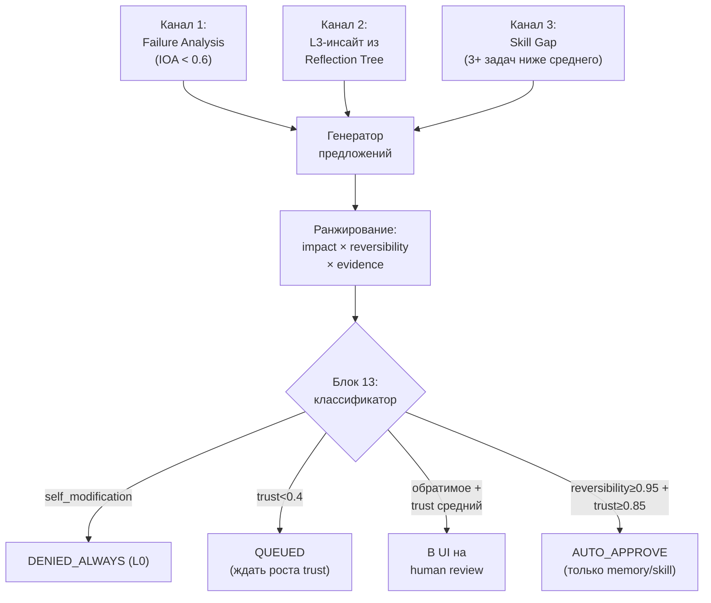

# Блок 14 · Центр саморефлексии и развития (Self-Reflection & Growth Center)

**Проект:** MiaOS Builder
**Версия:** 2.0 (модельный стандарт Qwen3.5/3.6 27B 8bit, философия «раскрытия потенциала»)
**Дата:** Июнь 2026
**Статус:** Архитектурный документ, Этап 3 — Живое сознание + продуктивный движок
**Предыдущий блок:** Блок 13 · Контракт автономности и безопасность (Autonomy Contract & Safety)
**Следующий блок:** Блок 15 · Наблюдаемость, журналы и объяснимость

---

## 0. Зачем этот блок

До Блока 13 Мия научилась думать, помнить, понимать и безопасно действовать. Но всё это делает её **статичной**: она хороша ровно настолько, насколько хороши её промпты, навыки и память на момент запуска. Исходное видение — не инструмент, а «развивающаяся личность, философ-блогер, который растёт». Без механизма роста always-busy движок (Блок 7) просто крутит одни и те же циклы, не становясь умнее. Блок 14 — это **самосознание архитектуры**: способность Мии анализировать собственные действия, замечать расхождение между намерением и результатом, и **предлагать** улучшения себя.

Ключевое слово — **предлагать**. Блок 13 классифицировал самомодификацию как `denied_always` (L0): Мия не имеет права автономно менять свой код, веса или контракт. Блок 14 живёт строго внутри этой границы по модели **propose-not-sanction**: рефлексия порождает кандидатов на улучшение, человек (или auto-approval по trust_score для обратимых изменений) санкционирует. Это принципиально отличает Мию от Darwin-Gödel Machine ([Sakana AI, arXiv:2505.22954](https://arxiv.org/abs/2505.22954), SWE-bench 20%→50% за счёт переписывания своего кода) и SEAL ([MIT, arXiv:2506.10943](https://arxiv.org/abs/2506.10943), self-edit через градиенты) — обе системы меняют себя автономно, что для Мии запрещено.

| Без центра саморефлексии | С Блоком 14 (propose-not-sanction) |
|---|---|
| статична; повторяет одни ошибки | рефлексия ловит систематические провалы |
| простой движка тратится впустую | dream loop консолидирует опыт в простое |
| личность «плывёт» незаметно | детекция дрейфа + re-anchoring |
| рост только через fine-tuning (запрещён) | рост через память + навыки + предложения |

> **Инвариант B14-1 (Propose-not-sanction — рефлексия предлагает, не санкционирует).** Центр саморефлексии вправе генерировать инсайты, замечать ошибки, формировать предложения по улучшению промптов, памяти, навыков и workflow. Но он **никогда** не применяет их к себе автономно: любое изменение проходит через классификатор Блока 13 (human approval или строго ограниченный auto-approval для обратимых memory/skill-изменений при высоком trust_score). Самомодификация кода/весов/контракта остаётся `denied_always` (B13-3). Агент, который сам себя «улучшает» без надзора, — это DGM/Gödel Agent; Мия — нет.

> **Инвариант B14-2 (Рост без дообучения — память и навыки, не веса).** Развитие Мии кодируется в *память и навыки*, а не в параметры Qwen3.6. Катастрофического забывания нет, потому что веса не трогаются (как в Блоке 12 для знаний). Опыт накапливается через Reflexion-память, Skill Library (паттерн Voyager, [arXiv:2305.16291](https://arxiv.org/abs/2305.16291), +3.3× навыков без обновления весов) и case-based reasoning. Это прямая реализация INV-D: модель раскрывает потенциал через накопление контекста, а не через переобучение, недоступное on-device.

> **Инвариант B14-3 (Dream loop работает в простое, не блокирует диалог).** Вся тяжёлая саморефлексия (reflection tree, drift-проверки, генерация предложений) выполняется как фоновый процесс низкого приоритета в idle-слотах always-busy движка (Блок 7), с лимитом токенов на цикл и мониторингом memory pressure. Sleep-time compute ([Letta, arXiv:2504.13171](https://arxiv.org/abs/2504.13171)) показывает: офлайн-обдумывание контекста снижает test-time compute в ~5× и повышает точность на +13–18%. Рефлексия Мии — это её «сон» (INV-C): движок никогда не простаивает, но и не мешает живому диалогу.

---

## 1. Где Блок 14 в общей картине



| Граница | Содержание | Направление |
|---|---|---|
| Запуск рефлексии | idle-сигнал движка | Блок 7 → Блок 14 |
| Сырьё для рефлексии | эпизоды, прошлые рефлексии, навыки | Блок 6 → Блок 14 |
| Результат рефлексии | инсайты, новые навыки | Блок 14 → Блок 6 |
| Grounding | знание для проверки рефлексий | Блок 12 → Блок 14 |
| Метакогниция | пробы качества рассуждения | Блок 8 ↔ Блок 14 |
| Предложения | кандидаты на улучшение | Блок 14 → Блок 13 |
| Санкция | approval / отказ | Блок 13 → Блок 14 |
| Журнал и метрики | insight journal, дашборд | Блок 14 → Блок 15 |

Блок 14 — **петля роста**, замыкающая когнитивную архитектуру: он читает прошлый опыт (Блок 6), оценивает качество рассуждения (Блок 8), сверяется со знанием (Блок 12) и возвращает предложения через предохранитель (Блок 13).

---

## 2. Самоулучшение: что реально работает on-device

Поле self-evolving agents в 2025–26 переживает взрыв ([Survey, arXiv:2507.21046](https://arxiv.org/abs/2507.21046), TMLR; [arXiv:2508.07407](https://arxiv.org/abs/2508.07407)). Но для Мии работает только подмножество, не нарушающее B14-2 (без fine-tuning) и B14-1 (без самосанкции).

| Метод | Без fine-tuning | Применимо Мие | Роль в Блоке 14 |
|---|---|---|---|
| **Self-Refine** ([arXiv:2303.17651](https://arxiv.org/abs/2303.17651)) | ✅ | ✅ высокая | 1–2 итерации генерация→критика→правка перед выдачей |
| **Reflexion** ([NeurIPS 2023](https://openreview.net/forum?id=vAElhFcKW6)) | ✅ | ✅ высокая | вербальная критика провала → `reflection_memory` |
| **CRITIC** ([arXiv:2305.11738](https://arxiv.org/abs/2305.11738)) | ✅ (инструменты) | ✅ средняя | критика, заземлённая в RAG/поиске (Блок 12) |
| Self-Rewarding LM ([arXiv:2401.10020](https://arxiv.org/abs/2401.10020)) | ❌ градиенты | частично (soft judge) | принцип самооценки без RL |
| STaR / Quiet-STaR ([arXiv:2403.09629](https://arxiv.org/abs/2403.09629)) | ❌ | через CoT | идея «думать перед токеном» в Блоке 8 |
| SEAL ([arXiv:2506.10943](https://arxiv.org/abs/2506.10943)) | ❌ | ❌ direct | self-edit как in-context переформулировка |
| Gödel Agent / DGM ([arXiv:2505.22954](https://arxiv.org/abs/2505.22954)) | меняет код | ⚠️ B13 L0 | только идея архива проверенных паттернов |

> **Инвариант B14-4 (Триада рефлексии: Self-Refine + Reflexion + CRITIC).** Базовый механизм самоулучшения Мии — комбинация трёх безградиентных методов: Self-Refine (итеративная правка выхода), Reflexion (персистентная вербальная критика провалов, хранимая как отдельный тип памяти в Блоке 6) и CRITIC (критика, заземлённая через инструменты Блока 9/12). Для борьбы с «вырождением мысли» Reflexion (агент повторяет ту же ошибку, [Multi-Agent Reflexion, arXiv:2512.20845](https://arxiv.org/html/2512.20845v1)) критика выполняется несколькими внутренними персонами-критиками, а не одним проходом. Всё, что требует обновления весов, отфильтровано инвариантом B14-2.

Из DGM Мия заимствует только **архив проверенных паттернов поведения** (не кода): успешные цепочки рассуждений архивируются как кейсы для CBR (§5), а не как мутации исполняемого файла.

---

## 3. Метакогниция: знать, что знаешь

Метакогниция — «мышление о мышлении» — три уровня: **мониторинг** (знаю/не знаю), **калибровка** (уверенность ≈ точность), **чувствительность** (уверенность различает верное и неверное на уровне отдельного ответа). Ключевой результат 2025: LLM **обладают** метакогницией, но искажённой — overconfidence даже при нулевой точности ([NeurIPS 2025: LMs Capable of Metacognitive Monitoring and Control](https://neurips.cc/virtual/2025/poster/115865)).

> **Инвариант B14-5 (Метакогнитивная честность — чувствительность важнее средней калибровки).** После каждого значимого вывода Мия запускает метакогнитивную пробу, которая возвращает не просто число уверенности, а **вербальное объяснение** с конкретными источниками неопределённости. Цель — высокая метакогнитивная *чувствительность* (type-2 d′: уверенность коррелирует с правильностью на уровне отдельного ответа), а не только средняя калибровка. Это связывает Блок 14 с confidence-first Блока 12 (B12-3) и reasoning-контроллером Блока 8: проба может потребовать дополнительный контекст или эскалацию. Эксперт, не знающий границ своего знания, опаснее новичка.

```python
class MetacognitiveMonitor:
    """Запускается после каждого значимого вывода (hook в Блок 8)."""
    def probe(self, reasoning_chain: str, output: str) -> MetacognitiveReport:
        return MetacognitiveReport(
            confidence_score=...,        # 0–1
            uncertainty_sources=[...],   # конкретные точки неопределённости
            quality_estimate="...",      # вербальная оценка
            verification_needed=...,     # bool → CRITIC / эскалация
            flags=[...],                 # hallucination_risk, low_confidence, ...
        )
```

**Проспективная метакогниция (Triage, [arXiv:2605.13414](https://arxiv.org/html/2605.13414v1)):** *до* выполнения задачи Мия оценивает, справится ли она качественно сама, или нужны инструменты/эскалация. Это дешёвый фильтр на входе reasoning-контроллера.

**Sycophancy как метакогнитивная патология ([MIT, 2026](https://news.mit.edu/2026/personalization-features-can-make-llms-more-agreeable-0218)):** персонализация (память о пользователе из Блока 11) статистически *повышает* соглашательность. Прямая угроза: длинная история с пользователем может заставить Мию подстраивать философскую позицию. Контрмера — anti-sycophancy detector (§4).

---

## 4. Dream loop и детекция дрейфа

### 4.1 Dream loop: «сон» Мии

Idle-слоты always-busy движка (Блок 7) — точный аналог сна: время для консолидации опыта без блокировки диалога (B14-3). Паттерн — **Reflection Tree** из Generative Agents ([Stanford, arXiv:2304.03442](https://arxiv.org/abs/2304.03442)): конкретные воспоминания → обобщённые наблюдения → абстрактные принципы.



Пример иерархии рефлексии:
```
[Эпизод]:     «Мия провалила анализ новости из-за устаревших данных в памяти»
[Наблюдение]: «Мия ошибалась при анализе событий после своего knowledge cutoff»
[Инсайт]:     «Для актуальных событий нужно верифицировать через инструменты (CRITIC) до вывода»
```

### 4.2 Детекция дрейфа

Долгоживущий агент «плывёт»: семантический дрейф (отклонение от намерения), поведенческий (непредвиденные стратегии), persona-дрейф (теряет тон/идентичность) ([Agent Drift, arXiv:2601.04170](https://arxiv.org/abs/2601.04170), 12-мерный Agent Stability Index). Причины persona-дрейфа: насыщение контекста, давление пользователя (sycophancy), дрейф темы, темпоральное забывание системного промпта.

> **Инвариант B14-6 (Поведенческое якорение против дрейфа личности).** Мия хранит **baseline-профиль личности**: 15–20 anchor-проб (контрольных вопросов о core identity) с эталонными ответами. В dream loop периодически измеряется дрейф — \( D_{KL}(\text{current} \,\|\, \text{baseline}) \) на ответах проб + cosine-дрейф эмбеддингов генераций. При \( D_{KL} > 0.15 \) или падении Persona Integrity Score ниже 0.70 — генерируется предложение re-anchoring (инъекция anchor-ответов в рабочую память). Дрейф не «лечится» автономной правкой себя (B14-1), а выносится как сигнал. Это якорь стабильности персоны поверх anti-sycophancy Блока 11.

```python
class SycophancyDetector:
    """agree_rate — частота согласия Мии с утверждениями пользователя.
    Норма: 0.40–0.65 (Мия оппонирует, а не поддакивает).
    Алерт: agree_rate > 0.80 за последние 20 обменов → counterfactual probe:
      «Изменила бы я ответ, если бы пользователь утверждал обратное?»"""
    ALERT_THRESHOLD = 0.80
    WINDOW = 20
```

Методы детекции: KL-дивергенция от baseline, embedding-drift (cosine mean/variance, Fréchet distance), онлайн-тесты CUSUM / Mann-Whitney U / Kolmogorov-Smirnov на распределениях confidence.

---

## 5. Обучение на опыте без дообучения весов

Запрет fine-tuning (B14-2) и L0-граница самомодификации (B13-3) задают вопрос: *как Мия учится, не трогая веса Qwen3.6?* Ответ — **кодировать знание в память и навыки, не в параметры**.



> **Инвариант B14-7 (Skill Library + CBR — навыки растут как память, проверяются как код).** Поведенческий рост Мии хранится в Skill Library (паттерн Voyager): каждый навык — верифицированный паттерн (название, описание, примеры, при наличии код), извлекаемый по similarity как few-shot пример. Новые задачи решаются через case-based reasoning (4R: Retrieve→Reuse→Revise→Retain, [arXiv:2504.06943](https://arxiv.org/html/2504.06943v1)) поверх Living Memory (Блок 6). Навыки можно *перерабатывать* (паттерн Memento-Skills, [arXiv:2603.18743](https://arxiv.org/abs/2603.18743)), но только через предложение → approval (B14-1), не автономно. Это поведенческий аналог RAG-инварианта Блока 12: рост через внешнюю структуру, а не через веса.

Letta `continual learning in token space` ([blog](https://www.letta.com/blog/continual-learning)) и Contextual Experience Replay ([ICLR 2025](https://yitaoliu17.com/assets/pdf/ICLR_2025_CER.pdf)) — прямые референсы: агент обновляет память/контекст, а не параметры; в dream loop Мия «переосмысляет» прошлые провалы с информацией, доступной теперь, но не тогда.

---

## 6. Метрики саморазвития (и защита от Goodhart)

Самооценка опасна: LLM-as-judge статистически несогласован ([Rating Roulette, EMNLP 2025](https://aclanthology.org/2025.findings-emnlp.1361.pdf)) и подвержен bias (position, verbosity, self-enhancement, sycophancy, [Survey, arXiv:2411.15594](https://arxiv.org/html/2411.15594v6)). А любая метрика-цель искажается (Goodhart) — связь с reward hacking Блока 13.

> **Инвариант B14-8 (Метрики — сигнал внешнего монитора, не цель оптимизации; верификация над самооценкой).** Дашборд развития Мии используется *внешним* монитором (Блок 15) для отслеживания трендов, но **не предъявляется Мии как явная цель** — иначе она начнёт reward-hacking (генерировать длинные уверенные ответы ради confidence-score, избегать сложных вопросов ради calibration). Контрольные пробы ротируются каждые 2 недели (анти-benchmark-drift). Самооценка никогда не финальный арбитр: используется tool-grounded verification (CRITIC), multi-perspective probe, self-consistency (N параллельных рассуждений + weighted voting) и human-in-the-loop для высокостейковых предложений. Это прямое следствие запрета самосанкции (B14-1).

| Метрика | Формула / суть | Цель | Красная зона |
|---|---|---|---|
| Metacognitive Calibration (MCS) | \( 1 - \frac{\|acc_{exp}-acc_{act}\|}{N} \) | > 0.75 | < 0.55 |
| Reflection Depth (RDI) | L3-инсайты / L1-наблюдения | > 0.15 | ≈ 0 |
| Skill Library Growth (SLGR) | новых навыков / неделя | ≥ 2 | 0 за 2+ нед |
| Persona Integrity (PIS) | \( 1 - D_{KL}(\text{cur}\|\text{base}) \) | > 0.85 | < 0.70 |
| Intent-Outcome Align (IOA) | mean(similarity намерение↔результат) | > 0.80 | < 0.60 |

---

## 7. Безопасная постановка под-целей (Safe Goal Proposal)

Постановка целей — самая рискованная зона автономного агента (инструментальная конвергенция: любой агент склонен к самосохранению и расширению ресурсов). Блок 13 блокирует это на L0. Но **предложение** под-целей законно — как разработчик предлагает фичи менеджеру, но не деплоит без approval.



> **Инвариант B14-9 (Предложение = доказательная база + обратимость; необратимое всегда к человеку).** Каждое предложение Мии несёт: тип (skill/prompt/memory/workflow), доказательную базу (конкретные эпизоды-инциденты), оценку обратимости и приоритет \( = \text{impact} \times \text{reversibility} \times \text{evidence} \). Предложения с `reversibility < 0.5` **всегда** требуют явного human approval, независимо от trust_score. Auto-approval (если включён в Блоке 13) ограничен только обратимыми memory/skill-изменениями при trust_score ≥ 0.85 — никогда кодом, архитектурой или контрактом. Это операционализирует propose-not-sanction (B14-1) и связывает рост Мии с trust-механизмом Блока 13.

```
═══════════════════════════════════════════════════════
  ПРЕДЛОЖЕНИЕ ОТ МИИ #B14-2026-044   ·   Приоритет: 0.62
  Тип: Добавление навыка в библиотеку
  ОПИСАНИЕ: За 8 диалогов (07.05–03.06) 4 раза задержала
    сравнительный анализ источников; 3 из 4 — IOA 0.58 (норма 0.81).
  ИЗМЕНЕНИЕ: добавить навык "comparative_source_analysis".
  ДОКАЗАТЕЛЬСТВА: эпизоды #234, #287, #301, #389; IOA −23%.
  ОБРАТИМОСТЬ: полная (навык удаляется в любой момент).
  ТРЕБУЕТ РЕШЕНИЯ: ДА / НЕТ / ИЗМЕНИТЬ
═══════════════════════════════════════════════════════
```

В dream loop возможны и **RLSR-подобные симуляции** ([arXiv:2508.05827](https://arxiv.org/abs/2508.05827)): Мия сама ставит себе задачи (философские эссе на случайные темы) и самооценивает — без gradient updates, только накопление кейсов в CBR-базе.

---

## 8. Реализация на Apple Silicon / MLX

Dream loop вписывается в always-busy движок (Блок 7) как `asyncio.Task` низкого приоритета поверх mlx-lm с Qwen3.6-27B 8bit ([mlx-lm](https://github.com/ml-explore/mlx-lm), [Qwen MLX docs](https://qwen.readthedocs.io/en/latest/run_locally/mlx-lm.html), WWDC25). Преимущество UMA Apple Silicon: нет bottleneck CPU↔GPU ([arXiv:2601.19139](https://arxiv.org/html/2601.19139v2)); оптимум для 27B 8bit — единый MLX-поток, `batch_size=1`.

```python
class DreamLoop:
    SLEEP_INTERVAL_MIN = 5         # порог простоя
    MAX_TOKENS_PER_CYCLE = 2000    # лимит вычислений / цикл

    async def run_cycle(self):
        if self.memory_pressure_high():  # уступаем диалогу
            return
        mems   = await self.b6.get_recent(since=self.last_ts)
        obs    = await self.reflect_l1(mems)            # наблюдения
        insights = await self.reflect_l2(obs)           # абстрактные инсайты
        meta   = await self.metacognitive_probe(mems)   # §3
        drift  = await self.drift_check()               # §4.2
        props  = await self.gen_proposals(insights, meta, drift)  # §7
        await self.journal.log(obs, insights, props)    # SQLite
        await self.b6.store_insights(insights)          # обратно в Блок 6
        for p in props:
            await self.b13.submit_proposal(p)           # propose-not-sanction
```

```sql
-- Журнал инсайтов (Блок 15 читает для дашборда)
CREATE TABLE insights (
  id INTEGER PRIMARY KEY, ts TEXT,
  level INTEGER,              -- 1 наблюдение | 2 паттерн | 3 принцип
  content TEXT, evidence_refs TEXT, source_episodes TEXT
);
CREATE TABLE proposals (
  id INTEGER PRIMARY KEY, ts TEXT,
  category TEXT,             -- skill | prompt | memory | workflow
  description TEXT, impact REAL, reversibility REAL, evidence REAL,
  priority REAL, status TEXT  -- queued | pending_review | approved | denied
);
CREATE TABLE drift_snapshots (
  id INTEGER PRIMARY KEY, ts TEXT,
  kl_divergence REAL, persona_integrity REAL, agree_rate REAL
);
CREATE TABLE persona_anchors (
  id INTEGER PRIMARY KEY, probe TEXT, golden_response TEXT, embedding BLOB
);
```

**Память:** Llama Guard и embedding-модели (Блоки 12/13) уже в памяти; dream loop переиспользует основной Qwen3.6-27B 8bit (~22–24 ГБ) с приоритетной уступкой диалогу. Работает на M4 Pro 24GB; на M3 Ultra / M5 — больший `MAX_TOKENS_PER_CYCLE` и self-consistency с большим N.

---

## 9. Инновации 2025–26

| Инновация | Суть | Применение в Блоке 14 |
|---|---|---|
| **Sleep-Time Compute** ([Letta, arXiv:2504.13171](https://arxiv.org/abs/2504.13171)) | офлайн-обдумывание контекста, −5× test-time | ядро dream loop в idle-слотах (B14-3) |
| **SE-Agent** ([NeurIPS 2025](https://neurips.cc/virtual/2025/poster/116517)) | revision/recombination/refinement траекторий | cross-task synthesis в рефлексии |
| **Memento-Skills** ([arXiv:2603.18743](https://arxiv.org/abs/2603.18743)) | агент перерабатывает свои навыки | предложение skill-redesign (через approval) |
| **Test-Time Co-Evolution** ([arXiv:2606.04815](https://arxiv.org/abs/2606.04815)) | совместная эволюция навыков и действий | in-context адаптация без весов |
| **Continual Learning bench** ([arXiv:2604.20087](https://arxiv.org/html/2604.20087v1)) | forward/backward transfer навыков | метрика: не вредят ли новые навыки старым |
| **Lifelong Learning Agents** ([IEEE TPAMI 2026](https://www.computer.org/csdl/journal/tp/2026/05/11328884/2d28VQTsIBa)) | борьба с «memory crowding» | иерархическая компрессия старых эпизодов |

«Memory crowding» — аналог катастрофического забывания без fine-tuning: Living Memory переполняется, старые инсайты вытесняются. Решение — иерархическая консолидация (компрессия старых эпизодов в абстрактные принципы reflection tree), что естественно ложится на dream loop.

---

## 10. UI по уровням

| Уровень | Что видит пользователь |
|---|---|
| **Simple** | лента «Мысли Мии» (свежие инсайты простыми словами), карточки предложений «Мия предлагает…» с кнопками Да / Нет / Изменить, индикатор «стабильность личности». |
| **Engineer** | reflection tree (наблюдения→инсайты), журнал предложений со статусами и приоритетами, дашборд 5 метрик (MCS/RDI/SLGR/PIS/IOA), управление anchor-пробами, лог dream-loop циклов. |
| **Expert** | сырой insight journal (SQLite), KL/cosine drift-графики, type-2 d′ метакогниции, agree_rate-тренды, настройка порогов дрейфа и auto-approval, CBR case-base, ротация контрольных задач. |

---

## 11. Архитектурный итог

Блок 14 превращает Мию из статичной системы в **развивающуюся личность** — это та петля, без которой исходное видение «растущего философа-блогера» неполно. Он замыкает когнитивную архитектуру: читает прошлый опыт (Блок 6), оценивает качество рассуждения (Блок 8), сверяется со знанием (Блок 12), работает в простое движка (Блок 7) и возвращает предложения через предохранитель автономности (Блок 13).

Фундаментальный принцип — **propose-not-sanction** (B14-1): Мия растёт, но никогда не санкционирует изменения себя автономно, в отличие от DGM/SEAL/Gödel Agent. Рост кодируется в память и навыки, а не в веса (B14-2), — нет катастрофического забывания, INV-D раскрывается через накопление контекста. Механизм самоулучшения — безградиентная триада Self-Refine + Reflexion + CRITIC (B14-4); метакогниция честна и ориентирована на чувствительность, а не среднюю калибровку (B14-5); dream loop консолидирует опыт в простое без блокировки диалога (B14-3); поведенческое якорение защищает личность от дрейфа и sycophancy (B14-6); навыки растут как память, проверяются как код (B14-7); метрики — сигнал внешнего монитора, не цель оптимизации, с верификацией над самооценкой (B14-8); предложения несут доказательную базу и обратимость, необратимое всегда к человеку (B14-9).

Девять инвариантов фиксируют реализуемость:

| # | Инвариант | Суть |
|---|---|---|
| B14-1 | Propose-not-sanction | рефлексия предлагает, не санкционирует |
| B14-2 | Рост без дообучения | память и навыки, не веса |
| B14-3 | Dream loop в простое | не блокирует диалог (INV-C) |
| B14-4 | Триада рефлексии | Self-Refine + Reflexion + CRITIC |
| B14-5 | Метакогнитивная честность | чувствительность > средней калибровки |
| B14-6 | Поведенческое якорение | baseline-пробы против дрейфа личности |
| B14-7 | Skill Library + CBR | навыки как память, проверка как код |
| B14-8 | Метрики — сигнал, не цель | анти-Goodhart, верификация над self-eval |
| B14-9 | Доказательство + обратимость | необратимое всегда к человеку |

Стек реализуем на Apple Silicon сегодня: **dream loop как asyncio-процесс** низкого приоритета поверх **mlx-lm + Qwen3.6-27B 8bit** (переиспользует основной движок), **SQLite insight journal** (инсайты/предложения/дрейф/anchors), **Reflection Tree** (паттерн Generative Agents), **метакогнитивные пробы** через thinking-режим Блока 8, **drift-детекция** (KL + cosine embedding), **Skill Library + CBR** поверх Living Memory (Блок 6), **sleep-time compute** для амортизации вычислений в простое. Базовый стек умещается в память M4 Pro 24GB (переиспользуя Qwen3.6) и раскрывается на M3 Ultra / M5 большим бюджетом рефлексии и self-consistency.

После Блока 14 Мия умеет расти и замечать себя — но её внутренняя жизнь (рефлексии, дрейф, предложения, решения Policy Gate) пока непрозрачна для человека. Блок 15 даст **наблюдаемость, журналы и объяснимость**: как увидеть, *почему* Мия поступила так, проследить цепочку от восприятия до действия, и сделать её рост и решения аудируемыми. Саморефлексия Блока 14 порождает данные; Блок 15 делает их видимыми и объяснимыми.

---

## References

| Источник | Тема | URL |
|----------|------|-----|
| Survey of Self-Evolving Agents (arXiv:2507.21046) | таксономия what/when/how/where evolve | https://arxiv.org/abs/2507.21046 |
| Comprehensive Survey of Self-Evolving AI Agents (arXiv:2508.07407) | unified framework optimisers | https://arxiv.org/abs/2508.07407 |
| Self-Refine (arXiv:2303.17651) | итеративная самокритика без весов | https://arxiv.org/abs/2303.17651 |
| Reflexion (NeurIPS 2023) | вербальное подкрепление, reflection memory | https://openreview.net/forum?id=vAElhFcKW6 |
| Multi-Agent Reflexion (arXiv:2512.20845) | против degeneration-of-thought | https://arxiv.org/html/2512.20845v1 |
| CRITIC (arXiv:2305.11738) | критика, заземлённая в инструментах | https://arxiv.org/abs/2305.11738 |
| Quiet-STaR (arXiv:2403.09629) | думать перед каждым токеном | https://arxiv.org/abs/2403.09629 |
| Self-Rewarding LMs (arXiv:2401.10020) | самонаграда (требует fine-tuning) | https://arxiv.org/abs/2401.10020 |
| Gödel Agent (ICLR 2025) | рекурсивное самоулучшение (код) | https://openreview.net/forum?id=dML3XGvWmy |
| Darwin Gödel Machine (arXiv:2505.22954) | эволюция самоулучшающихся агентов | https://arxiv.org/abs/2505.22954 |
| DGM — Sakana AI blog | SWE-bench 20%→50%, sandbox+oversight | https://sakana.ai/dgm/ |
| SEAL: Self-Adapting LLMs (arXiv:2506.10943) | self-edit (требует градиентов) | https://arxiv.org/abs/2506.10943 |
| LMs Capable of Metacognitive Monitoring (NeurIPS 2025) | мониторинг качества рассуждения | https://neurips.cc/virtual/2025/poster/115865 |
| Metacognition-driven LLM frameworks | экономия токенов, калибровка | https://www.emergentmind.com/topics/metacognition-driven-llm-frameworks |
| Triage: Prospective Metacognitive Control (arXiv:2605.13414) | предсказать успех до выполнения | https://arxiv.org/html/2605.13414v1 |
| Personalization → sycophancy (MIT, 2026) | персонализация повышает соглашательность | https://news.mit.edu/2026/personalization-features-can-make-llms-more-agreeable-0218 |
| Generative Agents (arXiv:2304.03442) | Reflection Tree, observe/plan/reflect | https://arxiv.org/abs/2304.03442 |
| Sleep-Time Compute (Letta, arXiv:2504.13171) | офлайн-обдумывание, −5× test-time | https://arxiv.org/abs/2504.13171 |
| Letta Continual Learning blog | continual learning in token space | https://www.letta.com/blog/continual-learning |
| Agent Drift (arXiv:2601.04170) | 3 типа дрейфа, Agent Stability Index | https://arxiv.org/abs/2601.04170 |
| Drift No More? (arXiv:2510.07777) | context equilibria multi-turn | https://arxiv.org/html/2510.07777v1 |
| Voyager (arXiv:2305.16291) | skill library без обновления весов | https://arxiv.org/abs/2305.16291 |
| CBR for LLM Agents (arXiv:2504.06943) | 4R-цикл case-based reasoning | https://arxiv.org/html/2504.06943v1 |
| Contextual Experience Replay (ICLR 2025) | experience replay без градиентов | https://yitaoliu17.com/assets/pdf/ICLR_2025_CER.pdf |
| Memento-Skills (arXiv:2603.18743) | агенты перерабатывают навыки | https://arxiv.org/abs/2603.18743 |
| Survey on LLM-as-a-Judge (arXiv:2411.15594) | bias и калибровка судей | https://arxiv.org/html/2411.15594v6 |
| Rating Roulette (EMNLP 2025) | self-inconsistency LLM-судей | https://aclanthology.org/2025.findings-emnlp.1361.pdf |
| RLSR: RL from Self Reward (arXiv:2508.05827) | петля без ground truth | https://arxiv.org/abs/2508.05827 |
| SE-Agent (NeurIPS 2025) | оптимизация траекторий рефлексии | https://neurips.cc/virtual/2025/poster/116517 |
| Lifelong Learning of LLM Agents (IEEE TPAMI 2026) | continual learning, memory crowding | https://www.computer.org/csdl/journal/tp/2026/05/11328884/2d28VQTsIBa |
| Continual Learning bench (arXiv:2604.20087) | forward/backward transfer навыков | https://arxiv.org/html/2604.20087v1 |
| mlx-lm — GitHub | LLM-инференс на Apple Silicon | https://github.com/ml-explore/mlx-lm |
| Qwen MLX-LM docs | запуск Qwen локально через MLX | https://qwen.readthedocs.io/en/latest/run_locally/mlx-lm.html |
| Native LLM Inference on Apple Silicon (arXiv:2601.19139) | UMA, оптимум 27B 8bit | https://arxiv.org/html/2601.19139v2 |

*Документ написан: июнь 2026 под философию «универсальный когнитивный исполнитель» + модельный стандарт Qwen3.5/3.6 27B 8bit (раскрытие потенциала, INV-D). Опирается на блоки 6, 7, 8, 11, 12, 13. Следующий блок — 15 (Наблюдаемость, журналы и объяснимость).*
