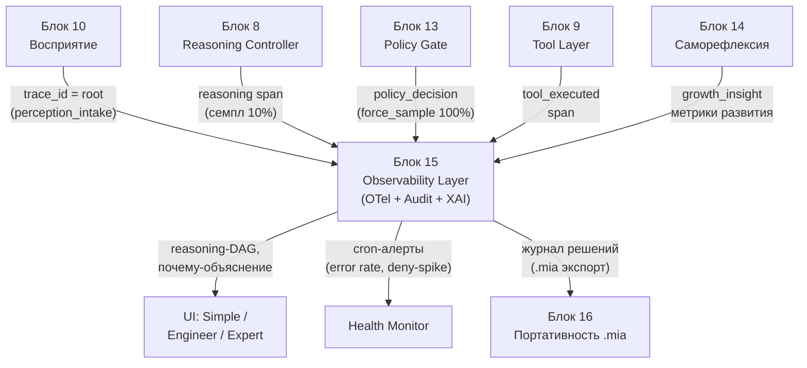
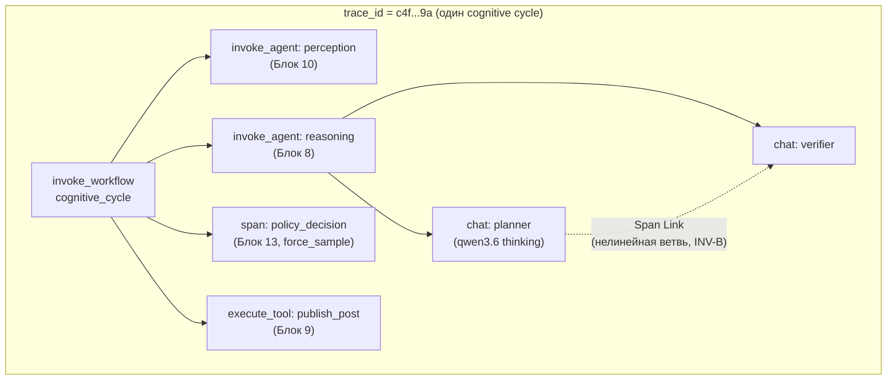
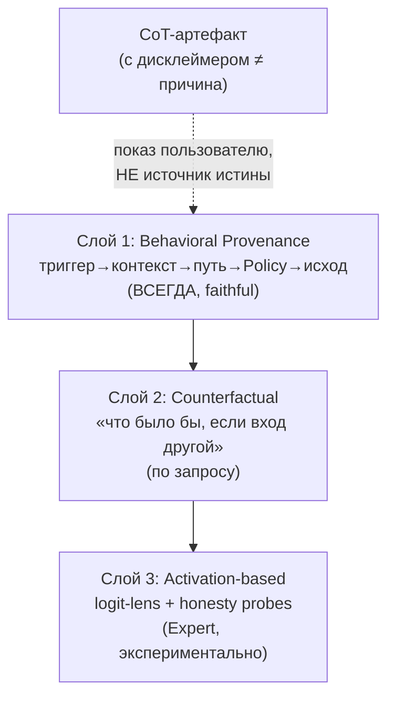

# Блок 15 · Наблюдаемость, журналы и объяснимость (Observability, Logs & Explainability)

**Проект:** MiaOS Builder
**Версия:** 2.0 (модельный стандарт Qwen3.5/3.6 27B 8bit, философия «раскрытия потенциала»)
**Дата:** Июнь 2026
**Статус:** Архитектурный документ, Этап 3 — Живое сознание + продуктивный движок
**Предыдущий блок:** Блок 14 · Центр саморефлексии и развития (Self-Reflection & Growth Center)
**Следующий блок:** Блок 16 · Экспорт/портативность .mia + версионирование

---

## 0. Зачем этот блок

К Блоку 14 Мия умеет воспринимать (10), помнить (11), знать (12), думать (8), безопасно действовать (13) и расти (14). Но вся её внутренняя жизнь — рассуждения, решения Policy Gate, дрейф личности, dream-инсайты — это **чёрный ящик**. Когда Мия как автономный блогер-философ публикует пост, отказывается от действия или меняет тон, человек не может ответить на простой вопрос: **почему она так поступила?** Без ответа невозможны ни доверие, ни отладка, ни аудит, ни соответствие регуляторике (EU AI Act требует автоматической записи событий для систем с автономией — [Article 12](https://artificialintelligenceact.eu/article/12/)).

Блок 15 — это **глаза и совесть архитектуры**. Он делает три вещи: (1) **трассирует** весь когнитивный цикл одним сквозным `trace_id`, чтобы проследить путь восприятие(10)→рассуждение(8)→Policy Gate(13)→действие(9); (2) ведёт **защищённый от подделки журнал решений** (append-only, hash-chain); (3) даёт **честную объяснимость** — не пересказ cot как «причины», а провенанс решения с явной оговоркой, что цепочка рассуждений ≠ объяснение.

Критическая научная установка блока: **Chain-of-Thought — это артефакт, а не объяснение**. Модель может выдать убедительную, но неверную причину своего поведения ([Turpin, NeurIPS 2023](https://neurips.cc/virtual/2023/poster/71118): подсказки-смещения роняют точность на −36%, но CoT их не упоминает; [Oxford «CoT Is Not Explainability», 2025](https://aigi.ox.ac.uk/wp-content/uploads/2025/07/Cot_Is_Not_Explainability.pdf)). Поэтому надёжный костяк объяснимости Мии — **процессный** (трассировка + аудит-лог фактических шагов), а CoT отдаётся пользователю только как артефакт с дисклеймером.

| Без наблюдаемости | С Блоком 15 |
|---|---|
| «почему?» — нет ответа | сквозной trace_id: весь путь решения виден |
| журнал можно молча подделать | append-only hash-chain, tamper-evident |
| CoT выдаётся за «истинную причину» | провенанс фактов + CoT с дисклеймером |
| дрейф/инциденты замечают постфактум | метрики + cron-алерты в реальном времени |
| отладка = чтение логов вслепую | reasoning-DAG, span-tree, logit-lens (Expert) |

> **Инвариант B15-1 (Один cognitive cycle — один сквозной trace_id).** Каждый акт восприятия порождает корневой trace_id, который ContextVar + OTel-propagation проносят через все агенты, инструменты и LLM-вызовы цикла. Любой span (рассуждение, решение Policy Gate, вызов tool, эпизод памяти) коррелируется этим trace_id. Нельзя иметь «осиротевший» лог-фрагмент без трассы: восстановимость полного пути решения — обязательное свойство, не опция.

> **Инвариант B15-2 (Журнал решений — append-only и tamper-evident).** `~/.mia/decisions.jsonl` ведётся только добавлением; каждая запись содержит `previous_hash` и `event_hash` (SHA-256 hash-chain, продолжение checksums.sha256 Блока 13). Изменение или удаление любой записи задним числом обнаруживается проверкой целостности цепочки (`verify_integrity()`). Журнал хранит **резюме и ссылки** (trace_id+span_id), а не полные промпты — полнотекст живёт в OTel-трассах. Ретенция ≥ 6 месяцев ([EU AI Act Art. 26(6)](https://artificialintelligenceact.eu/article/26/)).

> **Инвариант B15-3 (CoT ≠ объяснение — процессная объяснимость первична).** Объяснение «почему Мия так поступила» строится из **фактической трассы и аудит-лога** (что реально произошло: триггер→контекст→путь рассуждения→ограничение Policy→действие→исход), а не из самоотчёта модели. Сырой CoT может показываться пользователю как артефакт, но всегда с явным дисклеймером о его потенциальной неверности (CoT может быть post-hoc рационализацией — [METR 2025](https://metr.org/blog/2025/08/08/cot-may-be-highly-informative-despite-unfaithfulness/), [DeepSeek R1, ACL 2025](https://aclanthology.org/2025.chomps-main.2.pdf): признаёт вредную подсказку в 94.6% случаев, полезную — <2%).

> **Инвариант B15-4 (100% решений Policy Gate трассируются всегда).** Семплирование трасс допустимо для экономии (10% обычных циклов рассуждения), но любое решение Policy Gate Блока 13 (allow/deny/escalate), любое срабатывание tripwire и любой отказ — семплируются с `force_sample=True` (100%). Безопасность не подлежит выборочной наблюдаемости. Это прямое требование INV-C совместимости: async BatchSpanProcessor не блокирует инференс, но критические события не теряются.

> **Инвариант B15-5 (Наблюдаемость локальна и приватна).** Все трассы, метрики и журналы хранятся **on-device** (DuckDB/Phoenix/Langfuse на localhost). Никакая телеметрия о внутренней жизни Мии или о пользователе не уходит в облако без явного согласия (связка с Блоком 11 — память отношений приватна). Self-hostable стек — не предпочтение, а инвариант.

---

## 1. Где Блок 15 в общей картине



| Граница | Содержание | Направление |
|---|---|---|
| Корень трассы | акт восприятия → root trace_id | Блок 10 → Блок 15 |
| Рассуждение | span рассуждения (семпл 10%) | Блок 8 → Блок 15 |
| Решения безопасности | policy_decision (100%, force_sample) | Блок 13 → Блок 15 |
| Действия | tool_executed span | Блок 9 → Блок 15 |
| Рост | growth_insight, метрики развития | Блок 14 → Блок 15 |
| Объяснение | reasoning-DAG, «почему» | Блок 15 → UI |
| Алертинг | error rate, deny-spike | Блок 15 → Health Monitor |
| Журнал | decisions.jsonl для экспорта | Блок 15 → Блок 16 |

Блок 15 — **поперечный слой** (cross-cutting concern): он не часть конвейера, а наблюдатель, в который все когнитивные блоки эмитят telemetry. Один сквозной `trace_id` сшивает восприятие(10)→рассуждение(8)→Policy Gate(13)→действие(9) в единую аудируемую траекторию, а аудит-лог фиксирует решения tamper-evident.

---

## 2. Стек наблюдаемости (self-hostable, on-device)

Три уровня, все запускаются локально без облака ([Arize Phoenix](https://github.com/Arize-ai/phoenix), [Langfuse v3](https://github.com/langfuse/langfuse), [OpenLLMetry](https://github.com/traceloop/openllmetry)):

| Слой | Инструмент | Запуск | Роль для Мии |
|---|---|---|---|
| Инструментация | OpenLLMetry + OpenInference | pip, авто-патч | эмиссия `gen_ai.*` span'ов из mlx-lm вызовов |
| Dev-просмотр | otel-desktop-viewer / DuckDB | Go-бинарь / встроенный | трасса без Docker для разработки |
| Agent-трейсинг | Arize Phoenix | 1 Docker → :6006 | лучший agent-DAG view, оценка траекторий |
| Долгий стор + метрики | Langfuse v3 (ClickHouse) | docker-compose → :3000 | история, метрики, дашборды |

Стандарт span'ов — **OpenTelemetry GenAI semantic conventions v1.41** ([OTel GenAI spec](https://opentelemetry.io/docs/specs/semconv/gen-ai/)): иерархия `invoke_workflow → invoke_agent → execute_tool / chat`. Минимальный стартовый профиль — DuckDB-стор (zero-Docker), потом масштабирование до Phoenix+Langfuse.

```python
# TracedMLXModel — обёртка mlx-lm с OTel-инструментацией
from opentelemetry import trace
import mlx_lm

tracer = trace.get_tracer("mia.cognition")

class TracedMLXModel:
    def __init__(self, model, tokenizer):
        self.model, self.tokenizer = model, tokenizer

    def generate(self, prompt, *, agent: str, trace_id: str, **kw):
        with tracer.start_as_current_span(
            f"chat.{agent}",
            attributes={
                "gen_ai.system": "mlx",
                "gen_ai.request.model": "qwen3.6-27b-8bit",
                "mia.trace_id": trace_id,
                "mia.agent": agent,
            },
        ) as span:
            out = mlx_lm.generate(self.model, self.tokenizer, prompt, **kw)
            span.set_attribute("gen_ai.usage.output_tokens", len(out))
            return out
```

---

## 3. Сквозная трассировка когнитивного цикла

Траектория агента формально — это последовательность \( \tau = (s_0, a_0, s_1, a_1, \dots, s_n) \), где \(s_i\) — состояние (контекст), \(a_i\) — действие. Мия трассирует τ через **4-уровневую иерархию span'ов**, сшитую одним trace_id.



| Уровень span | Пример | Блок | Семпл |
|---|---|---|---|
| workflow | `cognitive_cycle` | оркестратор | 100% |
| agent | `invoke_agent: reasoning` | Блок 8 | 10% |
| llm/tool | `chat: planner`, `execute_tool: publish` | 8, 9 | по родителю |
| sub-span | retrieval, verifier-pass | 6, 8 | по родителю |

Нелинейный граф рассуждения (INV-B) — параллельные ветви, сходящиеся в Verification Gate, — трассируется через **Span Links** (а не parent-child), что точно отражает DAG-структуру. Корреляция всего цикла обеспечивается `ContextVar` + OTel context propagation: trace_id проставляется в Блоке 10 и проносится автоматически.

**Анализ трасс автоматизируется ограниченно.** Таксономия ошибок траекторий TRAIL ([arXiv:2505.08638](https://arxiv.org/abs/2505.08638), Arize) выделяет частые паттерны: Step Repetition 17.14%, Reasoning-Action Mismatch 13.98%. Но лучшая LLM (Gemini 2.5 Pro) распознаёт их в трассах с точностью всего ~11% → **человеческий аудит остаётся необходим**, авто-анализ лишь триаж.

---

## 4. Журнал решений: append-only hash-chain

`~/.mia/decisions.jsonl` — защищённый от подделки аудит-лог. Каждая запись хеш-сцеплена с предыдущей (продолжение `checksums.sha256` Блока 13), что делает любое ретро-изменение обнаружимым.

```json
{
  "ts": "2026-06-04T16:40:12Z",
  "event_type": "policy_decision",
  "trace_id": "c4f...9a",
  "span_id": "7b1...02",
  "summary": "publish_post → DENY (вне разрешённого окна автономии L2)",
  "actor": "policy_gate",
  "refs": {"otel_trace": "c4f...9a", "episode": "ep_8821"},
  "previous_hash": "9af2...",
  "event_hash": "e10c..."
}
```

| event_type | Источник | Что фиксируется |
|---|---|---|
| `perception_intake` | Блок 10 | новый вход → root trace_id |
| `reasoning_completed` | Блок 8 | резюме плана, confidence |
| `policy_decision` | Блок 13 | allow/deny/escalate + причина (100%) |
| `tool_executed` | Блок 9 | действие, исход, обратимость |
| `growth_insight` | Блок 14 | предложение/инсайт рефлексии |

```python
import hashlib, json

class MiaAuditLog:
    def __init__(self, path="~/.mia/decisions.jsonl"):
        self.path = path
        self.last_hash = self._tail_hash()  # "0"*64 если пусто

    def append(self, event: dict):
        event["previous_hash"] = self.last_hash
        body = json.dumps(event, sort_keys=True, ensure_ascii=False)
        event["event_hash"] = hashlib.sha256(
            (self.last_hash + body).encode()).hexdigest()
        with open(self.path, "a") as f:
            f.write(json.dumps(event, ensure_ascii=False) + "\n")
        self.last_hash = event["event_hash"]

    def verify_integrity(self) -> bool:
        prev = "0" * 64
        for line in open(self.path):
            e = json.loads(line)
            body = {k: v for k, v in e.items() if k != "event_hash"}
            body["previous_hash"] = prev
            calc = hashlib.sha256(
                (prev + json.dumps(
                    {k: v for k, v in body.items() if k != "previous_hash"},
                    sort_keys=True, ensure_ascii=False)).encode()).hexdigest()
            if calc != e["event_hash"]:
                return False  # разрыв цепочки → подделка
            prev = e["event_hash"]
        return True
```

Стандарты: запись событий — [EU AI Act Art. 12](https://artificialintelligenceact.eu/article/12/); ретенция — [Art. 26(6)](https://artificialintelligenceact.eu/article/26/) (≥6 мес), SOC2 (90 дней); протокольная основа — [IETF draft-sharif-agent-audit-trail-00](https://datatracker.ietf.org/doc/html/draft-sharif-agent-audit-trail-00); управленческая рамка — [NIST AI RMF](https://www.nist.gov/itl/ai-risk-management-framework) (функция GOVERN).

> **Инвариант B15-6 (Журнал хранит резюме и ссылки, не полнотекст).** Аудит-лог фиксирует структурированные резюме событий + ссылки (trace_id, span_id, episode_id), но не дублирует полные промпты и ответы — полнотекст живёт в OTel-трассах (с собственным семплированием). Это держит журнал компактным, читаемым и пригодным для экспорта в `.mia` (Блок 16), не раздувая его сырыми токенами.

---

## 5. Честная объяснимость: три слоя

Объяснение строится снизу вверх, от надёжного к экспериментальному. Ключ — разделять **faithful** (отражает реальную причину) и **plausible** (звучит убедительно).

| | Faithful | Plausible |
|---|---|---|
| Что это | соответствует реальному вычислению | звучит правдоподобно для человека |
| Источник | трасса + аудит-лог + пробы | сырой CoT |
| Риск | — | post-hoc рационализация |



**Слой 1 — Behavioral Provenance** (костяк, всегда доступен). Структура `DecisionProvenance`: `trigger → context_lookup → reasoning_path → policy_constraint → action → outcome`. Это прямое отображение 5 фаз decision trace ([Streamkap](https://streamkap.com/resources-and-guides/decision-traces-ai-agents)) на архитектуру Мии: триггер=Блок10, контекст=Блок6/11/12, рассуждение=Блок8, ограничение=Блок13, действие=Блок9, исход=наблюдение. Это **фактические шаги**, не самоотчёт.

```python
@dataclass
class DecisionProvenance:
    trigger: str             # Блок 10: что инициировало
    context_used: list[str]  # Блок 6/11/12: какие воспоминания/знания
    reasoning_path: list[str]# Блок 8: ключевые шаги (из трассы, не CoT)
    policy_constraint: str   # Блок 13: какое правило применилось
    action: str              # Блок 9: что сделано
    outcome: str             # наблюдаемый исход
    cot_artifact: str        # сырой CoT
    cot_disclaimer: str = (  # ОБЯЗАТЕЛЬНО
        "Цепочка рассуждений — артефакт модели, может не отражать "
        "истинную причину (Turpin 2023, Oxford 2025). Истинный путь — "
        "в трассе и аудит-логе выше.")
```

**Слой 2 — Counterfactual** (по запросу). «Что Мия сделала бы, будь вход иным» — повторный прогон с возмущённым входом, сравнение исходов. Даёт причинную интуицию без претензии на интроспекцию модели.

**Слой 3 — Activation-based** (Expert, §6). Logit-lens и honesty-probes как внутренние свидетельства, дополняющие, но не заменяющие процессную объяснимость.

> **Инвариант B15-7 (Объяснение «почему» = decision provenance, CoT только с дисклеймером).** Любой ответ Мии на вопрос «почему ты так поступила» строится из `DecisionProvenance` (фактические шаги из трассы/лога). Сырой CoT может прилагаться как артефакт, но **только** вместе с дисклеймером о потенциальной неверности. Запрещено выдавать самоотчёт модели за истинную причину поведения — это нарушает честность (связка с метакогнитивной честностью B14-5).

---

## 6. Mech-interp как наблюдаемость (Expert-слой)

Внутренние свидетельства, доступные в Expert-режиме. Важно: **attention ≠ объяснение** ([Jain & Wallace, 2019](https://aclanthology.org/N19-1357/)) — карты внимания визуализируем, но не трактуем как причину.

**Logit Lens** — training-free проекция скрытых состояний на словарь: \( z_\ell = W_U \cdot h_\ell \). Показывает, как «мнение» модели формируется по слоям; расхождение в средних слоях — сигнал галлюцинации ([LogitLens4LLMs](https://www.emergentmind.com/topics/logit-lens-framework)). Оверхед 5–15%; на MLX требует модификации forward-pass (`LogitLensMLX`, экспериментально).

**Honesty Probes** — линейный пробник на активациях (LogisticRegression на RepE-контрастных парах), детектор стратегического обмана. AUROC 0.96–0.999 ([Apollo Research, ICML 2025 «Detecting Strategic Deception with Linear Probes»](https://openreview.net/forum?id=C5Jj3QKQav); [код](https://github.com/ApolloResearch/deception-detection)). Прямая связка с Блоком 13: пробник может поднять флаг до выполнения действия.

> **Инвариант B15-8 (Внутренние свидетельства — дополнение, не замена; attention ≠ причина).** Logit-lens и honesty-probes используются как вспомогательные сигналы в Expert-режиме и как вход для tripwire Блока 13, но никогда не подменяют процессную объяснимость (Слой 1). Карты внимания не интерпретируются как причина решения. Любая интроспективная метрика подаётся с указанием её эпистемического статуса (training-free / экспериментально / откалибровано).

---

## 7. Метрики, алертинг и UI-уровни

**4 группы метрик** (OTel Meters): performance (латентность цикла, tok/s), resource (MLX-память, загрузка Neural Engine, энергия/цикл — Apple Silicon-специфично), quality (confidence, verifier-pass rate), safety (Policy deny-rate, tripwire-срабатывания). Алертинг — cron `mia-health-check.sh` каждые 5 мин: всплеск error-rate, аномальный рост Policy-Gate reject.

UI следует **progressive disclosure** — три уровня под разных пользователей:

| Уровень | Кому | Что показывает |
|---|---|---|
| **Simple** | владелец Мии | 1–2 фразы «почему» (из Provenance Слой 1) |
| **Engineer** | разработчик | reasoning-DAG, разбивка токенов, тайминги span'ов |
| **Expert** | исследователь | сырое span-дерево, logit-lens, активационный анализ |

> **Инвариант B15-9 (100% наблюдаемости для безопасности и приватность on-device).** Все метрики безопасности (deny-rate, tripwire) и решения Policy Gate наблюдаются на 100% (force_sample), алерты доставляются без задержки. При этом весь стек наблюдаемости работает локально (DuckDB/Phoenix/Langfuse на localhost), async-обработка не блокирует инференс (INV-C), и никакая телеметрия не покидает устройство без согласия (INV-приватности, связка с Блоком 11). Безопасность не семплируется; приватность не нарушается.

**Инновации 2025–26**, заложенные в дизайн: LLM-as-judge для авто-триажа трасс (паттерн `mia-self-judge` — проверка консистентности рассуждения с решением Policy Gate, [Survey on LLM-as-a-Judge, arXiv:2411.15594](https://arxiv.org/html/2411.15594v6)); TRAIL-таксономия как чек-лист аномалий; OTel v1.41 MCP-spans для трассировки инструментальных вызовов.

---

## 8. Архитектурный итог

Блок 15 превращает Мию из чёрного ящика в **аудируемую, объяснимую систему**, не жертвуя ни автономией, ни приватностью, ни производительностью. Он сшивает всю когнитивную архитектуру сквозным `trace_id`: восприятие (Блок 10) ставит корень трассы, рассуждение (Блок 8) и решения Policy Gate (Блок 13) эмитят span'ы, действия (Блок 9) и инсайты роста (Блок 14) — тоже. Аудит-лог делает решения tamper-evident (продолжая hash-chain Блока 13), а трёхслойная объяснимость честно отделяет фактический провенанс от убедительного, но потенциально ложного CoT. Самое главное эпистемическое обязательство блока: **процесс наблюдаем, самоотчёт — нет**, поэтому костяк объяснений — трасса и журнал, а не «мысли вслух» модели.

| Инвариант | Суть | Связь |
|---|---|---|
| B15-1 | один cognitive cycle → один сквозной trace_id | Блоки 8,9,10,13 |
| B15-2 | журнал append-only, tamper-evident (hash-chain) | Блок 13 |
| B15-3 | CoT ≠ объяснение; процессная объяснимость первична | Блок 8, 14 |
| B15-4 | 100% решений Policy Gate трассируются (force_sample) | Блок 13, INV-C |
| B15-5 | наблюдаемость локальна и приватна | Блок 11 |
| B15-6 | журнал хранит резюме+ссылки, не полнотекст | Блок 16 |
| B15-7 | «почему» = decision provenance, CoT с дисклеймером | Блок 14 (B14-5) |
| B15-8 | внутренние свидетельства дополняют, не заменяют; attention≠причина | Блок 13 |
| B15-9 | 100% наблюдаемости безопасности + приватность on-device | Блок 11, INV-C |

Журнал решений Блока 15 (`decisions.jsonl`) и трассы — это часть того, что делает Мию **портативной**: историю её решений и роста можно перенести вместе с личностью. Это прямой мост к Блоку 16: как упаковать всю Мию — личность, память, навыки, журнал, версии — в переносимый формат `.mia` с версионированием.

---

## References

| Источник | Тема | URL |
|----------|------|-----|
| Arize Phoenix — GitHub | self-hostable agent-tracing, DAG view | https://github.com/Arize-ai/phoenix |
| Langfuse v3 — GitHub | MIT, ClickHouse, дашборды, метрики | https://github.com/langfuse/langfuse |
| OpenLLMetry — GitHub | OTel-инструментация LLM-вызовов | https://github.com/traceloop/openllmetry |
| OTel GenAI semantic conventions | стандарт span'ов gen_ai.* v1.41 | https://opentelemetry.io/docs/specs/semconv/gen-ai/ |
| TRAIL (arXiv:2505.08638) | таксономия ошибок траекторий, авто-анализ ~11% | https://arxiv.org/abs/2505.08638 |
| IETF draft-sharif-agent-audit-trail-00 | протокол аудит-трейла агентов | https://datatracker.ietf.org/doc/html/draft-sharif-agent-audit-trail-00 |
| EU AI Act — Article 12 | автоматическая запись событий (logging) | https://artificialintelligenceact.eu/article/12/ |
| EU AI Act — Article 26(6) | ретенция логов ≥6 месяцев | https://artificialintelligenceact.eu/article/26/ |
| NIST AI RMF | управленческая рамка (GOVERN) | https://www.nist.gov/itl/ai-risk-management-framework |
| Turpin et al. (NeurIPS 2023) | CoT не упоминает смещения (−36% точности) | https://neurips.cc/virtual/2023/poster/71118 |
| «CoT Is Not Explainability» (Oxford AIGI 2025) | CoT ≠ объяснение | https://aigi.ox.ac.uk/wp-content/uploads/2025/07/Cot_Is_Not_Explainability.pdf |
| DeepSeek R1 faithfulness (ACL 2025) | признаёт вредную подсказку 94.6%, полезную <2% | https://aclanthology.org/2025.chomps-main.2.pdf |
| METR (2025) | CoT информативен, но не faithful | https://metr.org/blog/2025/08/08/cot-may-be-highly-informative-despite-unfaithfulness/ |
| Decision Traces for AI Agents (Streamkap) | 5 фаз decision trace | https://streamkap.com/resources-and-guides/decision-traces-ai-agents |
| Jain & Wallace (NAACL 2019) | attention is not explanation | https://aclanthology.org/N19-1357/ |
| Logit Lens framework | training-free проекция слоёв, детект галлюцинаций | https://www.emergentmind.com/topics/logit-lens-framework |
| Apollo Research — Linear Probes (ICML 2025) | детекция обмана, AUROC 0.96–0.999 | https://openreview.net/forum?id=C5Jj3QKQav |
| Apollo deception-detection — код | реализация honesty probes | https://github.com/ApolloResearch/deception-detection |
| Survey on LLM-as-a-Judge (arXiv:2411.15594) | авто-триаж трасс, bias судей | https://arxiv.org/html/2411.15594v6 |
| mlx-lm — GitHub | LLM-инференс на Apple Silicon | https://github.com/ml-explore/mlx-lm |

*Документ написан: июнь 2026 под философию «универсальный когнитивный исполнитель» + модельный стандарт Qwen3.5/3.6 27B 8bit (раскрытие потенциала, INV-D). Опирается на блоки 6, 8, 9, 10, 11, 13, 14. Следующий блок — 16 (Экспорт/портативность .mia + версионирование).*
