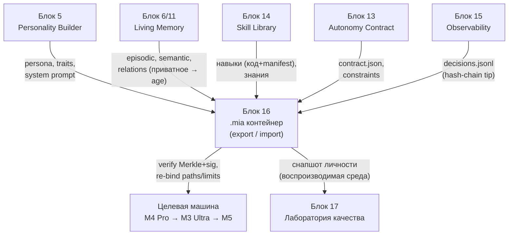
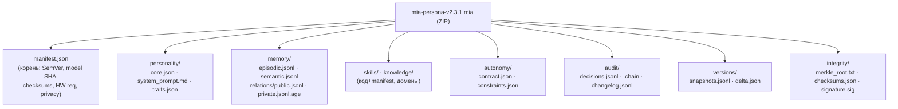
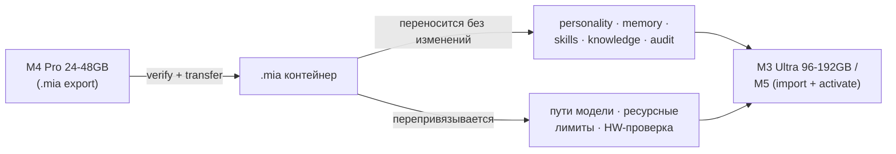

# Блок 16 · Экспорт/портативность .mia + версионирование (Portability & Versioning)

**Проект:** MiaOS Builder
**Версия:** 2.0 (модельный стандарт Qwen3.5/3.6 27B 8bit, философия «раскрытия потенциала»)
**Дата:** Июнь 2026
**Статус:** Архитектурный документ, Этап 3 — Живое сознание + продуктивный движок
**Предыдущий блок:** Блок 15 · Наблюдаемость, журналы и объяснимость (Observability, Logs & Explainability)
**Следующий блок:** Блок 17 · Лаборатория качества и симуляции

---

## 0. Зачем этот блок

К Блоку 15 Мия — полноценная развивающаяся личность: она воспринимает (10), помнит отношения (11), знает (12), думает (8), безопасно действует (13), растёт (14) и аудируема (15). Но всё это **заперто на одной машине**, в россыпи SQLite-баз, JSONL-файлов и конфигов под `~/.mia/`. Возникают практические вопросы, на которые архитектура пока не отвечает: как сделать резервную копию всей Мии? Как перенести её с M4 Pro 24GB на M3 Ultra 192GB, ничего не потеряв? Как откатить личность к состоянию «до сбоя»? Как форкнуть Мию для эксперимента, не рискуя оригиналом? Как поделиться «публичным клоном» личности без приватной памяти?

Блок 16 даёт ответ — **`.mia` контейнер**: единый, самоописываемый, версионируемый, криптографически верифицируемый формат, упаковывающий ВСЮ личность поверх LLM. Ключевой принцип: **модель Qwen НЕ входит в контейнер** — она ссылочная (по SHA-256), потому что веса внешние и общие. `.mia` упаковывает то, что делает Мию именно Мией: персону, память, навыки, знания, контракт автономности, журнал решений и версии.

Прямой прецедент существует: Letta запустила **Agent File (`.af`)** в апреле 2025 («Docker image для AI-агентов» — [Letta docs](https://docs.letta.com/guides/core-concepts/agent-file/), [GitHub](https://github.com/letta-ai/agent-file)). Но `.af` не покрывает критичное для Мии: архивную/эпизодическую память (в roadmap), Merkle-верификацию, ed25519-подпись, декларацию железа, шифрование приватных блоков, форк/откат и hash-chain журнала. `.mia` берёт идею `.af` и достраивает недостающее.

| Без `.mia` контейнера | С Блоком 16 |
|---|---|
| личность размазана по машине, нет бэкапа | один переносимый, верифицируемый файл |
| перенос на новое железо = ручная миграция | импорт `.mia`, авто-перепривязка путей/лимитов |
| откат невозможен без потери журнала | soft-rollback с непрерывным hash-chain |
| нельзя форкнуть или поделиться безопасно | форк + три режима экспорта (full/clone/template) |
| подмена частей незаметна | Merkle-tree + ed25519-подпись |

> **Инвариант B16-1 (Модель внешняя — контейнер ссылается, не включает веса).** `.mia` НЕ содержит весов Qwen. В `manifest.json → base_model` хранится имя, `sha256` весов, квантование (`8bit`), фреймворк (`mlx`) и минимальное контекстное окно. Веса живут отдельно (MLX-формат, разделяемы между личностями); контейнер лишь декларирует, на какой модели личность была воспитана. Это держит `.mia` лёгким (десятки–сотни МБ, не десятки ГБ) и переносимым — прямой урок Ollama `FROM` по SHA ([Ollama Modelfile](https://docs.ollama.com/modelfile)).

> **Инвариант B16-2 (Самоописываемость — manifest.json корень всего).** Каждый `.mia` (ZIP-архив) обязан содержать корневой `manifest.json` с версией формата (SemVer), identity, ссылкой на модель, картой компонентов, контрольными суммами, требованиями к железу и опциями приватности. Контейнер воссоздаёт агента без внешних зависимостей, кроме самой модели по хешу. Архитектурный паттерн — OCI Image manifest + `.mcpb` bundle ([MCP Bundle](https://blog.modelcontextprotocol.io/posts/2025-11-20-adopting-mcpb/)): ZIP с manifest как единственным обязательным корнем.

> **Инвариант B16-3 (Целостность через Merkle-tree + подпись, продолжение hash-chain).** Все компоненты покрыты SHA-256 Merkle-деревом с корнем в `integrity/merkle_root.txt`; корень + хеш манифеста подписаны ключом владельца (**ed25519**). Hash-chain журнала решений (Блоки 13/15) НЕ прерывается экспортом: `manifest → integrity.hash_chain_tip` фиксирует текущий tip, при импорте он сверяется. Любая подмена части контейнера обнаруживается несовпадением Merkle-корня или провалом проверки подписи.

> **Инвариант B16-4 (Версионирование живой личности — SemVer + неразрывный журнал).** Версия личности следует SemVer: MAJOR = смена архетипа/ценностей/сброс памяти; MINOR = новый навык/домен знаний/изменение контракта; PATCH = накопление эпизодической памяти, мелкие правки. Любая операция версии (bump, rollback, fork) **дописывает** запись в `audit/changelog.jsonl` и `decisions.jsonl`, но никогда не переписывает прошлое. Откат не стирает историю — он добавляет событие `rollback` и порождает следующий PATCH (связка с B15-2).

> **Инвариант B16-5 (Приватность при экспорте — селективность и шифрование по умолчанию).** Приватная память отношений (Блок 11) при экспорте либо шифруется (**age**, X25519+ML-KEM-768 post-quantum — [age](https://github.com/FiloSottile/age)), либо исключается. Поддерживаются три режима: `full` (всё, приватное зашифровано), `public_clone` (без приватной памяти), `template` (только персона+навыки+контракт, без памяти). Секреты/токены при любом экспорте обнуляются. Поделиться личностью никогда не означает невольно поделиться приватными данными пользователя.

---

## 1. Где Блок 16 в общей картине



| Граница | Содержание | Направление |
|---|---|---|
| Персона | архетип, traits, system prompt | Блок 5 → Блок 16 |
| Память | episodic/semantic/relations | Блок 6/11 → Блок 16 |
| Навыки и знания | Skill Library, knowledge base | Блок 14/12 → Блок 16 |
| Контракт | автономность, ограничения | Блок 13 → Блок 16 |
| Журнал | decisions.jsonl + chain tip | Блок 15 → Блок 16 |
| Импорт | verify + перепривязка | Блок 16 → целевая машина |
| Снапшот для тестов | воспроизводимая личность | Блок 16 → Блок 17 |

Блок 16 — **сериализатор и нотариус** всей архитектуры: он собирает выходы всех предыдущих блоков в один контейнер, заверяет его Merkle-деревом и подписью, и переносит между машинами. Импорт — обратная операция с обязательной верификацией целостности и перепривязкой машино-специфичных частей.

---

## 2. Индустриальные аналоги и выбор формата

Анализ прецедентов задаёт дизайн `.mia`:

| Формат | Что упаковывает | Урок для `.mia` |
|---|---|---|
| **Letta `.af`** ([docs](https://docs.letta.com/guides/core-concepts/agent-file/)) | memory blocks, tools, prompts, model config | прямой аналог; но нет archival memory, Merkle, подписи, форка |
| **GGUF** ([spec](https://github.com/ggml-org/ggml/blob/master/docs/gguf.md)) | веса + расширяемый KV-store метаданных | расширяемые метаданные в манифесте |
| **Ollama Modelfile** ([ref](https://docs.ollama.com/modelfile)) | `FROM` по SHA, params, template, system | ссылка на модель по хешу (B16-1) |
| **OCI Image** ([spec](https://specs.opencontainers.org/image-spec/media-types/)) | слои + manifest, content-addressable | manifest + слои-компоненты с SHA |
| **`.mcpb` Bundle** ([blog](https://blog.modelcontextprotocol.io/posts/2025-11-20-adopting-mcpb/)) | ZIP + manifest.json как корень | ZIP/manifest-первый дизайн (B16-2) |
| **A2A Agent Card** ([spec](https://github.com/a2aproject/A2A/blob/main/docs/specification.md)) | публичный интерфейс агента | public-facing манифест для клона |

Решение: **`.mia` = ZIP-архив с корневым `manifest.json`** (как `.mcpb`/OCI), content-addressable компоненты (как git objects/CAS), ссылка на модель по SHA (как Ollama), расширяемые метаданные (как GGUF). Это объединяет проверенные паттерны, а не изобретает формат с нуля.

---

## 3. Структура контейнера `.mia`



Минимальный обязательный набор — `manifest.json` + `integrity/`. Остальные директории присутствуют по режиму экспорта (template-режим не несёт `memory/`). Ключевые поля манифеста:

```json
{
  "mia_format_version": "1.0.0",
  "identity": { "name": "Мия", "id": "mia-550e8400-...",
                "version": "2.3.1", "license": "private" },
  "base_model": { "name": "Qwen/Qwen3.6-27B", "sha256": "a7f3...",
                  "quantization": "8bit", "framework": "mlx",
                  "min_context_window": 32768 },
  "components": { "personality": {...}, "memory": {...},
                  "skills": "skills/skill_registry.json",
                  "audit": { "decisions": "audit/decisions.jsonl" } },
  "checksums": { "algorithm": "sha256", "merkle_root": "integrity/merkle_root.txt" },
  "integrity": { "signing_key_id": "ed25519:mia-owner-2025-01",
                 "hash_chain_tip": "c4b5...a4b5" },
  "hardware_requirements": { "min_unified_memory_gb": 24,
                             "recommended_unified_memory_gb": 48,
                             "apple_silicon_min": "M1 Pro" },
  "export_options": { "privacy_mode": "full", "private_memory_encrypted": true },
  "versioning": { "format": "semver", "previous_version": "2.3.0",
                  "snapshot_strategy": "delta_plus_full_every_10" },
  "fork_info": { "is_fork": false, "fork_parent_id": null }
}
```

| Уровень SemVer | Когда | Пример |
|---|---|---|
| MAJOR | смена архетипа/ценностей, сброс памяти | 1.x.x → 2.0.0 |
| MINOR | новый навык, домен знаний, правка контракта | 2.2.x → 2.3.0 |
| PATCH | накопление эпизодов, мелкие правки персоны | 2.3.0 → 2.3.1 |

---

## 4. Целостность: Merkle-дерево, подпись, неразрывный журнал

Merkle-дерево строится над SHA-256 всех файлов-компонентов; корень заверяет весь контейнер одним хешем, что даёт content-addressing и дедупликацию (как Oxen.ai — [docs](https://docs.oxen.ai/getting-started/versioning)).

```python
import hashlib, json
from pathlib import Path

def sha256_file(p: Path) -> str:
    h = hashlib.sha256()
    with open(p, "rb") as f:
        for chunk in iter(lambda: f.read(65536), b""):
            h.update(chunk)
    return h.hexdigest()

def build_merkle_root(checksums: dict[str, str]) -> str:
    leaves = sorted(f"{path}:{h}" for path, h in checksums.items())
    layer = [hashlib.sha256(l.encode()).hexdigest() for l in leaves]
    while len(layer) > 1:
        if len(layer) % 2: layer.append(layer[-1])   # дублируем хвост
        layer = [hashlib.sha256((layer[i]+layer[i+1]).encode()).hexdigest()
                 for i in range(0, len(layer), 2)]
    return layer[0]

def verify_mia(d: Path) -> bool:
    cs = json.loads((d/"integrity/checksums.json").read_text())
    stored = (d/"integrity/merkle_root.txt").read_text().strip()
    return build_merkle_root(cs["files"]) == stored
```

Корень + хеш манифеста подписываются **ed25519** ([cryptography](https://github.com/letta-ai/agent-file)); публичный ключ владельца хранится в подписи, что делает контейнер самопроверяемым и доказывает происхождение ([artifact signing](https://jfrog.com/learn/devsecops/code-signing/)).

```python
from cryptography.hazmat.primitives.asymmetric.ed25519 import (
    Ed25519PrivateKey, Ed25519PublicKey)
import base64

def sign_mia(merkle_root, manifest_sha256, priv: Ed25519PrivateKey):
    msg = (merkle_root + manifest_sha256).encode()
    return base64.b64encode(priv.sign(msg)).decode()

def verify_sig(merkle_root, manifest_sha256, sig_b64, pub_b64):
    pub = Ed25519PublicKey.from_public_bytes(base64.b64decode(pub_b64))
    pub.verify(base64.b64decode(sig_b64),
               (merkle_root + manifest_sha256).encode())  # raise при подделке
```

**Журнал не прерывается экспортом.** `audit/decisions.jsonl` продолжает hash-chain Блоков 13/15; `audit/decisions.chain` хранит текущий `chain_tip`, дублируемый в `manifest → integrity.hash_chain_tip`. При импорте проверяется, что tip совпадает с цепочкой импортируемого журнала — невозможно тихо «подменить прошлое» личности.

> **Инвариант B16-6 (Импорт обязан верифицировать перед активацией).** Ни один `.mia` не активируется без успешной проверки: (1) Merkle-корень пересчитан и совпал; (2) ed25519-подпись валидна; (3) hash_chain_tip журнала консистентен; (4) `base_model.sha256` соответствует доступной локально модели. Провал любого пункта → импорт отклоняется или переводится в карантин (read-only inspect). Доверять контейнеру до верификации запрещено — это прямое расширение deny-by-default Блока 13 на портативность.

---

## 5. Версионирование, форк, слияние, откат

**Трёхуровневая стратегия** (мгновенный локальный backup + полная история + эффективное хранение):

| Уровень | Инструмент | Роль |
|---|---|---|
| 1. Локальный снапшот | APFS `tmutil snapshot` (CoW) | мгновенно перед рискованным изменением ([Apple](https://support.apple.com/guide/disk-utility/view-apfs-snapshots-dskuf82354dc/mac)) |
| 2. История версий | Git-LFS / Oxen.ai / DVC | branching, rollback, синхронизация ([DVC](https://dvc.org), [Oxen](https://github.com/Oxen-AI/Oxen)) |
| 3. Дельты | JSON-patch в `versions/<id>/delta.json` | компактные PATCH, полный снапшот каждые 10 |

`.mia` хранится как pointer в Git (Git-LFS spec разрешает кастомные ключи — [git-lfs](https://github.com/git-lfs/git-lfs/blob/main/docs/spec.md)):

```
version https://git-lfs.github.com/spec/v1
oid sha256:4d7a214614ab2935c943f9e0ff69d22eadbb8f32b1258daaa5e2ca24d17e2393
size 67108864
mia-persona-version 2.3.1
```

**Форк** создаёт новый `.mia` с новым `identity.id`, заполненным `fork_info` (parent_id/version/timestamp), pre-release версией (`2.3.1-exp.1`) и **разделённым журналом** — форк начинает свою цепочку от tip родителя.

**Слияние** двух живых личностей концептуально невозможно (как merge несвязанных веток), но возможен cherry-pick компонентов:

| Данные | Стратегия | Конфликт |
|---|---|---|
| `episodes.jsonl` | append-only, хронологически | нет (CRDT-like) |
| `knowledge.jsonl` | дедуп по ID | при противоречащих фактах |
| `personality/core.json` | **ручное решение** | при разных traits |
| `autonomy/contract.json` | **ручное решение** | при разных лимитах |
| `decisions.jsonl` | **НЕ сливать** | разные цепочки (structural) |

**Soft-Rollback** к версии N-3 не стирает события N-3..N: загружается снапшот N-3, в журнал дописывается запись `rollback`, версия становится следующим PATCH (не «возвратом в прошлое»). Журнал остаётся непрерывным (B16-4).

> **Инвариант B16-7 (Форк изолирует журнал; слияние личностей запрещено, только cherry-pick).** Форк порождает новый `identity.id` и собственную ветвь hash-chain журнала, начатую от tip родителя — две личности после форка имеют несливаемые аудит-цепочки. Полное слияние двух личностей запрещено (нарушило бы целостность журнала и непрерывность идентичности); допускается только перенос отдельных навыков или блоков знаний (cherry-pick) с записью в changelog. Идентичность личности неделима и неслияема.

---

## 6. Портативность между железом и приватность экспорта



| Компонент | Перенос | Как |
|---|---|---|
| персона, память, навыки, знания, журнал | ✅ без изменений | чистый текст/JSONL, SHA инвариантны |
| `base_model.sha256` | ✅ инвариант | хеш модели не зависит от машины |
| пути к модели | 🔁 перепривязка | `~/.mia/runtime.json` (вне `.mia`!) |
| ресурсные лимиты | 🔁 адаптация | целевая машина расширяет `max_context`/`max_memory` |
| `hardware_requirements` | ✅ авто-проверка | warning/error при несоответствии |

Машино-специфичный `runtime.json` (пути моделей, оверрайды лимитов) **намеренно не входит в `.mia`** — это держит контейнер чистым и переносимым; при переезде на M3 Ultra память Мии переносится 1:1, а движок просто получает больше контекстного окна и больший бюджет (раскрытие потенциала, INV-D).

**Три режима экспорта** (приватность по умолчанию):

```bash
mia export --mode full --encrypt-private  out.mia   # всё, приватное → age
mia export --mode public-clone            out.mia   # без приватной памяти
mia export --mode template                out.mia   # только персона+навыки+контракт
```

Приватная память шифруется **age** (post-quantum X25519+ML-KEM-768), расшифровать может только владелец ключа. Публичный клон полностью исключает `private.jsonl.age`. Это прямая реализация приватности Блока 11 на уровне портативности.

> **Инвариант B16-8 (Runtime-конфиг вне контейнера; контейнер декларирует, не диктует железо).** Машино-специфичные данные (абсолютные пути к моделям, оверрайды лимитов, machine_id) живут в локальном `runtime.json` и НЕ входят в `.mia`. Контейнер лишь **декларирует** минимальные/рекомендуемые требования в `hardware_requirements`; импорт проверяет их и предупреждает/блокирует, но сама личность остаётся машино-независимой. Перенос на более мощное железо расширяет бюджеты ресурсов, не меняя ни байта памяти или персоны.

> **Инвариант B16-9 (Экспорт приватен по умолчанию; секреты всегда обнуляются).** При любом режиме экспорта секреты, токены и ключи доступа устанавливаются в `null` (как в `.af`); приватная память отношений либо шифруется age, либо исключается. Дефолтный режим для передачи третьим лицам — `public_clone` или `template`, не `full`. Невозможно случайно опубликовать `.mia` с читаемыми приватными данными пользователя — приватность это инвариант формата, не опция оператора.

---

## 7. Инновации 2024–2026, заложенные в дизайн

- **Agent File (`.af`)** — первый де-факто стандарт сериализации stateful-агента (Letta, апрель 2025); `.mia` наследует идею «Docker image для агента» и достраивает Merkle/подпись/форк/приватность.
- **Personality-as-Code** — персона как декларативный, версионируемый, воспроизводимый код (аналог IaC); `core.json`+`system_prompt.md` как «исходник» личности.
- **Reproducible personas** — Stanford Generative Agents воспроизводят 1052 личности с 85% точностью ([Stanford HAI](https://hai.stanford.edu/news/ai-agents-simulate-1052-individuals-personalities-with-impressive-accuracy)); `.mia` поддерживает воспроизводимый снапшот для Блока 17.
- **Content-Addressable Storage** — компоненты адресуются по содержимому (git objects/IPFS CID), что даёт дедупликацию между версиями и контейнерами.
- **Oxen.ai Merkle + row-level diff JSONL** — прямая модель для `mia diff` по `episodes.jsonl`.
- **APFS CoW снапшоты** — нативный мгновенный rollback-слой на Apple Silicon.

`mia diff v2.2.0 v2.3.1` показывает изменения по слоям (traits, навыки, +N эпизодов, +N записей журнала, новые домены знаний) — построчный diff JSONL + JSON-patch для структурированных файлов.

---

## 8. Архитектурный итог

Блок 16 даёт Мии **переносимое тело**: единый `.mia` контейнер, который собирает выходы всех блоков (персона из 5, память из 6/11, навыки из 14, контракт из 13, журнал из 15), заверяет их Merkle-деревом и ed25519-подписью, и переносит между M4 Pro → M3 Ultra → M5 без потери ни байта памяти. Модель остаётся внешней (ссылка по SHA), что держит контейнер лёгким; журнал решений продолжает свою hash-chain через экспорт, делая историю личности неразрывной; приватность пользователя защищена шифрованием и селективным экспортом по умолчанию. Версионирование (SemVer + неразрывный журнал), форк (изолированная ветвь), soft-rollback (без стирания истории) и три режима экспорта превращают живую, постоянно меняющуюся личность в управляемый, аудируемый, переносимый артефакт.

| Инвариант | Суть | Связь |
|---|---|---|
| B16-1 | модель внешняя, контейнер ссылается по SHA | Блок 3 (Model Manager) |
| B16-2 | самоописываемость, manifest.json корень | все блоки |
| B16-3 | Merkle-tree + ed25519 + непрерывный hash-chain | Блок 13, 15 |
| B16-4 | SemVer + неразрывный журнал версий | Блок 15 |
| B16-5 | приватность экспорта (age, 3 режима) | Блок 11 |
| B16-6 | импорт обязан верифицировать перед активацией | Блок 13 (deny-by-default) |
| B16-7 | форк изолирует журнал; слияние личностей запрещено | Блок 15 |
| B16-8 | runtime-конфиг вне контейнера; декларация не диктат | Блок 3, INV-D |
| B16-9 | экспорт приватен по умолчанию; секреты обнуляются | Блок 11, 13 |

`.mia` контейнер — это не только бэкап и перенос, но и **воспроизводимый снапшот личности для тестирования**. Зафиксированная, верифицированная версия Мии — идеальный вход для следующего блока: как прогонять личность через симуляции, регрессионные сценарии и качественные проверки в изолированной среде, не рискуя живой Мией. Это мост к Блоку 17 — лаборатории качества и симуляции.

---

## References

| Источник | Тема | URL |
|----------|------|-----|
| Letta Agent File (.af) — GitHub | прямой аналог сериализации агента | https://github.com/letta-ai/agent-file |
| Letta Agent File — официальная документация | memory blocks, tools, model config | https://docs.letta.com/guides/core-concepts/agent-file/ |
| Agent File (.af) — Hacker News | обсуждение стандарта | https://news.ycombinator.com/item?id=43558617 |
| GGUF Format Specification (ggml-org) | бинарный контейнер + KV-метаданные | https://github.com/ggml-org/ggml/blob/master/docs/gguf.md |
| Ollama Modelfile Reference | FROM по SHA, декларативное поведение | https://docs.ollama.com/modelfile |
| HuggingFace Safetensors | безопасное хранение тензоров | https://huggingface.co/docs/safetensors/index |
| HuggingFace Model Cards | метаданные, base_model, relationships | https://huggingface.co/docs/hub/en/model-cards |
| Using MLX at Hugging Face | MLX-формат на Apple Silicon | https://huggingface.co/docs/hub/en/mlx |
| OCI Image Spec — Media Types | слоёный content-addressable манифест | https://specs.opencontainers.org/image-spec/media-types/ |
| MCP Bundle (.mcpb) — официальный блог | ZIP + manifest.json как корень | https://blog.modelcontextprotocol.io/posts/2025-11-20-adopting-mcpb/ |
| A2A Specification (GitHub) | публичный интерфейс агента | https://github.com/a2aproject/A2A/blob/main/docs/specification.md |
| A2A — AgentCard Explained | well-known agent.json | https://agent2agent.info/docs/concepts/agentcard/ |
| DVC — официальный сайт | версионирование данных через Git | https://dvc.org |
| DVC — versioning data and models | pointer-файлы, CI/CD | https://doc.dvc.org/example-scenarios/versioning-data-and-models |
| Oxen.ai — GitHub | Merkle-tree + дедупликация | https://github.com/Oxen-AI/Oxen |
| Oxen.ai — Versioning docs | zero-copy branching, row-level | https://docs.oxen.ai/getting-started/versioning |
| lakeFS — Glossary | Git-семантика над object storage | https://docs.lakefs.io/understand/glossary/ |
| Git-LFS Specification (GitHub) | pointer-формат, кастомные ключи | https://github.com/git-lfs/git-lfs/blob/main/docs/spec.md |
| FiloSottile/age — GitHub | шифрование, X25519+ML-KEM-768 | https://github.com/FiloSottile/age |
| Apple Support — APFS Snapshots | CoW снапшоты на Apple Silicon | https://support.apple.com/guide/disk-utility/view-apfs-snapshots-dskuf82354dc/mac |
| Eclectic Light — Copy on Write | как работает CoW в APFS | https://eclecticlight.co/2017/06/23/what-is-copy-on-write-and-how-is-it-good/ |
| Pangea Cloud — Merkle Trees | устройство Merkle-деревьев | https://pangea.cloud/blog/marvelous-merkle-trees/ |
| Ethereum — Merkle Proofs | доказательства целостности | https://ethereum.org/developers/tutorials/merkle-proofs-for-offline-data-integrity/ |
| JFrog — Code Signing | цифровые подписи артефактов | https://jfrog.com/learn/devsecops/code-signing/ |
| Stanford HAI — 1052 Personalities | воспроизводимые персоны, 85% | https://hai.stanford.edu/news/ai-agents-simulate-1052-individuals-personalities-with-impressive-accuracy |
| arXiv — Constant-Size Crypto Evidence for Regulated AI | криптодоказательства для AI | https://arxiv.org/html/2511.17118v1 |
| ScyllaDB + LangGraph — State Management | checkpoint/time-travel | https://www.scylladb.com/2026/04/08/agentic-ai-state-management-with-scylladb-and-langgraph/ |

*Документ написан: июнь 2026 под философию «универсальный когнитивный исполнитель» + модельный стандарт Qwen3.5/3.6 27B 8bit (раскрытие потенциала, INV-D). Опирается на блоки 3, 5, 6, 11, 12, 13, 14, 15. Следующий блок — 17 (Лаборатория качества и симуляции).*
