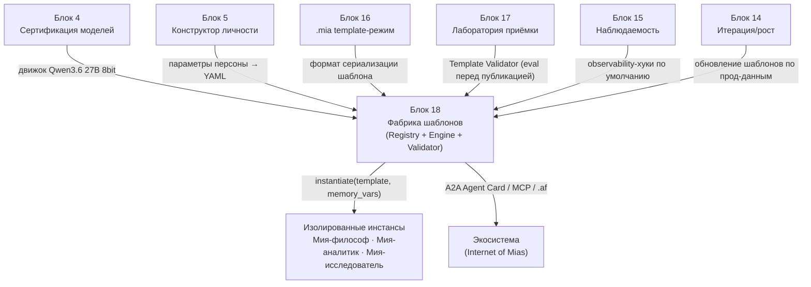
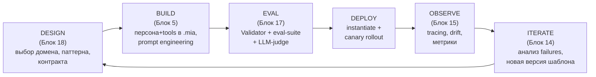
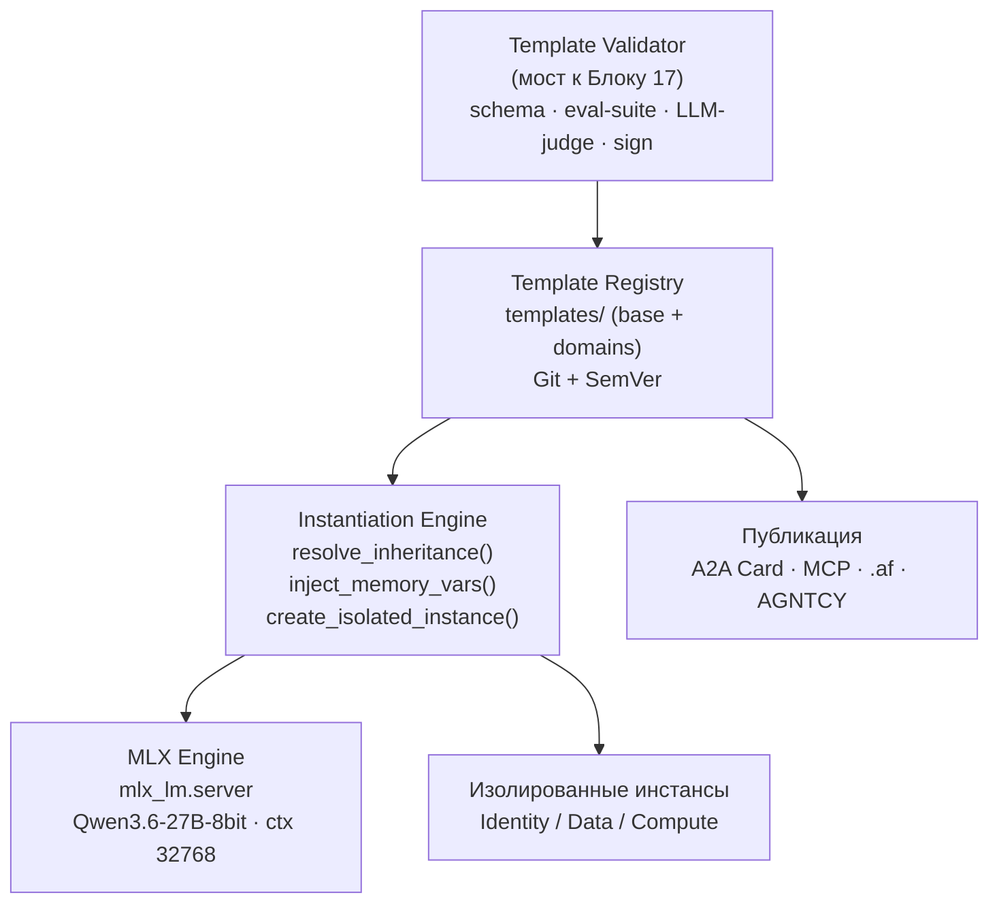

# Блок 18 · Шаблоны систем и профессия MAS-инженера (System Templates & the MAS-Engineer Profession)

**Проект:** MiaOS Builder
**Версия:** 2.0 (модельный стандарт Qwen3.5/3.6 27B 8bit, философия «раскрытия потенциала»)
**Дата:** Июнь 2026
**Статус:** Архитектурный документ, Этап 3 — Живое сознание + продуктивный движок · **Финальный блок (18 из 18)**
**Предыдущий блок:** Блок 17 · Лаборатория качества и симуляции (Quality Lab & Simulation)
**Следующий блок:** — (завершение архитектуры MiaOS Builder)

---

## 0. Зачем этот блок

Блоки 1–17 построили **одну** живую Мию: личность (5), думающую (8), действующую через инструменты (9), воспринимающую (10), помнящую отношения и знания (11, 12), безопасную (13), растущую (14), аудируемую (15), переносимую как `.mia` (16) и проверяемую лабораторией приёмки (17). Но это — **единственный экземпляр**, выращенный вручную. Исходное видение проекта — Мия как универсальный когнитивный исполнитель, заменяющий целые отделы; автономный блогер-философ — лишь **один** из доменов. Чтобы видение реализовалось, нужен последний переход: от **ремесленного создания одной Мии** к **инженерной фабрике**, которая порождает множество специализированных Мий под любой домен бизнеса — воспроизводимо, версионируемо, с приёмкой.

Блок 18 даёт два ответа. Первый — **шаблоны систем (System Templates)**: `.mia`-контейнер в **template-режиме** (Блок 16: только персона + навыки + контракт, без эпизодической памяти конкретного пользователя) становится параметризуемым «классом», из которого `instantiate(template_id, memory_vars)` порождает живой «объект»-инстанс. Это **Personality-as-Code**: архетип, домен, голос, набор навыков и контракт автономности — в YAML под контролем версий, наследуемые от базового шаблона. Второй ответ — оформление **профессии MAS-инженера**: новой инженерной дисциплины (отличной от ML-инженера, MLOps и prompt-инженера), которая проектирует, тестирует и сопровождает такие системы, со своим жизненным циклом (Agent SDLC / AgentOps), инструментарием и стандартами интероперабельности.

Прецеденты уже работают: **Letta Agent Templates** («templates define a common starting point... but they are not agents themselves» + memory variables + «Convert to Template» — [Letta docs](https://docs.letta.com/guides/templates/overview/)); **CrewAI** scaffolding (`crewai create crew` + YAML с placeholders); **LangGraph 0.3** prebuilt-реестр ([LangChain blog](https://www.langchain.com/blog/langgraph-0-3-release-prebuilt-agents)); стандарты **MCP** (агент↔инструмент — [Anthropic](https://www.anthropic.com/news/model-context-protocol)) и **A2A** (агент↔агент, Linux Foundation — [LF](https://www.linuxfoundation.org/press/linux-foundation-launches-the-agent2agent-protocol-project)).

| Без Блока 18 (одна ручная Мия) | С Блоком 18 (фабрика) |
|---|---|
| каждая новая Мия собирается вручную с нуля | `instantiate(template, memory_vars)` за секунды |
| личность = уникальный экземпляр, не воспроизводим | личность = параметризуемый архетип под версией |
| один домен (блогер) ⇒ переписывать всё под аналитика | base + domain overlay: новый домен без правки ядра |
| нет дисциплины сопровождения | Agent SDLC + AgentOps + EDD, профессия MAS-инженера |
| Мия заперта в MiaOS | A2A Agent Card + MCP + `.af` — интероперабельность |
| улучшения вносит только человек | self-improving factory (ADAS/DGM) в рамках propose-not-sanction |

> **Инвариант B18-1 (Шаблон ≠ агент — Personality-as-Code).** Шаблон (`mia-template`) — это **параметризованная декларативная спецификация** (персона + навыки + контракт), а не живой агент. Он содержит ТОЛЬКО переносимую часть (template-режим Блока 16): идентичность, голос, набор навыков, контракт автономности, runtime-конфиг, eval-suite. Он НЕ содержит эпизодической памяти, истории диалогов, персональных данных инстанса. Живой агент возникает лишь при инстанцировании: `template + memory_variables → instance`. Обратная операция «Convert to Template» стирает накопленную память, оставляя архетип (прецедент Letta).

> **Инвариант B18-2 (Фабрика — результат блоков 4/5/16/17, не отдельная сущность).** Блок 18 не вводит новый рантайм личности — он **собирает** уже построенное: Блок 4 даёт сертифицированный движок (Qwen3.6 27B 8bit), Блок 5 — параметры персоны, Блок 16 — формат сериализации (template-режим = основа спецификации шаблона), Блок 17 — Template Validator (шаблон проходит приёмку перед публикацией в реестр), Блок 15 — observability-хуки в каждом инстансе по умолчанию, Блок 14 — механизм обновления шаблонов по прод-наблюдениям. Фабрика = Template Registry + Instantiation Engine + Validator поверх этих блоков.

> **Инвариант B18-3 (Наследование шаблонов — base + domain overlay).** Шаблоны организованы иерархически: единый `mia-universal` (базовый архетип универсального когнитивного исполнителя) + доменные overlay (`philosopher-blogger`, `analyst`, `researcher`, `coder`, ...), переопределяющие ТОЛЬКО domain-специфичные поля (роль, цели, инструменты, контракт). Новый домен бизнеса добавляется как новый overlay **без изменения ядра** (INV-A: универсальный исполнитель, роли — проявление механизма). `_resolve_inheritance()` сливает base ← overlay (overlay переопределяет base).

> **Инвариант B18-4 (Изоляция инстансов при общем пуле моделей).** Несколько Мий на одном Apple Silicon-хосте изолированы по трём уровням: **Identity** (UUID инстанса + подписанный контракт), **Data** (отдельная SQLite/Qdrant на инстанс), **Compute** (отдельные MLX request-очереди и контекстные окна). При этом **модель загружена один раз** — единый `mlx_lm.server` обслуживает все инстансы через OpenAI-совместимый API (экономия памяти при полной изоляции данных). На M3 Max 64GB: Qwen 27B 8bit ≈28GB + остаток на контексты активных инстансов.

> **Инвариант B18-5 (Версионирование шаблонов — SemVer + правило обновления инстансов).** Шаблоны версионируются по SemVer: MAJOR = несовместимое изменение контракта/персоны; MINOR = новые навыки/инструменты (обратно совместимо); PATCH = правка промптов/eval-suite без изменения поведения. PATCH/MINOR-обновления могут программно прокатываться на все инстансы шаблона; **MAJOR требует ручного подтверждения** (propose-sanction, прецедент Letta). Версия шаблона, его подпись и хеш eval-suite фиксируются в метаданных (связь с B16-4).

> **Инвариант B18-6 (Single by default, multi when justified — выбор MAS-паттерна осознан).** Мия не «всегда мультиагентна». Каталог из 9 паттернов (orchestrator-worker, hierarchical, pipeline, swarm, blackboard, debate, supervisor, network, reflection) применяется по задаче. По умолчанию — **единый агент с непрерывным контекстом** (позиция Cognition: распределённые решения и неполная передача контекста делают MAS хрупкими — [Cognition](https://cognition.ai/blog/dont-build-multi-agents)); мультиагентность — только когда задача явно breadth-first и контекст можно полностью передать каждому субагенту (позиция Anthropic: +90.2% на research-eval — [Anthropic](https://www.anthropic.com/engineering/multi-agent-research-system)). Это прямое продолжение INV-B (нелинейное исполнение как граф ролей под задачу).

> **Инвариант B18-7 (Eval-Driven Development — шаблон не публикуется без приёмки).** Жизненный цикл шаблона следует EDD: develop → evaluate (Блок 17 eval-suite, golden dataset, порог ≥0.75) → analyze failing evals → iterate → redeploy+monitor (Блок 15). Eval-suite версионируется вместе с шаблоном в Git («evals as code»). Ни один шаблон не попадает в реестр и не инстанцируется в прод без прохождения Template Validator (мост к Блоку 17). CI/CD: schema-validation → eval-suite → canary-rollout → promote.

> **Инвариант B18-8 (Интероперабельность через открытые стандарты).** Каждый `mia`-шаблон публикует **A2A Agent Card** (capabilities, протоколы, endpoint — обнаружение другими агентами), его инструменты выражены как **MCP-серверы** (переиспользуемы любым MCP-клиентом, доступ к растущей экосистеме), а сам контейнер конвертируем в **Letta `.af`** (Блок 16). Это открывает «Internet of Mias» — сеть специализированных Мий, сотрудничающих через A2A, с публикацией в федеративном Agent Directory (AGNTCY). Опасность раскрытия внутренней реализации закрыта opacity-принципом A2A.

> **Инвариант B18-9 (Self-improving factory строго в рамках propose-not-sanction).** Фабрика может **сама предлагать** улучшения шаблонов (ADAS Meta Agent Search для оптимизации domain-паттернов — [ADAS](https://arxiv.org/abs/2408.08435); DGM-подобная самомодификация — [Sakana DGM](https://sakana.ai/dgm/)), но ТОЛЬКО как предложение (B14-1). Любое изменение проходит eval-suite Блока 17 в изолированной среде; PATCH-оптимизации (только refinement промпта без смены поведения) могут авто-применяться после прохождения порога; MINOR/MAJOR всегда санкционирует человек. Meta-агент никогда не пишет в живые инстансы напрямую — только в challenger-шаблон на приёмку.

---

## 1. Где Блок 18 в общей картине



| Граница | Содержание | Направление |
|---|---|---|
| Движок | сертифицированный Qwen 27B 8bit как runtime | Блок 4 → Блок 18 |
| Параметры персоны | роль, backstory, цели → YAML | Блок 5 → Блок 18 |
| Формат шаблона | template-режим `.mia` (без эпизод. памяти) | Блок 16 → Блок 18 |
| Приёмка шаблона | Template Validator + eval-suite | Блок 17 → Блок 18 |
| Observability | хуки в каждый инстанс | Блок 15 → Блок 18 |
| Обновление | прод-наблюдения → новые версии | Блок 14 → Блок 18 |
| Инстанцирование | живые изолированные Мии | Блок 18 → инстансы |
| Интероперабельность | Agent Card / MCP / .af | Блок 18 → экосистема |

Блок 18 — **завод и стандарт** архитектуры. Он не создаёт новый рантайм личности, а собирает выходы всех предыдущих блоков в фабрику: `Template Registry` (версионированные YAML-шаблоны в Git) + `Instantiation Engine` (наследование, подстановка memory variables, изолированный инстанс) + `Template Validator` (мост к Блоку 17). Параллельно он оформляет дисциплину MAS-инженера, который ведёт систему от blueprint через приёмку (17) и наблюдаемость (15) к итерации (14).

---

## 2. Шаблоны систем и Personality-as-Code

### 2.1 Шаблон как «класс», инстанс как «объект»

Agent blueprint — параметризованная декларативная спецификация, из которой подстановкой переменных рождается работающий агент. Personality-as-Code переносит спецификацию в систему контроля версий:

```
persona/
├── base/
│   └── mia-universal.yaml         # базовый архетип (универсальный исполнитель)
├── domains/
│   ├── philosopher-blogger.yaml   # base + domain overlay (исходный домен)
│   ├── analyst.yaml
│   ├── researcher.yaml
│   └── coder.yaml
├── skills/                        # переиспользуемые навыки
└── contracts/
    ├── supervised.yaml            # уровень автономности 1
    ├── propose-sanction.yaml      # уровень 2 (дефолт)
    └── autonomous.yaml            # уровень 3
```

### 2.2 Формат `mia-template` (сжатая схема)

```yaml
template_id: "mia-philosopher-blogger-v1.2.0"
version: "1.2.0"                          # SemVer (B18-5)
base_template: "mia-universal-v1.0.0"     # наследование (B18-3)
signature: "sha256:..."                   # подпись (связь B16-3)
eval_suite_hash: "sha256:..."             # версия eval-suite (B18-7)
domain: "philosophy_blogging"
persona:
  name: "Мия"
  role: "Автономный философский блогер-исследователь"
  goal: "Создавать оригинальные глубокие эссе, взаимодействовать с аудиторией"
  voice_style: "thoughtful, precise, occasionally ironic, always curious"
  language: "ru"
skills: [long_form_writing, philosophical_reasoning, audience_engagement, web_research]
tools:
  - {name: web_search,         mcp_server: "mcp://tools.local/web"}       # MCP (B18-8)
  - {name: markdown_publisher, mcp_server: "mcp://tools.local/publisher"}
autonomy_contract:                        # template-режим контракта (Блок 13/16)
  level: 2                                # propose-sanction
  auto_execute:    [web_research, draft_creation]
  require_approval:[publish_post, external_communication]
  forbidden:       [financial_transactions, user_data_export]
memory_variables:                         # заполняются при инстанцировании (B18-1)
  user_name: "{{ user_name }}"
  preferred_topics: "{{ preferred_topics | default('любые') }}"
runtime:
  mlx_model: "mlx-community/Qwen3.6-27B-Instruct-8bit"   # INV-D
  context_size: 32768
eval: {suite: "philosophy_blogger_v1_eval", min_score: 0.75}
agent_card:                               # A2A (B18-8)
  capabilities: [philosophical_writing, research_synthesis]
  protocols: [a2a/v1, mcp/v1]
```

### 2.3 Реестры и маркетплейсы (прецеденты)

| Платформа | Тип реестра | Особенности |
|---|---|---|
| LangGraph Prebuilt Registry | OSS, pip-пакеты | Supervisor/Swarm/LangMem, community ([LangChain](https://www.langchain.com/blog/langgraph-0-3-release-prebuilt-agents)) |
| Letta ADE | Template library | Agent File `.af`, memory variables, Convert-to-Template |
| CrewAI Enterprise | SaaS marketplace | YAML-based scaffolding, NVIDIA NIM ([CrewAI](https://blog.crewai.com/getting-started-with-crewai-build-your-first-crew/)) |
| Microsoft Agent Store | Enterprise | Teams/M365, Entra Agent ID governance ([MS Build 2025](https://blogs.microsoft.com/blog/2025/05/19/microsoft-build-2025-the-age-of-ai-agents-and-building-the-open-agentic-web/)) |
| AGNTCY Agent Directory | Федеративный OSS | OASF-схема, multi-org sync, A2A cards ([AGNTCY](https://docs.agntcy.org)) |
| HuggingFace mlx-community | Model + agent | MLX-квантованные модели, open-weight |

**MiaOS**: локальный `Template Registry` = YAML-файлы под Git + опциональная публикация в AGNTCY/A2A.

---

## 3. Фабрика личностей: инстанцирование и изоляция

### 3.1 Instantiation Engine

```python
# factory.py — ядро фабрики (B18-2, B18-3, B18-4)
class MiaFactory:
    def __init__(self, registry_path):
        self.registry  = TemplateRegistry(registry_path)
        self.validator = TemplateValidator()   # мост к Блоку 17 (B18-7)
        self.mlx       = MLXEngine()            # один Qwen3.6 27B 8bit, shared (B18-4)

    def instantiate(self, template_id, memory_vars, instance_id=None) -> "MiaInstance":
        tpl      = self.registry.get(template_id)
        self.validator.validate(tpl)                       # приёмка перед инстансом
        resolved = self._resolve_inheritance(tpl)          # base ← overlay (B18-3)
        persona  = self._inject_memory_vars(resolved.persona, memory_vars)  # (B18-1)
        return MiaInstance(
            id=instance_id or str(uuid.uuid4()),           # Identity-изоляция
            template_id=template_id, template_version=tpl.version,
            persona=persona, skills=resolved.skills, tools=resolved.tools,
            autonomy_contract=resolved.autonomy_contract,
            memory=EpisodicMemory(),                       # пустая, только для инстанса
            mlx_model=resolved.mlx_model)

    def _resolve_inheritance(self, tpl):
        if not tpl.base_template: return tpl
        return self._merge(self.registry.get(tpl.base_template), tpl)  # overlay wins
```

### 3.2 Три уровня изоляции при общем пуле моделей (B18-4)

| Уровень | Что изолируется | Реализация в MiaOS |
|---|---|---|
| Identity | от чьего имени действие | UUID инстанса + подписанный контракт автономности |
| Data | память, история, предпочтения | отдельная SQLite (эпизоды) + Qdrant (вектора) на инстанс |
| Compute | очереди вывода, контекст | отдельные MLX request-очереди и контекстные окна |

```
[mlx_lm.server: Qwen3.6 27B 8bit]   ← один процесс, модель загружена ОДИН раз
        ↑          ↑          ↑
    [Мия-1]    [Мия-2]    [Мия-3]    ← изолированные инстансы (Identity)
    [mem-1]    [mem-2]    [mem-3]    ← изолированные хранилища (Data)
```

Из единого `mia-universal` порождаются: `mia-philosopher-blogger` (исходный домен), `mia-business-analyst`, `mia-research-assistant`, `mia-code-reviewer`, `mia-domain-expert-[X]` — новые домены без правки ядра (INV-A).

---

## 4. Каталог MAS-паттернов и принцип «single by default»

### 4.1 Девять паттернов и применимость для Мии

| Паттерн | Связанность | Отлаживаемость | Параллелизм | Сценарий для Мии |
|---|---|---|---|---|
| Orchestrator-Worker | высокая | хорошая | высокий | исследование и агрегация |
| Hierarchical | высокая | хорошая | средний | крупные проекты, команды Мий |
| Pipeline | высокая | отличная | низкий | контент-конвейер (write→review→publish) |
| Swarm | низкая | сложная | оч. высокий | параллельный анализ источников |
| Blackboard | низкая | средняя | высокий | коллаборативное исследование |
| Debate | средняя | средняя | средний | философские аргументы, оценка идей |
| Supervisor | средняя | хорошая | средний | динамический роутинг задач |
| Network/Mesh | низкая | сложная | высокий | не рекомендован для MVP |
| Reflection | высокая | хорошая | низкий | качество любого текстового вывода |

### 4.2 Дебаты Cognition vs Anthropic → синтез

Две позиции одной недели (июнь 2025) дают противоположные выводы — обе верны для разных задач. **Cognition** («Don't Build Multi-Agents»): распределённые между агентами решения + неполная передача контекста = хрупкость; рекомендация — единый последовательный агент со сжатием истории ([Cognition](https://cognition.ai/blog/dont-build-multi-agents)). **Anthropic** («How we built our multi-agent research system»): MAS превзошла single-agent на **90.2%**, параллельные вызовы сократили время до 90% — но только для breadth-first задач с параллелизуемыми направлениями ([Anthropic](https://www.anthropic.com/engineering/multi-agent-research-system)).

| Задача Мии | Архитектура | Почему |
|---|---|---|
| Философское эссе | single + reflection | глубина, непрерывный контекст |
| Широкое исследование | orchestrator-worker | breadth-first, параллельные направления |
| Код-ревью | single agent | весь контекст нужен одновременно |
| Мониторинг источников | swarm/blackboard | независимые потоки, нет общего контекста |
| Дебаты по проблеме | debate | многосторонняя оценка |

**Правило MiaOS (B18-6): «Single by default, multi when justified»** — начинать с единого агента, добавлять мультиагентность только когда задача явно параллелизуема и контекст можно полностью передать каждому субагенту.

---

## 5. Профессия MAS-инженера

### 5.1 Дифференциация роли

В 2025–2026 из общей роли «AI Engineer» выделилась специализация **Agentic AI Engineer** (Agent Architect / MAS Engineer):

| Роль | Фокус |
|---|---|
| ML Engineer | обучение и оптимизация моделей |
| MLOps | деплой и мониторинг моделей |
| AI Engineer | интеграция LLM API в приложения |
| **MAS Engineer** | **проектирование, тестирование, сопровождение систем автономных агентов с инструментами, памятью и многоходовым поведением** |

### 5.2 Обязанности и навыки (рынок 2025–2026)

Ключевые обязанности: проектирование автономных агентов (рассуждение/планирование/исполнение); сборка MAS на LangGraph/CrewAI/AutoGen; интеграция через MCP; механизмы памяти и tool-calling; eval-driven мониторинг и оптимизация; AI governance и безопасность; деплой масштабируемых систем; adversarial/red-team протоколы ([Galileo career guide](https://galileo.ai/blog/how-to-become-agent-evaluation-engineer-career-guide), [NovelVista](https://www.novelvista.com/blogs/ai-and-ml/agentic-ai-engineer-career-guide)).

| Навык | Частота в вакансиях |
|---|---|
| Python | 71% |
| Deep Learning | 28.1% |
| NLP | 19.7% |
| Fine-tuning | 14.8% |
| RAG systems | 13.6% |
| AI Agents | 10.6% |
| Prompt Engineering | 8.9% |
| Model Evaluation | 5.5% |
| Multi-Agent Systems | 3.4% |
| MCP / A2A | emerging 2025 |

### 5.3 Карьерная траектория и инструментарий

```
Junior AI → AI App Developer → AI Agent Engineer → Senior Agent Engineer
          → Agent Architect → MAS Principal Engineer
```
Альтернативные треки: Agent Evaluation Engineer (adversarial/monitoring), AgentOps Engineer (observability/CI-CD), Agent Product Manager (UX + autonomy contracts).

| Категория | Инструменты |
|---|---|
| Orchestration | LangGraph, CrewAI, AutoGen/Semantic Kernel, Letta |
| Local Inference | **MLX**, Ollama, llama.cpp, LM Studio |
| Observability | AgentOps, LangSmith, Helicone, Latitude.so |
| Eval | Galileo, RAGAS, MLflow eval, Braintrust |
| MCP/A2A | Anthropic MCP SDK, A2A SDK, AGNTCY |
| Memory | Letta, Mem0, Zep |
| Версии/тесты | Git+DVC, SemVer для шаблонов, pytest + adversarial suites |

В MiaOS MAS-инженер — это пользователь уровня «Эксперт» (режим UI Expert), ведущий шаблоны через всю фабрику.

---

## 6. Жизненный цикл: Agent SDLC, EDD и AgentOps

### 6.1 Полный цикл, привязанный к блокам



### 6.2 Eval-Driven Development (EDD)

EDD адаптирует TDD для агентов: `develop → evaluate (eval-suite) → analyze failing evals → iterate → redeploy+monitor`. Принципы: **evals as code** (версионируются с шаблоном в Git), **golden datasets** (растут по мере обнаружения edge cases), **end-to-end** оценка финального результата, **LLM-as-judge** для неструктурированных выводов (эссе), **small batches early** (≈20 запросов на ранних итерациях — [Anthropic evals](https://www.anthropic.com/engineering/demystifying-evals-for-ai-agents)). Метрики: Task Completion Rate, Tool Selection Quality, Action Advancement, Context Adherence, Cost per Task.

### 6.3 Модель зрелости AgentOps

| Уровень | Характеристика | Признаки |
|---|---|---|
| L0 Adhoc | вручную, без процесса | нет версий/evals, ручной деплой |
| L1 Managed | базовый lifecycle | Git для шаблонов, eval-suite, ручной деплой |
| L2 Automated | CI/CD pipeline | авто-evals при PR, staged rollout |
| L3 Adaptive | самооптимизирующийся | eval в проде, авто-ротация промптов, drift detection |

**Цель MiaOS:** L2 на MVP, L3 в перспективе (через механизмы Блока 14 + self-improving factory §8). CI/CD: schema-validation → eval-suite (порог 0.75) → canary 10% → promote после мониторинга.

---

## 7. Экосистема и стандартизация

| Стандарт | Назначение | Роль в MiaOS |
|---|---|---|
| **MCP** (Anthropic, 11.2024) | агент ↔ инструмент/данные | каждый tool шаблона = MCP-сервер, переиспользуем; доступ к экосистеме MCP ([Anthropic](https://www.anthropic.com/news/model-context-protocol)) |
| **A2A** (Google→Linux Foundation, 2025) | агент ↔ агент | Agent Card на шаблон (capabilities/endpoint); «Internet of Mias» ([LF](https://www.linuxfoundation.org/press/linux-foundation-launches-the-agent2agent-protocol-project)) |
| **AGNTCY** (Cisco+LangChain+Galileo) | федеративный реестр | OASF + Agent Directory + SLIM + Identity; публикация шаблонов ([AGNTCY](https://docs.agntcy.org)) |
| **Letta `.af`** (10.2025) | сериализация stateful-агента | `.mia` (Блок 16) конвертируем в `.af` для интероперабельности |

**Governance шаблонов:** идентификация (template_id + SemVer), авторство (crypto-signing, аналог npm), доверие (eval-scores как репутация), compliance (контракт автономности = машиночитаемый policy), обновления (signed changelogs), отзыв (deprecate/yank версии из реестра).

---

## 8. Инновации 2025–2026: self-improving factory

| Подход | Год | Суть | Применимость к Мие (в рамках propose-not-sanction) |
|---|---|---|---|
| **ADAS** Meta Agent Search | ICLR 2025 | meta-агент программирует новых агентов, копит archive | авто-оптимизация domain-паттернов/workflow шаблона ([ADAS](https://arxiv.org/abs/2408.08435)) |
| **Darwin Gödel Machine** | ICLR 2026 | самомодификация кода + эмпир. валидация (SWE-bench 20→50%) | авто-PATCH шаблона ТОЛЬКО через eval Блока 17 ([Sakana](https://sakana.ai/dgm/)) |
| Generative Agents | 2023→ | Memory Stream + Reflection + Planning | reflection-процесс: эпизоды → семантические инсайты (Блок 12/14) |
| Agent Workflow Memory | 2024–25 | индукция reusable workflows из траекторий | автогенерация playbooks из успешных прод-runs |

**Контур безопасности (B18-9):** meta-агент **предлагает** улучшение шаблона → challenger-шаблон → eval-suite Блока 17 в изолированной среде (Блок 9) → PATCH авто-применяется при прохождении порога, MINOR/MAJOR санкционирует человек (B14-1). Meta-агент **никогда не пишет в живые инстансы** — только в challenger на приёмку. Это замыкает петлю: блоки 1–17 создали Мию, Блок 18 делает так, чтобы Мия воспроизводилась, улучшалась и масштабировалась — под полным контролем propose-not-sanction.

---

## 9. Референсная архитектура Блока 18



**Минимальный локальный стек (Apple Silicon):** Layer 4 Template Management (YAML+Git, validator, versioning) → Layer 3 Instantiation Engine (factory, instance manager, memory isolator) → Layer 2 Agent Runtime (tool loop, MCP-client, observability=Блок 15) → Layer 1 `mlx_lm.server` (Qwen3.6 27B 8bit). Storage на инстанс: SQLite (эпизоды) + Qdrant (вектора). Инфраструктура: systemd-сервисы + `mia-cli` + опциональный `mia-web`.

| Конфигурация | Память | Возможности |
|---|---|---|
| M3/M4 Pro 36GB | 36GB unified | 1 инстанс Qwen 27B 8bit + overhead |
| M3/M4 Max 64GB | 64GB unified | 1 инстанс + 2–3 параллельных контекста |
| M3/M4 Ultra 192GB | 192GB unified | 2–3 инстанса параллельно (INV-C: always-busy) |

```bash
pip install mlx-lm
mlx_lm.server --model mlx-community/Qwen3.6-27B-Instruct-8bit --port 8080 --context-size 32768
mia init --registry ./templates
mia validate    --template mia-philosopher-blogger-v1.2.0          # приёмка (Блок 17)
mia instantiate --template mia-philosopher-blogger-v1.2.0 \
                --user-name "Алексей" --preferred-topics "философия сознания, этика ИИ"
mia instances list
```

---

## 10. Архитектурный итог

Блок 18 — **завод и стандарт**, замыкающий архитектуру MiaOS Builder. Он не вводит новый рантайм личности, а собирает выходы всех 17 блоков в фабрику: Блок 4 даёт сертифицированный движок, Блок 5 — параметры персоны, Блок 16 — формат сериализации (template-режим = основа спецификации шаблона), Блок 17 — Template Validator, Блок 15 — observability по умолчанию, Блок 14 — механизм обновления. Через **Personality-as-Code** одна Мия становится параметризуемым архетипом: `instantiate(template, memory_vars)` порождает «свою Мию» под любой домен бизнеса (блогер-философ — лишь первый из многих, INV-A). Через **профессию MAS-инженера** оформляется дисциплина сопровождения: Agent SDLC, EDD, AgentOps-зрелость. Через **открытые стандарты** (MCP/A2A/`.af`/AGNTCY) Мия выходит за пределы MiaOS. А **self-improving factory** (ADAS/DGM) — строго в рамках propose-not-sanction — позволяет фабрике предлагать собственные улучшения, проходящие приёмку Блока 17.

| Инвариант | Суть | Связь |
|---|---|---|
| B18-1 | шаблон ≠ агент, Personality-as-Code | Блок 16 template-режим, Letta |
| B18-2 | фабрика = сборка блоков 4/5/16/17, не новая сущность | блоки 4, 5, 14, 15, 16, 17 |
| B18-3 | наследование base + domain overlay | INV-A |
| B18-4 | изоляция инстансов при общем пуле моделей | Identity/Data/Compute |
| B18-5 | SemVer шаблонов + правило обновления | Блок 16 версионирование |
| B18-6 | single by default, multi when justified | INV-B, Cognition vs Anthropic |
| B18-7 | EDD: нет публикации без приёмки | Блок 17, Блок 15 |
| B18-8 | интероперабельность через MCP/A2A/.af | экосистема, AGNTCY |
| B18-9 | self-improving factory в propose-not-sanction | Блок 14, Блок 17, Блок 9 |

С Блоком 18 архитектура MiaOS Builder **завершена**: пройден путь от концептуального фундамента (1–2) через первый пользовательский путь (3–5), живое сознание и продуктивный движок (6–14), наблюдаемость, портативность и приёмку (15–17) — к фабрике, тиражирующей всё это в воспроизводимые, версионируемые, интероперабельные и самоулучшающиеся системы. Мия из единственного экземпляра становится **родовым понятием** — и одновременно рождается профессия тех, кто такие системы проектирует. Это и есть квинтэссенция проекта: универсальный когнитивный исполнитель, который можно не только построить, но и поставить на поток.

---

## References

| Источник | Тема | URL |
|----------|------|-----|
| Letta Agent Templates — Overview | шаблон ≠ агент, memory variables, Convert-to-Template | https://docs.letta.com/guides/templates/overview/ |
| Lessons from ReAct, MemGPT & Claude Code (Letta v1) | stateful-агенты, версионирование | https://www.letta.com/blog/letta-v1-agent |
| LangGraph 0.3: Prebuilt Agents | реестр prebuilt-агентов (Supervisor/Swarm) | https://www.langchain.com/blog/langgraph-0-3-release-prebuilt-agents |
| LangGraph — GitHub | graph API, мультиагентные паттерны | https://github.com/langchain-ai/langgraph |
| Build your First CrewAI Agents | scaffolding, agents.yaml/tasks.yaml | https://blog.crewai.com/getting-started-with-crewai-build-your-first-crew/ |
| CrewAI Factory + NVIDIA | фабрика агентов, NIM | https://blog.crewai.com/unlocking-agent-native-transformation-with-crewai-factory-and-nvidia/ |
| How we built our multi-agent research system — Anthropic | +90.2%, breadth-first MAS | https://www.anthropic.com/engineering/multi-agent-research-system |
| Demystifying evals for AI agents — Anthropic | EDD, small batches early | https://www.anthropic.com/engineering/demystifying-evals-for-ai-agents |
| Don't Build Multi-Agents — Cognition | single-agent позиция, 2 принципа | https://cognition.ai/blog/dont-build-multi-agents |
| Why Cognition does not use multi-agent systems — Jason Liu | разбор позиции Cognition | https://jxnl.co/writing/2025/09/11/why-cognition-does-not-use-multi-agent-systems/ |
| Multi-Agent Architectures, Clearly Explained | каталог паттернов | https://newsletter.systemdesign.one/p/multi-agent-system |
| Agent Orchestration Patterns: Swarm vs Mesh vs Hierarchical | сравнение паттернов | https://gurusup.com/blog/agent-orchestration-patterns |
| Chapter 3: Architectures for Building Agentic AI (arXiv) | академический обзор архитектур | https://arxiv.org/html/2512.09458v1 |
| A Taxonomy of Hierarchical Multi-Agent Systems (arXiv) | иерархические MAS | https://arxiv.org/html/2508.12683 |
| Four Design Patterns for Multi-Agent Systems — Confluent | event-driven MAS | https://www.confluent.io/blog/event-driven-multi-agent-systems/ |
| Automated Design of Agentic Systems (ADAS) — arXiv | Meta Agent Search, ICLR 2025 | https://arxiv.org/abs/2408.08435 |
| ADAS — GitHub | реализация Meta Agent Search | https://github.com/ShengranHu/ADAS |
| Darwin Gödel Machine — arXiv | самомодификация, ICLR 2026 | https://arxiv.org/abs/2505.22954 |
| Darwin Gödel Machine — Sakana AI | SWE-bench 20→50%, sandbox+oversight | https://sakana.ai/dgm/ |
| Introducing Model Context Protocol — Anthropic | MCP: агент↔инструмент | https://www.anthropic.com/news/model-context-protocol |
| MCP vs A2A: AI Agent Communication Protocols | разграничение MCP/A2A | https://auth0.com/blog/mcp-vs-a2a/ |
| A2A — GitHub | протокол агент↔агент, Agent Cards | https://github.com/a2aproject/A2A |
| Linux Foundation Launches Agent2Agent Protocol | A2A передан LF, 100+ компаний | https://www.linuxfoundation.org/press/linux-foundation-launches-the-agent2agent-protocol-project |
| A Survey of Agent Interoperability Protocols (arXiv) | MCP/A2A/AGNTCY обзор | https://arxiv.org/html/2505.02279v1 |
| AGNTCY — Documentation | OASF, Agent Directory, SLIM, Identity | https://docs.agntcy.org |
| AgentOps Platform | observability/lifecycle для агентов | https://www.agentops.ai |
| Eval-Driven Development for AI Agents — Latitude.so | EDD-методология | https://latitude.so/blog/build-eval-driven-ai-observability-for-agents |
| Evaluation-Driven Development of LLM Agents (arXiv) | EDD академически | https://arxiv.org/html/2411.13768v3 |
| AgentOps Lifecycle Management — Microsoft | end-to-end lifecycle | https://techcommunity.microsoft.com/blog/azure-ai-foundry-blog/from-zero-to-hero-agentops---end-to-end-lifecycle-management-for-production-ai-a/4484922 |
| Agentic AI Engineer Career Guide 2026 — NovelVista | роль, навыки, траектория | https://www.novelvista.com/blogs/ai-and-ml/agentic-ai-engineer-career-guide |
| AI Agent Evaluation Engineer Career Guide — Galileo | специализация Agent Eval | https://galileo.ai/blog/how-to-become-agent-evaluation-engineer-career-guide |
| AI Engineer Job Description 2026 — Indeed | рыночные данные роли | https://www.indeed.com/hire/job-description/ai-engineer |
| Microsoft Build 2025: Age of AI Agents | Agent Store, Entra Agent ID, MCP | https://blogs.microsoft.com/blog/2025/05/19/microsoft-build-2025-the-age-of-ai-agents-and-building-the-open-agentic-web/ |
| Multi-Tenancy at Scale with Agentic AI — Microsoft | изоляция инстансов | https://techcommunity.microsoft.com/blog/coreinfrastructureandsecurityblog/transforming-enterprise-aks-multi-tenancy-at-scale-with-agentic-ai-and-semantic-/4446252 |
| AWS: Agents meet multi-tenancy | three-level isolation | https://docs.aws.amazon.com/prescriptive-guidance/latest/agentic-ai-multitenant/agents-meet-multi-tenancy.html |
| Apple WWDC25: LLMs on Apple Silicon with MLX | локальный инференс на MLX | https://developer.apple.com/videos/play/wwdc2025/298/ |
| Running local agent runtime on Apple Silicon with MLX | агентный рантайм на MLX | https://contracollective.com/blog/mlx-openclaw-apple-silicon-local-agent-runtime-2026 |

*Документ написан: июнь 2026 под философию «универсальный когнитивный исполнитель» + модельный стандарт Qwen3.5/3.6 27B 8bit (раскрытие потенциала, INV-D). Опирается на блоки 4, 5, 9, 13, 14, 15, 16, 17. Финальный блок архитектуры MiaOS Builder — следующего блока нет.*
