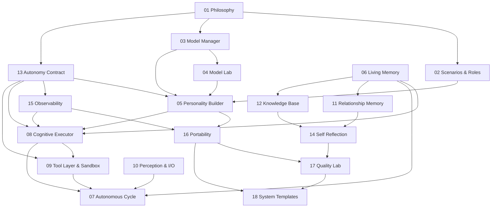

# MiaOS Builder dependency graph

This document records the initial project-ingestion pass over the 18 architecture blocks. It is the implementation map used to keep MiaOS Builder runtime-first, safety-first, and hardware-aware.

## Block inventory

All architecture source blocks are stored in `docs/blocks/`:

1. `01_Philosophy.md`
2. `02_Scenarios_and_Roles.md`
3. `03_Model_Manager.md`
4. `04_Model_Lab.md`
5. `05_Personality_Builder.md`
6. `06_Living_Memory.md`
7. `07_Autonomous_Cycle.md`
8. `08_Cognitive_Executor.md`
9. `09_Tool_Layer_Sandbox.md`
10. `10_Perception_IO.md`
11. `11_Relationship_Memory.md`
12. `12_Knowledge_Base.md`
13. `13_Autonomy_Contract.md`
14. `14_Self_Reflection.md`
15. `15_Observability.md`
16. `16_Portability.md`
17. `17_Quality_Lab.md`
18. `18_System_Templates.md`

## Topological implementation order

Practical order for the MVP:

1. B1, B2: invariants, user roles, scope.
2. B3: model registry and hardware-aware runtime profiles.
3. B4: certification state schema.
4. B5: persona and `.mia` MVP.
5. B13: safety kernel before real tools or autonomous actions.
6. B15: trace IDs and append-only decisions log.
7. B16: portable `.mia` directory/ZIP-compatible package.
8. B8: graph runtime with bounded DAG execution.
9. B9: sandbox-only tool layer.
10. B6/B11/B12: lightweight memory and knowledge interfaces.
11. B7/B14/B17/B18: autonomy, reflection, quality lab, templates.
12. B10: multimodal perception after runtime and safety foundations.

## Dependencies by block

| Block | Depends on | Produces |
|---|---|---|
| 01 Philosophy | — | global invariants INV-A/B/C/D, red lines, product frame |
| 02 Scenarios and Roles | 01 | user roles, UI modes, MVP role scope |
| 03 Model Manager | 01 | model registry, hardware-aware pool roles, MLX process boundary |
| 04 Model Lab | 03 | model certification schema, Track A/Track B suitability evidence |
| 05 Personality Builder | 01, 02, 03, 04, 13 | persona schema, `.mia` structure, model binding, `PersonalityGuard` |
| 06 Living Memory | 05 | episodic/semantic/procedural memory, dream-loop substrate |
| 07 Autonomous Cycle | 06, 08, 09, 13 | BDI runtime, reactive/proactive/sleep loops, resource controller |
| 08 Cognitive Executor | 03, 04, 05, 06, 13, 15 | graph executor, node roles, checkpoints, event stream |
| 09 Tool Layer and Sandbox | 08, 13, 15 | tool registry, policy boundary, sandbox execution contract |
| 10 Perception and I/O | 03, 07, 08 | perception channels, perceptual buffer, event input |
| 11 Relationship Memory | 06, 13 | user model, ToM state, relationship state |
| 12 Knowledge Base | 06, 09, 15 | domain namespaces, retrieval interfaces, confidence metadata |
| 13 Autonomy Contract | 01, 09 concepts | Policy Gate, autonomy levels, capability tokens, denied-always set |
| 14 Self Reflection | 06, 08, 13, 15 | reflection proposals, drift checks, propose-not-sanction loop |
| 15 Observability | 13 | trace IDs, decisions log, explainability/audit evidence |
| 16 Portability | 05, 13, 15 | `.mia` export/import, integrity model, versioning |
| 17 Quality Lab | 13, 14, 15, 16 | eval pipeline, verdict engine, evidence reports |
| 18 System Templates | 05, 13, 16, 17 | templates, factory, instance isolation, MAS patterns |

## Runtime module mapping

| Runtime module | Blocks | Initial scope |
|---|---|---|
| `miaos.runtime` | 02, 03, 07 | runtime profiles, hardware profiles, CLI inspection |
| `miaos.models` | 03, 04 | provider protocol, mock provider, model registry, lab status fields |
| `miaos.persona` | 05, 16 | minimal `.mia`, persona schemas, guard context |
| `miaos.safety` | 09, 13 | action classification, Policy Gate, approval/deny/allow |
| `miaos.observability` | 13, 15 | trace IDs and append-only decisions log |
| `miaos.executor` | 08, 15 | graph schema, validation, bounded mock execution |
| `miaos.tools` | 09, 13 | sandbox-only mock tools after Policy Gate |
| `miaos.memory` | 06, 11, 12 | lightweight SQLite interfaces before vector/KG backends |
| `miaos.quality` | 17 | later eval runner and evidence reports |
| `miaos.templates` | 18 | later template registry and instantiation engine |
| `miaos.perception` | 10 | deferred multimodal channels |

## Data schema map

| Schema | Source block | First implementation phase |
|---|---|---|
| `RuntimeProfile` | 03 + hardware guidance | v0.1 |
| `HardwareProfile` | 03 + hardware guidance | v0.1 |
| `ModelProfile` | 03 | v0.1 |
| `ModelRecord` | 03 | v0.1 |
| `LabCertificationStatus` | 04 | v0.1 |
| `PersonaManifest` | 05, 16 | v0.1 |
| `PersonaCard` | 05 | v0.1 |
| `ModelBinding` | 05 | v0.1 |
| `AutonomyContractRef` | 05, 13 | v0.1 |
| `ActionRequest` | 13 | v0.1 |
| `PolicyDecision` | 13 | v0.1 |
| `CapabilityToken` | 13 | v0.1 |
| `DecisionLogEvent` | 15 | v0.1 |
| `AgentGraphSpec` | 08 | v0.2 |
| `GraphEvent` | 08, 15 | v0.2 |
| `ToolSpec` | 09 | v0.5 |
| `MemoryRecord` | 06, 11, 12 | v0.5 |
| `EvalVerdict` | 17 | later v0.5+ |
| `MiaTemplate` | 18 | later v0.5+ |

## Critical sequencing constraints

- Safety and audit must exist before tool execution.
- Runtime/model abstractions must exist before persona-to-model binding.
- Persona and model binding must exist before chat or graph execution.
- Graph runtime must exist before Graph Studio UI.
- Backend API contracts must exist before desktop/editor work.
- Heavy dependencies (MLX, vector DB, Tauri) must stay optional until their slice is reached.
